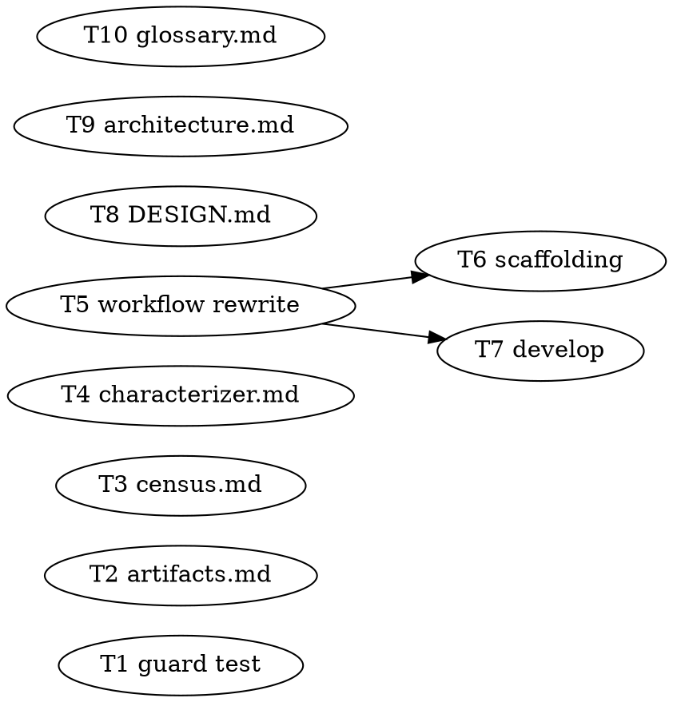

# Frontier-Scoped Characterization Implementation Plan

> **For agentic workers:** REQUIRED: Use superpowers:subagent-driven-development or superpowers:executing-plans to implement this plan. Steps use checkbox (`- [ ]`) syntax for tracking.

**Goal:** Replace the brownfield analysis-time characterization *corpus* pass (which eagerly pins the whole observable surface with teeth — cost ∝ legacy size) with a read-only, frontier-scoped *inventory* pass that records a thin prose `## Scenarios` map and defers every tooth-bearing pin to first-touch genesis.

**Architecture:** `workflows/characterization.workflow.js` is rewritten from a ~7-phase / ~4N+5-agent fenced-mutator pipeline to a **three-agent, read-only** flow: reconcile → one census agent that enumerates only frontier scenarios and appends a prose `## Scenarios` section to existing skeleton contracts → scribe. All teeth (born `characterized` clause + parked test + BF2 reverse discriminator + intent-verifier) stay exactly where they already run — first-touch genesis in `vertical-slice-runner.workflow.js`, now the sole birthplace of a `characterized` clause. The FLOOR (`baseline.json`) and the entire `lib/` enforcement layer are untouched, so brownfield regression protection is identical; only the *timing* of behavioural pins moves from eager to lazy.

**Tech Stack:** Dependency-free Node ESM (the `lib/` engine + standalone `node:assert` tests over the engine's pure-function modules); the Workflow tool's pure-JS orchestration substrate; Markdown-with-normative-force (agents, skills, design docs). No build, no package.json, no test runner — tests are `node test/<x>.test.mjs`.

**Spec:** [docs/superpowers/specs/2026-06-26-frontier-scoped-characterization-design.md](../specs/2026-06-26-frontier-scoped-characterization-design.md)

**Adversarial-TDD note:** This plan contains **no red/green/audit triads.** The only automated test (Task 1) is a *guard* over `lib/contract.mjs`, whose code is **not changed** — it pins an existing invariant the design leans on (it is green on first run). Everything else is pure orchestration (the workflow, gated structurally by `workflow-load.test.mjs`, not behaviour-unit-tested in this repo) or normative Markdown. There is no implementation-vs-test interpretation gap to separate agents over.

---

## File Structure

| File | Responsibility | Task |
|------|----------------|------|
| `test/contract.test.mjs` (new) | Pin the `## Scenarios` parser-invisibility + footprint-zero invariant on the unchanged parser | T1 |
| `docs/artifacts.md` | Normative on-disk format of the `## Scenarios` prose inventory (beside `## Topology`) | T2 |
| `agents/census.md` | Add the frontier `## Scenarios` inventory to census's read-only mandate | T3 |
| `agents/characterizer.md` | State explicitly that the characterizer runs **only** at first-touch (never analysis-time) | T4 |
| `workflows/characterization.workflow.js` | The rewrite: three-agent read-only frontier-inventory pass + new result union | T5 |
| `skills/scaffolding/SKILL.md` | Launch + route the new result union + the lighter sign-off gate | T6 |
| `skills/develop/SKILL.md` | Update the one-line description of what the pass does at the brownfield slot | T7 |
| `docs/DESIGN.md` | Update the §6/§21 references describing the workflow as a corpus pass | T8 |
| `docs/architecture.md` | Rewrite the §18 scaffolding-slot passage + the workflow table row | T9 |
| `docs/glossary.md` | Note characterization is lazy/first-touch; define "frontier inventory" | T10 |

Every task touches a distinct file (no two independent tasks share a file). Tasks 6 and 7 depend on Task 5 (they describe/route its final result shape); all others are independent.

---

## Task 1: Guard test — `## Scenarios` is parser-invisible

`role: guard (green on first run — lib/contract.mjs is NOT modified)`

**Files:**
- Create: `test/contract.test.mjs`
- (Reads, does not modify: `lib/contract.mjs`)

- [ ] **Step 1: Write the guard test**

```js
// contract.test.mjs — pin the grammar invariants the frontier-inventory design leans on:
// a `## Scenarios` prose section is PARSER-INVISIBLE (zero clauses, zero citations) and does
// not perturb a real clause's provenance/gates — exactly like `## Topology`. The parser
// (lib/contract.mjs) is unchanged; this is a regression guard, green from the first run.
// Run: node test/contract.test.mjs

import assert from 'node:assert';
import { parseContract } from '../lib/contract.mjs';

let passed = 0;
function check(name, fn) {
  try { fn(); passed += 1; console.log(`  ok  ${name}`); }
  catch (e) { console.error(`FAIL  ${name}\n      ${e.message}`); process.exitCode = 1; }
}

// A census skeleton contract carrying a `## Scenarios` frontier inventory: prose, zero teeth.
const SKELETON_WITH_SCENARIOS = `---
component: store
---

## Topology
- Lives at: \`src/store/\`
- Depends on: db
- Consumed by: api

## Clauses

## Scenarios
- delete-returns-immediately: \`delete(id)\` returns Ok synchronously today (seam: \`src/store/delete.rs\`; floor: delete_returns_ok)
- confirm-delete-prompts: deleting prompts for confirmation before removal (seam: \`src/ui/confirm.rs\`; floor: —)
`;

check('a `## Scenarios` section yields ZERO clauses', () => {
  const c = parseContract(SKELETON_WITH_SCENARIOS, 'store');
  assert.strictEqual(c.clauses.length, 0, 'frontier scenarios must not parse as clauses');
});

check('a `## Scenarios` section yields ZERO citations (footprint-zero)', () => {
  const c = parseContract(SKELETON_WITH_SCENARIOS, 'store');
  assert.strictEqual(c.citations.length, 0, 'frontier scenarios must add no citation-graph edges');
});

// Robustness: even when the component LATER grows a real clause, a trailing `## Scenarios`
// section must not be mis-attributed to it (no stray provenance/gate/citation bleed).
const GROWN_THEN_SCENARIOS = `---
component: store
---

## Clauses

### §1 Deletes a row
\`delete(id)\` removes the row.
- Gate: vertical-slice:del / asserts \`deletes_row\`

## Scenarios
- legacy-soft-delete: delete only marks a tombstone today (seam: \`src/store/delete.rs\`; floor: soft_delete_marks)
`;

check('a `## Scenarios` after a clause does not perturb that clause', () => {
  const c = parseContract(GROWN_THEN_SCENARIOS, 'store');
  assert.strictEqual(c.clauses.length, 1, 'exactly the one real clause');
  assert.strictEqual(c.clauses[0].provenance, 'grown', 'scenarios must not flip provenance to characterized');
  assert.strictEqual(c.clauses[0].gates.length, 1, 'the real gate is intact');
  assert.strictEqual(c.citations.length, 0, 'no citations leak from scenarios');
});

if (process.exitCode) console.error(`\ncontract: FAILURES above (${passed} passed).`);
else console.log(`\ncontract: all ${passed} checks pass. ✓`);
```

- [ ] **Step 2: Run the guard test — it passes against the unchanged parser**

Run: `node test/contract.test.mjs`
Expected: `contract: all 3 checks pass. ✓` (exit 0). If any check FAILS, the parser does **not** already ignore `## Scenarios` and the whole design assumption is wrong — STOP and escalate; do not "fix" the parser to make form-A work without re-checking the spec.

- [ ] **Step 3: Commit**

```bash
git add test/contract.test.mjs
git commit -m "test(reasonable): guard `## Scenarios` parser-invisibility (footprint-zero)"
```

---

## Task 2: `docs/artifacts.md` — the `## Scenarios` inventory format

**Files:**
- Modify: `docs/artifacts.md` (the `## contracts/<component>.md` section, near the `## Topology` / `- Seam:` parsing rules around lines 280–333)

- [ ] **Step 1: Add the `## Scenarios` grammar rule**

In `docs/artifacts.md`, in the contract-grammar "Parsing rules (exact)" list (the bulleted rules that currently cover Clauses, Citations, `- Gate:`, provenance, `- Seam:`, `- Supersession:`, `status`), add this bullet immediately **after** the `- Seam:` rule and **before** the `status` rule:

```markdown
- A `## Scenarios` section (brownfield, optional) is a **frontier inventory**: a prose,
  zero-teeth map of the observable top-level scenarios on the effort's frontier, written by
  `census` at the analysis-time frontier pass (`characterization.workflow.js`). Each bullet is
  `- <key>: <observable> (seam: \`<glob>\`; floor: <test-ids or —>)`. It is **parser-invisible
  and footprint-zero by construction**: it contains **zero `### §N` clauses** and **zero
  `## Citations` bullets**, so `lib/contract.mjs` and the citation closure ignore it entirely
  (the same property `## Topology` prose has). A bullet **must not begin** with the reserved
  keywords `Gate:` / `Provenance:` / `Supersession:` / `Seam:` (those are clause-body lines).
  The inventory is **advisory** — a hint for the route-planner and the human birth-ratification
  gate; tooth-bearing `characterized` clauses are born **separately**, lazily, at first touch.
```

- [ ] **Step 2: Verify the doc still reads coherently**

Run: `node test/contract.test.mjs`
Expected: still `all 3 checks pass. ✓` (this task only documents the invariant the test pins; no code changes).

- [ ] **Step 3: Commit**

```bash
git add docs/artifacts.md
git commit -m "docs(reasonable): pin the `## Scenarios` frontier-inventory format (artifacts.md)"
```

---

## Task 3: `agents/census.md` — add the frontier inventory to census's mandate

**Files:**
- Modify: `agents/census.md` (the "What you produce" section + the output summary)

- [ ] **Step 1: Add a third produced artifact**

In `agents/census.md`, under `## What you produce`, after the `### 2. The regression floor — .reasonable/baseline.json` subsection (and before the "These two halves run at different cadences…" paragraph), insert:

```markdown
### 3. The frontier scenario inventory — `## Scenarios` (analysis-time frontier pass only)
When you are dispatched by `characterization.workflow.js` at the brownfield scaffolding slot (NOT
at the one-time analysis census above), you also record a **thin, prose frontier inventory**. Read
the drafted route + the change-intention + `baseline.json`, enumerate **only the frontier**
observable top-level scenarios (those the route intends to touch, or named as integration risk —
**never the whole observable surface**), and append a `## Scenarios` section to each frontier
component's existing skeleton contract. One bullet per scenario:

    - <key>: <observable> (seam: `<glob>`; floor: <comma-separated test ids, or —>)

This is the SAME observational, read-only-on-code mandate as `## Topology`: **zero `### §N`
clauses, zero `## Citations` bullets** (parser-invisible, footprint-zero), no parked test, no
discriminator, no trust. You pin no behaviour with teeth — born `characterized` clauses are the
`characterizer`'s, demand-driven at first touch. Never begin a bullet with `Gate:` / `Provenance:`
/ `Supersession:` / `Seam:`. Write only into the **canonical** `<effortRoot>/.reasonable/contracts/`,
via Bash (you have no Edit/Write), exactly as you emit skeletons — never into any worktree.
```

- [ ] **Step 2: Add it to the "Forbidden moves" coherence**

In the `## Forbidden moves` table of `agents/census.md`, add this row:

```markdown
| "I'll pin every scenario I can see, to be thorough" | The frontier inventory is **frontier-scoped** — route-intended / integration-risk only. The rest is the FLOOR's job + lazy first-touch. Whole-surface enumeration is the cost disease this pass exists to avoid. |
```

- [ ] **Step 3: Commit**

```bash
git add agents/census.md
git commit -m "docs(reasonable): census records the frontier `## Scenarios` inventory (read-only, zero teeth)"
```

---

## Task 4: `agents/characterizer.md` — first-touch only

**Files:**
- Modify: `agents/characterizer.md` (the opening role paragraph)

- [ ] **Step 1: State the single dispatch point explicitly**

In `agents/characterizer.md`, at the end of the first body paragraph (the one beginning "You are the **characterizer**…", which already says "When a vertical slice first touches ungoverned code, you **pin what the code already does**…"), append this sentence:

```markdown
You are dispatched at **exactly one** point: **first-touch genesis**, inside the running
`vertical-slice-runner`, after the implementer declares its `behaviorDelta`. (You are no longer
run at the analysis-time slot — that pass is now a read-only `census` frontier inventory with no
teeth; see `characterization.workflow.js`.) So your `behaviorDelta` is **always** present: a pin
never freezes behaviour the effort has not yet decided to touch.
```

- [ ] **Step 2: Sanity-check there is no other analysis-time assumption**

Run: `grep -n "analysis" agents/characterizer.md`
Expected: no line implies the characterizer runs at the analysis-time corpus pass. If one does, reword it to first-touch. (As of writing there is none; this step is a guard.)

- [ ] **Step 3: Commit**

```bash
git add agents/characterizer.md
git commit -m "docs(reasonable): characterizer runs only at first-touch (behaviorDelta always present)"
```

---

## Task 5: Rewrite `workflows/characterization.workflow.js`

**Files:**
- Modify (full rewrite): `workflows/characterization.workflow.js`
- (Verified by: `test/workflow-load.test.mjs`)

- [ ] **Step 1: Replace the entire file with the frontier-inventory workflow**

Replace the **whole** contents of `workflows/characterization.workflow.js` with:

```js
// characterization.workflow.js — the brownfield analysis-time FRONTIER INVENTORY pass.
//
// REDESIGN (frontier-scoped + defer the teeth, 2026-06-26). The brownfield twin of the scaffolding
// slot is NO LONGER a tooth-bearing corpus pass over the whole observable surface. census.md already
// states the cost-asymmetry split — "the topology census is cheap and global, done up front;
// behavioural pins are expensive and demand-driven, done later at the seam by the characterizer."
// This workflow now OBEYS that split: it is a READ-ONLY, FRONTIER-SCOPED observation that records a
// thin prose `## Scenarios` inventory, and DEFERS every tooth (born `characterized` clause + parked
// test + BF2 reverse discriminator + intent-verifier) to first-touch genesis inside the
// vertical-slice-runner, which already runs them in full and is now the SOLE birthplace of a
// `characterized` clause. (architecture §18; spec docs/superpowers/specs/2026-06-26-...)
//
// WHY THE OLD APPARATUS IS GONE. Lane provisioning, the two-root fenced-mutator dance, the
// per-scenario census-check, the characterizer, the intent-verifier trio + verdict-writer, and the
// GREEN-on-HEAD invariant ALL existed to safely land a parked TEST (code) onto floor-tracked files.
// This pass writes no test and no code — only a prose `## Scenarios` section into census's own
// skeleton contracts, exactly as census writes `## Topology` at analysis, read-only on production
// code. No code write => no floor touch => no fence to arm => no lane, no adversary, no invariant.
//
// THE FLOOR IS UNCHANGED. baseline.json (written by census) remains the regression-containment
// fence for every pre-existing test. Untouched seams stay floor-protected; deferral changes only the
// TIMING of behavioural pins (eager -> lazy at first touch), never the protection.
//
// PURITY (substrate, absolute). Plain JS, no TypeScript. No fs, no Date.now/Math.random/new Date()
// (they THROW in the body). All side effects happen INSIDE agents. `meta` is a pure literal. No
// imports. Hooks used: agent(), log(), phase(), args; guard() wraps each agent so a budget ceiling
// becomes a structured checkpoint.
//
// RETURN. A typed result for the human birth-ratification gate (the engine cannot block on a human).
// Kinds: ratify | no-op | halt | checkpoint. There is no `escalate`/`invariant-failed` here — with
// no pins there is no adversary verdict and no suspectedBug to surface; both live at first touch.
// Silence never ratifies.

export const meta = {
  name: 'characterization',
  description: 'Brownfield analysis-time FRONTIER pass: enumerate ONLY the frontier observable scenarios (route-intended / integration-risk) and record a thin prose `## Scenarios` inventory in census\'s skeleton contracts; defer every tooth-bearing pin to first-touch genesis. Read-only on code. Returns a typed result to the human birth-ratification gate.',
  whenToUse: 'Launched from the main session at the brownfield scaffolding slot (config.brownfield true), AFTER census has written baseline.json + skeleton contracts and analysis has drafted the route + change-intention. NOT the tooth-bearing pin path — that is first-touch genesis inside vertical-slice-runner.',
  phases: [
    { title: 'Reconcile', detail: 'Unconditional recovery prologue: re-derive truth from git+ledger+contracts; read runMode; halt on AMBIGUOUS / runmode-absent. A floor-integrity diff is a non-blocking ADVISORY notice here (this pass mutates no floor state).' },
    { title: 'Inventory', detail: 'One read-only census agent: read the drafted route + change-intention + baseline.json; enumerate ONLY frontier scenarios; append a prose `## Scenarios` section (zero clauses, zero citations) to each frontier component\'s skeleton contract at the canonical root.' },
    { title: 'Scribe', detail: 'The lone serialized journal-writer records the frontier inventory + the transition into the derived index (journal.json + inbox.json) for the gate.' },
  ],
};

// ── Inlined schemas (JSON Schema literals; the engine forces + validates them) ──

const BRIEFING = {
  type: 'object',
  additionalProperties: false,
  required: ['halt', 'runMode', 'brownfield'],
  properties: {
    halt: { type: 'boolean', description: 'true when any artifact configuration was AMBIGUOUS (or runMode absent).' },
    haltReason: { type: ['string', 'null'] },
    haltClass: {
      type: ['string', 'null'],
      enum: ['sha-custody', 'ledger-without-commit', 'runmode-absent', 'two-lanes-one-wo', 'floor-integrity', 'other', null],
      description: 'Which class triggered the halt. floor-integrity is a NON-BLOCKING advisory notice in this read-only pass (it writes no floor state); the other four classes stay first-line HALTs.',
    },
    evidence: { type: ['string', 'null'] },
    runMode: { type: ['string', 'null'], enum: ['gated', 'autonomous', null], description: 'Read from config.json, never inferred. Absent -> halt.' },
    brownfield: { type: 'boolean', description: 'Must be true for this pass to do work; false -> no-op.' },
    floorNotice: { type: ['string', 'null'], description: 'A surfaced floor-integrity diff, carried as ADVISORY only — it never blocks this pass.' },
    note: { type: ['string', 'null'] },
  },
};

const FRONTIER_INVENTORY = {
  type: 'object',
  additionalProperties: false,
  required: ['scenarios', 'inventoryWritten'],
  properties: {
    scenarios: {
      type: 'array',
      maxItems: 256,
      items: {
        type: 'object',
        additionalProperties: false,
        required: ['key', 'component', 'observable', 'seam'],
        properties: {
          key: { type: 'string', description: 'Stable slug for the frontier scenario (dedup key + bullet label).' },
          component: { type: 'string', description: 'The owning component (its skeleton contract was born by census).' },
          observable: { type: 'string', description: 'The user-visible behaviour, in observable terms (pin what IS).' },
          seam: { type: 'string', description: 'The seam / declared locus (a file glob) the eventual first-touch pin will capture.' },
          floorTests: { type: 'array', items: { type: 'string' }, description: 'FLOOR test ids already touching this seam, if any.' },
          reason: { type: ['string', 'null'], description: 'Why it is ON the frontier — a drafted-route node, or named integration risk.' },
        },
      },
    },
    inventoryWritten: { type: 'boolean', description: 'The prose `## Scenarios` section was appended (zero clauses, zero citations) to each frontier component\'s skeleton contract at the CANONICAL effort root.' },
    componentsTouched: { type: 'array', items: { type: 'string' }, description: 'The components whose skeleton contracts gained a `## Scenarios` section.' },
    note: { type: ['string', 'null'] },
  },
};

const SCRIBE_ACK = {
  type: 'object',
  additionalProperties: false,
  required: ['persisted'],
  properties: {
    persisted: { type: 'boolean', description: 'journal.json + inbox.json written faithfully against their schemas.' },
    transition: { type: ['string', 'null'] },
    note: { type: ['string', 'null'] },
  },
};

// ── Inlined helpers (pure — no fs, no Date.now/random) ─────────────────────────

async function guard(thunk) {
  try {
    return await thunk();
  } catch (e) {
    // A budget ceiling (or any agent throw) becomes a structured checkpoint, never a silent pass.
    return { __checkpoint: true, reason: (e && e.message) || 'agent threw (budget ceiling or terminal error)' };
  }
}

function isCheckpoint(x) {
  return x !== null && typeof x === 'object' && x.__checkpoint === true;
}

function root(a) { return (a && a.effortRoot) || '.'; }
function plugin(a) { return (a && a.reasonableRoot) || '${reasonable}'; }

// ── Prompt builders (pure string functions) ────────────────────────────────────

function reconcilePrompt(a) {
  return [
    'You are the reconcile prologue for the brownfield FRONTIER characterization pass.',
    `Effort root: ${root(a)}. Plugin root: ${plugin(a)}.`,
    'Run UNCONDITIONALLY. Re-derive truth from git + the append-only ledger + the contract files;',
    'the resume cache has zero authority. Run `node ' + plugin(a) + '/lib/reconcile.mjs --root ' + root(a) + '` and read',
    'its exact output. Partition every artifact configuration into RESOLVED / SAFE-DEFAULT / AMBIGUOUS.',
    'An AMBIGUOUS configuration is a blocking halt — set halt:true with haltReason + evidence + haltClass; never guess.',
    'The first-line HALT classes stay HALTs: sha-custody, ledger-without-commit, runmode-absent, two-lanes-one-wo.',
    'A floor-integrity mismatch is DIFFERENT here: this pass writes NO code and NO test and mutates NO floor state,',
    'so a floor-integrity diff is a NON-BLOCKING ADVISORY notice — set floorNotice with the evidence, do NOT halt on it.',
    'Read config.runMode (gated|autonomous); if absent/null on a cold restart, HALT (inferring mode is forbidden).',
    'Confirm config.brownfield: this pass only does work when it is true. If false, set brownfield:false (no-op).',
    'Return the BRIEFING. Evidence before assertions: name the command you ran and quote its output.',
  ].join('\n');
}

function inventoryPrompt(a) {
  return [
    'You are the census (brownfield, READ-ONLY on production code) building the FRONTIER scenario inventory.',
    `Effort root (canonical .reasonable/ — read AND write here, by absolute path): ${root(a)}. Plugin root: ${plugin(a)}.`,
    'This is the analysis-time FRONTIER pass. You do NOT pin behaviour with teeth: no born `characterized`',
    'clause, no parked test, no reverse discriminator. Those are first-touch genesis (vertical-slice-runner),',
    'demand-driven, after an implementer declares a behaviorDelta. Here you record a THIN, observational map.',
    '',
    'STEP 1 — scope to the FRONTIER. Read the drafted route and the change-intention from `' + root(a) + '/.reasonable/`',
    '(find them via Read/Grep/Glob — the route backlog + the change-intention the analysis phase emitted) and',
    '`' + root(a) + '/.reasonable/baseline.json` (the FLOOR). Enumerate ONLY the observable top-level scenarios that',
    'are ON THE FRONTIER: a scenario the drafted route intends to touch, OR one named as integration risk. Do NOT',
    'enumerate the whole observable surface — a scenario orthogonal to the route is left to the FLOOR and to lazy',
    'first-touch genesis if a later slice ever reaches it. For each frontier scenario name: a stable `key`, the',
    'owning `component` (its skeleton contract was born by census), the `observable` behaviour in user-visible terms',
    '(pin what IS, not what should be), the `seam` (file glob the eventual pin will capture), any FLOOR test ids',
    'touching that seam, and the `reason` it is on the frontier.',
    '',
    'STEP 2 — write the THIN inventory (prose, zero teeth). For each frontier component, APPEND a `## Scenarios`',
    'section to its EXISTING skeleton contract `' + root(a) + '/.reasonable/contracts/<component>.md` via Bash (your',
    'role has no Edit/Write; emit via a heredoc append, exactly as you emit `## Topology`). One bullet per frontier',
    'scenario, in this prose shape (NEVER begin a bullet with the reserved keywords Gate:/Provenance:/Supersession:/Seam:):',
    '    - <key>: <observable> (seam: `<glob>`; floor: <comma-separated test ids, or —>)',
    'The `## Scenarios` section MUST contain ZERO `### §N` clauses and ZERO `## Citations` bullets — it is an',
    'advisory map, parser-invisible and footprint-zero, exactly like `## Topology`. Do NOT add a Citations bullet,',
    'do NOT birth a clause, do NOT confer trust. NEVER write into a worktree `.reasonable/` (there is no lane here).',
    '',
    'Read only production code; write only the `## Scenarios` prose into the canonical skeleton contracts.',
    'Return the FRONTIER_INVENTORY: the scenarios enumerated, inventoryWritten true once the sections are appended,',
    'and componentsTouched. Evidence before assertions: name the route/intention you read and the files you appended to.',
  ].join('\n');
}

function scribePrompt(a, inv) {
  const recorded = (inv.scenarios || []).map((s) => ({ key: s.key, component: s.component, seam: s.seam }));
  return [
    'You are the journal-writer (the lone serialized scribe). Persist the derived index for the brownfield',
    'FRONTIER characterization pass. Write ONLY journal.json + inbox.json — never the ledger, contracts, or code.',
    'Read both files before editing; match docs/artifacts.md field-for-field; invent no fields.',
    `Effort root: ${root(a)}.`,
    'Record the transition: phase -> the frontier scenario inventory is built and recorded; record the frontier',
    'scenarios (key + component + seam) so the retro / birth-ratification gate can see the frontier arrived as',
    'expected: ' + JSON.stringify(recorded) + '.',
    'inventoryWritten: ' + JSON.stringify(inv.inventoryWritten === true) + '; componentsTouched: ' + JSON.stringify(inv.componentsTouched || []) + '.',
    'If you cannot complete a clean, faithful write, return persisted:false (the script reads that as HALT — never a',
    'swallow; the derived index is rebuildable from git+ledger so halting loses no truth). Return the SCRIBE_ACK.',
  ].join('\n');
}

// ── The run (fixed control-flow shape; three agents, no fan-out) ───────────────

// 1. Reconcile prologue (unconditional; halt is authoritative; floor-integrity is advisory here).
phase('Reconcile');
log('Reconcile: re-deriving truth from git + ledger + contracts (resume cache has zero authority).');
const state = await guard(
  () => agent(reconcilePrompt(args), { agentType: 'reasonable:reconciler', label: 'reconcile', schema: BRIEFING }),
);
if (isCheckpoint(state)) {
  return { kind: 'checkpoint', reason: 'reconcile: ' + state.reason };
}
if (state === null) {
  return { kind: 'halt', reason: 'reconcile returned null — recovery prologue did not complete; frontier inventory not attempted.' };
}
if (state.halt && state.haltClass !== 'floor-integrity') {
  // The four first-line halt classes still HALT: sha-custody, ledger-without-commit, runmode-absent, two-lanes-one-wo.
  return { kind: 'halt', reason: state.haltReason || 'reconcile: AMBIGUOUS configuration', evidence: state.evidence || null };
}
// floor-integrity is a NON-BLOCKING advisory notice in this read-only pass (it mutates no floor state).
const floorNotice = state.floorNotice
  || (state.halt && state.haltClass === 'floor-integrity'
    ? (state.haltReason || 'floor-integrity diff surfaced (advisory; this pass mutates no floor state).')
    : null);
if (floorNotice) {
  log('Reconcile: floor-integrity diff surfaced as an ADVISORY notice — logged for the human; it does not block this read-only pass.');
}
if (state.brownfield !== true) {
  // Brownfield is one provenance, not a second methodology; absent it, this pass is a no-op.
  return { kind: 'no-op', reason: 'config.brownfield is not set — the frontier characterization pass is a no-op (greenfield path untouched).' };
}

// 2. Build + write the frontier inventory (one read-only census agent; no fan-out, no lane).
phase('Inventory');
log('Inventory: enumerating the FRONTIER observable scenarios (route-intended / integration-risk) and writing the thin `## Scenarios` map.');
const inv = await guard(
  () => agent(inventoryPrompt(args), { agentType: 'reasonable:census', label: 'frontier-inventory', schema: FRONTIER_INVENTORY }),
);
if (isCheckpoint(inv)) {
  return { kind: 'checkpoint', reason: 'inventory: ' + inv.reason, floorNotice };
}
if (inv === null) {
  return { kind: 'halt', reason: 'frontier inventory returned null — no scenario map produced; pass not completed.', floorNotice };
}
const scenarios = inv.scenarios || [];
log('Inventory: ' + scenarios.length + ' frontier scenario(s) recorded across ' + ((inv.componentsTouched || []).length) + ' component(s).');

// An empty frontier is honest (nothing route-intended yet to inventory). The FLOOR still stands.
if (scenarios.length === 0) {
  return {
    kind: 'ratify',
    runMode: state.runMode,
    frontierScenarios: [],
    inventoryWritten: inv.inventoryWritten === true,
    componentsTouched: inv.componentsTouched || [],
    floorNotice,
    note: 'No frontier scenarios to inventory (none route-intended / integration-risk). The FLOOR (baseline.json) still stands as the regression containment fence; tooth-bearing pins are born lazily at first touch.',
  };
}

// 3. Scribe the derived index (serial, awaited). A null/false ack is a HALT.
phase('Scribe');
log('Scribe: persisting the frontier inventory to the derived index (journal.json + inbox.json).');
const ack = await guard(
  () => agent(scribePrompt(args, inv), { agentType: 'reasonable:journal-writer', label: 'scribe', schema: SCRIBE_ACK }),
);
if (ack === null || isCheckpoint(ack) || ack.persisted !== true) {
  return {
    kind: 'halt',
    reason: 'scribe did not persist the derived index (null / checkpoint / persisted:false) — index not written; reconcile rebuilds from git+ledger on the next run.',
    floorNotice,
  };
}

// 4. Return the typed result to the human birth-ratification gate. Silence never ratifies.
return {
  kind: 'ratify',
  runMode: state.runMode,
  frontierScenarios: scenarios.map((s) => ({ key: s.key, component: s.component, seam: s.seam, observable: s.observable, floorTests: s.floorTests || [], reason: s.reason || null })),
  inventoryWritten: inv.inventoryWritten === true,
  componentsTouched: inv.componentsTouched || [],
  floorNotice,
  note: 'Frontier scenario inventory built and recorded: ' + scenarios.length + ' route-intended / integration-risk scenario(s) mapped as a thin prose `## Scenarios` baseline (zero clauses, zero citations — parser-invisible, footprint-zero). NO tooth-bearing pins were created; every born `characterized` clause + parked test + reverse discriminator + intent-verifier is deferred to first-touch genesis (vertical-slice-runner), with the FLOOR (baseline.json) unchanged as the regression containment fence. Present to the human birth-ratification gate; silence never ratifies.'
    + (floorNotice ? ' A floor-integrity diff was surfaced as an advisory notice (does not block).' : ''),
};
```

- [ ] **Step 2: Verify it loads under the engine function-scope wrap**

Run: `node test/workflow-load.test.mjs`
Expected: `workflow-load: all N workflow(s) load. ✓` (exit 0) — the rewritten file is among them. A `SyntaxError: Identifier '<x>' has already been declared` means a duplicate top-level binding (helper name colliding with a `const`) — rename and re-run.

- [ ] **Step 3: Eyeball the purity invariants (no automated check exists)**

Confirm by reading: no `import`, no `require`, no `fs`, no `Date.now()` / `Math.random()` / `new Date()`; `meta` is a pure object literal; the only engine hooks used are `agent`, `log`, `phase`, `args`. (CLAUDE.md invariant #5 — workflow scripts are pure.)

- [ ] **Step 4: Commit**

```bash
git add workflows/characterization.workflow.js
git commit -m "feat(reasonable): frontier-scoped characterization workflow (defer the teeth to first-touch)"
```

---

## Task 6: `skills/scaffolding/SKILL.md` — launch + route the new result

**Files:**
- Modify: `skills/scaffolding/SKILL.md` (the brownfield characterization launch + result routing + sign-off gate; per the explore, around lines 100–140)

**Depends on:** Task 5 (the result union `ratify | no-op | halt | checkpoint` and the fields `frontierScenarios` / `inventoryWritten` / `floorNotice` must exist).

- [ ] **Step 1: Update what the pass produces and what the gate reviews**

Read `skills/scaffolding/SKILL.md` around the characterization launch. Apply these changes:

1. Where it describes launching `characterization.workflow.js` as the brownfield corpus pass, change the wording to: "launch `characterization.workflow.js` — the analysis-time **frontier inventory** pass (read-only; records a thin prose `## Scenarios` map of the route-intended / integration-risk scenarios; **defers every tooth-bearing pin to first-touch genesis**)."
2. Where it records corpus births to the journal for the retro, change it to record the **frontier inventory** (`frontierScenarios` + `componentsTouched`) — there are no `pinned` / `verdicts` / `suspectedBugs` at this stage.
3. Update the result routing to the new union exactly:

```markdown
The frontier pass returns a typed result; route by `kind`:
- **`ratify`** — the frontier inventory was built (or is honestly empty) and scribed. Present
  `frontierScenarios` + `inventoryWritten` (+ any `floorNotice`) to the human **birth-ratification
  gate**. The gate reviews a small, reviewable frontier map + confirms the FLOOR stands — it does
  **not** review a tooth-bearing corpus (there is none; teeth are born lazily at first touch).
  Silence never ratifies.
- **`no-op`** — `config.brownfield` is not set; the greenfield scaffold path is unaffected.
- **`halt`** — reconcile AMBIGUOUS (`sha-custody` / `ledger-without-commit` / `runmode-absent` /
  `two-lanes-one-wo`), a null inventory, or a failed scribe. Surface `reason` (+ `evidence`); do
  not ratify.
- **`checkpoint`** — a budget ceiling or terminal agent error; resumable, not a verification gap.

A `floorNotice` on any result is **advisory** (this read-only pass mutates no floor state) — log
it for the human; it never blocks ratification.
```

4. Delete any routing arms for `escalate` / `invariant-failed` / `budget-exhausted` / per-pin `verdicts` / `suspectedBugs` — the frontier pass never returns them (those concerns now arise only at first-touch, surfaced through the vertical-slice retro).

- [ ] **Step 2: Verify no dangling references to the old result fields**

Run: `grep -nE "pinned|verdicts|suspectedBug|invariant-failed|GREEN-on-HEAD" skills/scaffolding/SKILL.md`
Expected: no hits tied to the analysis-time characterization launch. (If a hit belongs to the greenfield scaffold's own invariant-verify, leave it — that is a different mechanism.)

- [ ] **Step 3: Commit**

```bash
git add skills/scaffolding/SKILL.md
git commit -m "docs(reasonable): scaffolding routes the frontier-inventory result; lighter birth-ratification gate"
```

---

## Task 7: `skills/develop/SKILL.md` — update the slot description

**Files:**
- Modify: `skills/develop/SKILL.md` (the brownfield scaffolding-slot line that launches the workflow, ~line 108)

**Depends on:** Task 5.

- [ ] **Step 1: Reword the launch line**

In `skills/develop/SKILL.md`, find the line launching `characterization.workflow.js` (the explore located it near line 108, currently calling it "the analysis-time corpus pass"). Replace that clause with:

```markdown
Launch `characterization.workflow.js` here instead — the analysis-time **frontier inventory** pass
(read-only `census`: records a thin prose `## Scenarios` map of the frontier scenarios; every
tooth-bearing pin is deferred to first-touch genesis in the vertical-slice-runner). It mirrors the
greenfield scaffold slot but writes no parked tests.
```

- [ ] **Step 2: Commit**

```bash
git add skills/develop/SKILL.md
git commit -m "docs(reasonable): develop describes the brownfield slot as a frontier inventory pass"
```

---

## Task 8: `docs/DESIGN.md` — update the corpus-pass references

**Files:**
- Modify: `docs/DESIGN.md` (the §6/§21 references describing `characterization.workflow.js`; keep all `§N` numbers stable — CLAUDE.md invariant #4)

- [ ] **Step 1: Update the workflow description**

In `docs/DESIGN.md`, find references that describe `characterization.workflow.js` as the "analysis-time corpus pass" / "invariant-verify = GREEN on HEAD" (the agent/workflow inventory table near line 632 region, and any prose echoing it). Replace each such description with: "**analysis-time frontier inventory pass** — a read-only `census` that records a thin prose `## Scenarios` map of the frontier (route-intended / integration-risk) scenarios; **no teeth** (born clauses + parked tests + reverse discriminator + intent-verifier are deferred to first-touch genesis). First-touch genesis is the in-run agent sequence inside the vertical-slice-runner and is the sole birthplace of a `characterized` clause."

Do **not** renumber any section. Do **not** alter the §5.6 reverse-discriminator description (line ~168) or the intent-verifier table (line ~358) — those mechanisms are unchanged and still run at first-touch.

- [ ] **Step 2: Verify section numbers are intact**

Run: `grep -nE "^#{2,3} .*§|§[0-9]" docs/DESIGN.md | head -40`
Expected: the same `§` headings/anchors as before this task (you changed prose, not numbering).

- [ ] **Step 3: Commit**

```bash
git add docs/DESIGN.md
git commit -m "docs(reasonable): DESIGN describes characterization as a frontier inventory (teeth deferred)"
```

---

## Task 9: `docs/architecture.md` §18 — rewrite the scaffolding-slot passage

**Files:**
- Modify: `docs/architecture.md` (the §18 passage at ~lines 558–571 and the workflow table row at ~line 632)

- [ ] **Step 1: Rewrite the scaffolding-slot paragraph**

In `docs/architecture.md` §18, locate the passage describing the brownfield scaffolding slot (it currently reads that the slot's job becomes *"characterize the observable top-level scenarios as a parked baseline,"* via a main-session `characterization.workflow.js` that *"mirrors scaffold.workflow.js; here invariant-verify means GREEN on HEAD,"* used *"only for the analysis-time corpus pass"*). Replace that description with:

```markdown
the slot's job becomes a **read-only frontier inventory**: a main-session
`characterization.workflow.js` runs `census` (read-only on code) to enumerate **only the frontier**
observable scenarios (route-intended / integration-risk — not the whole surface) and record them as
a thin prose `## Scenarios` map in the existing skeleton contracts. It writes **no parked test and
no born `characterized` clause** — every tooth (born clause + parked test + BF2 reverse
discriminator + intent-verifier) is **deferred to first-touch genesis**. This is the cost-asymmetry
split made literal: cheap, frontier-scoped observation up front; expensive, demand-driven pins lazy
at the seam. The FLOOR (`baseline.json`) is unchanged, so regression protection is identical — only
the *timing* of behavioural pins moves from eager to lazy.
```

- [ ] **Step 2: Make first-touch genesis the sole birthplace, explicitly**

In the following sentences (the `characterization-needed` OUTCOME arm describing the in-run agent sequence), ensure it states this is now the **sole** birthplace of a `characterized` clause. If the existing text says `characterization.workflow.js` is "used only for the analysis-time corpus pass," change "corpus pass" to "frontier inventory pass."

- [ ] **Step 3: Update the workflow table row (~line 632)**

Find the table row for `characterization.workflow.js` (currently: "analysis-time corpus pass (mirrors `scaffold.workflow.js`); invariant-verify = GREEN on HEAD…"). Replace the description cell with: "analysis-time **frontier inventory** pass — read-only `census` records a prose `## Scenarios` map of the frontier; **no teeth** (deferred to first-touch). First-touch genesis is the in-run agent sequence in the vertical-slice-runner."

- [ ] **Step 4: Reconcile the coherence-grill line (~line 116)**

Find the line mentioning the coherence-grill "mines the characterization corpus for legacy …". Change "characterization corpus" to "frontier scenario inventory" so the vocabulary stays consistent (the grill mines the same frontier map; it never needed tooth-bearing pins).

- [ ] **Step 5: Commit**

```bash
git add docs/architecture.md
git commit -m "docs(reasonable): architecture §18 — frontier inventory slot; first-touch is the sole clause birthplace"
```

---

## Task 10: `docs/glossary.md` — lazy characterization + frontier inventory

**Files:**
- Modify: `docs/glossary.md`

- [ ] **Step 1: Add / adjust the terms**

In `docs/glossary.md`, add these two entries (alphabetically placed, matching the file's existing entry style):

```markdown
- **Frontier inventory** — the brownfield analysis-time artifact: a thin, prose `## Scenarios`
  section (zero clauses, zero citations — parser-invisible, footprint-zero) recording the
  observable top-level scenarios on the effort's frontier (route-intended / integration-risk).
  Written read-only by `census` via `characterization.workflow.js`. Advisory: it feeds the
  route-planner and the human birth-ratification gate; it confers no trust and pins no behaviour.

- **First-touch genesis** — the **only** point a born `characterized` clause (with its parked
  characterization test + BF2 reverse discriminator + intent-verifier) is created: just-in-time,
  inside the running vertical-slice-runner, after the implementer declares its `behaviorDelta`.
  Analysis-time characterization is now a read-only frontier inventory only (no teeth); pinning
  behaviour eagerly, before a change has decided to touch it, is the prediction disease this defers
  away from.
```

If a `characterization` entry already exists implying an eager whole-surface corpus, reword it to point at these two terms (lazy / first-touch).

- [ ] **Step 2: Commit**

```bash
git add docs/glossary.md
git commit -m "docs(reasonable): glossary — frontier inventory + first-touch genesis (lazy characterization)"
```

---

## Dependency Graph

### Dependency table

| Task | Depends On | Files Created/Modified |
|------|-----------|------------------------|
| T1 Guard test | — | `test/contract.test.mjs` |
| T2 artifacts.md format | — | `docs/artifacts.md` |
| T3 census mandate | — | `agents/census.md` |
| T4 characterizer first-touch | — | `agents/characterizer.md` |
| T5 workflow rewrite | — | `workflows/characterization.workflow.js` |
| T6 scaffolding routing | T5 | `skills/scaffolding/SKILL.md` |
| T7 develop slot line | T5 | `skills/develop/SKILL.md` |
| T8 DESIGN.md | — | `docs/DESIGN.md` |
| T9 architecture.md | — | `docs/architecture.md` |
| T10 glossary.md | — | `docs/glossary.md` |

No two independent tasks modify the same file. T6 and T7 depend on T5 only because they describe/route T5's final result shape — not because of a file conflict.

### Dot visualization



### Wave schedule

- **Wave 1 (parallel):** T1, T2, T3, T4, T5, T8, T9, T10 — eight independent, single-file tasks.
- **Wave 2 (parallel):** T6, T7 — both depend only on T5's result shape.

---

## Self-Review

**Spec coverage:**
- Spine (obey census's cost-asymmetry split) → T5 (workflow) + T9 (architecture §18). ✓
- Three-agent read-only shape + new result union → T5. ✓
- Form-A prose `## Scenarios` inventory → T2 (grammar) + T3 (census writes it) + T1 (invariant pinned). ✓
- "What does not change" (FLOOR + first-touch teeth + lib enforcement) → asserted in T5's header, T9, T10; **no task touches `lib/` or the first-touch arm of `vertical-slice-runner.workflow.js`** (correct — they must stay untouched). ✓
- Lighter birth-ratification gate → T6. ✓
- Launch surface (develop + scaffolding) → T6 + T7. ✓
- Docs (DESIGN/architecture/artifacts/glossary) → T2, T8, T9, T10. ✓

**Placeholder scan:** No "TBD"/"TODO"/"handle edge cases"/"similar to". Every code/prose step shows the actual content. ✓

**Type/name consistency:** Result union `ratify | no-op | halt | checkpoint` and fields `frontierScenarios` / `inventoryWritten` / `componentsTouched` / `floorNotice` are defined in T5 and consumed verbatim in T6/T7. Schema names `BRIEFING` / `FRONTIER_INVENTORY` / `SCRIBE_ACK` and agent types `reasonable:reconciler` / `reasonable:census` / `reasonable:journal-writer` are internally consistent. The `## Scenarios` bullet shape `- <key>: <observable> (seam: \`<glob>\`; floor: <ids or —>)` is identical across T1, T2, T3, and T5's prompt. ✓

**Atomicity:** Each task is one file, independently implementable/committable. T5 is large but is a single coherent file rewrite that cannot be split without leaving a non-loading intermediate. ✓
