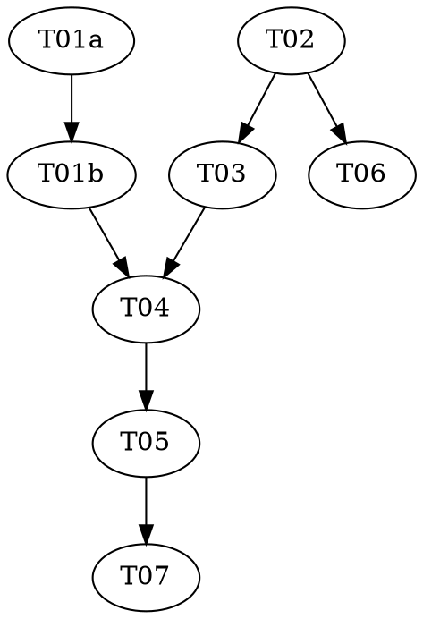

# tdd-audit Implementation Plan

> **For agentic workers:** REQUIRED: Use superpowers:subagent-driven-development (parallel, same session) or superpowers:executing-plans (sequential, separate session) to implement this plan. Steps use checkbox (`- [ ]`) syntax for tracking. This plan contains a `role: red|green` pair (T01a/T01b) — the executor MUST run each as a fresh subagent so the test author and the implementer are different agents.

**Goal:** Add a user-invocable `reasonable:tdd-audit` diagnostic that audits any repo's test suite for coverage, quality, and honesty, and mechanically *confirms* each sycophancy flag with the per-test reverse-discriminator — re-homing the external `tdd-audit` command at full capability and consolidating the honesty rubric + reverse-discriminator into one source of truth.

**Architecture:** A thin user-invocable skill launches a deterministic `reasonable-tdd-audit` workflow (Survey → Judge → Confirm → Report). Model judgment lives in `test-auditor` agent nodes (read-only); the Confirm phase shells out to the existing `lib/discriminator.mjs` reverse mode, which gains an effort-free flag path so the same code serves both the brownfield `characterizer` and this standalone audit. The honesty rubric becomes one canonical file cited by the audit and by the effort's `intent-verifier` + `auditor`.

**Tech Stack:** Node ESM (builtins only, no deps), the Workflow tool substrate, Claude Code skills/agents (markdown constitutions), git.

**Design doc:** `docs/superpowers/specs/2026-06-27-tdd-audit-skill-design.md`

**Planned by:** claude-opus-4-8[1m]

---

## Dependency Graph

| Task | Role | Depends On | Files Created/Modified |
|------|------|-----------|------------------------|
| T01a | red   | —          | `test/discriminator-reverse-standalone.test.mjs` (authored here) |
| T01b | green | T01a       | `lib/discriminator.mjs` (impl; the T01a test file is READ-ONLY) |
| T02  | —     | —          | `skills/tdd-audit/references/test-honesty-rubric.md` |
| T03  | —     | T02        | `agents/test-auditor.md` |
| T04  | —     | T01b, T03  | `workflows/tdd-audit.workflow.js` |
| T05  | —     | T04        | `skills/tdd-audit/SKILL.md` |
| T06  | —     | T02        | `agents/intent-verifier.md`, `agents/auditor.md` |
| T07  | —     | T05        | `CLAUDE.md` |

**Wave Schedule:**
- Wave 1: T01a, T02 (no dependencies)
- Wave 2: T01b (←T01a), T03 (←T02), T06 (←T02)
- Wave 3: T04 (←T01b, T03)
- Wave 4: T05 (←T04)
- Wave 5: T07 (←T05)

## Task Index

| ID   | Name                         | File                                      | Description                                                        |
|------|------------------------------|-------------------------------------------|-------------------------------------------------------------------|
| T01a | Discriminator standalone — test | tasks/T01a-discriminator-standalone-red.md   | Author the failing test for the effort-free reverse path          |
| T01b | Discriminator standalone — impl | tasks/T01b-discriminator-standalone-green.md | Implement the `--test-one-cmd`/`--test-glob` flag path             |
| T02  | Canonical honesty rubric     | tasks/T02-honesty-rubric.md               | The one rubric file the whole plugin cites                        |
| T03  | test-auditor agent           | tasks/T03-test-auditor-agent.md           | Read-only, lens-parameterized audit agent constitution            |
| T04  | tdd-audit workflow           | tasks/T04-tdd-audit-workflow.md           | The Survey→Judge→Confirm→Report orchestration script              |
| T05  | tdd-audit skill              | tasks/T05-tdd-audit-skill.md              | The user-invocable orchestrator checklist                         |
| T06  | Cite rubric in effort agents | tasks/T06-cite-rubric-effort-agents.md    | Point `intent-verifier` + `auditor` at the canonical rubric       |
| T07  | CLAUDE.md inventory          | tasks/T07-claude-md-inventory.md          | Add the diagnostic category + deprecation pointer                 |

## Execution Handoff

**Plan complete and saved to `docs/superpowers/plans/2026-06-27-tdd-audit/plan.md`.**

**1. Subagent-Driven (this session)** — dispatch fresh subagent per task, review between tasks.

**2. Parallel Session (separate)** — open new session with executing-plans, batch execution.
