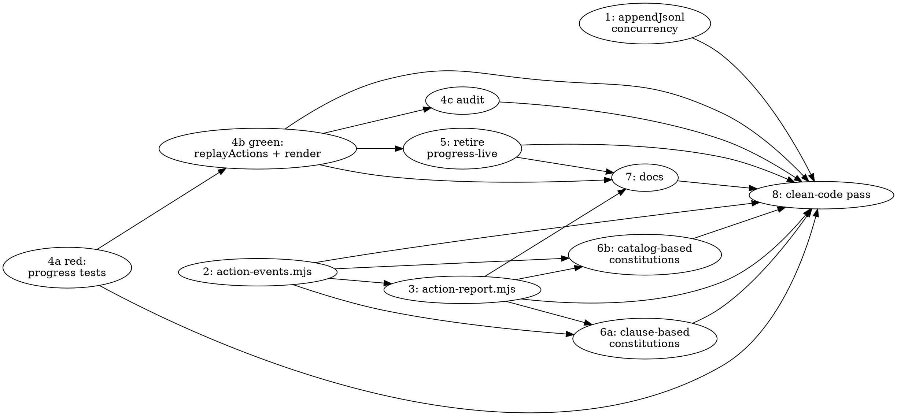

# Progress Action Events Implementation Plan

> **For agentic workers:** REQUIRED: Use superpowers:subagent-driven-development or superpowers:executing-plans to implement this plan. Steps use checkbox (`- [ ]`) syntax for tracking.

**Goal:** Replace the reasonable plugin's D19 heartbeat tier (`lib/progress-live.mjs`,
`progress-live.jsonl`, per-tool-call sampling) with agent-reported, addressable
`action-started`/`action-finished`/`action-obsoleted` ledger events, sequentially replayed into
the progress tree — killing the floating "now" lines and raw log fallback the heartbeat produced.

**Architecture:** Every dispatched agent reports its own named section (start as its first Bash
action, finish as its last) and, within it, its own items (contract clauses, a fixed per-role step
catalog, or ad hoc work) via a new `lib/action-report.mjs` CLI that appends to the existing
`ledger.jsonl` and regenerates the mirror. `lib/progress.mjs` replaces its old "furthest stage
reached" frontier math with a plain sequential replay of these events. Full spec:
`docs/superpowers/specs/2026-07-01-progress-action-events-design.md`.

**Tech Stack:** Node.js (builtins only, no dependencies), plain JSONL append-only ledger, the
existing `check(name, fn)` standalone test-harness convention (no test runner).

---

## Before you start

Read the full design spec first: `docs/superpowers/specs/2026-07-01-progress-action-events-design.md`.
This plan implements it task-by-task; the spec has the "why" this plan won't repeat.

Shared references (read once, cited by filename in later tasks instead of repeated):
- `docs/superpowers/plans/knowledge/running-tests.md` — how to run one test file / the whole suite.
- `docs/superpowers/plans/knowledge/cli-root-convention.md` — the `--root`/`rootFromArgv`/`argvWithoutRoot` pattern every `lib/*.mjs` CLI follows.

---

### Task 1: Harden `appendJsonl` for concurrent-safe `seq` assignment

**Files:**
- Modify: `lib/effort.mjs:8` (imports), `lib/effort.mjs:61-67` (`appendJsonl`)
- Test: `test/effort.test.mjs`

**Why this is first:** every ledger writer (existing and new) goes through `appendJsonl`. It
currently reads the last line's `seq`, adds 1, and appends — a read-then-write race under
concurrent callers. It's latent today because ledger writes are rare; this plan makes them
frequent and parallel (many lanes reporting section/item events concurrently), so fix the race
before anything depends on frequent concurrent appends.

- [ ] **Step 1: Write the failing concurrency test**

Add to the end of `test/effort.test.mjs` (before the final cleanup loop at the bottom of the
file), changing the import list on line 10 to add `appendJsonl`, `readJsonl`, and two more
`node:` imports:

```js
import { roleOf, rootFromArgv, argvWithoutRoot, findEffortRoot, appendJsonl, readJsonl } from '../lib/effort.mjs';
import { spawn } from 'node:child_process';
import { pathToFileURL } from 'node:url';
```

(`resolve` is already imported from `node:path` on line 9 — reuse it.)

```js
check('appendJsonl: N concurrent callers each get a unique, gapless seq', async () => {
  const root = mkdtempSync(join(tmpdir(), 'eff-concurrency-')); tmps.push(root);
  const path = join(root, 'ledger.jsonl');
  const effortMjsUrl = pathToFileURL(resolve('lib/effort.mjs')).href;
  const N = 20;
  // A single Node process can't race its own synchronous fs calls against itself — the
  // read-then-write window only shows up across real OS processes, so spawn N of them, all
  // targeting the same ledger path.
  const workers = Array.from({ length: N }, (_, i) => {
    const code = `import(${JSON.stringify(effortMjsUrl)}).then(m => m.appendJsonl(${JSON.stringify(path)}, { i: ${i} }));`;
    return spawn(process.execPath, ['--input-type=module', '-e', code], { stdio: 'ignore' });
  });
  await Promise.all(workers.map((w) => new Promise((res, rej) => {
    w.on('exit', (code) => (code === 0 ? res() : rej(new Error(`worker ${w.pid} exited ${code}`))));
    w.on('error', rej);
  })));
  const lines = readJsonl(path);
  assert.equal(lines.length, N, 'every concurrent append landed exactly once');
  const seqs = lines.map((l) => l.seq).sort((a, b) => a - b);
  assert.equal(new Set(seqs).size, N, 'no duplicate seq under concurrency');
  assert.deepEqual(seqs, Array.from({ length: N }, (_, i) => i + 1), 'seq is gapless 1..N');
});
```

(Uses the file's own `tmps` array + trailing cleanup loop — same convention as every other check
in this file — rather than a local try/finally.)

This async test needs the harness to await it — see Step 1b.

- [ ] **Step 1b: Make the test harness await async checks**

`test/effort.test.mjs`'s `check()` helper currently assumes synchronous checks. This is the
file's first async check, but `.mjs` is a native ES module — top-level `await` works directly, no
IIFE wrapper needed. Replace the file's exact current `check` helper (lines 14–17):

```js
function check(name, fn) {
  try { fn(); passed += 1; console.log(`  ok  ${name}`); }
  catch (e) { console.error(`FAIL  ${name}\n      ${e.message}`); process.exitCode = 1; }
}
```

with:

```js
async function check(name, fn) {
  try { await fn(); passed += 1; console.log(`  ok  ${name}`); }
  catch (e) { console.error(`FAIL  ${name}\n      ${e.message}`); process.exitCode = 1; }
}
```

and prefix **every** existing `check(...)` call in the file with `await` (there are 8 — run
`grep -n "^check(" test/effort.test.mjs` to confirm you got them all before moving on). Add
`import { spawn } from 'node:child_process';` to the import list.

- [ ] **Step 2: Run test to verify it fails**

Run: `node test/effort.test.mjs`
Expected: FAIL on the new concurrency check — either a thrown error from the current
read-then-write race producing duplicate `seq` values, or (nondeterministically) a pass, since
the race is a probabilistic window. If it passes on a given run, that's expected flakiness of an
unfixed race, not proof the race doesn't exist — proceed to Step 3 regardless; Step 4 must make
it deterministically pass under the same concurrency.

- [ ] **Step 3: Implement the lock-hardened `appendJsonl`**

In `lib/effort.mjs`, change the import line (line 8) to add `openSync`, `closeSync`, `unlinkSync`:

```js
import { existsSync, readFileSync, writeFileSync, appendFileSync, readdirSync, statSync, openSync, closeSync, unlinkSync } from 'node:fs';
```

Replace the existing `appendJsonl` (lines 61-67) with:

```js
/**
 * Acquire an exclusive advisory lock next to `path` (spin-retry with a short backoff), run
 * `fn`, then release. Bounds concurrent appendJsonl callers (many lanes reporting progress
 * events at once) to one at a time, closing the read-last-seq-then-append race below. Node has
 * no synchronous sleep builtin; Atomics.wait on a throwaway SharedArrayBuffer blocks the calling
 * thread for exactly `ms`, which is what a synchronous CLI needs here (no event loop to yield to).
 */
function withLock(path, fn) {
  const lockPath = `${path}.lock`;
  const deadline = Date.now() + 5000; // generous vs. a single JSON-line append; never hangs a run
  for (;;) {
    try {
      closeSync(openSync(lockPath, 'wx')); // exclusive create; throws EEXIST if already held
      break;
    } catch (e) {
      if (e.code !== 'EEXIST' || Date.now() > deadline) throw e;
      Atomics.wait(new Int32Array(new SharedArrayBuffer(4)), 0, 0, 10); // 10ms backoff
    }
  }
  try { return fn(); } finally { try { unlinkSync(lockPath); } catch { /* already gone */ } }
}

export function appendJsonl(path, obj) {
  return withLock(path, () => {
    const existing = readJsonl(path);
    const next = existing.length ? (existing[existing.length - 1].seq || existing.length) + 1 : 1;
    const line = JSON.stringify({ seq: next, ts: new Date().toISOString(), ...obj });
    appendFileSync(path, line + '\n');
    return next;
  });
}
```

- [ ] **Step 4: Run test to verify it passes**

Run: `node test/effort.test.mjs`
Expected: PASS, deterministically, across repeated runs (run it 3 times in a row to confirm —
`for i in 1 2 3; do node test/effort.test.mjs; done` — the concurrency check must pass every time,
not just probabilistically).

- [ ] **Step 5: Commit**

```bash
git add lib/effort.mjs test/effort.test.mjs
git commit -m "$(cat <<'EOF'
fix(effort): harden appendJsonl against concurrent-writer seq races

Ledger writes are about to become frequent and parallel (agent-reported
progress events); the existing read-last-seq-then-append pattern is a
latent race under concurrency. Add an exclusive advisory lock around the
critical section.

Co-Authored-By: Claude Sonnet 5 <noreply@anthropic.com>
EOF
)"
```

---

### Task 2: `lib/action-events.mjs` — shared event vocabulary, validator, and stage catalog

**Files:**
- Create: `lib/action-events.mjs`
- Test: `test/action-events.test.mjs`

**Depends on:** nothing (pure constants + a pure validation function, no I/O).

One shared module so `lib/action-report.mjs` (Task 3) and `lib/progress.mjs` (Task 4) — and any
future caller — use the exact same vocabulary and validation rules, never re-implemented per
caller (this is the "keep reusable code generic" piece the user asked for).

- [ ] **Step 1: Write the failing test**

Create `test/action-events.test.mjs`:

```js
// Standalone test for lib/action-events.mjs — node builtins only (no runner).
// Run: node test/action-events.test.mjs

import assert from 'node:assert';
import { LEVELS, KINDS, EVENT_TYPES, STAGE_ITEM_CATALOG, validateActionEvent } from '../lib/action-events.mjs';

let passed = 0;
function check(name, fn) {
  try { fn(); passed += 1; console.log(`  ok  ${name}`); }
  catch (e) { console.error(`FAIL  ${name}\n      ${e.stack || e.message}`); process.exitCode = 1; }
}

check('vocabulary: the three event types, two levels, three kinds', () => {
  assert.deepEqual(EVENT_TYPES, ['action-started', 'action-finished', 'action-obsoleted']);
  assert.deepEqual(LEVELS, ['section', 'item']);
  assert.deepEqual(KINDS, ['clause', 'step', 'adhoc']);
});

check("STAGE_ITEM_CATALOG: the auditor's four fixed steps", () => {
  assert.deepEqual(STAGE_ITEM_CATALOG.audit, ['discriminator-check', 'bidirectional-mapping', 'mutation-sampling', 'proportionality-review']);
});

check('validateActionEvent: a section requires workOrder + label, nothing else', () => {
  assert.deepEqual(validateActionEvent('action-started', { workOrder: 'WO-1', level: 'section', label: 'implementation' }), { ok: true });
  assert.equal(validateActionEvent('action-started', { workOrder: 'WO-1', level: 'section' }).ok, false, 'missing label');
  assert.equal(validateActionEvent('action-started', { level: 'section', label: 'x' }).ok, false, 'missing workOrder');
});

check('validateActionEvent: an item requires kind + ref', () => {
  assert.deepEqual(validateActionEvent('action-started', { workOrder: 'WO-1', level: 'item', kind: 'clause', ref: '§4' }), { ok: true });
  assert.equal(validateActionEvent('action-started', { workOrder: 'WO-1', level: 'item', ref: '§4' }).ok, false, 'missing kind');
  assert.equal(validateActionEvent('action-started', { workOrder: 'WO-1', level: 'item', kind: 'clause' }).ok, false, 'missing ref');
  assert.equal(validateActionEvent('action-started', { workOrder: 'WO-1', level: 'item', kind: 'bogus', ref: 'x' }).ok, false, 'unknown kind');
});

check('validateActionEvent: an adhoc ref must be a lowercase kebab-slug', () => {
  assert.equal(validateActionEvent('action-started', { workOrder: 'WO-1', level: 'item', kind: 'adhoc', ref: 'extract-helper' }).ok, true);
  assert.equal(validateActionEvent('action-started', { workOrder: 'WO-1', level: 'item', kind: 'adhoc', ref: '42' }).ok, false, 'bare number rejected');
  assert.equal(validateActionEvent('action-started', { workOrder: 'WO-1', level: 'item', kind: 'adhoc', ref: 'has space' }).ok, false, 'whitespace rejected');
  assert.equal(validateActionEvent('action-started', { workOrder: 'WO-1', level: 'item', kind: 'adhoc', ref: 'Upper' }).ok, false, 'uppercase rejected');
  assert.equal(validateActionEvent('action-started', { workOrder: 'WO-1', level: 'item', kind: 'adhoc', ref: 'red-1' }).ok, true, 'a trailing numeric segment is fine');
});

check('validateActionEvent: a clause/step ref is exempt from the adhoc slug shape', () => {
  assert.equal(validateActionEvent('action-started', { workOrder: 'WO-1', level: 'item', kind: 'clause', ref: '§4' }).ok, true);
  assert.equal(validateActionEvent('action-started', { workOrder: 'WO-1', level: 'item', kind: 'step', ref: 'discriminator-check' }).ok, true);
});

check('validateActionEvent: action-obsoleted requires a reason', () => {
  assert.equal(validateActionEvent('action-obsoleted', { workOrder: 'WO-1', level: 'item', kind: 'clause', ref: '§4' }).ok, false, 'missing reason');
  assert.equal(validateActionEvent('action-obsoleted', { workOrder: 'WO-1', level: 'item', kind: 'clause', ref: '§4', reason: 'covered by §3' }).ok, true);
});

check('validateActionEvent: rejects an unknown event type', () => {
  assert.equal(validateActionEvent('action-teleported', { workOrder: 'WO-1', level: 'section', label: 'x' }).ok, false);
});

if (process.exitCode) console.error(`\naction-events: FAILURES above (${passed} passed).`);
else console.log(`\naction-events: all ${passed} checks passed. ✓`);
```

- [ ] **Step 2: Run test to verify it fails**

Run: `node test/action-events.test.mjs`
Expected: FAIL immediately with a module-not-found error (`lib/action-events.mjs` doesn't exist yet).

- [ ] **Step 3: Write the implementation**

Create `lib/action-events.mjs`:

```js
// action-events.mjs — shared vocabulary for agent-reported progress action events (D19).
//
// The three ledger.jsonl event types a dispatched agent appends to report its own progress:
// action-started / action-finished / action-obsoleted. One shared validator here means
// lib/action-report.mjs (the CLI agents call) and any future caller enforce the exact same
// rules — never re-implemented per caller. See
// docs/superpowers/specs/2026-07-01-progress-action-events-design.md for the full design.

export const LEVELS = ['section', 'item'];
export const KINDS = ['clause', 'step', 'adhoc'];
export const EVENT_TYPES = ['action-started', 'action-finished', 'action-obsoleted'];

// A role's own fixed step catalog — the addressable `ref`s a kind:"step" item may name. Only
// roles whose work doesn't map to contract clauses AND doesn't vary in count per run need one
// (the auditor's own escalating checks, to start — adjudicator's per-red items vary in count,
// so they report kind:"adhoc" instead). Declared once, imported everywhere it's needed (agent
// constitutions cite these exact slugs; this module validates them) — never copy-pasted.
export const STAGE_ITEM_CATALOG = {
  audit: ['discriminator-check', 'bidirectional-mapping', 'mutation-sampling', 'proportionality-review'],
};

// A lowercase kebab-slug: starts with a letter, then letters/digits/hyphen-separated groups —
// rejects a bare number (no leading digit) and rejects whitespace (no space-separated words).
const ADHOC_REF_RE = /^[a-z][a-z0-9]*(-[a-z0-9]+)*$/;

/**
 * Validate one action-event's fields for the given event `type`. Returns { ok:true } or
 * { ok:false, error }. Pure — no I/O — so the CLI and its own tests exercise the exact same
 * function with no drift between "what's allowed" and "what's tested."
 */
export function validateActionEvent(type, fields) {
  const f = fields || {};
  if (!EVENT_TYPES.includes(type)) return { ok: false, error: `unknown event type: ${type}` };
  if (!f.workOrder) return { ok: false, error: 'workOrder is required' };
  if (!LEVELS.includes(f.level)) return { ok: false, error: `level must be one of: ${LEVELS.join(', ')}` };

  if (f.level === 'section') {
    if (!f.label) return { ok: false, error: 'a section requires a label' };
    return { ok: true };
  }

  // level === 'item'
  if (!KINDS.includes(f.kind)) return { ok: false, error: `kind must be one of: ${KINDS.join(', ')}` };
  if (!f.ref) return { ok: false, error: 'an item requires a ref' };
  if (f.kind === 'adhoc' && !ADHOC_REF_RE.test(f.ref)) {
    return { ok: false, error: `adhoc ref must be a lowercase kebab-slug (got "${f.ref}")` };
  }
  if (type === 'action-obsoleted' && !f.reason) return { ok: false, error: 'action-obsoleted requires a reason' };
  return { ok: true };
}
```

- [ ] **Step 4: Run test to verify it passes**

Run: `node test/action-events.test.mjs`
Expected: PASS — `action-events: all 8 checks passed. ✓`

- [ ] **Step 5: Commit**

```bash
git add lib/action-events.mjs test/action-events.test.mjs
git commit -m "$(cat <<'EOF'
feat(progress): shared action-event vocabulary + validator (D19)

One place declaring the action-started/finished/obsoleted schema, the
section/item level and kind enums, and the auditor's fixed step catalog —
shared by the reporting CLI and any future caller instead of being
re-implemented per consumer.

Co-Authored-By: Claude Sonnet 5 <noreply@anthropic.com>
EOF
)"
```

---

### Task 3: `lib/action-report.mjs` — the CLI agents call to report their own progress

**Files:**
- Create: `lib/action-report.mjs`
- Test: `test/action-report.test.mjs`

**Depends on:** Task 2 (`validateActionEvent`) only. This task imports `appendJsonl` from
`lib/effort.mjs`, but never exercises concurrent calls to it, and doesn't modify that file — so
it does **not** need to wait for Task 1's hardening (correct either way, and genuinely
parallelizable with it). It also imports `writeMirror` from `lib/progress.mjs`, which already
exists today with this exact export — this task does **not** need to wait for Task 4's rewrite
of `progress.mjs`'s internals either.

Read `docs/superpowers/plans/knowledge/cli-root-convention.md` first — this CLI follows that
exact `--root`/`rootFromArgv`/`argvWithoutRoot` pattern.

- [ ] **Step 1: Write the failing test**

Create `test/action-report.test.mjs`:

```js
// Standalone test for lib/action-report.mjs — node builtins only (no runner).
// Run: node test/action-report.test.mjs

import assert from 'node:assert';
import { execFileSync } from 'node:child_process';
import { mkdtempSync, mkdirSync, writeFileSync, readFileSync, rmSync, existsSync } from 'node:fs';
import { tmpdir } from 'node:os';
import { join, dirname } from 'node:path';
import { fileURLToPath } from 'node:url';

import { reportAction } from '../lib/action-report.mjs';

const LIB = join(dirname(fileURLToPath(import.meta.url)), '..', 'lib', 'action-report.mjs');
const tmps = [];

function newEffort() {
  const root = mkdtempSync(join(tmpdir(), 'action-report-test-'));
  tmps.push(root);
  mkdirSync(join(root, '.reasonable'), { recursive: true });
  writeFileSync(join(root, '.reasonable', 'journal.json'), JSON.stringify({
    effort: 'demo', currentVerticalSlice: 's',
    workOrders: { 'WO-1': { status: 'dispatched', role: 'implementer', verticalSlice: 's' } },
  }));
  return root;
}

let passed = 0;
function check(name, fn) {
  try { fn(); passed += 1; console.log(`  ok  ${name}`); }
  catch (e) { console.error(`FAIL  ${name}\n      ${e.stack || e.message}`); process.exitCode = 1; }
}

check('reportAction: a valid section-started call appends + regenerates the mirror', () => {
  const root = newEffort();
  const result = reportAction(root, 'started', { workOrder: 'WO-1', level: 'section', label: 'implementation' });
  assert.deepEqual(result, { ok: true });
  const ledger = readFileSync(join(root, '.reasonable', 'ledger.jsonl'), 'utf8').trim().split('\n').map((l) => JSON.parse(l));
  assert.equal(ledger.length, 1);
  assert.equal(ledger[0].type, 'action-started');
  assert.equal(ledger[0].level, 'section');
  assert.equal(ledger[0].label, 'implementation');
  assert.ok(existsSync(join(root, '.reasonable', 'progress.md')), 'mirror regenerated');
});

check('reportAction: an invalid call (missing label) is rejected, nothing appended', () => {
  const root = newEffort();
  const result = reportAction(root, 'started', { workOrder: 'WO-1', level: 'section' });
  assert.equal(result.ok, false);
  assert.match(result.error, /label/);
  assert.ok(!existsSync(join(root, '.reasonable', 'ledger.jsonl')), 'no partial append on validation failure');
});

check('reportAction: an unknown verb is rejected', () => {
  const root = newEffort();
  const result = reportAction(root, 'teleported', { workOrder: 'WO-1', level: 'section', label: 'x' });
  assert.equal(result.ok, false);
  assert.match(result.error, /unknown verb/);
});

check('CLI: a valid item-started call over the command line appends and exits 0', () => {
  const root = newEffort();
  execFileSync('node', [
    LIB, '--root', root, '--workOrder', 'WO-1',
    '--level', 'item', '--kind', 'clause', '--ref', '§4', '--label', 'precedence handling', 'started',
  ], { stdio: ['ignore', 'pipe', 'pipe'], timeout: 15000 });
  const ledger = readFileSync(join(root, '.reasonable', 'ledger.jsonl'), 'utf8').trim().split('\n').map((l) => JSON.parse(l));
  assert.equal(ledger.length, 1);
  assert.equal(ledger[0].kind, 'clause');
  assert.equal(ledger[0].ref, '§4');
});

check('CLI: fails loud (non-zero exit, stderr message) on a malformed call', () => {
  const root = newEffort();
  assert.throws(() => {
    execFileSync('node', [
      LIB, '--root', root, '--workOrder', 'WO-1', '--level', 'item', '--kind', 'adhoc', '--ref', 'HAS SPACE', 'started',
    ], { stdio: ['ignore', 'pipe', 'pipe'], timeout: 15000 });
  }, /Command failed/);
  assert.ok(!existsSync(join(root, '.reasonable', 'ledger.jsonl')), 'no partial append on a failed CLI call');
});

check('CLI: an obsoleted call requires --reason', () => {
  const root = newEffort();
  assert.throws(() => {
    execFileSync('node', [
      LIB, '--root', root, '--workOrder', 'WO-1', '--level', 'item', '--kind', 'clause', '--ref', '§4', 'obsoleted',
    ], { stdio: ['ignore', 'pipe', 'pipe'], timeout: 15000 });
  });
});

for (const t of tmps) { try { rmSync(t, { recursive: true, force: true }); } catch { /* best effort */ } }

if (process.exitCode) console.error(`\naction-report: FAILURES above (${passed} passed).`);
else console.log(`\naction-report: all ${passed} checks passed. ✓`);
```

- [ ] **Step 2: Run test to verify it fails**

Run: `node test/action-report.test.mjs`
Expected: FAIL immediately with a module-not-found error (`lib/action-report.mjs` doesn't exist yet).

- [ ] **Step 3: Write the implementation**

Create `lib/action-report.mjs`:

```js
// action-report.mjs — the CLI a dispatched agent calls to report ITS OWN progress: starting or
// finishing a named section of work, or an item within it, or marking an item obsolete (D19).
// Replaces the old passively-sampled progress-live heartbeat: this is a DELIBERATE call the
// agent makes, so — unlike the old hook, which had to fail open on every tool call — it fails
// LOUD on a malformed call, so the agent finds out immediately instead of the report vanishing.
//
// Usage:
//   node action-report.mjs --root <effortRoot> --workOrder <id> --level section --label <text> started
//   node action-report.mjs --root <effortRoot> --workOrder <id> --level section --label <text> finished
//   node action-report.mjs --root <effortRoot> --workOrder <id> --level item --kind <clause|step|adhoc> --ref <ref> [--label <text>] started
//   node action-report.mjs --root <effortRoot> --workOrder <id> --level item --kind <k> --ref <ref> finished
//   node action-report.mjs --root <effortRoot> --workOrder <id> --level item --kind <k> --ref <ref> --reason <text> obsoleted
//
// See docs/superpowers/specs/2026-07-01-progress-action-events-design.md for the full design.

import { appendJsonl, join, rootFromArgv, argvWithoutRoot, findEffortRoot, basename } from './effort.mjs';
import { validateActionEvent } from './action-events.mjs';
import { writeMirror } from './progress.mjs';

const VERBS = { started: 'action-started', finished: 'action-finished', obsoleted: 'action-obsoleted' };

/** Parse `--flag value` pairs plus one trailing bare verb (started|finished|obsoleted). */
function parseArgs(argv) {
  const fields = {};
  let verb = null;
  for (let i = 0; i < argv.length; i++) {
    const a = argv[i];
    if (a.startsWith('--')) { fields[a.slice(2)] = argv[i + 1]; i += 1; }
    else if (VERBS[a]) verb = a;
  }
  return { fields, verb };
}

/**
 * Validate + append one action-event, then regenerate the mirror. Returns { ok:true } or
 * { ok:false, error } — never throws, so both the CLI and a direct caller get the same shape.
 * Pure of any argv parsing (that's `parseArgs`'s job) — this is the one place the append+regen
 * side effect happens, shared by the CLI entrypoint and this module's own tests.
 */
export function reportAction(root, verb, fields) {
  const type = VERBS[verb];
  if (!type) return { ok: false, error: `unknown verb: ${verb} (expected one of ${Object.keys(VERBS).join(', ')})` };
  const check = validateActionEvent(type, fields);
  if (!check.ok) return check;

  appendJsonl(join(root, '.reasonable', 'ledger.jsonl'), { type, ...fields });
  writeMirror(root);
  return { ok: true };
}

// ── CLI ────────────────────────────────────────────────────────────────────────────
function runCli() {
  const root = rootFromArgv(process.argv, null) || findEffortRoot(process.cwd());
  if (!root) { console.error('action-report: no effort here (.reasonable/ not found).'); process.exit(1); }
  const { fields, verb } = parseArgs(argvWithoutRoot(process.argv).slice(2));
  const result = reportAction(root, verb, fields);
  if (!result.ok) { console.error(`action-report: ${result.error}`); process.exit(1); }
  process.exit(0);
}

if (basename(process.argv[1] || '') === 'action-report.mjs') runCli();
```

**Note:** `lib/effort.mjs` must export `basename` for this import to work — check
`lib/effort.mjs`'s import line (`import { ..., basename, join } from 'node:path';`) and its
re-export; `lib/progress.mjs` already imports `basename` from `./effort.mjs` today (see its
import block), so this is an existing, already-working re-export — no change needed there.

- [ ] **Step 4: Run test to verify it passes**

Run: `node test/action-report.test.mjs`
Expected: PASS — `action-report: all 6 checks passed. ✓`

- [ ] **Step 5: Commit**

```bash
git add lib/action-report.mjs test/action-report.test.mjs
git commit -m "$(cat <<'EOF'
feat(progress): action-report CLI — agents report their own progress (D19)

Replaces passive per-tool-call heartbeat sampling with a deliberate call
every dispatched agent makes to report a section or item starting,
finishing, or being marked obsolete. Fails loud on a malformed call
instead of silently vanishing, since this is an intentional report, not
sampled telemetry.

Co-Authored-By: Claude Sonnet 5 <noreply@anthropic.com>
EOF
)"
```

---

### Task 4a: [role: red] Write the section/item replay + rendering tests

**Files:**
- Modify: `test/progress.test.mjs`

**Depends on:** nothing (writes tests only — no implementation exists yet, this is intentional:
these tests define the contract Task 4b must satisfy). **Owns this file** — Task 4b must not
modify it.

This is the "red" leg of an adversarial-TDD triad: this task writes tests **from the spec**, not
from any implementation, and must not peek at how Task 4b will implement `replayActions`. Assert
invariants (a repeated start is a no-op, obsolete is terminal, no advance preview) rather than
pinning incidental implementation choices.

`test/progress.test.mjs` currently has a section (labeled with a `// G —` comment) testing the
old ephemeral live-heartbeat merge, and a later block (`// H —` through `// L —`) testing the old
fixed pipeline scaffold with live-fold. Both are being retired along with
`lib/progress-live.mjs` — replace them with the new section/item tests below. `// G2 —` (ledger
action-line timestamp prefixing) and `// M —` (seq-vs-ts ordering trust) test the **unrelated,
unchanged** flat atomic-action trail — leave those two exactly as they are.

- [ ] **Step 1: Add `replayActions` to the top-of-file import**

Change line 15 of `test/progress.test.mjs` from:

```js
import { buildModel, renderMarkdown, writeMirror } from '../lib/progress.mjs';
```

to:

```js
import { buildModel, renderMarkdown, writeMirror, replayActions } from '../lib/progress.mjs';
```

- [ ] **Step 2: Replace the `// G —` live-merge block with unit tests for `replayActions`**

Find the block starting at the comment `// G — the ephemeral live channel (D19 tier-2) merges on
top of the projection.` and ending immediately before the comment `// G2 — atomic-action lines
carry the same literal [HH:MM:SS] prefix…` (this spans the `liveLines` helper and the three
`check(...)` blocks: `'live merge: latest heartbeat per key…'`, `'live merge: a heartbeat older
than journal.lastReconciled…'`, and `'render: live heartbeats render as ⟳ now lines…'`). Delete
that entire block and replace it with:

```js
// G — action events (D19 replacement for the old per-tool-call heartbeat): agents report their
// own progress as action-started / action-finished / action-obsoleted ledger lines, replayed
// SEQUENTIALLY (never accumulated by hand) into an ordered section list, each holding an ordered
// item list. See docs/superpowers/specs/2026-07-01-progress-action-events-design.md.

check('replayActions: a single section with two items, one done one active', () => {
  const { sections } = replayActions([
    { seq: 1, type: 'action-started', level: 'section', label: 'implementation', ts: '2026-06-27T09:00:00Z' },
    { seq: 2, type: 'action-started', level: 'item', kind: 'clause', ref: '§1', label: '§1 exists', ts: '2026-06-27T09:00:05Z' },
    { seq: 3, type: 'action-finished', level: 'item', ref: '§1', ts: '2026-06-27T09:01:00Z' },
    { seq: 4, type: 'action-started', level: 'item', kind: 'clause', ref: '§2', label: '§2 routes', ts: '2026-06-27T09:01:05Z' },
  ]);
  assert.equal(sections.length, 1);
  assert.equal(sections[0].label, 'implementation');
  assert.equal(sections[0].status, 'active', 'no matching section finish yet');
  assert.deepEqual(sections[0].items.map((i) => [i.ref, i.status]), [['§1', 'done'], ['§2', 'active']]);
});

check('replayActions: a repeated action-started for an open ref is a no-op, not a second row', () => {
  const { sections } = replayActions([
    { seq: 1, type: 'action-started', level: 'section', label: 'implementation' },
    { seq: 2, type: 'action-started', level: 'item', kind: 'adhoc', ref: 'extract-helper', ts: '2026-06-27T09:00:05Z' },
    { seq: 3, type: 'action-started', level: 'item', kind: 'adhoc', ref: 'extract-helper', ts: '2026-06-27T09:00:09Z' },
  ]);
  assert.equal(sections[0].items.length, 1, 'no duplicate row for the re-affirmed ref');
  assert.equal(sections[0].items[0].startedAt, '2026-06-27T09:00:05Z', 'keeps the ORIGINAL start time');
  assert.equal(sections[0].items[0].status, 'active');
});

check('replayActions: an obsoleted item shows its own status + reason, regardless of start/finish', () => {
  const { sections } = replayActions([
    { seq: 1, type: 'action-started', level: 'section', label: 'implementation' },
    { seq: 2, type: 'action-started', level: 'item', kind: 'clause', ref: '§4' },
    { seq: 3, type: 'action-obsoleted', level: 'item', kind: 'clause', ref: '§4', reason: "covered by §3's new helper" },
  ]);
  const item = sections[0].items[0];
  assert.equal(item.status, 'obsolete');
  assert.equal(item.reason, "covered by §3's new helper");
});

check('replayActions: obsolete is terminal — a later finished event does not flip it back', () => {
  const { sections } = replayActions([
    { seq: 1, type: 'action-started', level: 'section', label: 'implementation' },
    { seq: 2, type: 'action-started', level: 'item', kind: 'clause', ref: '§4' },
    { seq: 3, type: 'action-obsoleted', level: 'item', kind: 'clause', ref: '§4', reason: 'moot' },
    { seq: 4, type: 'action-finished', level: 'item', ref: '§4' }, // stray, out-of-order report
  ]);
  assert.equal(sections[0].items[0].status, 'obsolete', 'obsoleted is terminal once reported');
});

check('replayActions: a finish/obsolete with no prior started still renders, never throws', () => {
  assert.doesNotThrow(() => {
    const { sections } = replayActions([
      { seq: 1, type: 'action-started', level: 'section', label: 'audit' },
      { seq: 2, type: 'action-finished', level: 'item', kind: 'step', ref: 'discriminator-check' },
    ]);
    assert.equal(sections[0].items[0].status, 'done', 'best-effort render, no crash');
  });
});

check('replayActions: item identity resets per section — the same ref in two sections is two rows', () => {
  const { sections } = replayActions([
    { seq: 1, type: 'action-started', level: 'section', label: 'implementation' },
    { seq: 2, type: 'action-started', level: 'item', kind: 'clause', ref: '§4' },
    { seq: 3, type: 'action-finished', level: 'item', ref: '§4' },
    { seq: 4, type: 'action-finished', level: 'section', label: 'implementation' },
    { seq: 5, type: 'action-started', level: 'section', label: 'post-audit fixes' },
    { seq: 6, type: 'action-started', level: 'item', kind: 'clause', ref: '§4' }, // reopened in a NEW section
  ]);
  assert.equal(sections.length, 2);
  assert.equal(sections[0].items.length, 1);
  assert.equal(sections[0].items[0].status, 'done');
  assert.equal(sections[1].items.length, 1, 'a fresh row in the new section, not merged with the old one');
  assert.equal(sections[1].items[0].status, 'active');
});

check('replayActions: an explicitly finished section is done even as the last section in the run', () => {
  const { sections } = replayActions([
    { seq: 1, type: 'action-started', level: 'section', label: 'audit', ts: '2026-06-27T10:00:00Z' },
    { seq: 2, type: 'action-finished', level: 'section', label: 'audit', ts: '2026-06-27T10:05:00Z' },
  ]);
  assert.equal(sections[0].status, 'done');
});
```

- [ ] **Step 3: Replace the `// H —` through `// L —` blocks with integration/rendering tests**

Find the block starting at the comment `// H — the FROZEN-WAVE fix end to end (D19 acceptance
#1).` and ending at the closing `});` of the `check('render: a live agent todo list renders as a
checklist subtree under its active stage', …)` block (immediately before the `// M —` comment).
Delete that entire block (four `check(...)` calls: the frozen-wave fix, the dispatched-WO
pipeline scaffold, the merged-WO pipeline, the evidence-gated conditionals, and the live-todo
subtree — all of them tested the retired `pipelineFor`/live-fold mechanism) and replace it with:

```js
// H — the acceptance scenario from the design spec: an audit finds bugs, a "post-audit fixes"
// section is appended (never rewriting the original implementation/audit sections), followed by
// a second "audit" pass — the exact shape a rework cycle must render as.
check('render: post-audit-fixes rework renders as new sections, never rewriting history', () => {
  const root = newEffort();
  write(root, '.reasonable/journal.json', JSON.stringify({
    effort: 'demo', currentVerticalSlice: 's',
    workOrders: { 'WO-1': { status: 'checkpointed', role: 'implementer', verticalSlice: 's' } },
  }));
  write(root, '.reasonable/ledger.jsonl', [
    { seq: 1, type: 'action-started', workOrder: 'WO-1', level: 'section', label: 'implementation', ts: '2026-06-27T09:00:00Z' },
    { seq: 2, type: 'action-started', workOrder: 'WO-1', level: 'item', kind: 'adhoc', ref: 'feature-x', label: 'feature X', ts: '2026-06-27T09:00:05Z' },
    { seq: 3, type: 'action-finished', workOrder: 'WO-1', level: 'item', ref: 'feature-x', ts: '2026-06-27T09:10:00Z' },
    { seq: 4, type: 'action-started', workOrder: 'WO-1', level: 'item', kind: 'adhoc', ref: 'feature-y', label: 'feature Y', ts: '2026-06-27T09:10:05Z' },
    { seq: 5, type: 'action-finished', workOrder: 'WO-1', level: 'item', ref: 'feature-y', ts: '2026-06-27T09:20:00Z' },
    { seq: 6, type: 'action-finished', workOrder: 'WO-1', level: 'section', label: 'implementation', ts: '2026-06-27T09:20:00Z' },
    { seq: 7, type: 'action-started', workOrder: 'WO-1', level: 'section', label: 'audit', ts: '2026-06-27T09:20:05Z' },
    { seq: 8, type: 'action-started', workOrder: 'WO-1', level: 'item', kind: 'step', ref: 'discriminator-check', ts: '2026-06-27T09:20:10Z' },
    { seq: 9, type: 'action-finished', workOrder: 'WO-1', level: 'item', ref: 'discriminator-check', ts: '2026-06-27T09:21:00Z' },
    { seq: 10, type: 'action-started', workOrder: 'WO-1', level: 'item', kind: 'step', ref: 'mutation-sampling', ts: '2026-06-27T09:21:05Z' },
    { seq: 11, type: 'action-finished', workOrder: 'WO-1', level: 'item', ref: 'mutation-sampling', ts: '2026-06-27T09:22:00Z' },
    { seq: 12, type: 'action-finished', workOrder: 'WO-1', level: 'section', label: 'audit', ts: '2026-06-27T09:22:00Z' },
    { seq: 13, type: 'action-started', workOrder: 'WO-1', level: 'section', label: 'post-audit fixes', ts: '2026-06-27T09:22:05Z' },
    { seq: 14, type: 'action-started', workOrder: 'WO-1', level: 'item', kind: 'adhoc', ref: 'bug-a', label: 'bug A', ts: '2026-06-27T09:22:10Z' },
    { seq: 15, type: 'action-finished', workOrder: 'WO-1', level: 'item', ref: 'bug-a', ts: '2026-06-27T09:25:00Z' },
    { seq: 16, type: 'action-started', workOrder: 'WO-1', level: 'item', kind: 'adhoc', ref: 'bug-b', label: 'bug B', ts: '2026-06-27T09:25:05Z' },
  ].map((e) => JSON.stringify(e)).join('\n') + '\n');
  const wo = buildModel(root).slices[0].children[0];
  assert.deepEqual(wo.sections.map((s) => s.label), ['implementation', 'audit', 'post-audit fixes']);
  assert.equal(wo.sections[0].status, 'done');
  assert.equal(wo.sections[1].status, 'done');
  assert.equal(wo.sections[2].status, 'active', 'the tail section is the one still open');
  assert.equal(wo.sections[2].items[0].status, 'done', 'bug A finished');
  assert.equal(wo.sections[2].items[1].status, 'active', 'bug B is the current work');

  const md = renderMarkdown(buildModel(root));
  assert.match(md, /- ✓ implementation/);
  assert.match(md, /- ✓ audit/);
  assert.match(md, /- ▶ post-audit fixes {2,}\[09:22:05\]/);
  assert.match(md, /- ▶ bug B {2,}\[09:25:05\]/);
  assert.doesNotMatch(md, /now:/, 'no floating "now" fallback line anywhere');
  assert.doesNotMatch(md, /⟳/, 'no heartbeat glyph — the heartbeat tier is gone');
});

check('render: an obsoleted clause shows its own glyph + reason, never the done glyph', () => {
  const root = newEffort();
  write(root, '.reasonable/journal.json', JSON.stringify({
    effort: 'demo', currentVerticalSlice: 's',
    workOrders: { 'WO-1': { status: 'dispatched', role: 'implementer', verticalSlice: 's' } },
  }));
  write(root, '.reasonable/ledger.jsonl', [
    { seq: 1, type: 'action-started', workOrder: 'WO-1', level: 'section', label: 'implementation' },
    { seq: 2, type: 'action-started', workOrder: 'WO-1', level: 'item', kind: 'clause', ref: '§4', label: 'legacy branch' },
    { seq: 3, type: 'action-obsoleted', workOrder: 'WO-1', level: 'item', kind: 'clause', ref: '§4', reason: "covered by §3's helper" },
  ].map((e) => JSON.stringify(e)).join('\n') + '\n');
  const md = renderMarkdown(buildModel(root));
  assert.match(md, /⊘ legacy branch — covered by §3's helper/);
  assert.doesNotMatch(md, /✓ legacy branch/);
});

check('render: a started-but-never-finished item stays visibly active even after the section closes (honest gap)', () => {
  const root = newEffort();
  write(root, '.reasonable/journal.json', JSON.stringify({
    effort: 'demo', currentVerticalSlice: 's',
    workOrders: { 'WO-1': { status: 'dispatched', role: 'implementer', verticalSlice: 's' } },
  }));
  write(root, '.reasonable/ledger.jsonl', [
    { seq: 1, type: 'action-started', workOrder: 'WO-1', level: 'section', label: 'implementation' },
    { seq: 2, type: 'action-started', workOrder: 'WO-1', level: 'item', kind: 'clause', ref: '§4', label: 'left dangling' },
    { seq: 3, type: 'action-finished', workOrder: 'WO-1', level: 'section', label: 'implementation' },
    { seq: 4, type: 'action-started', workOrder: 'WO-1', level: 'section', label: 'audit' },
  ].map((e) => JSON.stringify(e)).join('\n') + '\n');
  const wo = buildModel(root).slices[0].children[0];
  assert.equal(wo.sections[0].items[0].status, 'active', 'never silently promoted to done just because the section closed');
});

check('render: no advance preview — a section never appears before its own action-started lands', () => {
  const root = newEffort();
  write(root, '.reasonable/journal.json', JSON.stringify({
    effort: 'demo', currentVerticalSlice: 's',
    workOrders: { 'WO-1': { status: 'dispatched', role: 'implementer', verticalSlice: 's' } },
  }));
  write(root, '.reasonable/ledger.jsonl', JSON.stringify(
    { seq: 1, type: 'action-started', workOrder: 'WO-1', level: 'section', label: 'implementation' },
  ) + '\n');
  const md = renderMarkdown(buildModel(root));
  assert.doesNotMatch(md, /· audit/, 'audit never previews before it has started');
  assert.doesNotMatch(md, /blind-test/, 'blind-test never previews before it has started');
});
```

- [ ] **Step 4: Run tests to verify they fail for the right reason**

Run: `node test/progress.test.mjs`
Expected: FAIL — every new check errors with `replayActions is not a function` or `undefined
(reading 'sections')`, since `lib/progress.mjs` doesn't export `replayActions` yet and
`buildModel` doesn't attach `.sections` yet. This is the right failure (missing implementation),
not a wrong-assertion failure.

- [ ] **Step 5: Commit**

```bash
git add test/progress.test.mjs
git commit -m "$(cat <<'EOF'
test(progress): red — section/item replay + rendering tests (D19)

Replaces the retired live-heartbeat-merge and fixed-pipeline-scaffold
tests with tests for the new agent-reported action-event model: basic
replay, the idempotent-restart and honest-gap edge cases, obsolete as a
terminal state, item identity resetting per section, and the
post-audit-fixes rework scenario as an acceptance test. Fails until Task
4b implements replayActions + the new rendering.

Co-Authored-By: Claude Sonnet 5 <noreply@anthropic.com>
EOF
)"
```

---

### Task 4b: [role: green] Implement `replayActions` + the new section/item rendering

**Files:**
- Modify: `lib/progress.mjs`

**Depends on:** Task 4a. **Read-only on `test/progress.test.mjs` — do not modify it.** If a
locked test looks wrong, escalate rather than editing it.

This removes `pipelineFor` and the whole live-heartbeat merge entirely — not extends them. Every
edit below is a straight replacement of existing code in `lib/progress.mjs`, matched by exact
current text (use the Edit tool with these as `old_string`/`new_string`).

- [ ] **Step 1: Remove the `progress-live.mjs` import**

Delete this line (currently line 36):

```js
import { readLive } from './progress-live.mjs';
```

(Leave the rest of the import block from `./effort.mjs` above it untouched.)

- [ ] **Step 2: Replace the pipeline-scaffold block with `replayActions`**

Replace this entire block (the `// ── the per-WO pipeline scaffold ──…` comment through the end
of `pipelineFor`):

```js
// ── the per-WO pipeline scaffold ─────────────────────────────────────────────────
// Every vertical-slice work order runs the SAME fixed wave (vertical-slice-runner):
// provision → [characterize] → implement → [intent-verify] → blind-test → adjudicate → audit
// (then merge). The two bracketed stages are CONDITIONAL — characterize fires only on a
// brownfield first-touch, intent-verify only when a risk-gated contract enrichment is
// proposed — so we render them ONLY when the run has evidenced them (a heartbeat or a
// ledger action). The projection never PREDICTS a stage that may not run.
//
// A stage's status is read off the run, never accumulated: the FRONTIER is the furthest
// stage any evidence reached (latest live heartbeat ∪ ledger-action-implied stage ∪ the
// terminal WO status). Because the wave is monotone, everything before the frontier is
// done, the frontier itself is active (⏸ if the WO checkpointed, ✗ if it dead-ended), and
// everything after is pending. A merged/green WO is wholly done.
const PIPELINE = [
  { stage: 'provision', conditional: false },
  { stage: 'characterize', conditional: true },
  { stage: 'implement', conditional: false },
  { stage: 'intent-verify', conditional: true },
  { stage: 'blind-test', conditional: false },
  { stage: 'adjudicate', conditional: false },
  { stage: 'audit', conditional: false },
];
const STAGE_INDEX = Object.fromEntries(PIPELINE.map((p, i) => [p.stage, i]));
// A landed ledger action implies its producing stage was reached — the fallback when a
// finished stage's live heartbeat has aged out but the WO has not merged yet.
const STAGE_FOR_ACTION = {
  enrichment: 'implement', amendment: 'implement', commit: 'implement', checkpoint: 'implement',
  characterization: 'characterize', 'characterization-promotion': 'characterize',
  'change-characterized': 'characterize', 'change-characterized-planned': 'characterize',
  'verifier-verdict': 'intent-verify',
  verdict: 'adjudicate',
};

function pipelineFor(status, live, actions) {
  const evidenced = new Set();
  let furthest = -1;
  const note = (stage) => {
    const i = STAGE_INDEX[stage];
    if (i == null) return; // unknown stage (non-WO role) — never advances the pipeline
    evidenced.add(stage);
    if (i > furthest) furthest = i;
  };
  for (const a of (actions || [])) note(STAGE_FOR_ACTION[a.type]);
  if (live && live.stage) note(live.stage);

  const done = isDone(status);
  if (done) furthest = PIPELINE.length - 1; // merged ⇒ every stage reached
  const frontier = status === 'dead-end' ? 'blocked' : (status === 'checkpointed' ? 'checkpointed' : 'active');

  return PIPELINE
    .filter((p) => !p.conditional || evidenced.has(p.stage))
    .map((p) => {
      const i = STAGE_INDEX[p.stage];
      const st = (done || i < furthest) ? 'done' : (i === furthest ? frontier : 'pending');
      return { stage: p.stage, status: st };
    });
}
```

with:

```js
// ── action events: agent-reported progress (D19 replacement for the old heartbeat tier) ────
// Each work order's own `action-started`/`action-finished`/`action-obsoleted` ledger lines are
// replayed SEQUENTIALLY (seq order — the same causal clock every other ledger consumer trusts)
// into an ordered section list, each holding an ordered item list. No stored status: a row's
// glyph is always DERIVED from which events exist for it, never accumulated by hand. See
// docs/superpowers/specs/2026-07-01-progress-action-events-design.md.
const ACTION_GLYPH = { pending: '·', active: '▶', done: '✓', obsolete: '⊘' };

/**
 * Replay one work order's seq-ordered ledger entries into { sections }. Pure — no I/O,
 * independently unit-testable. Only `action-started`/`action-finished`/`action-obsoleted`
 * entries participate; everything else (enrichment, commit, checkpoint, …) is ignored here — it
 * still renders in the atomic-action trail, unchanged, alongside this.
 */
export function replayActions(actions) {
  const sections = [];
  let curSection = null;
  let itemsByRef = new Map(); // ref -> item, scoped to the CURRENTLY open section only

  const closeSection = () => {
    if (curSection) curSection.status = curSection.finishedAt ? 'done' : 'active';
  };

  for (const a of (actions || [])) {
    if (a.type === 'action-started' && a.level === 'section') {
      closeSection();
      curSection = { label: a.label, startedAt: a.ts || null, finishedAt: null, status: 'active', items: [] };
      sections.push(curSection);
      itemsByRef = new Map();
      continue;
    }
    if (!curSection) continue; // an item event with no open section is unaddressable — ignore, never throw
    if (a.type === 'action-finished' && a.level === 'section') { curSection.finishedAt = a.ts || null; continue; }
    if (a.level !== 'item') continue;

    let item = itemsByRef.get(a.ref);
    if (!item) {
      item = { kind: a.kind || null, ref: a.ref, label: a.label || a.ref, startedAt: null, finishedAt: null, obsoleted: false, reason: null, status: 'pending' };
      itemsByRef.set(a.ref, item);
      curSection.items.push(item);
    }
    if (item.obsoleted) continue; // obsolete is terminal — a later start/finish never revives it
    if (a.type === 'action-started') { item.startedAt = item.startedAt || a.ts || null; item.status = item.finishedAt ? 'done' : 'active'; }
    else if (a.type === 'action-finished') { item.finishedAt = item.finishedAt || a.ts || null; item.status = 'done'; }
    else if (a.type === 'action-obsoleted') { item.obsoleted = true; item.reason = a.reason || null; item.status = 'obsolete'; }
  }
  closeSection();
  return { sections };
}
```

- [ ] **Step 3: Remove the now-dead `TODO_GLYPH`/`todoGlyph` helper**

Delete (it was only used by the retired live-todo rendering):

```js
// A spawned agent's own TodoWrite items (captured live) render as a checklist subtree.
const TODO_GLYPH = { completed: '☑', in_progress: '▶', pending: '☐' };
const todoGlyph = (s) => TODO_GLYPH[s] || '☐';
```

- [ ] **Step 4: Simplify `buildModel`'s signature and per-WO mapping**

Replace:

```js
// ── the projection ────────────────────────────────────────────────────────────────
// opts (all optional, for deterministic tests): { now } — the clock for live-channel TTL;
// { liveTtlMs } — override the staleness window.
export function buildModel(root, opts = {}) {
```

with:

```js
// ── the projection ────────────────────────────────────────────────────────────────
export function buildModel(root) {
```

Then replace the per-WO mapping inside the `slices` computation:

```js
    const workOrders = [...woIds].sort().map((id) => {
      const st = woState[id] || {};
      const def = woDefs[id] || {};
      const status = st.status || 'pending';
      // Ordered by `seq` — the monotonic append counter, i.e. causal order — NEVER by ts
      // (ts can be agent-authored and unreliable; seq is mechanically assigned).
      const actions = (actionsByWO[id] || [])
        .slice()
        .sort((a, b) => (a.seq || 0) - (b.seq || 0))
        .map((e) => ({ kind: 'action', type: e.type, title: actionLine(e), ts: e.ts || null, seq: e.seq ?? null }));
      return { kind: 'work-order', id, status, title: woTitle(id, def, st), role: st.role || def.role || null, children: actions };
    });
```

with:

```js
    const workOrders = [...woIds].sort().map((id) => {
      const st = woState[id] || {};
      const def = woDefs[id] || {};
      const status = st.status || 'pending';
      // Ordered by `seq` — the monotonic append counter, i.e. causal order — NEVER by ts
      // (ts can be agent-authored and unreliable; seq is mechanically assigned).
      const rawActions = (actionsByWO[id] || []).slice().sort((a, b) => (a.seq || 0) - (b.seq || 0));
      // The flat historical trail excludes the new action-* events — those render as the
      // section/item tree below (replayActions) instead; showing both would be redundant.
      const actions = rawActions
        .filter((e) => !e.type || !e.type.startsWith('action-'))
        .map((e) => ({ kind: 'action', type: e.type, title: actionLine(e), ts: e.ts || null, seq: e.seq ?? null }));
      const { sections } = replayActions(rawActions);
      return { kind: 'work-order', id, status, title: woTitle(id, def, st), role: st.role || def.role || null, children: actions, sections };
    });
```

- [ ] **Step 5: Delete the live-channel merge block entirely**

Delete this whole block (it sat between building `slices` and the final `return`):

```js
  // ── ephemeral live channel (D19 tier-2): merge per-agent "now" heartbeats on top of
  // the canonical projection. Reset-on-reconcile is honored by ignoring any heartbeat
  // older than journal.lastReconciled; the TTL drops a dead agent's last gasp. This is
  // PRESENTATION-ONLY: it changes nothing the projection reads back as authoritative.
  const sinceMs = journal.lastReconciled ? Date.parse(journal.lastReconciled) : NaN;
  const live = readLive(root, {
    now: opts.now,
    ttlMs: opts.liveTtlMs,
    sinceMs: Number.isFinite(sinceMs) ? sinceMs : null,
  });
  const attached = new Set();
  for (const s of slices) {
    for (const w of s.children) {
      const lv = live.byWorkOrder[w.id];
      if (lv) { w.live = lv; attached.add(w.id); }
    }
  }
  // The pipeline scaffold is a projection of (WO status ∪ live heartbeat ∪ ledger actions),
  // so it is computed AFTER the live heartbeat is attached above.
  for (const s of slices) for (const w of s.children) w.pipeline = pipelineFor(w.status, w.live, w.children);
  // Heartbeats with no work-order stage (reconcile / plan / scribe), plus any work-order
  // heartbeat whose node is not in the tree yet (the write-ahead has not landed), surface
  // at the effort level so nothing live is lost.
  const effortLive = [
    ...live.effort,
    ...Object.entries(live.byWorkOrder).filter(([id]) => !attached.has(id)).map(([, v]) => v),
  ];
```

- [ ] **Step 6: Drop `live`/`counts.live` from the returned model**

Replace:

```js
  // Effort-level tallies (the user-facing "atomic actions done" + cost).
  const atomicActions = ledger.filter((e) => e && e.workOrder).length;
  return {
    effort: journal.effort || basename(root),
    phase: journal.phase || null,
    currentVerticalSlice: current,
    cost: journal.cost || null, // { agentsDispatched, tokensSpent, updatedAt } — written by the scribe (D19)
    counts: {
      slices: slices.length,
      slicesGreen: slices.filter((s) => s.status === 'green').length,
      workOrders: slices.reduce((n, s) => n + s.children.length, 0),
      workOrdersGreen: slices.reduce((n, s) => n + s.children.filter((w) => isDone(w.status)).length, 0),
      atomicActions,
      live: attached.size + effortLive.length,
    },
    slices,
    live: effortLive, // effort-level "now" heartbeats (no work order, or not-yet-in-tree)
    inbox: (Array.isArray(inbox) ? inbox : []).map((i) => ({ id: i.id || null, kind: i.kind || null, class: i.class || i.cls || null })),
    lastReconciled: journal.lastReconciled || null,
  };
```

with:

```js
  // Effort-level tallies (the user-facing "atomic actions done" + cost).
  const atomicActions = ledger.filter((e) => e && e.workOrder).length;
  return {
    effort: journal.effort || basename(root),
    phase: journal.phase || null,
    currentVerticalSlice: current,
    cost: journal.cost || null, // { agentsDispatched, tokensSpent, updatedAt } — written by the scribe (D19)
    counts: {
      slices: slices.length,
      slicesGreen: slices.filter((s) => s.status === 'green').length,
      workOrders: slices.reduce((n, s) => n + s.children.length, 0),
      workOrdersGreen: slices.reduce((n, s) => n + s.children.filter((w) => isDone(w.status)).length, 0),
      atomicActions,
    },
    slices,
    inbox: (Array.isArray(inbox) ? inbox : []).map((i) => ({ id: i.id || null, kind: i.kind || null, class: i.class || i.cls || null })),
    lastReconciled: journal.lastReconciled || null,
  };
```

- [ ] **Step 7: Remove the dead `liveLine` helper and add `actionRowSuffix`**

Replace:

```js
// One ephemeral heartbeat as a human line: "implement · Edit ChoiceEdge.tsx" (the caller
// prefixes the literal timestamp).
function liveLine(lv) {
  const who = lv.stage || lv.role || '?';
  const what = [lv.tool, lv.target].filter(Boolean).join(' ');
  return `${who}${what ? ` · ${what}` : ''}`;
}
```

with:

```js
// Only the currently-active row gets a timestamp — done/pending/obsolete rows show none;
// duration is inferred from the gap to whatever started next, never stored explicitly.
function actionRowSuffix(row) {
  return row.status === 'active' ? `   ${tsp(row.startedAt)}`.trimEnd() : '';
}
```

- [ ] **Step 8: Replace the "now" ticker + pipeline-fold rendering with section/item rendering**

Replace:

```js
  L.push('> Pin this file to follow the run live — it is regenerated from the ledger on every journal update and on every subagent tool call (the ⟳ heartbeats), no model in the loop. Times are UTC.');
  L.push('');
  // Effort-level "now" heartbeats: stages with no work order (reconcile / plan / scribe),
  // or a work-order heartbeat whose tree node has not landed yet.
  for (const lv of (m.live || [])) L.push(`> ${tsp(lv.ts)}⟳ **now** · ${liveLine(lv)}`);
  if (m.live && m.live.length) L.push('');
  for (const s of m.slices) {
    L.push(`- ${glyph(s.status)} **${s.id}**  _(${s.status})_`);
    for (const w of s.children) {
      L.push(`  - ${glyph(w.status)} \`${w.id}\` — ${w.title}  _(${w.status})_`);
      // The pipeline scaffold: the fixed stage checklist. The live heartbeat (the tool the
      // current stage is running right now) folds into the active stage's line.
      const liveStage = w.live && w.live.stage;
      let folded = false;
      for (const p of (w.pipeline || [])) {
        if (w.live && p.stage === liveStage && p.status !== 'done' && p.status !== 'pending') {
          folded = true;
          const what = [w.live.tool, w.live.target].filter(Boolean).join(' ');
          L.push(`    - ${glyph(p.status)} ${p.stage}   ${tsp(w.live.ts)}⟳ ${what}`.trimEnd());
        } else {
          L.push(`    - ${glyph(p.status)} ${p.stage}`);
        }
        // The agent's own todo list, captured live, hangs under the stage running it.
        if (w.live && p.stage === liveStage && Array.isArray(w.live.todos) && w.live.todos.length) {
          for (const t of w.live.todos) L.push(`      - ${todoGlyph(t.status)} ${t.content}`);
        }
      }
      // A live heartbeat whose stage isn't a rendered pipeline stage (an unknown role) must
      // never be lost — surface it as a standalone ⟳ line.
      if (w.live && !folded) L.push(`    - ${tsp(w.live.ts)}⟳ now: ${liveLine(w.live)}`);
      // The action trail (already seq-ordered). A ts later than some higher-seq sibling's is
```

with:

```js
  L.push('> Pin this file to follow the run live — it is regenerated every time a work order reports its own progress, no model in the loop. Times are UTC.');
  L.push('');
  for (const s of m.slices) {
    L.push(`- ${glyph(s.status)} **${s.id}**  _(${s.status})_`);
    for (const w of s.children) {
      L.push(`  - ${glyph(w.status)} \`${w.id}\` — ${w.title}  _(${w.status})_`);
      for (const sec of (w.sections || [])) {
        L.push(`    - ${ACTION_GLYPH[sec.status] || '·'} ${sec.label}${actionRowSuffix(sec)}`);
        for (const it of sec.items) {
          const reasonSuffix = it.status === 'obsolete' && it.reason ? ` — ${it.reason}` : '';
          L.push(`      - ${ACTION_GLYPH[it.status] || '·'} ${it.label}${reasonSuffix}${actionRowSuffix(it)}`);
        }
      }
      // The action trail (already seq-ordered). A ts later than some higher-seq sibling's is
```

(The rest of the function — the `reliable`/`minLaterMs` action-trail loop, the inbox block, the
closing `return L.join('\n')` — is unchanged; this replacement only removes text up to and
including the old pipeline-fold loop and reconnects to the existing action-trail comment that
follows it.)

- [ ] **Step 9: Run the red tests to verify they now pass**

Run: `node test/progress.test.mjs`
Expected: PASS — `progress: all N checks passed. ✓` (every test A–G, H–M, including the new
post-audit-fixes acceptance test).

Also run the two CLI-level tests that exercise `buildModel`/`renderMarkdown` indirectly:
`node test/action-report.test.mjs` — expected PASS (unaffected by this task, but confirms
`writeMirror` still works after the rewrite).

- [ ] **Step 10: Commit**

```bash
git add lib/progress.mjs
git commit -m "$(cat <<'EOF'
feat(progress): green — replay action events into the progress tree (D19)

Deletes the pipelineFor frontier-math and the whole live-heartbeat merge
(readLive, w.live, w.pipeline, the "now" ticker, the dangling raw-tool
fallback line). Replaces them with replayActions: a plain sequential
replay of agent-reported action-started/finished/obsoleted events into
an ordered section/item tree per work order. Passes the tests Task 4a
locked, including the post-audit-fixes rework acceptance scenario.

Co-Authored-By: Claude Sonnet 5 <noreply@anthropic.com>
EOF
)"
```

---

### Task 4c: [role: audit] Adversarially review the replay + rendering rewrite

**Files:**
- Read-only review of: `lib/progress.mjs`, `test/progress.test.mjs`

**Depends on:** Task 4b.

- [ ] **Step 1: Verify the tests actually pin intent, not implementation accidents**

Read `docs/superpowers/specs/2026-07-01-progress-action-events-design.md` and
`test/progress.test.mjs`'s new checks (the `// G —` and `// H —` blocks). Confirm each of these
specific claims from the spec has a test that would fail if violated:
- Item identity resets per section (same `ref` in two sections renders as two rows).
- A repeated `action-started` for an already-open ref never creates a duplicate row.
- `action-obsoleted` is terminal — no later event flips it back.
- A `finished`/`obsoleted` naming a `ref` with no prior `action-started` still renders, never
  throws.
- A started-but-never-finished item stays visibly active even after its section closes (the
  honest-gap case) — confirm no code path silently promotes it to done.
- No advance preview of a section or item before its own `action-started` lands.
- The post-audit-fixes rework scenario renders as new sections in order, with the original
  `implementation`/`audit` sections untouched (byte-for-byte reproducible: re-run the same
  fixture twice, confirm identical output).

- [ ] **Step 2: Check for gaps the red task didn't cover**

Specifically verify:
- What happens if `action-started` at `level:"item"` arrives with NO open section at all (not
  even one that was later closed) — confirm `replayActions` silently ignores it (per the design
  spec's corner-case note) rather than throwing, and that this is actually tested.
- What happens to the OLD atomic-action trail rendering (`enrichment`, `commit`, `checkpoint`,
  etc.) for a work order that ALSO has `action-*` events — confirm the trail excludes the
  `action-*` types (no duplicate/redundant lines) and that an existing test (`// G2 —`, `// M —`)
  still passes unmodified, proving the flat trail is genuinely untouched by this rewrite.
- Confirm `lib/progress.mjs` no longer imports anything from `./progress-live.mjs` (grep the
  file) — a lingering import would break the moment Task 5 deletes that module.
- Confirm no other file in the repo still calls `buildModel(root, { now, liveTtlMs })` expecting
  the old TTL-related options to do anything (grep for `buildModel(` outside `test/`).

- [ ] **Step 3: Report findings**

If every check above holds and no gap is found: report PASS with a one-line confirmation per
bullet in Step 1. If a gap is found: write the missing test case directly into
`test/progress.test.mjs` (this task MAY add tests the red task missed — it may not weaken or
delete an existing one) and note it in the commit message; do not modify `lib/progress.mjs`
(escalate an implementation gap instead of fixing it silently — that's Task 4b's job, re-opened).

- [ ] **Step 4: Commit (only if Step 3 added a test)**

```bash
git add test/progress.test.mjs
git commit -m "$(cat <<'EOF'
test(progress): audit — close a gap in the action-event replay tests

Co-Authored-By: Claude Sonnet 5 <noreply@anthropic.com>
EOF
)"
```

---

### Task 5: Retire the heartbeat tier

**Files:**
- Delete: `lib/progress-live.mjs`, `hooks/progress-live`, `test/progress-live.test.mjs`
- Modify: `hooks/hooks.json`

**Depends on:** Task 4b (which removes `progress.mjs`'s import of `progress-live.mjs` — deleting
the module first would leave a dangling import and break every test in between).

- [ ] **Step 1: Delete the three files**

```bash
git rm lib/progress-live.mjs hooks/progress-live test/progress-live.test.mjs
```

- [ ] **Step 2: Remove the `PreToolUse` hook registration**

In `hooks/hooks.json`, delete this block from the `PreToolUse` array (it's the 4th entry, between
the `budget` block and the closing `],` of `PreToolUse`):

```json
      {
        "matcher": "Edit|Write|MultiEdit|NotebookEdit|Bash|TodoWrite",
        "hooks": [
          {
            "type": "command",
            "command": "\"${CLAUDE_PLUGIN_ROOT}/hooks/run-hook.cmd\" progress-live",
            "async": true
          }
        ]
      }
```

Remove the trailing comma from the preceding `budget` block's closing `}` (it was followed by a
comma before this now-deleted block; it must now be the last entry before `],`). The `PostToolUse`
array right after it (the `progress` and `commit-record` hooks) is untouched.

- [ ] **Step 3: Confirm nothing else references the deleted files**

```bash
grep -rn "progress-live" --include="*.mjs" --include="*.json" --include="*.cmd" . 2>/dev/null | grep -v node_modules
```

Expected: no output (every reference was in the three deleted files or in
`hooks/hooks.json`, now fixed by Step 2). Any remaining hit is either a stale doc reference for
Task 7 to fix, or a real leftover code reference that must be fixed here before committing.

- [ ] **Step 4: Run the full test suite**

```bash
for t in test/*.test.mjs; do node "$t"; done
```

Expected: every file reports all-pass; `test/progress-live.test.mjs` no longer runs (it's
deleted) and is absent from the loop's output.

- [ ] **Step 5: Commit**

```bash
git add hooks/hooks.json
git commit -m "$(cat <<'EOF'
feat(progress): retire the per-tool-call heartbeat tier (D19)

Deletes lib/progress-live.mjs, hooks/progress-live, and its hook
registration, along with its test file. Superseded by the agent-reported
action-event model (lib/action-report.mjs, lib/progress.mjs's
replayActions) — no replacement hook is needed, since each report is a
deliberate CLI call that regenerates the mirror itself.

Co-Authored-By: Claude Sonnet 5 <noreply@anthropic.com>
EOF
)"
```

---

### Task 6a: Clause-based reporting in `implementer.md`, `blind-test-writer.md`, `characterizer.md`

**Files:**
- Modify: `agents/implementer.md`, `agents/blind-test-writer.md`, `agents/characterizer.md`

**Depends on:** Task 2 (`STAGE_ITEM_CATALOG`/vocabulary must exist so the paragraph below is
accurate), Task 3 (`lib/action-report.mjs` must exist with this exact CLI shape).

No automated test applies to prose constitution edits — this task's acceptance is a careful read,
not a `node test/...` run. These three roles all work through a contract's clauses, so they all
get the same paragraph, adapted only in its opening sentence.

- [ ] **Step 1: `agents/implementer.md`**

Read the file and find the heading `## Your one atomic commit (D3a)` (it currently documents
appending the enrichment ledger line at the end of the work — this new section reports progress
*throughout*, not just at that final commit). Insert this new section immediately **before** it:

```markdown
## Report your progress as you go

Before anything else, report the start of your own section — the phase name your dispatch
prompt gave you (`"implementation"` normally; a rework label like `"post-audit fixes"` if you
were re-dispatched after an audit finding):

    node "${CLAUDE_PLUGIN_ROOT}/lib/action-report.mjs" --root <effortRoot> --workOrder <id> \
      --level section --label "<the phase name your prompt gave you>" started

As you work through each contract clause, report it starting and finishing. This is what the
human watching this run sees update live — the more precisely you report, the more useful it is:

    node "${CLAUDE_PLUGIN_ROOT}/lib/action-report.mjs" --root <effortRoot> --workOrder <id> \
      --level item --kind clause --ref '§4' --label '<short description>' started
    ... do the actual work on §4 ...
    node "${CLAUDE_PLUGIN_ROOT}/lib/action-report.mjs" --root <effortRoot> --workOrder <id> \
      --level item --ref '§4' finished

If you discover meaningful work that doesn't correspond to any contract clause (an internal
helper, a refactor the clause needs), report it the same way with `--kind adhoc --ref
<a-short-kebab-slug>` instead of `--kind clause`.

If you determine a clause is no longer needed for this work order — a later clause's
implementation already covers it — report it obsolete instead of silently dropping it. This is
**binding**: the checklist updates immediately, and the auditor is the independent check that
would catch a wrong call.

    node "${CLAUDE_PLUGIN_ROOT}/lib/action-report.mjs" --root <effortRoot> --workOrder <id> \
      --level item --kind clause --ref '§4' --reason '<why>' obsoleted

Report your own section finished as your last action, immediately before you return control.
```

- [ ] **Step 2: `agents/blind-test-writer.md`**

Read the file and find the heading `## Hard boundaries` (it comes right after `## What you do`).
Insert this new section immediately **before** it:

```markdown
## Report your progress as you go

Report your own section starting (first action) and finishing (last action, before you return),
using the phase label your dispatch prompt gave you (normally `"blind-test"`):

    node "${CLAUDE_PLUGIN_ROOT}/lib/action-report.mjs" --root <effortRoot> --workOrder <id> \
      --level section --label "<the phase name your prompt gave you>" started

As you translate each contract clause into a test, report it starting and finishing:

    node "${CLAUDE_PLUGIN_ROOT}/lib/action-report.mjs" --root <effortRoot> --workOrder <id> \
      --level item --kind clause --ref '§4' --label '<short description>' started
    ... write the test for §4 ...
    node "${CLAUDE_PLUGIN_ROOT}/lib/action-report.mjs" --root <effortRoot> --workOrder <id> \
      --level item --ref '§4' finished

    node "${CLAUDE_PLUGIN_ROOT}/lib/action-report.mjs" --root <effortRoot> --workOrder <id> \
      --level section --label "<same>" finished
```

- [ ] **Step 3: `agents/characterizer.md`**

Read the file and find the heading `## Admit each pin via the BF2 reverse discriminator` (it
comes right after `## What you produce (per pinned behaviour, in a fixed atomic write order)`).
Insert this new section immediately **before** it:

```markdown
## Report your progress as you go

Report your own section starting (first action) and finishing (last action, before you return),
using the phase label your dispatch prompt gave you (normally `"characterize"`):

    node "${CLAUDE_PLUGIN_ROOT}/lib/action-report.mjs" --root <effortRoot> --workOrder <id> \
      --level section --label "<the phase name your prompt gave you>" started

For each observed behaviour you pin, report it starting when you begin the atomic
contract→event→test write order, and finishing once all three land:

    node "${CLAUDE_PLUGIN_ROOT}/lib/action-report.mjs" --root <effortRoot> --workOrder <id> \
      --level item --kind clause --ref '§<n>' --label '<short description>' started
    ... born clause, characterization ledger event, parked test ...
    node "${CLAUDE_PLUGIN_ROOT}/lib/action-report.mjs" --root <effortRoot> --workOrder <id> \
      --level item --ref '§<n>' finished

    node "${CLAUDE_PLUGIN_ROOT}/lib/action-report.mjs" --root <effortRoot> --workOrder <id> \
      --level section --label "<same>" finished
```

- [ ] **Step 4: Commit**

```bash
git add agents/implementer.md agents/blind-test-writer.md agents/characterizer.md
git commit -m "$(cat <<'EOF'
docs(agents): clause-based progress reporting (D19)

implementer, blind-test-writer, and characterizer now report their own
section start/finish plus per-clause item start/finish/obsoleted via
lib/action-report.mjs, replacing the retired per-tool-call heartbeat.

Co-Authored-By: Claude Sonnet 5 <noreply@anthropic.com>
EOF
)"
```

---

### Task 6b: Catalog and lightweight reporting in `auditor.md`, `adjudicator.md`, `lane-provisioner.md`

**Files:**
- Modify: `agents/auditor.md`, `agents/adjudicator.md`, `agents/lane-provisioner.md`

**Depends on:** Task 2 (`STAGE_ITEM_CATALOG.audit` must exist with these exact four slugs), Task 3.

These three roles don't work through contract clauses, so each gets a different item-reporting
shape: the auditor has a genuinely fixed catalog (`kind:"step"`), the adjudicator's per-red count
varies per run (`kind:"adhoc"`), and the lane-provisioner is narrow enough that section-level
reporting alone is sufficient (no items at all).

- [ ] **Step 1: `agents/auditor.md`**

Read the file and find the heading `## Your output` (the final section). Insert this new section
immediately **before** it:

```markdown
## Report your progress as you go

Report your own section starting (first action) and finishing (last action, before your final
verdict), using the phase label your dispatch prompt gave you (normally `"audit"`):

    node "${CLAUDE_PLUGIN_ROOT}/lib/action-report.mjs" --root <effortRoot> --workOrder <id> \
      --level section --label "<the phase name your prompt gave you>" started

Report each of your four fixed checks as you run it, using its catalog name as `--ref` (`--kind
step`): `discriminator-check`, `bidirectional-mapping`, `mutation-sampling`,
`proportionality-review` — in that order, matching "Never simulate what a script can compute"
above.

    node "${CLAUDE_PLUGIN_ROOT}/lib/action-report.mjs" --root <effortRoot> --workOrder <id> \
      --level item --kind step --ref discriminator-check started
    ... run it ...
    node "${CLAUDE_PLUGIN_ROOT}/lib/action-report.mjs" --root <effortRoot> --workOrder <id> \
      --level item --ref discriminator-check finished

    node "${CLAUDE_PLUGIN_ROOT}/lib/action-report.mjs" --root <effortRoot> --workOrder <id> \
      --level section --label "<same>" finished
```

- [ ] **Step 2: `agents/adjudicator.md`**

Read the file and find the heading `## Your output` (the final section). Insert this new section
immediately **before** it:

```markdown
## Report your progress as you go

Report your own section starting (first action) and finishing (last action, before your final
verdict), using the phase label your dispatch prompt gave you (normally `"adjudicate"`):

    node "${CLAUDE_PLUGIN_ROOT}/lib/action-report.mjs" --root <effortRoot> --workOrder <id> \
      --level section --label "<the phase name your prompt gave you>" started

Unlike the auditor's fixed checklist, the number of reds you rule on varies per run — report each
one as an ad hoc item, numbered in the order you take them up:

    node "${CLAUDE_PLUGIN_ROOT}/lib/action-report.mjs" --root <effortRoot> --workOrder <id> \
      --level item --kind adhoc --ref red-1 started
    ... rule on it ...
    node "${CLAUDE_PLUGIN_ROOT}/lib/action-report.mjs" --root <effortRoot> --workOrder <id> \
      --level item --ref red-1 finished

    node "${CLAUDE_PLUGIN_ROOT}/lib/action-report.mjs" --root <effortRoot> --workOrder <id> \
      --level section --label "<same>" finished
```

- [ ] **Step 3: `agents/lane-provisioner.md`**

Read the file and find the heading `## Your output (the hand-off)` (the final section). Insert
this new section immediately **before** it:

```markdown
## Report your progress as you go

You're narrow enough that section-level reporting alone is useful — no item-level breakdown is
needed. Report your own section starting (before Step 1: create the worktree) and finishing
(after Step 4: record the lane in the journal), using the phase label your dispatch prompt gave
you (normally `"provision"`):

    node "${CLAUDE_PLUGIN_ROOT}/lib/action-report.mjs" --root <effortRoot> --workOrder <id> \
      --level section --label "<the phase name your prompt gave you>" started
    ... the four ordered steps above ...
    node "${CLAUDE_PLUGIN_ROOT}/lib/action-report.mjs" --root <effortRoot> --workOrder <id> \
      --level section --label "<same>" finished
```

- [ ] **Step 4: Commit**

```bash
git add agents/auditor.md agents/adjudicator.md agents/lane-provisioner.md
git commit -m "$(cat <<'EOF'
docs(agents): catalog + lightweight progress reporting (D19)

auditor reports its fixed four-check catalog, adjudicator reports its
variable per-red items as ad hoc, lane-provisioner reports section
boundaries only — all via lib/action-report.mjs.

Co-Authored-By: Claude Sonnet 5 <noreply@anthropic.com>
EOF
)"
```

---

### Task 7: Docs — DESIGN.md, artifacts.md, glossary.md, architecture.md, journal-writer.md

**Files:**
- Modify: `docs/DESIGN.md`, `docs/artifacts.md`, `docs/glossary.md`, `docs/architecture.md`, `agents/journal-writer.md`

**Depends on:** Task 3, Task 4b, Task 5 (docs should describe the actually-shipped shape).

- [ ] **Step 1: `docs/DESIGN.md` §5.12 — rewrite the D19 bullet's second half**

Find the bullet beginning `- **Progress is a projection, not a record (D19).**` (around line
298). It has two halves: the first (ending `...the lone-scribe rule (D3b) is untouched.`)
describes the canonical projection and is **unchanged**. Replace only the second half — starting
at `A second **ephemeral live tier** (\`progress-live.jsonl\`, tier-2) overlays...` and running to
the end of the bullet's closing parenthetical — with:

```markdown
A second **agent-reported action-event tier** replaces the old per-tool-call heartbeat: every
dispatched agent reports its own named **section** (start as its first action, finish as its
last — `"implementation"`, `"audit"`, or a rework label like `"post-audit fixes"` when
re-dispatched after a rejected audit) and, within it, its own **items** — a contract clause, a
role's fixed step catalog, or ad hoc work — via `lib/action-report.mjs`, appended to the SAME
ledger as every other atomic action (`action-started`/`action-finished`/`action-obsoleted`).
`lib/progress.mjs` replays these SEQUENTIALLY (`seq` order, never accumulated by hand, never
predicting a section that hasn't started) into an ordered section/item tree per work order — no
fixed stage backbone, no monotonic frontier: a rework cycle after a rejected audit appends new
sections after the old ones, never rewriting them, so the full honest history (bug found → fixed
→ re-verified) stays visible. A row's status is always derived from which events exist for it —
pending (no start), active (start, no finish), done (both), or obsolete (an explicit, binding
`action-obsoleted` — an agent may drop a checklist item it determines is no longer needed,
backstopped by the auditor as the independent check that would catch a wrong call); an item
started but never finished before its section closes stays visibly active, an honest gap rather
than a silently manufactured completion. Only the currently-active row carries a literal
`[HH:MM:SS]` timestamp (its start time — duration is inferred from the gap to whatever started
next, never stored explicitly). (Why not the model, or a timer-driven digest? An LLM tracker
would burn tokens and could lie; the native session-task store can't be rebuilt from the ledger
and isn't readable from a hook — only a ledger-derived file honors both *deterministic* and
*crash-recoverable*.)
```

- [ ] **Step 2: `docs/artifacts.md` — the top-level file-tree comment**

Delete this line (currently line 97):

```
  progress-live.jsonl      # EPHEMERAL per-tool-call heartbeats the mirror overlays (D19 tier-2; presentation-only; reset freely)
```

- [ ] **Step 3: `docs/artifacts.md` — the ownership table row**

Replace (currently line 148):

```
| progress.{json,md} · progress-live.jsonl | the **`progress` / `progress-live` hooks** (`lib/progress*.mjs`, no model) | derived presentation mirror + its ephemeral live overlay — not via a tool, never canonical |
```

with:

```
| progress.{json,md} | the **`progress` hook** (`lib/progress.mjs`, no model) | derived presentation mirror, replayed from agent-reported action events already in the ledger — not via a tool, never canonical |
```

- [ ] **Step 4: `docs/artifacts.md` — add the three new ledger event types**

In the `ledger.jsonl` section's example code block (the one starting `{"seq":1,...,"type":"enrichment",...}`), add these four lines immediately before the closing ` ``` ` (after the existing `correction` example line):

```
{"seq":16,"ts":"...","type":"action-started","workOrder":"WO-12","level":"section","label":"implementation"}
{"seq":17,"ts":"...","type":"action-started","workOrder":"WO-12","level":"item","kind":"clause","ref":"§4","label":"precedence handling"}
{"seq":18,"ts":"...","type":"action-finished","workOrder":"WO-12","level":"item","ref":"§4"}
{"seq":19,"ts":"...","type":"action-obsoleted","workOrder":"WO-12","level":"item","kind":"clause","ref":"§4","reason":"covered by §3's helper"}
```

Update the sentence beginning `Event \`type\` values:` (right after that code block) to append
`, and the D19 action-event trio \`action-started\`, \`action-finished\`, \`action-obsoleted\``
to the existing list. Then, after the last bulleted event-type description (`- \`correction\` —
…`), add:

```markdown
- `action-started` / `action-finished` / `action-obsoleted` — a dispatched agent's own progress
  report (D19), replacing the retired per-tool-call heartbeat. `level` is `"section"` (a named
  span of work — `"implementation"`, `"audit"`, a rework label like `"post-audit fixes"`) or
  `"item"` (a contract clause, a role's fixed step catalog entry, or ad hoc work) nested inside
  whichever section is currently open for that work order. `action-obsoleted` is **binding** —
  it drops the item from the work order's checklist immediately, backstopped by the auditor as
  the independent check that would catch a wrong call — and is terminal (no later event revives
  it). `lib/progress.mjs` replays these sequentially (never accumulated by hand) into the
  section/item tree `progress.md` renders; see
  `docs/superpowers/specs/2026-07-01-progress-action-events-design.md` for the full design.
```

- [ ] **Step 5: `docs/artifacts.md` — rewrite the progress.json/progress.md section**

In the `## progress.json / progress.md  (derived mirror, D19)` section, replace the sentence
describing a work-order node's `pipeline` field:

```
  `{ kind: effort|slice|work-order|action, id, status, title, children, … }` plus
  effort-level `cost` and `counts`. A work-order node also carries a `pipeline` — the fixed
  wave checklist (`provision → [characterize] → implement → [intent-verify] → blind-test →
  adjudicate → audit`, the two bracketed stages conditional) projected to per-stage
  `done|active|pending|blocked`, and `live` (its current heartbeat, optionally with the
  acting agent's `todos`).
```

with:

```
  `{ kind: effort|slice|work-order|action, id, status, title, children, … }` plus
  effort-level `cost` and `counts`. A work-order node also carries `sections` — the ordered list
  of named work-spans the dispatched agents themselves reported (`action-started`/`finished`
  ledger events replayed sequentially, D19), each holding its own ordered `items`
  (`pending|active|done|obsolete`). No fixed backbone and no monotonic frontier: a rework cycle
  appends new sections after the old ones rather than rewriting them.
```

And replace the sentence describing rendering:

```
- `progress.md` — the **pinnable** rendered tree. The orchestrator tells the human once to
  pin it (`.reasonable/progress.md`) to follow a long run live; it updates each wave with no
  token cost. Each work order renders its `pipeline` scaffold (done/active/pending stages,
  the live tool folded into the active stage, the agent's own todo list nested beneath it).
  Atomic actions are ordered by **`seq`** (the monotonic append clock = causal order), never
  by `ts`; each event line carries a **literal `[HH:MM:SS]` UTC timestamp** (sliced from the
```

with:

```
- `progress.md` — the **pinnable** rendered tree. The orchestrator tells the human once to
  pin it (`.reasonable/progress.md`) to follow a long run live; it updates every time a work
  order reports its own progress, no token cost. Each work order renders its `sections` in
  order, each with its `items` nested beneath — only the currently-active row carries a literal
  timestamp (its start time; duration is inferred from the gap to whatever started next).
  Atomic actions are ordered by **`seq`** (the monotonic append clock = causal order), never
  by `ts`; each event line carries a **literal `[HH:MM:SS]` UTC timestamp** (sliced from the
```

(Leave whatever text follows on the next line — about the ts-suppression rule for the flat
action trail — exactly as it is; that mechanism is unchanged by this design.)

- [ ] **Step 6: `docs/artifacts.md` — delete the entire `progress-live.jsonl` section**

Delete the whole section, from its `## progress-live.jsonl  (ephemeral live channel, D19 tier-2)`
heading through the paragraph ending `...Deleting the file at any time loses only the live
overlay, never canonical truth — the next tool call repopulates it.` (including the horizontal
rule `---` immediately before that heading, so no double-rule is left behind).

- [ ] **Step 7: `docs/glossary.md` — add "Section" and "Action event"**

Read the file and find the **Ledger** entry. Insert two new entries immediately after it:

```markdown
- **Section** — a named span of work a dispatched agent reports within its own work order
  (`"implementation"`, `"audit"`, a rework label like `"post-audit fixes"`) via an
  `action-started`/`action-finished` pair (D19). Sections are strictly linear per work order —
  the *n*-th `action-started` at `level:"section"` is the *n*-th section, in order; a rework
  cycle appends a new one rather than reopening an old one.
- **Action event** — the `action-started` / `action-finished` / `action-obsoleted` ledger event
  trio a dispatched agent reports as it works (D19), replacing the retired per-tool-call
  heartbeat. `lib/progress.mjs` replays them sequentially into the section/item tree
  `progress.md` renders; `action-obsoleted` is binding and terminal.
```

- [ ] **Step 8: `docs/architecture.md` — line 344**

Read the surrounding paragraph (around the D19/D20 comparison at line 344, which currently reads
along the lines of `"...the D19 progress mirror: D19's heartbeat is an ephemeral presentation
*pointer*; the D20 custody line is a..."`). Replace `D19's heartbeat` with `D19's agent-reported
action event` (keeping the rest of the D19-vs-D20 contrast — pointer vs. anchor — intact; only
the word "heartbeat" is stale).

- [ ] **Step 9: `agents/journal-writer.md` — lines 83–87**

Read the surrounding paragraph (it currently tells the journal-writer that per-tool-call
liveness is *not* its job, describing `.reasonable/progress-live.jsonl` as a separate
hook-written file). Replace the description of that other channel — currently along the lines of
`"A separate, presentation-only file — .reasonable/progress-live.jsonl — carries the live
per-tool-call heartbeat the progress mirror overlays. It is written by a hook, never by you..."`
— with:

```markdown
A separate mechanism — each dispatched agent's own `action-started`/`action-finished`/
`action-obsoleted` reports via `lib/action-report.mjs` — carries this fine-grained progress. It
is written by the acting agent itself, never by you, and it is not your job: you write ONLY
`journal.json` and `inbox.json`, the coarse per-wave program counter.
```

(Keep whatever precedes it — "...advance is yours; the FINE per-stage, per-tool 'now' [live
progress] is **not**" — intact; only the description of the *other* mechanism changes.)

- [ ] **Step 10: Confirm no stale references remain**

```bash
grep -rn "progress-live\|per-tool-call heartbeat" docs/ agents/ skills/ hooks/hooks.json 2>/dev/null
```

Expected: no output. (The "mandatory blocking heartbeat" references to the **retro** in
`docs/glossary.md`, `docs/DESIGN.md`, and various `skills/*.md` files are an unrelated, informal
use of the word "heartbeat" describing the retro's cadence — leave those untouched; this grep
targets only the two retired-mechanism phrases.)

- [ ] **Step 11: Commit**

```bash
git add docs/DESIGN.md docs/artifacts.md docs/glossary.md docs/architecture.md agents/journal-writer.md
git commit -m "$(cat <<'EOF'
docs: describe the agent-reported action-event model, retire heartbeat docs (D19)

Rewrites the D19 paragraph in DESIGN.md §5.12, the ledger.jsonl and
progress.json/md sections in artifacts.md, deletes the progress-live.jsonl
section entirely, adds Section/Action event to the glossary, and fixes
the two remaining cross-references (architecture.md, journal-writer.md).

Co-Authored-By: Claude Sonnet 5 <noreply@anthropic.com>
EOF
)"
```

---

### Task 8: `/clean-code` review pass over everything changed

**Files:** none created/modified by this task's own hand except whatever fixes Step 2 applies.

**Depends on:** every prior task (1 through 7) — this is the final holistic pass, per the user's
explicit instruction that the implementation follow the `/clean-code` standard and keep reusable
code generic.

- [ ] **Step 1: Run the clean-code skill over the full diff**

Invoke the `clean-code` skill (SOLID/KISS/DRY/YAGNI + common smells) scoped to every file this
plan touched:

```
lib/effort.mjs, lib/action-events.mjs, lib/action-report.mjs, lib/progress.mjs,
test/effort.test.mjs, test/action-events.test.mjs, test/action-report.test.mjs, test/progress.test.mjs,
hooks/hooks.json, agents/implementer.md, agents/blind-test-writer.md, agents/characterizer.md,
agents/auditor.md, agents/adjudicator.md, agents/lane-provisioner.md, agents/journal-writer.md,
docs/DESIGN.md, docs/artifacts.md, docs/glossary.md, docs/architecture.md
```

Pay particular attention to the two things the user explicitly asked for:
- **Genuinely shared, not copy-pasted:** the six agent constitution paragraphs (Task 6a/6b) all
  follow one template with role-specific substitutions — confirm they read as *the same
  mechanism explained per role*, not six independently-drifted variants. `STAGE_ITEM_CATALOG`
  (Task 2) is declared exactly once and both `lib/action-report.mjs`'s validation and
  `agents/auditor.md`'s instructions cite the same four slugs — confirm no file hand-restates
  the list with its own spelling.
- **No leftover dead code:** confirm `lib/progress.mjs` has no orphaned reference to `pipelineFor`,
  `PIPELINE`, `STAGE_INDEX`, `STAGE_FOR_ACTION`, `readLive`, `liveLine`, `TODO_GLYPH`, or
  `todoGlyph` anywhere (Task 4b's deletions were exact-match replacements; a partial match would
  leave a stray reference that only shows up as a `ReferenceError` at runtime, not a syntax
  error).

- [ ] **Step 2: Apply any findings**

Fix findings directly in the relevant file(s); re-run that file's test (`node test/<name>.test.mjs`)
after each fix.

- [ ] **Step 3: Run the whole suite one final time**

```bash
for t in test/*.test.mjs; do node "$t"; done
```

Expected: every file all-pass.

- [ ] **Step 4: Commit (only if Step 2 changed anything)**

```bash
git add -A
git commit -m "$(cat <<'EOF'
refactor(progress): clean-code pass over the action-event rollout

Co-Authored-By: Claude Sonnet 5 <noreply@anthropic.com>
EOF
)"
```

---

## Dependency Graph

| Task | Depends On | Files Created/Modified |
|------|-----------|-------------------------|
| 1 | — | `lib/effort.mjs`, `test/effort.test.mjs` |
| 2 | — | `lib/action-events.mjs`, `test/action-events.test.mjs` |
| 3 | 2 | `lib/action-report.mjs`, `test/action-report.test.mjs` |
| 4a (red) | — | `test/progress.test.mjs` |
| 4b (green) | 4a | `lib/progress.mjs` |
| 4c (audit) | 4b | `test/progress.test.mjs` (only if a gap is found) |
| 5 | 4b | delete `lib/progress-live.mjs`, `hooks/progress-live`, `test/progress-live.test.mjs`; modify `hooks/hooks.json` |
| 6a | 2, 3 | `agents/implementer.md`, `agents/blind-test-writer.md`, `agents/characterizer.md` |
| 6b | 2, 3 | `agents/auditor.md`, `agents/adjudicator.md`, `agents/lane-provisioner.md` |
| 7 | 3, 4b, 5 | `docs/DESIGN.md`, `docs/artifacts.md`, `docs/glossary.md`, `docs/architecture.md`, `agents/journal-writer.md` |
| 8 | 1, 2, 3, 4a, 4b, 4c, 5, 6a, 6b, 7 | (whatever Step 2's findings touch) |



**Wave schedule:**

- **Wave 1** (parallel): Task 1, Task 2, Task 4a
- **Wave 2** (parallel): Task 3 (needs 2 only — genuinely parallelizable with Task 1, listed in
  this wave just because Task 2 lands here), Task 4b (needs 4a)
- **Wave 3** (parallel): Task 4c (needs 4b), Task 5 (needs 4b), Task 6a (needs 2+3), Task 6b (needs 2+3)
- **Wave 4**: Task 7 (needs 3+4b+5)
- **Wave 5**: Task 8 (needs everything)
