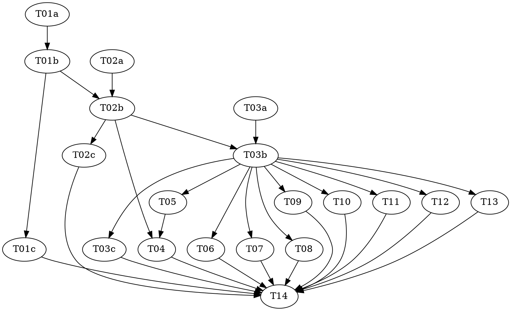

# Unified Execution Tree — Plan 1 of 3: The Organs

> **For agentic workers:** REQUIRED: Use vf-superpowers:subagent-driven-development (parallel, same session) or vf-superpowers:executing-plans (sequential, separate session) to implement this plan. Steps use checkbox (`- [ ]`) syntax for tracking. This plan contains `role: red|green|audit` triads — each role MUST run as a fresh, isolated subagent.

**Goal:** Build the three organs of the unified execution tree — the generic progress-tree component, the ledger controller (sole write path), and the ledger→tree mapper — and wire them under the *existing* runner, replacing the heuristic projection and the direct-file-append norm.

**Architecture:** Ledger stays the single source of truth (WAL); progress is a full-replay fold through a generic tree API; all writes go through one validated controller that stamps `seq`/`ts`/`attempt` script-authoritatively. See `shared/architecture.md` for staging context (Plans 2–3 build the node-kind registry and single interpreter on top of these organs).

**Tech Stack:** Node.js ESM, builtins only (`node:fs`, `node:child_process`, `node:assert`). No package.json, no dependencies — a hard invariant of this repo.

**Design doc:** `docs/superpowers/specs/2026-07-02-unified-execution-tree-design.md` (ratified)

**Planned by:** claude-fable-5

---

## Pre-flight (supervisor, before Wave 1)

The working tree carries **unrelated in-flight modifications** (`.claude-plugin/plugin.json`,
`docs/architecture.md`, `docs/artifacts.md`, `lib/discriminator.mjs`, `lib/effort.mjs`,
`lib/mutation-sample.mjs`, `skills/gate-mechanics/references/*.md`,
`workflows/vertical-slice-runner.workflow.js`, `test/per-stack-command.test.mjs`). Resolve these
with the user (commit, stash, or accept) BEFORE dispatching any task that touches those files
(T10, T12, T14). Every task stages **only its own listed files** — `git add -A` is forbidden
(see `shared/conventions.md`).

## Dependency Graph

| Task | Role | Depends On | Files Created/Modified |
|------|------|-----------|------------------------|
| T01a | red   | —          | `test/progress-tree.test.mjs` (authored here) |
| T01b | green | T01a       | `lib/progress-tree.mjs` (test file READ-ONLY) |
| T01c | audit | T01b       | — (audit only) |
| T02a | red   | —          | `test/progress-map.test.mjs` (authored here) |
| T02b | green | T02a, T01b | `lib/progress-map.mjs` (test file READ-ONLY) |
| T02c | audit | T02b       | — (audit only) |
| T03a | red   | —          | `test/ledger.test.mjs` (authored here) |
| T03b | green | T03a, T02b | `lib/ledger.mjs` (test file READ-ONLY) |
| T03c | audit | T03b       | — (audit only) |
| T05  | —     | T03b       | delete `lib/action-report.mjs`, `lib/action-events.mjs`, `test/action-report.test.mjs`, `test/action-events.test.mjs` |
| T04  | —     | T05, T02b  | `lib/progress.mjs` (slim), `test/progress.test.mjs` (rewrite) |
| T06  | —     | T03b       | `lib/reconcile.mjs`, `test/reconcile-downgrade-event.test.mjs` |
| T07  | —     | T03b       | `lib/conclude.mjs`, `test/conclude.test.mjs` |
| T08  | —     | T03b       | `lib/commit-record.mjs`, `test/commit-record.test.mjs` |
| T09  | —     | T03b       | `lib/fence.mjs`, `test/fence.test.mjs` |
| T10  | —     | T03b       | `docs/artifacts.md`, `docs/DESIGN.md`, `docs/glossary.md` |
| T11  | —     | T03b       | `agents/*.md` (reporting paragraphs) |
| T12  | —     | T03b       | `workflows/*.workflow.js` (prompt text only) |
| T13  | —     | T03b       | `skills/*/SKILL.md` (lifecycle emissions) |
| T14  | —     | all above  | `.claude-plugin/plugin.json` (version 2.0.0), full-suite check |

**Wave Schedule:**
- Wave 1: T01a, T02a, T03a (red authors — three disjoint test files, parallel)
- Wave 2: T01b (progress-tree green)
- Wave 3: T02b (mapper green), T01c (tree audit — read-only, parallel-safe)
- Wave 4: T03b (controller green), T02c (mapper audit)
- Wave 5: T05, T06, T07, T08, T09, T10, T11, T12, T13, T03c (all file-disjoint, parallel)
- Wave 6: T04 (slim progress.mjs — must follow the T05 deletions)
- Wave 7: T14 (version bump + full suite)

**File conflict rule holds:** no two tasks without a dependency edge touch the same file. Audits touch nothing.

## Task Index

| ID   | Name                       | File                                | Description |
|------|----------------------------|-------------------------------------|-------------|
| T01a | progress-tree tests (red)  | tasks/T01a-progress-tree-red.md     | Failing tests for the generic tree component |
| T01b | progress-tree impl (green) | tasks/T01b-progress-tree-green.md   | Implement `lib/progress-tree.mjs` against locked tests |
| T01c | progress-tree audit        | tasks/T01c-progress-tree-audit.md   | Adversarial audit of tests + impl |
| T02a | progress-map tests (red)   | tasks/T02a-progress-map-red.md      | Failing tests for the EVENT_MAP fold incl. reopen acceptance |
| T02b | progress-map impl (green)  | tasks/T02b-progress-map-green.md    | Implement `lib/progress-map.mjs` against locked tests |
| T02c | progress-map audit         | tasks/T02c-progress-map-audit.md    | Adversarial audit of tests + impl |
| T03a | ledger controller (red)    | tasks/T03a-ledger-controller-red.md | Failing tests: validation, stamping, attempt arithmetic, CLI, concurrency |
| T03b | ledger controller (green)  | tasks/T03b-ledger-controller-green.md | Implement `lib/ledger.mjs` against locked tests |
| T03c | ledger controller audit    | tasks/T03c-ledger-controller-audit.md | Adversarial audit of tests + impl |
| T04  | Slim progress CLI          | tasks/T04-slim-progress-cli.md      | `progress.mjs` becomes a thin delegate; heuristics deleted |
| T05  | Retire action-report       | tasks/T05-retire-action-report.md   | Delete action-report/action-events + their tests |
| T06  | Reconcile downgrade event  | tasks/T06-reconcile-downgrade.md    | reconcile emits `node-downgraded` via controller API |
| T07  | Conclude switch            | tasks/T07-conclude-switch.md        | conclude appends via controller API |
| T08  | Commit-record switch       | tasks/T08-commit-record-switch.md   | custody hook appends via controller API |
| T09  | Fence flip                 | tasks/T09-fence-flip.md             | direct ledger writes denied for every role |
| T10  | Docs                       | tasks/T10-docs.md                   | artifacts.md vocabulary, DESIGN §D19, glossary |
| T11  | Agent constitutions        | tasks/T11-agent-constitutions.md    | reporting paragraphs → controller CLI |
| T12  | Workflow prompts           | tasks/T12-workflow-prompts.md       | prompt text → controller CLI + section ids |
| T13  | Skill lifecycle events     | tasks/T13-skill-lifecycle-events.md | phase/slice/node lifecycle emissions from main-session skills |
| T14  | Version + final check      | tasks/T14-version-bump-final-check.md | 2.0.0, run every test |

## Execution Handoff

Execution mode was chosen by the user in advance: **Subagent-Driven (this session)** via
vf-superpowers:subagent-driven-development, dispatching **Sonnet-model** subagents, fresh agent
per task, two-stage review, waves as scheduled above.
