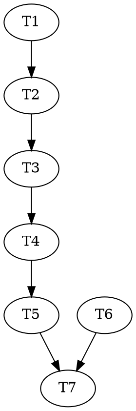

# Dead-End Retirement + Blast-Radius Problem Definition — Implementation Plan

> **For agentic workers:** REQUIRED: Use superpowers:subagent-driven-development or superpowers:executing-plans to implement this plan. Steps use checkbox (`- [ ]`) syntax for tracking.

**Goal:** Restore the (now Bash-less) thin route-planner's view of dead-ends with **retirement semantics** — a dead-ended work-order id is never re-proposed; the frontier is replanned around it — and pin the full blast-radius design (premise reification, computed blast radius, retirement superseding hash-unbind) as a roadmap problem definition.

**Architecture:** Track 1 mirrors the `terminalWorkOrders` pattern end-to-end: a pure lib folds the ledger into the dead-end set → `reconcile.mjs` threads it into the briefing (minus merged ids) → the reconciler copies it verbatim → the routePrompt hands it to the planner as RETIRED ids → the script drops any retired id that slips through (capability beside discipline) and escalates a stuck frontier as a BREAKING block instead of a mislabeled budget-exhaustion. Track 2 is a docs-only roadmap problem definition that captures the knowledge-graph generalization and formally proposes superseding D§5.8's hash-unbind semantics.

**Tech Stack:** Node ESM builtins only (`lib/` is dependency-free — invariant #1). Standalone `node test/*.test.mjs` scripts; workflow tests use the load-and-mock harness (`new Function` over the workflow source with mocked `agent`/`pipeline`/`parallel`).

**Working directory:** the `feat/thin-planner` worktree at `c:/work/claude/vanillafairy/reasonable/.worktrees/thin-planner` (all paths below are relative to it). Current version 2.2.0; suite is 29/29 green at `6c70261`.

**Adversarial-TDD note:** triads are deliberately **skipped**. The binding-event predicate is pinned verbatim by existing code (`lib/redispatch-guard.mjs:38-40`), the briefing/drop patterns are exact mirrors of the shipped `terminalWorkOrders` machinery, and this plan supplies the critical examples itself — the "spec so airtight it supplies the examples" exemption. If run inline (no subagents), nothing is lost.

---

## Design constraints (read before Task 1)

1. **Retirement semantics (the user's rule, ratified in conversation 2026-07-05):** a dead-ended work-order id is **RETIRED** — never re-proposed in-band, not even after an input change. Resurrection is a *replan* decision producing a **new** id. Mirrors the spike rule: *re-entry is always replan-from-knowledge, never repurpose-the-dead-WO.*
2. **`lib/redispatch-guard.mjs` is NOT touched.** Its hash-unbind semantics are pinned by DESIGN §5.8; formally superseding that is Track 2's problem definition, to be ratified via DESIGN.md — never smuggled through a workflow patch. Track 1 only adds the surfacing + the drop; the guard remains as a dormant backstop.
3. **`docs/glossary.md` is NOT edited in this plan.** Glossary terms carry normative force (invariant #6); the retirement wording is *proposed* inside the Track 2 doc and lands in the glossary only when the DESIGN amendment is ratified. (The existing entry — "code dies on its branch; knowledge is harvested" — already leans this way.)
4. **Conservative direction:** the dead-end set fails toward scrutiny. A later green verdict does *not* clear an entry; only a merge (terminal) excludes it. A wrongly-retired id costs a replan; a wrongly-resurrected id re-runs a confirmed crater.

## File structure

| File | Status | Responsibility |
|---|---|---|
| `lib/dead-ends.mjs` | create | Pure ledger fold → the dead-end set (no I/O; caller reads the ledger) |
| `test/dead-ends.test.mjs` | create | Unit-pins the fold: binding shapes, latest-wins, non-binding excluded |
| `lib/reconcile.mjs` | modify | Import + compute `deadEnds` (minus terminal), add to result + `briefing()` render |
| `test/reconcile-dead-ends.test.mjs` | create | Integration-pins reconcile's `deadEnds` against a real temp repo + ledger |
| `workflows/vertical-slice-runner.workflow.js` | modify | BRIEFING schema field, reconcilePrompt copy-verbatim line, routePrompt RETIRED block, script drop + frontier-stuck escalation |
| `test/vertical-slice-runner-dead-end-retirement.test.mjs` | create | Pins: retired id dropped before persist; stuck frontier → BREAKING block |
| `agents/route-planner.md` | modify | "After a confirmed dead end" section → retirement rules |
| `agents/reconciler.md` | modify | Description mentions the dead-end set |
| `docs/roadmap/dead-end-blast-radius.md` | create | Track 2: the full problem definition |
| `docs/roadmap/README.md` | modify | Index the new problem; retire the stale "redispatch guard" bullet |
| `.claude-plugin/plugin.json`, `README.md` | modify | Version bumps (2.2.0 → 2.3.0 → 2.3.1) |

No two independent tasks touch the same file (see dependency table).

---

## Track 1 — dead-end retirement in the briefing + workflow

### Task 1: `lib/dead-ends.mjs` — the pure ledger fold

**Files:**
- Create: `lib/dead-ends.mjs`
- Test: `test/dead-ends.test.mjs`

- [ ] **Step 1: Write the failing test**

Create `test/dead-ends.test.mjs`:

```js
// dead-ends.test.mjs — pin lib/dead-ends.mjs, the pure ledger fold behind the
// briefing's deadEnds set (retirement semantics: a dead-ended work-order id is
// never re-proposed in-band; docs/roadmap/dead-end-blast-radius.md). The binding
// predicate mirrors lib/redispatch-guard.mjs EXACTLY: a first-class `dead-end`
// event, or a `verdict` kind:"infeasible" that survived the skeptic.
// Run: node test/dead-ends.test.mjs

import assert from 'node:assert';
import { deadEndSet } from '../lib/dead-ends.mjs';

let passed = 0;
function check(name, fn) {
  try { fn(); passed += 1; console.log(`  ok  ${name}`); }
  catch (e) { console.error(`FAIL  ${name}\n      ${e.message}`); process.exitCode = 1; }
}

check('a first-class dead-end event binds', () => {
  const out = deadEndSet([
    { seq: 3, type: 'dead-end', workOrder: 'WO-X', hash: 'sha256:aa' },
  ]);
  assert.deepStrictEqual(out, [{ workOrder: 'WO-X', ledgerSeq: 3, hash: 'sha256:aa' }]);
});

check('a refutation-surviving infeasible verdict binds; a non-surviving one does not', () => {
  const out = deadEndSet([
    { seq: 4, type: 'verdict', kind: 'infeasible', survivedSkeptic: true, workOrder: 'WO-A' },
    { seq: 5, type: 'verdict', kind: 'infeasible', workOrder: 'WO-B' }, // no skeptic survival
  ]);
  assert.deepStrictEqual(out, [{ workOrder: 'WO-A', ledgerSeq: 4, hash: null }]);
});

check('unrelated event types never bind', () => {
  const out = deadEndSet([
    { seq: 1, type: 'enrichment', component: 'c', workOrder: 'WO-A' },
    { seq: 2, type: 'verdict', kind: 'green', workOrder: 'WO-A' },
    { seq: 3, type: 'node-failed', workOrder: 'WO-A' }, // recoverable, not a dead end
  ]);
  assert.deepStrictEqual(out, []);
});

check('latest binding event per work order wins (one entry, newest seq + hash)', () => {
  const out = deadEndSet([
    { seq: 2, type: 'dead-end', workOrder: 'WO-X', hash: 'sha256:old' },
    { seq: 7, type: 'dead-end', workOrder: 'WO-X', hash: 'sha256:new' },
  ]);
  assert.deepStrictEqual(out, [{ workOrder: 'WO-X', ledgerSeq: 7, hash: 'sha256:new' }]);
});

check('a later green verdict does NOT clear the entry (conservative; only a merge excludes, and the caller does that)', () => {
  const out = deadEndSet([
    { seq: 2, type: 'dead-end', workOrder: 'WO-X', hash: null },
    { seq: 9, type: 'verdict', kind: 'green', workOrder: 'WO-X' },
  ]);
  assert.strictEqual(out.length, 1);
  assert.strictEqual(out[0].workOrder, 'WO-X');
});

check('empty/garbage-safe: null lines, missing workOrder, no ledger', () => {
  assert.deepStrictEqual(deadEndSet([]), []);
  assert.deepStrictEqual(deadEndSet(null), []);
  assert.deepStrictEqual(deadEndSet([null, {}, { type: 'dead-end' }]), []); // no workOrder -> skip
});

if (process.exitCode) console.error(`\ndead-ends: FAILURES above (${passed} passed).`);
else console.log(`\ndead-ends: all ${passed} checks pass. ✓`);
```

- [ ] **Step 2: Run it — expect ERR_MODULE_NOT_FOUND**

Run: `node test/dead-ends.test.mjs`
Expected: fails with `Cannot find module ... lib/dead-ends.mjs`.

- [ ] **Step 3: Create `lib/dead-ends.mjs`**

```js
// dead-ends.mjs — the dead-end set, folded from the ledger (pure, no I/O).
//
// A DEAD END is a refutation-surviving infeasibility verdict (glossary: "a
// retroactive spike — code dies on its branch; knowledge is harvested; verdict
// enters the ledger"). The ledger records it as either a first-class `dead-end`
// event or a `verdict` kind:"infeasible" with survivedSkeptic — the SAME two
// shapes lib/redispatch-guard.mjs treats as binding (its lines 38-40); keep the
// predicates in lockstep if either changes.
//
// This module exists so the reconcile briefing can carry the set (`deadEnds`) to
// the Bash-less thin route-planner — RETIREMENT semantics: a dead-ended id is
// never re-proposed in-band; successor work arrives under a NEW id via a replan
// that consumed the dead-end (docs/roadmap/dead-end-blast-radius.md). The fold is
// conservative: a later green verdict does NOT clear an entry — only a merge
// (terminal) excludes it, and the CALLER applies that subtraction (reconcile.mjs
// filters on terminalWorkOrders) so this stays a pure ledger fold.
//
// Law 1 (dependency-free): node builtins only — in fact NO I/O at all.

/** A binding dead-end event (mirrors redispatch-guard.mjs's predicate). */
function isBindingDeadEnd(e) {
  if (!e || typeof e !== 'object' || !e.workOrder) return false;
  if (e.type === 'dead-end') return true;
  return e.type === 'verdict' && e.kind === 'infeasible' && !!e.survivedSkeptic;
}

/**
 * Fold the ledger into the dead-end set: one entry per work order carrying a
 * binding infeasibility verdict, keeping the LATEST such event's seq + hash.
 * @returns [{ workOrder, ledgerSeq, hash }]
 */
export function deadEndSet(ledger) {
  const byWo = new Map();
  for (const e of ledger || []) {
    if (!isBindingDeadEnd(e)) continue;
    const seq = Number(e.seq) || 0;
    const prev = byWo.get(e.workOrder);
    if (!prev || seq >= prev.ledgerSeq) {
      byWo.set(e.workOrder, { workOrder: e.workOrder, ledgerSeq: seq, hash: e.hash || null });
    }
  }
  return [...byWo.values()];
}
```

- [ ] **Step 4: Run the test — expect all green**

Run: `node test/dead-ends.test.mjs`
Expected: `dead-ends: all 6 checks pass. ✓`

- [ ] **Step 5: Commit**

```bash
git add lib/dead-ends.mjs test/dead-ends.test.mjs
git commit -m "feat(dead-ends): pure ledger fold for the dead-end set (retirement groundwork)"
```

---

### Task 2: `reconcile.mjs` computes + renders `deadEnds`

**Files:**
- Modify: `lib/reconcile.mjs` (import block ~line 62-68; after the `terminalWorkOrders` computation ~line 317-320; the result object ~line 395; the `briefing()` render after the staleness block ~line 695)
- Test: `test/reconcile-dead-ends.test.mjs` (create)

Depends on: Task 1.

- [ ] **Step 1: Write the failing integration test**

Create `test/reconcile-dead-ends.test.mjs` (harness copied from `test/reconcile-terminal-workorders.test.mjs`, extended with a `ledgerLines` parameter):

```js
// Standalone test for lib/reconcile.mjs `deadEnds` — node builtins only.
// Run: node test/reconcile-dead-ends.test.mjs
//
// WHY (thin-planner follow-up, 2026-07-05). The thin route-planner lost Bash, so it
// can no longer read the ledger's dead-end verdicts — the one fact that should
// dominate a replan. reconcile now folds the set mechanically (lib/dead-ends.mjs)
// and the briefing carries it, minus already-merged ids, with RETIREMENT semantics
// (a dead-ended id is never re-proposed; docs/roadmap/dead-end-blast-radius.md).

import assert from 'node:assert';
import { execFileSync } from 'node:child_process';
import { mkdtempSync, mkdirSync, writeFileSync } from 'node:fs';
import { tmpdir } from 'node:os';
import { join, dirname } from 'node:path';

import { reconcile } from '../lib/reconcile.mjs';

const git = (cwd, ...args) => execFileSync('git', args, { cwd, stdio: ['ignore', 'pipe', 'pipe'] }).toString();
const write = (root, rel, content) => {
  const p = join(root, rel); mkdirSync(dirname(p), { recursive: true }); writeFileSync(p, content);
};

function newEffort(workOrders, ledgerLines) {
  const root = mkdtempSync(join(tmpdir(), 'rde-'));
  git(root, 'init', '-q');
  const hooks = join(root, '.nohooks'); mkdirSync(hooks, { recursive: true });
  git(root, 'config', 'core.hooksPath', hooks);
  git(root, 'config', 'user.email', 'test@example.com');
  git(root, 'config', 'user.name', 'Reconcile DeadEnds Test');
  git(root, 'config', 'commit.gpgsign', 'false');
  write(root, 'README.md', 'base\n');
  write(root, '.gitignore', '.reasonable/\n.worktrees/\n');
  git(root, 'add', '-A'); git(root, 'commit', '-q', '-m', 'init');
  git(root, 'branch', 'effort/demo');
  write(root, '.reasonable/config.json', JSON.stringify({ effort: 'demo', runMode: 'autonomous', effortBranch: 'effort/demo' }) + '\n');
  write(root, '.reasonable/journal.json', JSON.stringify({
    effort: 'demo', currentVerticalSlice: 'slice-1', phase: 'vertical-slice-execution', supervision: 'standard',
    workOrders, lanes: {}, inbox: [],
  }, null, 2) + '\n');
  write(root, '.reasonable/ledger.jsonl', ledgerLines.map((l) => JSON.stringify(l)).join('\n') + '\n');
  return root;
}

let passed = 0;
function check(name, fn) {
  try { fn(); passed += 1; console.log(`  ok  ${name}`); }
  catch (e) { console.error(`FAIL  ${name}\n      ${e.message}`); process.exitCode = 1; }
}

check('a ledger dead-end event surfaces in result.deadEnds with seq + hash', () => {
  const root = newEffort(
    { 'WO-X': { status: 'dead-end', verticalSlice: 'slice-1', role: 'implementer' } },
    [{ seq: 1, type: 'ratification', gate: 'analysis' },
     { seq: 2, type: 'dead-end', workOrder: 'WO-X', hash: 'sha256:aa' }],
  );
  const r = reconcile(root);
  assert.deepEqual(r.deadEnds, [{ workOrder: 'WO-X', ledgerSeq: 2, hash: 'sha256:aa' }]);
});

check('a refutation-surviving infeasible verdict surfaces; a merged id is excluded (terminal wins)', () => {
  const root = newEffort(
    {
      'WO-A': { status: 'dead-end', verticalSlice: 'slice-1', role: 'implementer' },
      'WO-B': { status: 'merged', verticalSlice: 'slice-1', role: 'implementer' },
    },
    [{ seq: 1, type: 'verdict', kind: 'infeasible', survivedSkeptic: true, workOrder: 'WO-A' },
     { seq: 2, type: 'dead-end', workOrder: 'WO-B', hash: null }], // later merged -> excluded
  );
  const r = reconcile(root);
  assert.deepEqual(r.deadEnds, [{ workOrder: 'WO-A', ledgerSeq: 1, hash: null }]);
  assert.deepEqual(r.terminalWorkOrders, ['WO-B'], 'sanity: WO-B is terminal, which is WHY it is excluded');
});

check('no binding events -> deadEnds is an empty array (field always present)', () => {
  const root = newEffort(
    { 'WO-C': { status: 'pending', verticalSlice: 'slice-1', role: 'implementer' } },
    [{ seq: 1, type: 'ratification', gate: 'analysis' }],
  );
  const r = reconcile(root);
  assert.deepEqual(r.deadEnds, []);
});

if (process.exitCode) console.error(`\nreconcile-dead-ends: FAILURES above (${passed} passed).`);
else console.log(`\nreconcile-dead-ends: all ${passed} checks passed. ✓`);
```

- [ ] **Step 2: Run it — expect FAIL** (`r.deadEnds` is `undefined`)

Run: `node test/reconcile-dead-ends.test.mjs`
Expected: FAIL on the first check (`deepEqual` against `undefined`).

- [ ] **Step 3: Wire `reconcile.mjs`**

3a. Add the import next to the `trustStaleness` import:

```js
import { deadEndSet } from './dead-ends.mjs';
```

3b. Immediately after the `terminalWorkOrders` computation (the `.map(([id]) => id);` line, ~line 320), insert:

```js
  // --- Dead-end set (retirement) — from the ledger event stream. -------------
  // Refutation-surviving infeasibility verdicts (lib/dead-ends.mjs), minus ids
  // already merged (a terminal WO's dead-end history is moot). The briefing
  // carries this so the Bash-less thin route-planner SEES every crater when it
  // replans: a dead-ended id is RETIRED — never re-proposed in-band; successor
  // work arrives under a NEW id via a replan that consumed the dead-end
  // (docs/roadmap/dead-end-blast-radius.md). Conservative: a later green verdict
  // never clears an entry here — only the merge subtraction above does.
  const deadEnds = deadEndSet(ledger).filter((d) => !terminalWorkOrders.includes(d.workOrder));
```

3c. In the result object, directly under `terminalWorkOrders,` add:

```js
    deadEnds,
```

3d. In `briefing()`, after the trust-staleness render block (`if (r.staleness && r.staleness.staleTests.length) { ... }`), add:

```js
  if (r.deadEnds && r.deadEnds.length) {
    lines.push(`Dead ends (RETIRED ids — replan around them, never re-propose): ${r.deadEnds.map((d) => `${d.workOrder} (seq ${d.ledgerSeq})`).join(', ')}.`);
  }
```

- [ ] **Step 4: Run the new test + the neighboring reconcile tests**

Run: `node test/reconcile-dead-ends.test.mjs && node test/reconcile-terminal-workorders.test.mjs && node test/reconcile-correction.test.mjs`
Expected: all pass.

- [ ] **Step 5: Commit**

```bash
git add lib/reconcile.mjs test/reconcile-dead-ends.test.mjs
git commit -m "feat(reconcile): thread the computed dead-end set (minus merged) into the briefing"
```

---

### Task 3: workflow — schema field, prompts, retirement drop, frontier-stuck escalation

**Files:**
- Modify: `workflows/vertical-slice-runner.workflow.js` — four regions: BRIEFING schema (~line 128-150), `reconcilePrompt` (~line 630), `routePrompt` (~line 640-660), the post-plan filter block (~line 1595-1615, after the `droppedTerminal` block)
- Test: `test/vertical-slice-runner-dead-end-retirement.test.mjs` (create)

Depends on: Task 2.

- [ ] **Step 1: Write the failing workflow test**

Create `test/vertical-slice-runner-dead-end-retirement.test.mjs` (harness identical to `test/vertical-slice-runner-persist-work-orders.test.mjs` — same `loadRunner`/`GLOBALS`/`pipeline`/`parallel`):

```js
// vertical-slice-runner-dead-end-retirement.test.mjs — RETIREMENT semantics for
// dead-ended work orders (thin-planner follow-up, 2026-07-05).
//
// A dead-ended work-order id must NEVER be re-run in-band: the briefing carries the
// reconcile-computed deadEnds set, the routePrompt marks those ids RETIRED, and the
// script drops any that slip through BEFORE persist/footprint/provision (capability
// beside discipline — the exact terminalWorkOrders pattern). A frontier left EMPTY
// after the drops is a human decision (BREAKING blocked, "frontier-stuck"), never a
// silent grind to a mislabeled budget-exhausted.
// Run: node test/vertical-slice-runner-dead-end-retirement.test.mjs

import assert from 'node:assert';
import { readFileSync } from 'node:fs';
import { join, dirname } from 'node:path';
import { fileURLToPath } from 'node:url';

const here = dirname(fileURLToPath(import.meta.url));
const scriptPath = join(here, '..', 'workflows', 'vertical-slice-runner.workflow.js');

const GLOBALS = ['args', 'budget', 'phase', 'log', 'agent', 'parallel', 'pipeline', 'workflow'];
function loadRunner() {
  const src = readFileSync(scriptPath, 'utf8')
    .replace(/^export\s+const\s+meta\b/m, 'const meta')
    .replace(/^export\s+default\s+/m, '');
  // eslint-disable-next-line no-new-func
  return new Function(...GLOBALS, `return (async () => { ${src}\n });`);
}

const noop = () => {};
const mockBudget = { spent: () => 0, remaining: () => Infinity, total: null };
async function pipeline(items, ...stages) {
  return Promise.all(items.map(async (item, i) => {
    let acc = item;
    for (let s = 0; s < stages.length; s++) acc = await stages[s](acc, item, i);
    return acc;
  }));
}
async function parallel(thunks) { return Promise.all(thunks.map((t) => t())); }

const LIVE = 'WO-S1-live';
const DEAD = 'WO-S1-dead';

function briefing() {
  return {
    halt: false, effortRoot: '/eff', currentVerticalSlice: 'slice-1', runMode: 'autonomous',
    brownfield: false, terminalWorkOrders: [], staleTrusted: [], floorUnexplained: 0,
    deadEnds: [{ workOrder: DEAD, ledgerSeq: 9, hash: 'sha256:h1' }],
    effortBranch: 'effort/demo',
  };
}
const wo = (id) => ({
  id, role: 'implementer', verticalSlice: 'slice-1',
  locus: [`src/${id}/**`], contractSeeds: ['comp-' + id], resources: [],
});

// Green-path agent mock for ONE live work order; records every call.
function makeAgent(calls, planWorkOrders) {
  return async (prompt, opts) => {
    const label = (opts && opts.label) || '';
    calls.push({ label, agentType: opts && opts.agentType, prompt });
    if (label === 'reconcile') return briefing();
    if (label === 'route-plan') return { workOrders: planWorkOrders, rationale: 'test cut' };
    if (opts && opts.agentType === 'reasonable:work-order-writer') return { persisted: true, written: [LIVE], note: null };
    if (opts && opts.agentType === 'reasonable:footprinter') {
      return { footprints: [{ id: LIVE, locus: [`src/${LIVE}/**`], contracts: ['comp-' + LIVE], resources: [] }], independence: [] };
    }
    if (label.startsWith('scribe:') || label.startsWith('commit-blind-tests:')) return { persisted: true, transition: label, note: null };
    if (label.startsWith('provision:') || label.startsWith('reprovision-blind-test:')) {
      return { provisioned: true, worktree: '/eff/.worktrees/' + LIVE, branch: 'lane/' + LIVE,
        descriptorWritten: true, depsReady: true, noOp: false, kind: null, note: null };
    }
    if (label.startsWith('implement:')) return { kind: 'green', workOrder: LIVE, verticalSlice: 'slice-1', detail: { commit: 'abc123' } };
    if (label.startsWith('blind-test:') || label.startsWith('adjudicate:')) return { kind: 'green', workOrder: LIVE, verticalSlice: 'slice-1', detail: { suiteRan: true } };
    if (label.startsWith('audit:')) {
      const isSuite = label.startsWith('audit:suite:');
      return { kind: 'green', workOrder: LIVE, verticalSlice: 'slice-1',
        detail: isSuite ? { suiteRan: true, trustedGreen: true, floorGreen: true } : {} };
    }
    throw new Error(`unexpected agent() call: ${label} (agentType ${opts && opts.agentType})`);
  };
}

let passed = 0;
async function check(name, fn) {
  try { await fn(); passed += 1; console.log(`  ok  ${name}`); }
  catch (e) { console.error(`FAIL  ${name}\n      ${e.stack || e.message}`); process.exitCode = 1; }
}

const baseArgs = () => ({ effortRoot: '/eff', verticalSliceId: 'slice-1', runMode: 'autonomous', tier: 'lite' });

await check('a RETIRED (dead-ended) id is dropped before persist/footprint/provision; the live WO proceeds', async () => {
  const calls = [];
  const run = loadRunner()(baseArgs(), mockBudget, noop, noop, makeAgent(calls, [wo(LIVE), wo(DEAD)]), parallel, pipeline, noop);
  const result = await run();
  assert.equal(result.kind, 'green', `live WO must still gate green, got ${JSON.stringify(result).slice(0, 300)}`);

  const persist = calls.find((c) => c.agentType === 'reasonable:work-order-writer');
  assert.ok(persist, 'persist step must run for the surviving WO');
  assert.ok(!persist.prompt.includes(DEAD), 'the RETIRED id must never reach the persist request');
  const footprint = calls.find((c) => c.agentType === 'reasonable:footprinter');
  assert.ok(footprint && !footprint.prompt.includes(DEAD), 'the RETIRED id must never reach the footprint step');
  assert.ok(!calls.some((c) => (c.label || '') === `provision:${DEAD}`), 'the RETIRED id must never provision');
});

await check('the routePrompt carries the deadEnds set with RETIRED semantics (planner visibility)', async () => {
  const calls = [];
  const run = loadRunner()(baseArgs(), mockBudget, noop, noop, makeAgent(calls, [wo(LIVE)]), parallel, pipeline, noop);
  await run();
  const plan = calls.find((c) => c.label === 'route-plan');
  assert.ok(plan, 'route-plan must be dispatched');
  assert.match(plan.prompt, /RETIRED/, 'the planner must be told the ids are retired');
  assert.match(plan.prompt, new RegExp(DEAD), 'the planner must see the dead-ended id');
});

await check('a frontier left EMPTY after the retirement drop escalates BREAKING (frontier-stuck), nothing dispatched', async () => {
  const calls = [];
  const run = loadRunner()(baseArgs(), mockBudget, noop, noop, makeAgent(calls, [wo(DEAD)]), parallel, pipeline, noop);
  const result = await run();
  assert.equal(result.kind, 'blocked', `an emptied frontier must block, got ${JSON.stringify(result).slice(0, 300)}`);
  const item = result.outcome && result.outcome.items && result.outcome.items[0];
  assert.ok(item && item.class === 'BREAKING', 'the block must be BREAKING (a human decision)');
  assert.match(String(item.detail && item.detail.reason), /frontier-stuck/, 'the reason names the stuck frontier');
  assert.ok(!calls.some((c) => c.agentType === 'reasonable:work-order-writer'), 'nothing may persist on a stuck frontier');
  assert.ok(!calls.some((c) => (c.label || '').startsWith('provision:')), 'nothing may provision on a stuck frontier');
});

if (process.exitCode) console.error(`\ndead-end-retirement: FAILURES above (${passed} passed).`);
else console.log(`\ndead-end-retirement: all ${passed} checks passed. ✓`);
```

- [ ] **Step 2: Run it — expect FAIL** (no drop exists yet; the dead WO reaches persist)

Run: `node test/vertical-slice-runner-dead-end-retirement.test.mjs`
Expected: first check FAILS (`the RETIRED id must never reach the persist request`), third check FAILS (kind is not `blocked`).

- [ ] **Step 3: BRIEFING schema — add the field**

In `workflows/vertical-slice-runner.workflow.js`, directly under the `terminalWorkOrders` property in the `BRIEFING` schema, add:

```js
    // Refutation-surviving dead-ends (minus merged ids), reconcile.mjs-computed via
    // lib/dead-ends.mjs. RETIREMENT semantics: the planner never re-proposes one of
    // these ids (successor work gets a NEW id via a replan); the script drops any
    // that slip through — capability beside discipline, the terminalWorkOrders twin.
    deadEnds: {
      type: 'array',
      items: {
        type: 'object',
        additionalProperties: true,
        properties: {
          workOrder: { type: 'string' },
          ledgerSeq: { type: ['integer', 'null'] },
          hash: { type: ['string', 'null'] },
        },
      },
    },
```

- [ ] **Step 4: reconcilePrompt — the copy-verbatim line**

After the `'Report terminalWorkOrders EXACTLY …'` line, add:

```js
    'Report deadEnds EXACTLY as reconcile.mjs computed it (result.deadEnds) - the refutation-surviving infeasibility verdicts, minus already-merged ids, each { workOrder, ledgerSeq, hash }. lib/dead-ends.mjs folds this from the ledger; do NOT eyeball ledger events or re-derive the set in prose - copy the computed set verbatim, like terminalWorkOrders and staleTrusted.',
```

- [ ] **Step 5: routePrompt — the RETIRED block**

After the `` `TERMINAL work orders …` `` line in `routePrompt`, add:

```js
    `DEAD-ENDED work orders (refutation-surviving, reconcile.mjs-computed): ${j(state.deadEnds || [])}. These ids are RETIRED - NEVER re-propose one, even if you believe an input changed (resurrection is a REPLAN decision that produces a NEW work-order id from a cut that consumed the dead-end - never an in-band re-proposal of the old id). Treat each as feedback with a blast radius: the premise that died there is likely shared by its neighborhood - re-price siblings leaning on the same assumption and route around the crater. If the refuted premise reaches the route ordering or the intention itself, do NOT paper over it with a decomposition: return zero work orders and say why in the rationale - the script escalates a stuck frontier to the human.`,
```

- [ ] **Step 6: the retirement drop + frontier-stuck escalation**

Directly after the existing `droppedTerminal` block (which ends with the `log(...)` about terminal drops) and BEFORE the `persistWorkOrders` call, add:

```js
// Retirement backstop (the terminal filter's twin): a dead-ended work-order id is
// RETIRED - the planner is handed the same set above, but if one slips through, drop
// it here rather than re-run a confirmed crater (capability beside discipline).
// Successor work must arrive under a NEW id via a replan that consumed the dead-end
// (docs/roadmap/dead-end-blast-radius.md).
const deadEnded = new Set((state.deadEnds || []).map((d) => d.workOrder));
const droppedDead = (plan.workOrders || []).filter((wo) => deadEnded.has(wo.id));
if (droppedDead.length > 0) {
  plan.workOrders = (plan.workOrders || []).filter((wo) => !deadEnded.has(wo.id));
  log(`route-planner re-proposed ${droppedDead.length} RETIRED (dead-ended) work order(s) ` +
    `[${droppedDead.map((wo) => wo.id).join(', ')}] - dropped; a dead end is replanned around, never re-run.`);
}

// A stuck frontier is a human decision, never a silent grind: zero dispatchable work
// orders (the planner returned none, or every proposal was terminal/dead-ended) means
// the slice cannot proceed as planned - escalate BREAKING with the rationale instead
// of limping into a mislabeled budget-exhausted.
if ((plan.workOrders || []).length === 0) {
  return { kind: 'blocked', outcome: { kind: 'trap', items: [{
    class: 'BREAKING', kind: 'other',
    detail: {
      reason: 'frontier-stuck: zero dispatchable work orders after terminal/dead-end filtering - the slice needs a replan around the dead end(s), or is already done',
      droppedTerminal: droppedTerminal.map((w) => w.id),
      droppedDeadEnds: droppedDead.map((w) => w.id),
      rationale: plan.rationale || null,
    },
  }] } };
}
```

- [ ] **Step 7: Run the new test + the whole workflow-test family**

Run: `node test/vertical-slice-runner-dead-end-retirement.test.mjs && node test/workflow-load.test.mjs && node test/vertical-slice-runner-persist-work-orders.test.mjs && node test/vertical-slice-runner-green-no-mergesha.test.mjs && node test/vertical-slice-runner-scope-expansion-no-spin.test.mjs && node test/vertical-slice-runner-reconcile-halt.test.mjs`
Expected: all pass. (The older tests' briefings omit `deadEnds` → `state.deadEnds || []` handles it; no edits to them needed.)

- [ ] **Step 8: Commit**

```bash
git add workflows/vertical-slice-runner.workflow.js test/vertical-slice-runner-dead-end-retirement.test.mjs
git commit -m "feat(runner): dead-end retirement - briefing field, RETIRED routePrompt, drop backstop, frontier-stuck escalation"
```

---

### Task 4: constitutions — planner retirement rules, reconciler description

**Files:**
- Modify: `agents/route-planner.md` (the `## After a confirmed dead end` section, ~line 175-177)
- Modify: `agents/reconciler.md` (frontmatter `description:` only)

Depends on: Task 3 (references the shipped mechanics).

- [ ] **Step 1: Replace the planner's dead-end section**

In `agents/route-planner.md`, replace the whole section:

```md
## After a confirmed dead end
Re-price sibling nodes — infeasibility is correlated across a neighborhood. A confirmed dead end (a
refutation-surviving verdict in the ledger) reprices siblings before the next dispatch wave.
```

with:

```md
## After a confirmed dead end: retire the id, replan the region
A dead end is the paradigm's highest-value feedback — a premise reality refuted. You do not read the
ledger for it (no Bash): the briefing hands you the computed set (`deadEnds` — refutation-surviving
verdicts, minus merged ids, via `lib/dead-ends.mjs`). Three rules:
- **The id is RETIRED.** Never re-propose a dead-ended work-order id — not in this decomposition, and
  not because "an input changed." Resurrection is a *replan* decision: successor work arrives under a
  **new** id, from a cut that consumed the dead-end. (The script drops any retired id that slips
  through — capability beside discipline.) Re-entry is always **replan-from-knowledge, never
  repurpose-the-dead-WO** — the same one-way membrane as the spike rule ("rewrite-from-knowledge,
  never refactor-from-spike").
- **Re-price the neighborhood.** Infeasibility is correlated: siblings leaning on the premise that
  died are probably also infeasible — down-weight or re-route them before the next dispatch wave.
- **Escalate a refuted premise that outgrows the slice.** If the dead premise reaches the route
  ordering or the intention itself, do not paper over it with a decomposition — return zero work
  orders with the why in your rationale; the script escalates a stuck frontier to the human.
  (Premise-level blast radius — computing this reach mechanically — is tracked in
  `docs/roadmap/dead-end-blast-radius.md`.)
```

- [ ] **Step 2: Reconciler description**

In `agents/reconciler.md` frontmatter, in the `description:` line, replace the fragment
`trust-staleness set, inbox)` with `trust-staleness set, dead-end set, inbox)`.

- [ ] **Step 3: Full suite**

Run: `for t in test/*.test.mjs; do node "$t" >/dev/null 2>&1 || echo "FAIL $t"; done; echo done`
Expected: `done` with no FAIL lines (32 files).

- [ ] **Step 4: Commit**

```bash
git add agents/route-planner.md agents/reconciler.md
git commit -m "docs(agents): retirement rules in the planner constitution; reconciler description carries the dead-end set"
```

---

### Task 5: Track 1 version bump + release commit

**Files:**
- Modify: `.claude-plugin/plugin.json` (line 4), `README.md` (install snippet ~line 138, footer ~line 170)

Depends on: Task 4.

- [ ] **Step 1: Bump 2.2.0 → 2.3.0 in all three places** (minor — new backward-compatible capability: the briefing's dead-end surfacing + retirement enforcement).

- [ ] **Step 2: Full suite once more** (same command as Task 4 Step 3). Expected: no FAIL lines.

- [ ] **Step 3: Commit**

```bash
git add .claude-plugin/plugin.json README.md
git commit -m "chore(release): bump reasonable to 2.3.0 (dead-end retirement surfacing)"
```

---

## Track 2 — the blast-radius problem definition (docs only)

### Task 6: `docs/roadmap/dead-end-blast-radius.md`

**Files:**
- Create: `docs/roadmap/dead-end-blast-radius.md`

Depends on: nothing (may run in parallel with Tasks 1–5; touches no shared file).

- [ ] **Step 1: Write the problem definition** — full content:

```md
# Problem: a dead end refutes a premise, but the system only records a work order

**Status:** TODO — problem + design direction defined below. **This one supersedes pinned design**
(D§5.8's hash-unbind semantics), so the resolution must land through a deliberate `DESIGN.md`
amendment + glossary update, never through a workflow patch alone.
**Origin:** the thin-planner follow-up discussion (2026-07-05): dead-end knowledge generalizes to a
shared, dynamically-built knowledge graph over the effort — and a dead end must never be *directly
repurposed*; it has a **blast radius** that may demand a full replan.
**Interim (landed 2026-07-05, v2.3.0):** reconcile computes the dead-end set (`lib/dead-ends.mjs`),
the briefing carries it, the routePrompt marks those ids RETIRED, and the runner drops re-proposals +
escalates a stuck frontier BREAKING. That closes the *id-level* loop. This file is about the
*premise-level* loop it cannot close.

## What is broken

1. **The dead-end record is WO-centric; the refuted premise is implicit.** A `dead-end` ledger event
   names a work order and an input *hash* — a digest of {gate + spec + cited contract texts}. The
   hash blocks an *identical* re-run, but the **assumption that actually died** ("charts can be
   rasterized client-side on an edge runtime") is never a node anything can cite or traverse.
2. **Blast radius is therefore uncomputable.** Dead-ends propagate along *assumption* coupling, not
   structural coupling: two work orders can share zero files and zero contracts and still die of the
   same idea. No traversal over the existing graph (loci, citations) finds the sibling that leans on
   the dead premise. Today that correlation lives only in the planner's judgment ("re-price the
   neighborhood") — prose, not capability.
3. **Id-level retirement cannot catch a rebranded dead idea.** The interim drop blocks the *old id*;
   nothing blocks the same doomed approach re-proposed under a fresh id with a clean hash. Only a
   premise-level record can.
4. **D§5.8's hash-unbind is permission-shaped.** As pinned, an input change makes the *same* WO id
   dispatchable again — the "directly repurposed" path. That inverts the intended flow: a changed
   input should feed a **replan** that may produce successor work under new identity; it should never
   auto-relicense the old node.

## Why it matters

A dead end is the paradigm's highest-value feedback — prediction corrected by reality ("feedback
beats prediction"). If the system cannot (a) say *what* was refuted, (b) find *who else* leans on it,
and (c) force re-entry through a replan, then the feedback is spent once and leaks: pipelines re-walk
craters under new names, and a vision-level refutation can be silently papered over by a local
decomposition. In autonomous mode there is no human to catch either.

## Failure modes a solution must prevent

1. **Rebranded resurrection** — the dead premise back under a new WO id/hash, undetected.
2. **Minimal-perturbation resurrection** — nudging an input just enough to flip the hash, then
   re-running the same id ("directly repurposed"). Retirement must make this path not exist.
3. **Silent local patch of a vision-level refutation** — a decomposition that routes *around* a dead
   premise the intention itself cites, instead of escalating the intent fork.
4. **Knowledge rot** — an assumption registry nothing parses and nothing gates becomes stale prose
   (the plugin's own warning). Every record here must have a mechanical consumer.
5. **Blast-radius narrowing** — judgment may *widen* the computed radius, never shrink it below the
   mechanical bound (same doctrine as the conservative footprint).

## Candidate resolution (design direction, not yet committed)

**One new edge type in the graph that already exists — refutation — plus one mechanical join.**

- **Premise reification.** The dead-end ledger event grows a `refutes` field: the contract clause(s)
  and/or a first-class assumption record ("A-12: client-side canvas rasterization is available")
  that the verdict killed. Assumptions live where clauses live — citable, parsed, pinned in
  `docs/artifacts.md` (grammar is load-bearing, invariant #3). The WO stays as *where* the
  refutation was discovered; the premise becomes *what* was refuted.
- **Blast radius = computed closure, widen-only.** radius(dead-end) = citation-closure over the
  `refutes` set (contracts citing a refuted clause, WOs whose footprints intersect it, route nodes
  whose specs cite it). Computed, not declared — judgment (planner/retro) may widen, never narrow.
  If the closure reaches `intention.md`'s citations, the dead end is **vision-level**: always an
  intent fork to the human; no agent may resolve it (the "full replan" rung).
- **Context self-routing.** Any future work order whose footprint intersects a dead-end's blast
  radius gets that dead-end record injected into its planning/dispatch context automatically —
  footprint intersection is existing machinery. The knowledge routes itself to whoever works near
  the crater; no agent has to remember to look. This is the mechanical consumer that keeps the
  registry from rotting (failure mode 4), and the only structural defense against rebranding
  (failure mode 1) short of judgment.
- **Retirement supersedes hash-unbind (the D§5.8 amendment).** A dead-ended WO id is terminal for
  dispatch purposes, permanently — like `merged`, with its own journal status (`dead-end` already
  exists). `redispatch-guard.mjs` is repurposed from permission-check ("hash changed ⇒ clear") to
  retirement enforcement ("dead-ended id ⇒ blocked, period"). The *legitimate* path back into the
  crater: a replan consumes the dead-end record, produces successor WOs under new ids, and those
  new specs cite the amended inputs — the hash machinery survives as provenance, not as license.
  **Proposed glossary wording** (lands only with the DESIGN amendment): *"Dead end — a
  refutation-surviving infeasibility verdict; a retroactive spike. Code dies on its branch;
  knowledge is harvested; the verdict enters the ledger naming the refuted premise. The work-order
  id retires permanently: re-entry is always replan-from-knowledge, never repurpose-the-dead-WO."*
- **Escalation ladder** (the organs all exist; this pins the routing rule):

  | Blast radius reaches | Replanner | Gate |
  |---|---|---|
  | only this slice's cut | thin route-planner re-cuts | in-run |
  | route ordering / other slices | route re-sort | retro-ratified |
  | `intention.md` citations | vision amendment | human, always |

- **The knowledge-graph frame (why this is not a new subsystem).** The effort already persists a
  knowledge graph in shards: contracts+citations (structure), the ledger (events), spike artifacts
  (experiments), intention.md (intent). This design adds the missing *refutation* edge and joins it
  to the existing footprint machinery. It is NOT a parallel wiki: every artifact added here is
  machine-parsed and has a mechanical consumer, per the plugin's own survival rules.

## How we'll know it's fixed

- A dead-end ledger event names its refuted premise; `docs/artifacts.md` pins the grammar and a lib
  parses it.
- Blast radius is a computed set with a test; judgment paths can only widen it.
- A new WO whose footprint intersects a live blast radius receives the dead-end record in its
  dispatch context, mechanically.
- `redispatch-guard.mjs` blocks a dead-ended id regardless of hash; the DESIGN §5.8 text and the
  glossary entry say retirement, and code comments citing §5.8 are updated in the same change
  (invariant #4).
- A vision-level refutation cannot be resolved by any agent — it always surfaces as an intent fork.
```

- [ ] **Step 2: Sanity-read** — confirm every failure mode maps to at least one resolution bullet (1→self-routing, 2→retirement, 3→escalation ladder, 4→mechanical consumers, 5→widen-only).

*(No commit yet — Task 7 commits both roadmap files together.)*

---

### Task 7: roadmap index + release commit

**Files:**
- Modify: `docs/roadmap/README.md` (the "Open problems" list and the "Anticipated next" bullet about the redispatch guard)
- Modify: `.claude-plugin/plugin.json`, `README.md` (bump 2.3.0 → 2.3.1)

Depends on: Task 5 and Task 6 (bumps atop 2.3.0; indexes the file Task 6 created).

- [ ] **Step 1: Add the index entry** to `docs/roadmap/README.md`, in the Open problems list (after the thin-planner entry):

```md
- [dead-end-blast-radius.md](dead-end-blast-radius.md) — **a dead end refutes a premise, but the
  system only records a work order.** Id-level retirement (landed v2.3.0: briefing surfacing +
  RETIRED drop + frontier-stuck escalation) cannot catch a rebranded dead idea. Candidate fix:
  reify the refuted premise in the dead-end event grammar, compute blast radius as a widen-only
  citation closure, self-route dead-end records into intersecting footprints, and supersede
  D§5.8's hash-unbind with permanent id retirement — a deliberate DESIGN.md + glossary amendment.
```

- [ ] **Step 2: Update the stale "Anticipated next" bullet.** In the same file, replace the fragment
`the redispatch guard that never fires, ` (inside the **Standalone bugs** bullet) with nothing — and confirm the surrounding bullet still reads correctly (the guard's fate now lives in the new problem file; the other examples stay).

- [ ] **Step 3: Bump 2.3.0 → 2.3.1 in all three places** (patch — docs only).

- [ ] **Step 4: Full suite** (same command as Task 4 Step 3). Expected: no FAIL lines.

- [ ] **Step 5: Commit**

```bash
git add docs/roadmap/dead-end-blast-radius.md docs/roadmap/README.md .claude-plugin/plugin.json README.md
git commit -m "docs(roadmap): dead-end blast-radius problem definition (premise reification, retirement supersedes hash-unbind); bump 2.3.1"
```

---

## Dependency graph

| Task | Depends on | Files created/modified |
|---|---|---|
| T1 lib + unit test | — | `lib/dead-ends.mjs`, `test/dead-ends.test.mjs` |
| T2 reconcile wiring | T1 | `lib/reconcile.mjs`, `test/reconcile-dead-ends.test.mjs` |
| T3 workflow + test | T2 | `workflows/vertical-slice-runner.workflow.js`, `test/vertical-slice-runner-dead-end-retirement.test.mjs` |
| T4 constitutions | T3 | `agents/route-planner.md`, `agents/reconciler.md` |
| T5 bump 2.3.0 | T4 | `.claude-plugin/plugin.json`, `README.md` |
| T6 roadmap doc | — | `docs/roadmap/dead-end-blast-radius.md` |
| T7 index + bump 2.3.1 | T5, T6 | `docs/roadmap/README.md`, `.claude-plugin/plugin.json`, `README.md` |



**Wave schedule:**
- Wave 1: T1, T6 (parallel — no shared files)
- Wave 2: T2
- Wave 3: T3
- Wave 4: T4
- Wave 5: T5
- Wave 6: T7

**Common actions:** the full-suite command appears in Tasks 4, 5, 7 — it is:
`for t in test/*.test.mjs; do node "$t" >/dev/null 2>&1 || echo "FAIL $t"; done; echo done`
(bash; run from the worktree root; success = `done` with zero FAIL lines).
