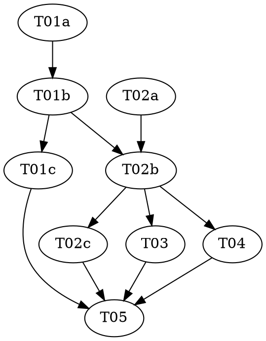

# Reasonable 3.0 — Part 2 of 7: Contract Grammar v3

> **For agentic workers:** REQUIRED: Use vf-superpowers:subagent-driven-development (parallel,
> same session) or vf-superpowers:executing-plans (sequential, separate session) to implement
> this plan. Steps use checkbox (`- [ ]`) syntax for tracking. This plan contains `role:
> red|green|audit` triads — each role MUST run as a fresh, isolated subagent.

> **Design status — read before starting.** This plan implements a slice of `docs/DESIGN-3.0.md`,
> which is **still a draft** (its own header: "draft four... has not yet faced its own independent
> attack"). Per the parent roadmap
> (`../2026-07-08-reasonable-3.0-roadmap.md`): **do not build past Part 1 until Part 1 has landed
> and been reviewed.** Part 1 has landed (v2.8.1). This part is a genuinely **breaking, hard-cutover**
> change to an on-disk, machine-parsed grammar — unlike Part 1's purely additive shape, if this
> lands on the plugin's released line it changes behavior for every existing 2.x reasonable effort
> with live contracts, not just future 3.0 adopters. See T05 for the version-bump decision this
> plan deliberately does NOT make unilaterally, and see
> `docs/superpowers/specs/2026-07-08-reasonable-3.0-p2-contract-grammar-v3-design.md` for the full
> design reasoning, including every place DESIGN-3.0 left a concrete shape unstated and how this
> plan resolved it (flagged as overridable, not silently assumed).

**Goal:** Teach `lib/contract.mjs`'s parser and `lib/ledger.mjs`'s event grammar to speak the v3
contract grammar (DESIGN-3.0 §4.2) — durable, ledger-allocated clause ids (`<component>#c<N>`,
replacing positional `§N`), citations attached per clause instead of file-level, and a required
`- Demanded-by:` provenance line on every clause — with zero behavior change to every other
existing grammar feature (Scenarios/Seams/Provenance/Supersession/Gate) and zero source changes to
this parser's two downstream consumers (`lib/footprint.mjs`, `lib/citation-resolve.mjs`), verified
rather than assumed.

**Architecture:** A new, small module `lib/clause-id.mjs` owns the id shape (pure) and its
ledger-backed allocator (`allocateClauseId`, one new `clause-allocated` `EVENT_SCHEMAS` entry in
`lib/ledger.mjs`) — split out for the same reason Part 1 split out `lib/effects.mjs`: the parsing
half and the allocating half are genuinely different concerns (one pure, one I/O), and bundling
them in `lib/contract.mjs` would put two independent tasks on the same file with no dependency
edge between them. The clause id's numeric suffix is simply the ledger's own `seq` — no
per-component counter, no fold, no persisted registry anywhere: the ledger's existing append lock
already makes concurrent allocation collision-proof, and there is nothing left to cache once ids
are seq-derived. `lib/contract.mjs`'s `parseContract()` is rewritten to recognize the new heading
shape, attach citations per clause, and parse a per-clause `demanded-by` tagged reference
(`goal:|gate:|cite:|ledger:`) — permissively (never throws), with a new sibling function
`missingDemandedBy` auditing completeness separately, mirroring the existing `danglingCitations`
split. Every other 2.x/brownfield grammar feature (none of which DESIGN-3.0 mentions) carries
forward byte-for-byte unchanged. See `shared/architecture.md` for the full reasoning, including why
this does **not** yet build the clause-cohesion graph that reads this data (that's Part 3,
DESIGN-3.0 §4.3).

**Tech Stack:** Node.js ESM (`.mjs`), builtins only (`node:assert`, `node:fs`, `node:os`,
`node:path`). No package.json, no dependencies — a hard invariant of this repo (see `CLAUDE.md`).

**Design doc:** `docs/superpowers/specs/2026-07-08-reasonable-3.0-p2-contract-grammar-v3-design.md`
(every open design question DESIGN-3.0 left unstated, resolved with reasoning, flagged where
genuinely contestable). `docs/DESIGN-3.0.md` §4.2 (identity/clause ids/provenance), §4.3 (the
minimality/cohesion law this grammar feeds but does not compute), §12 (breaking-changes list +
the companion-docs-are-a-ratification-precondition rule), §15 findings R3-5 (demanded-by
provenance vocabulary), R3-6 (allocation concurrency), and the "Identity undefined" R4 fatal
finding (why allocated ids, not positional or content-derived ones).

**Planned by:** claude-sonnet-5

---

## Pre-flight (supervisor, before Wave 1)

Check `git status` before dispatching anything. If the working tree carries unrelated in-flight
changes, resolve those with the user first — every task in this plan stages **only its own
listed files**; `git add -A` is forbidden (see `shared/conventions.md`).

## Dependency Graph

| Task | Role | Depends On | Files Created/Modified |
|------|------|-----------|------------------------|
| T01a | red | — | `test/clause-id.test.mjs` (authored here) |
| T01b | green | T01a | `lib/clause-id.mjs` (new), `lib/ledger.mjs` (test file READ-ONLY) |
| T01c | audit | T01b | — (audit only) |
| T02a | red | — | `test/contract-v3-grammar.test.mjs` (authored here) |
| T02b | green | T02a, T01b | `lib/contract.mjs` (rewrite), `test/contract.test.mjs` (fixture migration — see `shared/conventions.md`'s exception; `test/contract-v3-grammar.test.mjs` stays READ-ONLY) |
| T02c | audit | T02b | — (audit only) |
| T03 | — | T02b | `test/contract-consumers.test.mjs` (new); `lib/footprint.mjs`/`lib/citation-resolve.mjs` only if a real gap surfaces |
| T04 | — | T02b | `docs/artifacts.md`, `docs/glossary.md` |
| T05 | — | T01c, T02c, T03, T04 | `.claude-plugin/plugin.json`, `README.md` (human decides major vs. minor — see T05) |

**Wave Schedule:**
- Wave 1: T01a (red — clause-id tests), T02a (red — contract-v3-grammar tests). These run in
  parallel, not sequentially like Part 1's two triads did — `T02a`'s fixtures are written directly
  against `shared/interfaces.md`'s fully-pinned `CLAUSE_ID_PATTERN` regex (a simple, unambiguous
  shape), so unlike Part 1's `T02a` (which waited one wave for `lib/effects.mjs`'s real two-shape
  disambiguation rules to exist before writing "valid" fixtures against them), there is no real
  ambiguity here for `T02a` to get wrong by not waiting. The dependency that DOES exist —
  `lib/contract.mjs`'s rewrite needing `lib/clause-id.mjs` to already exist to import from — is
  captured correctly below, at `T02b`.
- Wave 2: T01b (green — `lib/clause-id.mjs` + the one-line `lib/ledger.mjs` schema entry)
- Wave 3: T01c (audit, read-only), T02b (green — `lib/contract.mjs` rewrite + `test/contract.test.mjs`
  migration; depends on both T02a's locked tests and T01b's real `lib/clause-id.mjs` to import) —
  file-disjoint from T01c, safe in parallel
- Wave 4: T02c (audit), T03 (consumer regression, file-disjoint from T02c), T04 (docs,
  file-disjoint from both) — all three depend only on T02b, safe in parallel
- Wave 5: T05 (version-bump human decision + full suite check)

**File conflict rule holds:** no two tasks without a dependency edge touch the same file. Audits
touch nothing.

## Task Index

| ID | Name | File | Description |
|----|------|------|-------------|
| T01a | Clause-id shape + allocator tests (red) | `tasks/T01a-clause-id-red.md` | Failing tests for `lib/clause-id.mjs` and the new `clause-allocated` ledger event |
| T01b | Clause-id shape + allocator impl (green) | `tasks/T01b-clause-id-green.md` | Implement `lib/clause-id.mjs` + the one-line `lib/ledger.mjs` schema entry |
| T01c | Clause-id shape + allocator audit | `tasks/T01c-clause-id-audit.md` | Adversarial audit of tests + impl |
| T02a | Contract grammar v3 tests (red) | `tasks/T02a-contract-grammar-red.md` | Failing tests for the new `parseContract()` grammar (ids, per-clause citations, demanded-by) |
| T02b | Contract grammar v3 impl (green) | `tasks/T02b-contract-grammar-green.md` | Rewrite `parseContract()`; migrate `test/contract.test.mjs`'s pre-existing fixtures to the new syntax |
| T02c | Contract grammar v3 audit | `tasks/T02c-contract-grammar-audit.md` | Adversarial audit of tests, impl, and the migration's honesty |
| T03 | Consumer regression | `tasks/T03-consumer-regression.md` | Prove `lib/footprint.mjs`/`lib/citation-resolve.mjs` still work against v3 grammar (new coverage — neither had a test before) |
| T04 | Docs | `tasks/T04-docs-artifacts-glossary.md` | `docs/artifacts.md`'s contract-grammar section + `docs/glossary.md`'s `Clause`/new `Demanded-by` entries |
| T05 | Version + final check | `tasks/T05-version-bump-final-check.md` | **Stops and asks the human** major vs. minor before bumping; then runs every test |

## Execution Handoff

**Plan complete and saved to
`docs/superpowers/plans/2026-07-08-reasonable-3.0-p2-contract-grammar-v3/plan.md`.**

**1. Subagent-Driven (this session)** — dispatch fresh subagent per task, review between tasks

**2. Parallel Session (separate)** — open new session with executing-plans, batch execution

See the parent roadmap (`../2026-07-08-reasonable-3.0-roadmap.md`) before starting Part 3 — do
not write or execute Part 3 until this part has landed and been reviewed. Part 3 (the atom:
charter/delta split, the lifecycle state machine, the minimality/cohesion law) depends on this
part's per-clause citations and `demanded-by` field — if this part's grammar shape changes during
review, Part 3's plan would need to change with it.
