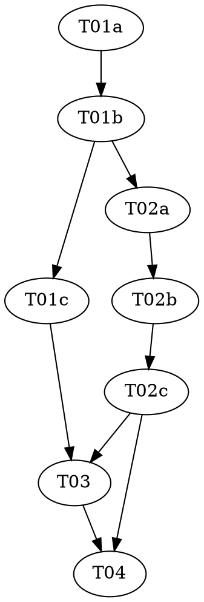

# Reasonable 3.0 — Part 3 of 7: The Atom

> **For agentic workers:** REQUIRED: Use vf-superpowers:subagent-driven-development (parallel,
> same session) or vf-superpowers:executing-plans (sequential, separate session) to implement
> this plan. Steps use checkbox (`- [ ]`) syntax for tracking. This plan contains `role:
> red|green|audit` triads — each role MUST run as a fresh, isolated subagent.

> **Design status — read before starting.** This plan implements a slice of `docs/DESIGN-3.0.md`,
> which is **still a draft** (its own header: "draft four... has not yet faced its own independent
> attack"). Per the parent roadmap
> (`../2026-07-08-reasonable-3.0-roadmap.md`): **do not build past Part 2 until Part 2 has landed
> and been reviewed.** Part 1 landed as v2.8.1; Part 2 landed as v3.0.0 (the current version). This
> part is purely **additive** — a new file plus new, optional ledger event types — with zero
> behavior change to any existing caller, the same shape as Part 1, not Part 2's hard grammar
> cutover. See
> `docs/superpowers/specs/2026-07-09-reasonable-3.0-p3-atom-design.md` for the full design
> reasoning, including every place DESIGN-3.0 left a concrete shape unstated and how this plan
> resolved it (flagged as overridable, not silently assumed) — in particular the **un-owned gap**
> around citing `intention.md` from a premise (Decision 3), which this plan deliberately does not
> attempt to close.

**Goal:** Build `lib/atom.mjs` — the atom's charter/delta split (DESIGN-3.0 §4.1), its full
lifecycle state machine including the three orthogonal flags (§4.1), and the minimality/cohesion
law (§4.3) — with a thin ledger-integration layer (six new, additive `EVENT_SCHEMAS` entries in
`lib/ledger.mjs`) and zero behavior change to every existing event type, parser, or exported
function.

**Architecture:** One new file, `lib/atom.mjs`, growing across two tasks: a **pure** top section
(the lifecycle adjacency table, the flag vocabulary, the clause-cohesion graph algorithm — zero
I/O, mirroring `lib/effects.mjs`'s pure-shape-validator style) and an **I/O** bottom section
(`charterAtom`/`authorDelta`/`enrichDelta`/`transitionAtom`/`setFlag`/`clearFlag`/`loadAtom`/
`foldAtoms`, all routed through `lib/ledger.mjs`'s existing `append()`, mirroring
`lib/clause-id.mjs`'s shape-plus-allocator split). Unlike Parts 1 and 2 (each split their pure and
I/O halves into two separate files), the roadmap pins exactly one new file for this part —
`shared/architecture.md` explains why one file, grown across two dependent tasks, is the right
shape here rather than a further file split. Atom identity is allocated exactly like Part 2's
clause ids (a ledger event, `atom-chartered`, riding the ledger's own `seq` — no per-component
counter, no persisted registry). The cohesion check reuses Part 2's `citations`/`demandedBy` clause
fields directly — this is the "consumer" `lib/contract.mjs`'s own `DEMANDED_BY_RE` comment names
explicitly: "resolving WHAT a reference means is deferred to the consumer (the cohesion graph, Part
3)."

**Tech Stack:** Node.js ESM (`.mjs`), builtins only (`node:assert`, `node:fs`, `node:os`,
`node:path`). No package.json, no dependencies — a hard invariant of this repo (see `CLAUDE.md`).

**Design doc:** `docs/superpowers/specs/2026-07-09-reasonable-3.0-p3-atom-design.md` (every open
design question DESIGN-3.0 left unstated, resolved with reasoning, flagged where genuinely
contestable). `docs/DESIGN-3.0.md` §4 (the atom, overview), §4.1 (charter/delta/lifecycle), §4.2
(identity/clause ids/provenance — Part 2's, read here as a dependency), §4.3 (the minimality law),
§7/§7.1/§7.2 (the failure calculus — read for *which edges exist* in the lifecycle graph, not
implemented here — verdict routing is Part 5), §8 (the event grammar's `effects` field and "every
atom lifecycle transition is one ledger event" ruling), §12 (breaking-changes list; the
companion-docs-are-a-ratification-precondition rule; the un-owned `intention.md` clause-addressing
gap), §15 finding record (draft one's vacuous footprint-relation cohesion mistake — why criterion
(c) is defined precisely in this plan, not loosely).

**Planned by:** claude-sonnet-5

---

## Pre-flight (supervisor, before Wave 1)

Check `git status` before dispatching anything. If the working tree carries unrelated in-flight
changes, resolve those with the user first — every task in this plan stages **only its own
listed files**; `git add -A` is forbidden (see `shared/conventions.md`).

## Dependency Graph

| Task | Role | Depends On | Files Created/Modified |
|------|------|-----------|------------------------|
| T01a | red | — | `test/atom-lifecycle.test.mjs`, `test/atom-cohesion.test.mjs` (authored here) |
| T01b | green | T01a | `lib/atom.mjs` (new — pure half only; test files READ-ONLY) |
| T01c | audit | T01b | — (audit only) |
| T02a | red | T01b | `test/atom-ledger.test.mjs` (authored here) |
| T02b | green | T02a, T01b | `lib/atom.mjs` (I/O half, appended), `lib/ledger.mjs` (test file READ-ONLY) |
| T02c | audit | T02b | — (audit only) |
| T03 | — | T01c, T02c | `docs/artifacts.md`, `docs/glossary.md` |
| T04 | — | T02c, T03 | `.claude-plugin/plugin.json`, `README.md`, full-suite check |

**Wave Schedule:**
- Wave 1: T01a (red — pure lifecycle + cohesion tests)
- Wave 2: T01b (green — `lib/atom.mjs`'s pure half)
- Wave 3: T01c (audit, read-only), T02a (red — ledger integration tests; needs T01b's real
  `isValidTransition`/`LIFECYCLE_STATES`/`FLAG_NAMES`/`cohesionComponents` to write fixtures
  against, so it waits one wave — the same reasoning Part 1's T02a used, and unlike Part 2's T02a,
  which didn't need to wait)
- Wave 4: T02b (green — `lib/atom.mjs`'s I/O half, appended to the same file; the six
  `lib/ledger.mjs` `EVENT_SCHEMAS` lines)
- Wave 5: T02c (audit), T03 (docs — file-disjoint from T02c, safe in parallel; depends on T01c too,
  already landed by Wave 3)
- Wave 6: T04 (version bump — automatic minor, no human gate needed, see the design doc's "Version
  bump" section — + full suite)

**File conflict rule holds, with one named exception:** no two tasks without a dependency edge
touch the same file. The one deliberate exception: T01b and T02b both write to `lib/atom.mjs` —
permitted because T02b **depends on** T01b (a real dependency edge, not an absent one) and the two
tasks own disjoint, non-overlapping sections of the file (T01b: top, pure; T02b: bottom, I/O,
strictly appended) — see `shared/conventions.md` for why this differs from Parts 1/2's practice of
one triad per whole new file.

## Task Index

| ID | Name | File | Description |
|----|------|------|-------------|
| T01a | Atom lifecycle + cohesion tests (red) | `tasks/T01a-atom-pure-red.md` | Failing tests for `lib/atom.mjs`'s pure lifecycle adjacency table and cohesion graph algorithm |
| T01b | Atom lifecycle + cohesion impl (green) | `tasks/T01b-atom-pure-green.md` | Implement `lib/atom.mjs`'s pure half against the locked tests |
| T01c | Atom lifecycle + cohesion audit | `tasks/T01c-atom-pure-audit.md` | Adversarial audit of tests + impl |
| T02a | Atom ledger integration tests (red) | `tasks/T02a-atom-ledger-red.md` | Failing tests for charter/delta/enrichment/transition/flag ledger events and the `loadAtom`/`foldAtoms` fold |
| T02b | Atom ledger integration impl (green) | `tasks/T02b-atom-ledger-green.md` | Append the I/O half to `lib/atom.mjs`; add six `EVENT_SCHEMAS` lines to `lib/ledger.mjs` |
| T02c | Atom ledger integration audit | `tasks/T02c-atom-ledger-audit.md` | Adversarial audit of tests + impl |
| T03 | Docs | `tasks/T03-docs-artifacts-glossary.md` | `docs/artifacts.md`'s new atom-events subsection + `docs/glossary.md`'s new terms |
| T04 | Version + final check | `tasks/T04-version-bump-final-check.md` | Bump minor (automatic, additive change), run every test |

## Execution Handoff

**Plan complete and saved to
`docs/superpowers/plans/2026-07-09-reasonable-3.0-p3-atom/plan.md`.**

**1. Subagent-Driven (this session)** — dispatch fresh subagent per task, review between tasks

**2. Parallel Session (separate)** — open new session with executing-plans, batch execution

See the parent roadmap (`../2026-07-08-reasonable-3.0-roadmap.md`) before starting Part 4 — do not
write or execute Part 4 until this part has landed and been reviewed. Part 4 (the graph engine:
containment-tree fold, dependency-edge computation) depends on this part's atom records and Part
1's `effects` field both existing — if this part's atom-record shape changes during review, Part
4's plan would need to change with it.
