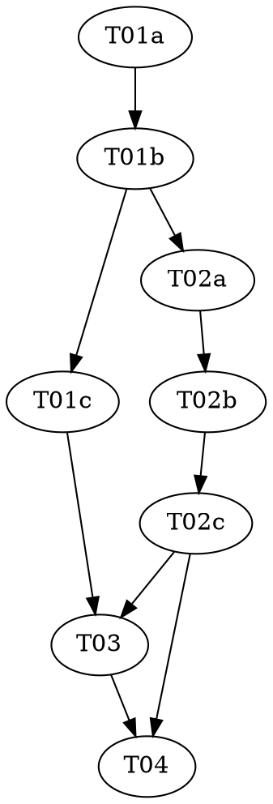

# Reasonable 3.0 — Part 4 of 7: The Graph Engine

> **For agentic workers:** REQUIRED: Use vf-superpowers:subagent-driven-development (parallel,
> same session) or vf-superpowers:executing-plans (sequential, separate session) to implement this
> plan. Steps use checkbox (`- [ ]`) syntax for tracking. This plan contains `role:
> red|green|audit` triads — each role MUST run as a fresh, isolated subagent.

> **Design status — read before starting.** This plan implements a slice of `docs/DESIGN-3.0.md`,
> which is **still a draft** (its own header: "draft four... has not yet faced its own independent
> attack"). Per the parent roadmap
> (`../2026-07-08-reasonable-3.0-roadmap.md`): Parts 1–3 have landed (v2.8.0, v3.0.0, v3.1.0). This
> part is purely **additive** — one new file (`lib/graph.mjs`) plus a small, strictly
> backward-compatible export addition to the already-shipped `lib/atom.mjs` — with zero behavior
> change to any existing caller, the same shape as Parts 1 and 3, not Part 2's hard grammar cutover.
> See `docs/superpowers/specs/2026-07-09-reasonable-3.0-p4-graph-design.md` for the full design
> reasoning, including every place DESIGN-3.0 left a concrete shape unstated and how this plan
> resolved it (flagged as overridable, not silently assumed) — in particular two real, un-owned
> gaps this plan deliberately does not attempt to close (no atom field carries resource claims yet;
> planned-fidelity edges need topology-stage data that doesn't exist), and one contestable
> proportionality call (no `graph.json` disk mirror yet — nothing reads one today).

**Goal:** Build `lib/graph.mjs` — the containment-tree fold (DESIGN-3.0 §2.1), the four
dependency-edge computations `needs`/`excludes`/`serves`/`informs` (§2.2), edge lifting (§2.3), and
the as-lived-vs-current graph projection split plus a divergence check (§2.4) — with one small,
additive export change to `lib/atom.mjs` (`foldAtomFromEvents`/`foldAtomsFromEvents`) so the
as-lived projection can fold a seq-bounded slice of the ledger without duplicating Part 3's
per-event fold logic.

**Architecture:** One new file, `lib/graph.mjs`, growing across two tasks: a **pure** top section
(containment, all four edge computations, edge lifting — zero I/O, mirroring `lib/atom.mjs`'s own
pure-then-I/O split) and an **I/O** bottom section (`foldAsLived`/`deriveCurrent`/
`graphDivergence`, reading the ledger via `lib/atom.mjs`'s new exports and live contracts via
`lib/contract.mjs`). The central fact this whole plan turns on: **nothing in this codebase has ever
written a real `effects` array**, so `needs`/`excludes`/`serves`/`informs` are always *derived* —
never read off one — which makes the as-lived and current projections provably identical on any
effort whose contracts were only ever touched through this engine's own atom pipeline, and gives
the required divergence check (§2.4) a real job today: catching a contract hand-edited outside the
ledger-governed pipeline.

**Tech Stack:** Node.js ESM (`.mjs`), builtins only (`node:assert`, `node:fs`, `node:os`,
`node:path`). No package.json, no dependencies — a hard invariant of this repo (see `CLAUDE.md`).

**Design doc:** `docs/superpowers/specs/2026-07-09-reasonable-3.0-p4-graph-design.md` (every open
design question DESIGN-3.0 left unstated, resolved with reasoning, flagged where genuinely
contestable, grounded in the actually-shipped Parts 1–3 code). `docs/DESIGN-3.0.md` §2 (the two
structures overview), §2.1 (containment), §2.2 (the four edge kinds, "computed by the fold... never
hand-stored"), §2.3 (edge lifting), §2.4 (the self-sufficiency ruling, the two projections,
divergence), §8 (the event grammar's `effects` field — read here as a dependency Part 1 already
shipped and this part folds, never writes to).

**Planned by:** claude-sonnet-5

---

## Pre-flight (supervisor, before Wave 1)

Check `git status` before dispatching anything. If the working tree carries unrelated in-flight
changes, resolve those with the user first — every task in this plan stages **only its own listed
files**; `git add -A` is forbidden (see `shared/conventions.md`).

## Dependency Graph

| Task | Role | Depends On | Files Created/Modified |
|------|------|-----------|------------------------|
| T01a | red | — | `test/graph-containment.test.mjs`, `test/graph-edges.test.mjs` (authored here) |
| T01b | green | T01a | `lib/graph.mjs` (new — pure half only; test files READ-ONLY) |
| T01c | audit | T01b | — (audit only) |
| T02a | red | T01b | `test/graph-projections.test.mjs` (authored here) |
| T02b | green | T02a, T01b | `lib/graph.mjs` (I/O half, appended), `lib/atom.mjs` (additive export change; test files READ-ONLY) |
| T02c | audit | T02b | — (audit only) |
| T03 | — | T01c, T02c | `docs/artifacts.md`, `docs/glossary.md` |
| T04 | — | T02c, T03 | `.claude-plugin/plugin.json`, `README.md`, roadmap status cell, full-suite check |

**Wave Schedule:**
- Wave 1: T01a (red — pure containment/edge/lifting tests)
- Wave 2: T01b (green — `lib/graph.mjs`'s pure half)
- Wave 3: T01c (audit, read-only), T02a (red — projection tests; needs T01b's real `needsEdges`/
  `excludesEdges`/`ledgerCitationGraph`/etc. to build fixtures against, so it waits one wave — the
  same reasoning Part 3's T02a used)
- Wave 4: T02b (green — `lib/graph.mjs`'s I/O half, appended; the small additive `lib/atom.mjs`
  export change)
- Wave 5: T02c (audit), T03 (docs — file-disjoint from T02c, safe in parallel; depends on T01c too,
  already landed by Wave 3)
- Wave 6: T04 (version bump — automatic minor, no human gate needed, see the design doc's "Version
  bump" section — + full suite)

**File conflict rule holds, with one named exception:** no two tasks without a dependency edge
touch the same file. The one deliberate exception: T01b and T02b both write to `lib/graph.mjs` —
permitted because T02b **depends on** T01b (a real dependency edge, not an absent one) and the two
tasks own disjoint, non-overlapping sections of the file (T01b: top, pure; T02b: bottom, I/O,
strictly appended) — see `shared/conventions.md` for why this differs from Part 2's practice of one
triad per whole new file (it matches Part 3's practice instead). T02b **also** touches
`lib/atom.mjs` — a small, additive, backward-compatible export change no other task in this plan
touches, so no conflict.

## Task Index

| ID | Name | File | Description |
|----|------|------|-------------|
| T01a | Graph pure-function tests (red) | `tasks/T01a-graph-pure-red.md` | Failing tests for `lib/graph.mjs`'s containment fold, four edge computations, and edge lifting |
| T01b | Graph pure-function impl (green) | `tasks/T01b-graph-pure-green.md` | Implement `lib/graph.mjs`'s pure half against the locked tests |
| T01c | Graph pure-function audit | `tasks/T01c-graph-pure-audit.md` | Adversarial audit of tests + impl |
| T02a | Graph projection tests (red) | `tasks/T02a-graph-projections-red.md` | Failing tests for `foldAsLived`/`deriveCurrent`/`graphDivergence` and `lib/atom.mjs`'s two new exports |
| T02b | Graph projection impl + `lib/atom.mjs` export (green) | `tasks/T02b-graph-projections-green.md` | Append `lib/graph.mjs`'s I/O half; rename/export `lib/atom.mjs`'s per-event fold |
| T02c | Graph projection audit | `tasks/T02c-graph-projections-audit.md` | Adversarial audit of tests + impl |
| T03 | Docs | `tasks/T03-docs-artifacts-glossary.md` | `docs/artifacts.md`'s new graph-engine subsection + updated Effects scope note; `docs/glossary.md`'s nine new terms |
| T04 | Version + final check | `tasks/T04-version-bump-final-check.md` | Bump minor (automatic, additive change), update the roadmap status cell, run every test |

## Execution Handoff

**Plan complete and saved to
`docs/superpowers/plans/2026-07-09-reasonable-3.0-p4-graph/plan.md`.**

**1. Subagent-Driven (this session)** — dispatch fresh subagent per task, review between tasks

**2. Parallel Session (separate)** — open new session with executing-plans, batch execution

See the parent roadmap (`../2026-07-08-reasonable-3.0-roadmap.md`) before starting Part 5 — do not
write or execute Part 5 until this part has landed and been reviewed. Part 5 (the rewrite engine:
failure calculus, verdict types R1–R9, effect application) depends on this part's graph-fold shape
and Part 3's atom records both existing — if this part's edge/projection shapes change during
review, Part 5's plan would need to change with it.
