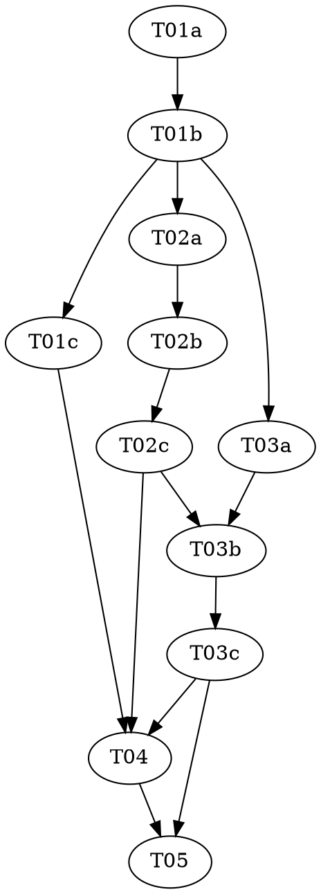

# Reasonable 3.0 — Part 5 of 8: The Rewrite Engine (the failure calculus)

> **For agentic workers:** REQUIRED: Use vf-superpowers:subagent-driven-development (parallel,
> same session) or vf-superpowers:executing-plans (sequential, separate session) to implement this
> plan. Steps use checkbox (`- [ ]`) syntax for tracking. This plan contains `role:
> red|green|audit` triads — each role MUST run as a fresh, isolated subagent.

> **Design status — read before starting.** This plan implements a slice of `docs/DESIGN-3.0.md`,
> which is **still a draft** (its own header: "draft four... has not yet faced its own independent
> attack"; the ceremony amendment is draft-five, "NOT YET ATTACKED"). Per the parent roadmap
> (`../2026-07-08-reasonable-3.0-roadmap.md`): Parts 1–4 have landed (v2.8.0, v3.0.0, v3.1.0,
> v3.2.0). This part is purely **additive** — one new file (`lib/rewrite.mjs`), zero I/O, zero
> change to any existing file — the same additive shape as Parts 1, 3, and 4, not Part 2's hard
> grammar cutover. See `docs/superpowers/specs/2026-07-09-reasonable-3.0-p5-rewrite-design.md` for
> the full design reasoning, including the **one pivotal, confirmed scoping call** (Part 5 is a
> *pure calculus library*; the append-path wiring, the collision-free 3.0-verdict event type, and
> the effects-overlay fold are all Part 7's) and the flagged, un-owned gaps this plan deliberately
> does not close (the complexity-band vocabulary/thresholds and the legibility density metric are
> Part 6; the R1 reprice factor α is uncalibrated, §16).

**Goal:** Build `lib/rewrite.mjs` — the failure calculus: a **pure**, total
`computeVerdictEffects(verdict, state)` that maps an already-typed, already-audited R1–R9 verdict to
a two-phase `{provisional, permanent}` effect set (in `lib/effects.mjs`'s validated shape), plus the
§7.1 routing ladder (`routeRefutedPremise`) and the **ceremony-escalation effect**
(`ceremonyEscalation`) **and its unwind** (`unwindCeremonyEscalation`) — the last being DESIGN-3.0's
own still-untested open edge, built here with an explicit apply-then-unwind = identity invariant.

**Architecture:** One new pure file, `lib/rewrite.mjs`, grown across three triads that each append a
**disjoint section** below a marker comment (exactly as `lib/graph.mjs` grew across P4's T01b/T02b).
The router is written once in T01 and reads a shared `RULES` registry object; later triads register
their verdict kinds by *assignment* (`RULES['dead-end'] = …`) — never by editing the router or a
prior section — so the router "grows" with no merge conflict. Every rule reuses Parts 1/3/4's pure
exports (`citationClosureOver`, `cohesionComponents`, `isValidTransition`, `EDGE_NAMES`,
`validateEffects`); the only genuinely new algorithms are SCC detection (R6) and the dependent-cone
reverse-walk (R7). **No I/O, no `lib/ledger.mjs`/`lib/atom.mjs`/`lib/graph.mjs` change, no new event
type** — Part 5 computes effect sets; Part 7 applies them.

**Tech Stack:** Node.js ESM (`.mjs`), builtins only (`node:assert`). No package.json, no
dependencies — a hard invariant of this repo (see `CLAUDE.md`).

**Design doc:** `docs/superpowers/specs/2026-07-09-reasonable-3.0-p5-rewrite-design.md` (every open
design question DESIGN-3.0 left unstated, resolved with reasoning, flagged where genuinely
contestable, grounded in the actually-shipped Parts 1–4 code). `docs/DESIGN-3.0.md` §7 (the failure
calculus + the ceremony ruling), §7.1 (the routing ladder), §7.2 (the invariants — Totality,
two-phase effects, monotone evidence), §5.4/§9/§17 (the ceremony dial the escalation effect feeds),
§2.4 (the determinism claim — why the effect set is code-computed, and why the *wiring* is Part 7).

**Planned by:** claude-opus-4-8

**Versioning — no bump (roadmap decision, 2026-07-09).** P5–P8 land on one shared refactoring line;
the plugin version stays **`3.2.0`** and bumps once, at the end of the generation. This plan
therefore carries **no `version-bump-final-check` task** (unlike Parts 1–4). T05 moves the roadmap
status cell to `Landed — merged (no bump, 3.2.0)` and runs the suite — it does not touch
`plugin.json` or the README.

---

## Pre-flight (supervisor, before Wave 1)

Check `git status` before dispatching anything. If the working tree carries unrelated in-flight
changes, resolve those with the user first — every task in this plan stages **only its own listed
files**; `git add -A` is forbidden (see `shared/conventions.md`).

## Dependency Graph

| Task | Role | Depends On | Files Created/Modified |
|------|------|-----------|------------------------|
| T01a | red | — | `test/rewrite-router.test.mjs`, `test/rewrite-simple-verdicts.test.mjs` (authored here) |
| T01b | green | T01a | `lib/rewrite.mjs` (new — T01 section: vocab, router, ladder, R1/R4/R9; test files READ-ONLY) |
| T01c | audit | T01b | — (audit only) |
| T02a | red | T01b | `test/rewrite-structural.test.mjs` (authored here) |
| T02b | green | T02a, T01b | `lib/rewrite.mjs` (T02 section appended: scc, dependentCone, R2/R3/R5/R6/R7; test files READ-ONLY) |
| T02c | audit | T02b | — (audit only) |
| T03a | red | T01b | `test/rewrite-ceremony.test.mjs` (authored here) |
| T03b | green | T03a, T02c | `lib/rewrite.mjs` (T03 section appended: ceremonyEscalation, unwind, R8; test files READ-ONLY) |
| T03c | audit | T03b | — (audit only) |
| T04 | — | T01c, T02c, T03c | `docs/artifacts.md`, `docs/glossary.md` |
| T05 | — | T03c, T04 | roadmap status cell, full-suite check (NO version bump) |

**Wave Schedule:**
- Wave 1: T01a (red — router/ladder/simple-verdict tests)
- Wave 2: T01b (green — `lib/rewrite.mjs`'s T01 section)
- Wave 3: T01c (audit), T02a (red — structural-verdict tests; needs T01b's module + router to
  import and to build `state` fixtures against), T03a (red — ceremony tests; needs T01b's module) —
  all three read/author **disjoint** files, safe in parallel
- Wave 4: T02b (green — the structural verdicts + SCC/cone helpers, appended)
- Wave 5: T02c (audit, read-only) — held one wave before T03b so it audits a settled `lib/rewrite.mjs`
- Wave 6: T03b (green — ceremony escalation + unwind + R8, appended below T02b's marker)
- Wave 7: T03c (audit)
- Wave 8: T04 (docs — file-disjoint; lands right after all three audits are clean, per
  `shared/conventions.md`'s "companion doc updates are a ratification precondition")
- Wave 9: T05 (roadmap status cell + full suite — **no version bump**)

**File conflict rule holds, with one named exception:** no two tasks without a dependency edge
touch the same file. The one deliberate exception is T01b/T02b/T03b, which all write to
`lib/rewrite.mjs` — permitted because each **depends on** the last (real dependency edges, not
absent ones) and each owns a **disjoint, strictly-appended section** below the previous triad's
marker comment (T01b: top — vocab/router/ladder/R1/R4/R9; T02b: middle — helpers + R2/R3/R5/R6/R7;
T03b: bottom — ceremony + R8). This matches P4's practice for `lib/graph.mjs` exactly. **No task in
this plan modifies any pre-existing file** except the docs (T04) and the roadmap cell (T05) — in
particular `lib/ledger.mjs`, `lib/atom.mjs`, `lib/graph.mjs`, and `lib/effects.mjs` are imported
from, never edited.

## Task Index

| ID | Name | File | Description |
|----|------|------|-------------|
| T01a | Router + ladder + simple-verdict tests (red) | `tasks/T01a-router-simple-red.md` | Failing tests for `VERDICT_KINDS`/`RCODE_TO_KIND`, the total router (HALT on unknown), `routeRefutedPremise`, and R1/R4/R9 |
| T01b | Router + ladder + R1/R4/R9 impl (green) | `tasks/T01b-router-simple-green.md` | Implement `lib/rewrite.mjs`'s T01 section against the locked tests |
| T01c | T01 audit | `tasks/T01c-router-simple-audit.md` | Adversarial audit of the T01 tests + impl |
| T02a | Structural-verdict tests (red) | `tasks/T02a-structural-red.md` | Failing tests for R2/R3/R5/R6/R7, `scc`, `dependentCone` |
| T02b | Structural verdicts impl (green) | `tasks/T02b-structural-green.md` | Append the T02 section: SCC/cone helpers + the five structural rules |
| T02c | T02 audit | `tasks/T02c-structural-audit.md` | Adversarial audit of the T02 tests + impl |
| T03a | Ceremony + unwind + R8 tests (red) | `tasks/T03a-ceremony-red.md` | Failing tests for `ceremonyEscalation` (monotone-up, cap), the apply-then-unwind = identity invariant, and R8 |
| T03b | Ceremony + unwind + R8 impl (green) | `tasks/T03b-ceremony-green.md` | Append the T03 section: `ceremonyEscalation`, `unwindCeremonyEscalation`, R8 |
| T03c | T03 audit | `tasks/T03c-ceremony-audit.md` | Adversarial audit — with extra teeth on the unwind identity invariant |
| T04 | Docs | `tasks/T04-docs-artifacts-glossary.md` | Supersede `docs/artifacts.md`'s two "Part 5 future work" scope notes with a rewrite-engine subsection; add `docs/glossary.md` terms + the flagged gaps |
| T05 | Final check (no bump) | `tasks/T05-final-check.md` | Full-suite run; move the roadmap P5 status cell to `Landed — merged (no bump, 3.2.0)` — no version bump |

## Execution Handoff

**Plan complete and saved to
`docs/superpowers/plans/2026-07-09-reasonable-3.0-p5-rewrite/plan.md`.**

**1. Subagent-Driven (this session)** — dispatch fresh subagent per task, review between tasks

**2. Parallel Session (separate)** — open new session with executing-plans, batch execution

See the parent roadmap (`../2026-07-08-reasonable-3.0-roadmap.md`) before starting Parts 6–8 — do
not write or execute them until this part has landed and been reviewed. Parts 6 (topology/legibility
+ the complexity-band vocabulary) and 7 (the frontier loop that *applies* these effect sets, wires
the calculus into the append path, and mints the collision-free 3.0-verdict event type) both sit on
this part's effect-set shapes — if those shapes change during review, their plans change with them.
