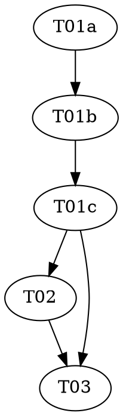

# Reasonable 3.0 — Part 6a of the P6 sub-series: The Planned-Edge Fold

> **For agentic workers:** REQUIRED: Use vf-superpowers:subagent-driven-development (fresh Sonnet
> subagent per task, Opus supervising) or vf-superpowers:executing-plans. Steps use checkbox
> (`- [ ]`) syntax. This plan contains one `role: red|green|audit` triad — each role MUST run as a
> fresh, isolated subagent.

> **Design status — read before starting.** This plan implements **P6a**, the first sub-part of the
> P6 topology stage, of `docs/DESIGN-3.0.md` (still a draft; the ceremony amendment is draft-five,
> "NOT YET ATTACKED"). Per the parent roadmap
> (`../2026-07-08-reasonable-3.0-roadmap.md`) and the P6 whole-stage design doc
> (`../../specs/2026-07-10-reasonable-3.0-p6-topology-design.md`): P6 is split into P6a–P6e, planned
> and landed one at a time. P6a is **purely additive** — it extends the already-shipped
> `lib/graph.mjs` with one new pure function, changing no existing behavior — the same additive shape
> as Parts 1, 3, 4 and P5. It does **not** retire `route.mjs`, touch `reconcile.mjs`, or add any
> artifact (Call #1 in the design doc: the whole of P6 is additive; the route retirement + projection
> rebuild is P7's migration).

**Goal:** Extend `lib/graph.mjs` with `plannedNeedsEdges(charters)` — the **planned** `needs`
fidelity (DESIGN-3.0 §2.2) that P4 built to a boundary and deferred whole. It derives genesis-time
dependency edges from **charters alone** (before any delta exists), from two sources: the
cross-component quotient (a `cite:Y#cN` premise ⇒ this atom planned-needs every atom of component Y)
and the intra-component ordering (within one component, an atom planned-needs the immediately-preceding
`order` stratum). This is what lets P6b's legibility law measure a non-empty graph at genesis — where
`needsEdges` (which reads `deltaClauses[].citations`) returns `[]`.

**Architecture:** One new pure function appended to `lib/graph.mjs`'s **pure** section (above the
existing I/O marker), plus one import of the already-shipped, pure `parseClauseId` from
`lib/clause-id.mjs`. No new file, no I/O, no new artifact, no change to any existing function. Planned
vs. actual edges share the exact `{from, to, edge:'needs', op:'add'}` shape — the distinction is *which
function produced the array* (planned = `plannedNeedsEdges`, actual = `needsEdges`), exactly as P4's
`foldAsLived` vs `deriveCurrent` produce different edge arrays from one shape.

**Tech Stack:** Node.js ESM (`.mjs`), builtins only (`node:assert` in tests). No package.json, no
dependencies — a hard invariant of this repo (`CLAUDE.md`).

**Design doc:** `docs/superpowers/specs/2026-07-10-reasonable-3.0-p6-topology-design.md` (Decision 2
pins the derive-from-charters call and its flagged alternative). `docs/DESIGN-3.0.md` §2.2 (the two
edge fidelities), §2.4 (the ledger is self-sufficient; edges are computed by the fold, never stored).

**Planned by:** claude-opus-4-8. **Implemented by:** Sonnet subagents (one per role), Opus supervising.

**Versioning — no bump (roadmap decision, 2026-07-09).** P5–P8 land on one shared refactoring line at
`3.2.0`; the version bumps once, at the end of the generation. This plan carries **no
`version-bump-final-check` task** and touches neither `plugin.json` nor the README. T03 moves the
roadmap P6a status cell to `Landed — merged (no bump, 3.2.0)` and runs the suite.

---

## Pre-flight (supervisor, before Wave 1)

Check `git status` before dispatching anything. The branch is `reasonable-3.0-p6-topology-plan`. If
the working tree carries unrelated in-flight changes, resolve those with the user first — every task
stages **only its own listed files**; `git add -A` is forbidden (`shared/conventions.md`).

## Dependency Graph

| Task | Role | Depends On | Files Created/Modified |
|------|------|-----------|------------------------|
| T01a | red | — | `test/graph-planned-edges.test.mjs` (authored here) |
| T01b | green | T01a | `lib/graph.mjs` (planned-edge sub-section + one import; test file READ-ONLY) |
| T01c | audit | T01b | — (audit only) |
| T02 | — | T01c | `docs/glossary.md`, `docs/artifacts.md` |
| T03 | — | T01c, T02 | roadmap P6a status cell; full-suite check (NO version bump) |

**Wave Schedule:**
- Wave 1: T01a (red — the planned-edge tests)
- Wave 2: T01b (green — `plannedNeedsEdges`)
- Wave 3: T01c (audit — read-only)
- Wave 4: T02 (docs — glossary + artifacts; file-disjoint from code, lands after the audit is clean
  per `shared/conventions.md`'s "companion doc updates are a ratification precondition")
- Wave 5: T03 (roadmap status cell + full suite — **no version bump**)

**File conflict rule holds:** no two tasks without a dependency edge touch the same file. T01b is the
only task that edits `lib/graph.mjs`; T02 is the only task that edits the docs; T03 the only one that
touches the roadmap. No pre-existing `lib/*.mjs` other than `graph.mjs` is modified — `clause-id.mjs`,
`atom.mjs`, `route.mjs`, `reconcile.mjs` are imported-from or untouched.

## Task Index

| ID | Name | File | Description |
|----|------|------|-------------|
| T01a | Planned-edge tests (red) | `tasks/T01a-planned-edges-red.md` | Failing tests for `plannedNeedsEdges`: cross-component quotient, intra-component strata, dedup, ties, un-parseable cite, empty/single |
| T01b | Planned-edge impl (green) | `tasks/T01b-planned-edges-green.md` | Implement `plannedNeedsEdges` in `lib/graph.mjs`'s pure section against the locked tests |
| T01c | Planned-edge audit | `tasks/T01c-planned-edges-audit.md` | Adversarial audit of the tests + impl (discriminator on pre-task commit, bidirectional §2.2 mapping) |
| T02 | Docs | `tasks/T02-docs.md` | Add `docs/glossary.md` terms (planned edge / planned fidelity); update `docs/artifacts.md`'s graph-section "planned edges deferred to Part 6" note to "built (P6a)" |
| T03 | Final check (no bump) | `tasks/T03-final-check.md` | Full-suite run; move the roadmap P6a status cell to `Landed — merged (no bump, 3.2.0)` — no version bump |

## Execution Handoff

**Plan complete and saved to
`docs/superpowers/plans/2026-07-10-reasonable-3.0-p6a-planned-edges/plan.md`.**

Execution model (human-set): Sonnet subagents implement, one fresh subagent per role task; Opus
supervises and reviews between waves (vf-superpowers:subagent-driven-development). After P6a lands
(tests green, merged) the P6b plan (the legibility law) is written next — one sub-part at a time, per
the parent roadmap.
