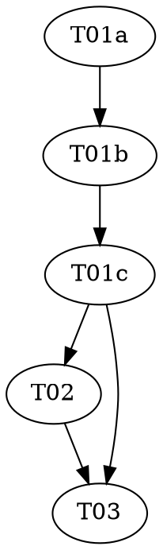

# Reasonable 3.0 — Part 6b of the P6 sub-series: The Legibility Law

> **For agentic workers:** REQUIRED: Use vf-superpowers:subagent-driven-development (fresh Sonnet
> subagent per task, Opus supervising) or vf-superpowers:executing-plans. Steps use checkbox
> (`- [ ]`) syntax. This plan contains one `role: red|green|audit` triad — each role MUST run as a
> fresh, isolated subagent.

> **Design status — read before starting.** This plan implements **P6b**, landed after P6a → P6d in
> the P6 topology stage (order: P6a → P6d → { **P6b**, P6c } → P6e), of `docs/DESIGN-3.0.md` (still a
> draft; the ceremony amendment is draft-five, "NOT YET ATTACKED"). Per the parent roadmap
> (`../2026-07-08-reasonable-3.0-roadmap.md`) and the P6 whole-stage design doc
> (`../../specs/2026-07-10-reasonable-3.0-p6-topology-design.md`, **Decision 3**): P6b is **purely
> additive** — one brand-new file, `lib/legibility.mjs`, changing no existing behavior — the same
> additive shape as Parts 1/3/4, P5, P6a, and P6d. It does **not** retire `route.mjs`, touch
> `reconcile.mjs`/`next-action.mjs`, edit `rewrite.mjs`, or wire a live consumer (Call #1: P6 is
> additive; the route retirement + projection rebuild + dispatch are P7's migration). **Nothing calls
> `legibilityFindings` on a live effort until P7** — P6b builds the pure calculus; P7 decides
> genesis-R8-blocks vs. live-R8-batches (the dispatch distinction, explicitly P7's per Decision 3).

**Goal:** Add `lib/legibility.mjs` — the **legibility law** (DESIGN-3.0 §5.2): a pure calculus over
`lib/graph.mjs`'s output that measures the *shape* of a dependency graph against `policy.json`
thresholds. It exports `legibilityFindings(graph, policy)` (bounded width, bounded tangle, coupling
smells, chain smell) and `regroupingReducesTangle(proposal, tree, edges)` — R8's **density-reduction
guard**, which closes the exact boundary P5's `rewrite.mjs` R8 rule left open ("*applied only if it
reduces measured density*").

**Architecture:** One new pure file. `legibilityFindings` reads `graph.containment`/`graph.atoms`/
`graph.edges` and `policy.legibility` thresholds, returning an array of findings each shaped so it is
**drop-in usable as the `proposal` of an R8 `illegible` verdict** `rewrite.mjs` already consumes (the
two compose without either inventing a shape). It is **edge-source-agnostic** — over P6a's
`plannedNeedsEdges` at genesis, over `needsEdges`/`servesEdges` post-delta; which fidelity to feed is
the caller's (P7's) concern. The only import is the shipped, pure `liftEdges` from `graph.mjs`.

**Tech Stack:** Node.js ESM (`.mjs`), builtins only (`node:assert` in tests). No package.json, no
dependencies — a hard invariant of this repo (`CLAUDE.md`).

**Design doc:** `docs/superpowers/specs/2026-07-10-reasonable-3.0-p6-topology-design.md` (Decision 3
pins the four invariants + the density-reduction guard; Cross-cutting Decision 1 pins
`legibility.mjs` as its own file; Call #1 pins additive scoping). `docs/DESIGN-3.0.md` §5.2 (the
legibility law). Decision 3 pinned P6b's shape concretely, so this went straight to `plan.md` (P6a/P6d
precedent), with the genuinely unresolved shape flagged inline below — grounded against the *shipped*
`rewrite.mjs`/`policy.mjs`/`graph.mjs`, not the design's prose (the same discipline P6d used to catch
the `scenarioCitations`-are-objects mismatch).

**Planned by:** claude-opus-4-8. **Implemented by:** Sonnet subagents (one per role), Opus supervising.

**Versioning — no bump (roadmap decision, 2026-07-09).** P5–P8 land on one shared refactoring line at
`3.2.0`; the version bumps once, at the end of the generation. This plan carries **no
`version-bump-final-check` task** and touches neither `plugin.json` nor the README. T03 moves the
roadmap P6b status cell to `Landed — merged (no bump, 3.2.0)` and runs the suite.

---

## Flagged calls (contestable — surfaced, not silently resolved)

This session is non-interactive; per the whole-stage design doc's discipline, genuinely contestable
calls are flagged here rather than blocking. None changes P6b's scope; each is cheap to revise because
`lib/legibility.mjs` is a pure calculus with no on-disk artifact and no live consumer yet.

1. **The R8 payload is *opaque / pass-through* — a grounding correction.** Decision 3 says findings are
   "shaped as the R8 payload P5's `rewrite.mjs` already consumes." Reading the shipped `ruleIllegible`
   (`lib/rewrite.mjs`) and its tests (`test/rewrite-ceremony.test.mjs`): R8 reads only `verdict.scope`
   and `verdict.proposal`, and threads `proposal` **verbatim, uninspected** into the topology effect
   (its own tests pass an arbitrary `{ recut: 'ab' }`). So there is **no pinned payload field-set** to
   match — **P6b owns the finding grammar.** The composition contract is precise and testable: *a
   finding is drop-in usable as an `illegible` verdict's `proposal`*, and `validateEffects` accepts the
   resulting R8 effect. A red test pins this end-to-end for both `scope: 'genesis'` and `scope: 'live'`
   (the same shape as P6d's `servesEdges` composition check). This is the one load-bearing boundary;
   the finding's internal fields (`{ kind, metric, threshold, ‹locator› }`) are P6b's to shape.

2. **Two P6b-coined `policy.legibility` keys — `maxCoupling`, `maxFanIn`.** P6d's landed `policy.json`
   grammar pins `legibility` = `{ maxWidth, maxTangle, maxChain, r8Retries }`. Decision 3's invariant 3
   (coupling smells) needs two more thresholds the design named **by role, not by key** — exactly the
   "design pinned the role, we coin the key" pattern P6d used for `r8Retries`/`cadence`/`dials`. P6b
   coins `maxCoupling` (cross-cone density) and `maxFanIn` (god-component fan-in). They ride
   `policy.json`'s **open** grammar — `readPolicy` returns the object verbatim and gates only the four
   required names, so the extras survive **with no edit to `lib/policy.mjs`**. And because P6b reads a
   **caller-supplied `policy` object** (a synthetic fixture in its tests, never an import of
   `lib/policy.mjs` — Decision 3), this is a documented key coinage, not a code dependency. A reviewer
   could rename either, fold coupling into `maxTangle`, or defer the god-component check; each is local.

3. **The density-reduction guard: pinned metric + proposal shape.** The guard is the subtlest,
   load-bearing piece (it closes R8's open boundary). Pinned: `regroupingReducesTangle(proposal, tree,
   edges)` returns true iff the **raw count of dependency edges crossing the proposed group boundaries
   is strictly less** than the count crossing the current child boundaries at `proposal.nodeId`. Since
   the total edge count under the node is invariant across groupings, raw-count-decrease **is** a
   density decrease — and empty grouping strata (which move no atom) provably leave the count unchanged,
   so they are rejected (the exact gaming §5.2 names). Proposal shape is P6b-coined:
   `{ nodeId, groupOf: { ‹childId›: ‹groupLabel› } }`, an unmentioned child defaulting to its own
   singleton group. A reviewer could normalize to a fraction or shape the proposal as explicit group
   arrays; both are local, because the guard gates a boolean property. (Full worked semantics in
   `shared/interfaces.md`.)

4. **Cross-cone coupling metric over *overlapping* cones — pin one formula, assert intent.** `servesEdges`
   is transitive, so cones overlap (a shared provider serves several goals). The pinned metric measures
   coupling between two goals' **exclusive** cone members (`cross needs edges / (2·|exA|·|exB|)`),
   treating shared membership as expected, not smelly; a pair with an empty exclusive set is skipped
   (no divide-by-zero). A reviewer could additionally penalize cone overlap itself; not taken. The red
   tests assert the **decision** (independent goals → no finding; interlinked exclusive cones → a
   finding) under chosen thresholds, never an over-fitted density. The design's "*before history has
   earned it*" nuance for god-component fan-in is a caller-context (genesis vs. live) distinction, not a
   threshold P6b owns — P6b measures fan-in against `maxFanIn`; *when* high fan-in is premature is P7's.

5. **Tangle counts `needs` + `excludes`.** The tangle metric lifts *all* dependency edges among
   siblings; in practice that is `needs` + `excludes` (`serves`/`informs` point at non-tree goal/spike
   ids and never lift). A reviewer could restrict tangle to `needs`; not taken, because an `excludes`
   (serialization) between siblings is genuine coupling the density should see. Chain and god-component,
   by contrast, are pinned to the `needs` subset (serialization/readiness), which §5.2's "over-serialization"
   and "fan-in" language names directly.

6. **One triad, not a per-invariant split — a deliberate structural call.** The task invited splitting
   by invariant if it reduces risk. It does not here: `legibilityFindings` is **one entry point**
   returning **one** array, and the bounded-tangle metric and the density-reduction guard **share** the
   cross-group edge-counting helper (the guard's cross-group count generalizes the tangle metric's
   cross-sibling count — one author writes it once, DRY). Splitting the four invariants across triads
   would fragment a single function; splitting the guard off would duplicate or awkwardly share that
   helper across a triad boundary. So P6b is **one** red→green→audit triad over one file (P6a's proven
   single-file-additive shape), and the focused adversarial attention a split would give each invariant
   is delivered instead by an **expanded, invariant-by-invariant audit** (T01c) — with a dedicated
   empty-strata-gaming teeth-check for the guard, a cycle-safety check for chain, and an overlapping-cone
   check for coupling. This is the honest lowest-coordination structure for one cohesive calculus.

## Pre-flight (supervisor, before Wave 1)

Check `git status` before dispatching anything. The branch is `reasonable-3.0-p6-topology-plan`. If the
working tree carries unrelated in-flight changes, resolve those with the user first — every task stages
**only its own listed files**; `git add -A` is forbidden (`shared/conventions.md`).

## Dependency Graph

| Task | Role | Depends On | Files Created/Modified |
|------|------|-----------|------------------------|
| T01a | red | — | `test/legibility.test.mjs` (authored here) |
| T01b | green | T01a | `lib/legibility.mjs` (new; test file READ-ONLY) |
| T01c | audit | T01b | — (audit only) |
| T02 | — | T01c | `docs/artifacts.md`, `docs/glossary.md` |
| T03 | — | T01c, T02 | roadmap P6b status cell; full-suite check (NO version bump) |

**Wave Schedule:**
- Wave 1: T01a (red — the legibility-law tests)
- Wave 2: T01b (green — `legibilityFindings` + `regroupingReducesTangle`)
- Wave 3: T01c (audit — read-only, the load-bearing invariant-by-invariant pass)
- Wave 4: T02 (docs — glossary + artifacts; file-disjoint from code, lands after the audit is clean
  per `shared/conventions.md`'s "companion doc updates are a ratification precondition")
- Wave 5: T03 (roadmap status cell + full suite — **no version bump**)

**File conflict rule holds:** no two tasks without a dependency edge touch the same file. T01b is the
only task that creates `lib/legibility.mjs`; T02 the only one that edits the docs; T03 the only one that
touches the roadmap. **No pre-existing `lib/*.mjs` is modified** — `graph.mjs` (`liftEdges`),
`rewrite.mjs`/`effects.mjs`/`containmentTree` are imported-from (in the lib or the tests), never edited
(Call #1). No append-marker discipline is needed: `lib/legibility.mjs` is one new file, one author.

## Task Index

| ID | Name | File | Description |
|----|------|------|-------------|
| T01a | Legibility tests (red) | `tasks/T01a-legibility-red.md` | Failing tests: width, tangle (density = lifted/pairs), the density-reduction guard (co-locate/empty-strata/uncoupled/unknown-node), cross-cone coupling, god-component fan-in, chain + cycle-safety, R8 composition, threshold-absence, finding hygiene |
| T01b | Legibility impl (green) | `tasks/T01b-legibility-green.md` | Create `lib/legibility.mjs` — `legibilityFindings` + `regroupingReducesTangle` against the locked tests |
| T01c | Legibility audit | `tasks/T01c-legibility-audit.md` | Adversarial audit: per-invariant discriminator, the empty-strata gaming attack on the guard, chain cycle-safety, overlapping-cone coupling, threshold shape-not-value, bidirectional §5.2 mapping, the R8 composition boundary, purity/Law 1, additivity |
| T02 | Docs | `tasks/T02-docs.md` | `docs/artifacts.md` (two forward-ref notes → built; add `maxCoupling`/`maxFanIn` to the `policy.json` legibility bullet); `docs/glossary.md` (Legibility law / Legibility finding / Cone / Stratum) |
| T03 | Final check (no bump) | `tasks/T03-final-check.md` | Full-suite run (zero regressions incl. P6a/P6d); move roadmap P6b cell to `Landed — merged (no bump, 3.2.0)` — no version bump |

## Execution Handoff

**Plan complete and saved to
`docs/superpowers/plans/2026-07-10-reasonable-3.0-p6b-legibility/plan.md`.**

Execution model (human-set): Sonnet subagents implement, one fresh subagent per role task; Opus
supervises and reviews between waves (vf-superpowers:subagent-driven-development). P6b is one triad, so
Waves 1–3 dispatch one subagent each. Any confirmed audit gap becomes a fresh follow-up `red` task/commit
(the P6a/P6d pattern — an audit finding hardens the suite, it is not a blocking redo). After P6b lands
(tests green, merged), the **P6c** (ceremony dial) and **P6e** (topologist + `topology.html`) plans are
written next — one sub-part at a time, per the parent roadmap.
