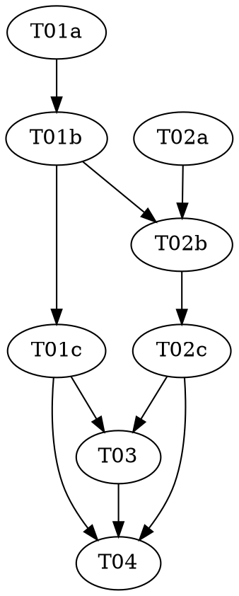

# Reasonable 3.0 — Part 6c of the P6 sub-series: The Ceremony Dial

> **For agentic workers:** REQUIRED: Use vf-superpowers:subagent-driven-development (fresh Sonnet
> subagent per task, Opus supervising) or vf-superpowers:executing-plans. Steps use checkbox
> (`- [ ]`) syntax. This plan contains **two** `role: red|green|audit` triads — each role MUST run as a
> fresh, isolated subagent.

> **Design status — read before starting.** This plan implements **P6c**, landed after P6a → P6d →
> P6b in the P6 topology stage (order: P6a → P6d → { P6b, **P6c** } → P6e), of `docs/DESIGN-3.0.md`
> (still a draft; the ceremony amendment is draft-five, "NOT YET ATTACKED"). Per the parent roadmap
> (`../2026-07-08-reasonable-3.0-roadmap.md`) and the P6 whole-stage design doc
> (`../../specs/2026-07-10-reasonable-3.0-p6-topology-design.md`, **Decisions 4 & 5**): P6c is **purely
> additive** — one brand-new file, `lib/ceremony.mjs`, changing no existing behavior — the same additive
> shape as Parts 1/3/4, P5, P6a, P6b, and P6d. It does **not** retire `route.mjs`, touch
> `reconcile.mjs`/`next-action.mjs`, edit `rewrite.mjs`, register a ledger event type, or wire a live
> consumer (Call #1: P6 is additive; the route retirement + projection rebuild + role dispatch are P7's
> migration). **Nothing calls `classify` or a phase predicate on a live effort until P7** — P6c builds
> the pure calculus; **who dispatches or skips a role on a predicate's result is P7's frontier loop.**

**Goal:** Add `lib/ceremony.mjs` — the **ceremony dial** (DESIGN-3.0 §5.4) — as two independent pure
groups: (A) the **complexity classifier** `classify(inputs, dials)`, a monotone map from five
t0-observable risk inputs to a band drawn from the *same* ordered `dials.bandScale` array
`lib/rewrite.mjs`'s `ceremonyEscalation` ratchets through; and (B) the **phase-degeneration predicate**
`scaffoldMaterializes(genesis, lastRatified, skeletonComponents)` plus its two siblings
`rechartingDegenerates` / `retroClassificationDegenerates` — **the roadmap's mandated mechanical pin**,
each returning a `materialize` or a `degenerate` record, never a silent skip.

**Architecture:** One new pure file, zero imports (it emits its own plain objects, like `effects.mjs`/
`rewrite.mjs`). The classifier reads `dials.bandScale` + a P6c-coined `dials.classifier` cutoff dial and
emits a band; its consumers (P7) read `dials.phaseCutoffs`/`dials.cadenceIndex`. The phase predicates are
pure set-operations over `{ goals, atoms }` genesis/last-ratified snapshots (`readGoals`-shaped goals,
charter-shaped atoms). The file is built by two triads sharing no helper, so it grows via one
append-marker (the `rewrite.mjs` discipline): T01 creates it with `classify` + the marker; T02 appends
the phase predicates below.

**Tech Stack:** Node.js ESM (`.mjs`), builtins only (`node:assert` in tests). No package.json, no
dependencies — a hard invariant of this repo (`CLAUDE.md`).

**Design doc:** `docs/superpowers/specs/2026-07-10-reasonable-3.0-p6-topology-design.md` (Decision 4
pins the classifier mechanism + input shape + band vocabulary; Decision 5 pins the phase-degeneration
predicate — *the mandated open edge*; Cross-cutting Decision 1 pins `ceremony.mjs` as its own file,
distinct from `legibility.mjs` and `rewrite.mjs`; Call #1 pins additive scoping). `docs/DESIGN-3.0.md`
§3, §5.4, §9, §17. Decisions 4/5 pin P6c's shape concretely, so this went straight to `plan.md` (P6a/
P6b/P6d precedent), with the genuinely unresolved shape flagged inline below — grounded against the
*shipped* `rewrite.mjs` (`ceremonyEscalation`'s `bands`/`bandScale` contract), `policy.mjs` (the landed
`dials` shape), `graph.mjs`/`goals.mjs`/`atom.mjs` (the genesis snapshot shapes), and `baseline.mjs` (the
trusted-set shape), not the design's prose.

**Planned by:** claude-opus-4-8. **Implemented by:** Sonnet subagents (one per role), Opus supervising.

**Versioning — no bump (roadmap decision, 2026-07-09).** P5–P8 land on one shared refactoring line at
`3.2.0`; the version bumps once, at the end of the generation. This plan carries **no
`version-bump-final-check` task** and touches neither `plugin.json` nor the README. T04 moves the roadmap
P6c status cell to `Landed — merged (no bump, 3.2.0)` and runs the suite.

---

## Flagged calls (contestable — surfaced, not silently resolved)

This session is non-interactive; per the whole-stage design doc's discipline, genuinely contestable
calls are flagged here rather than blocking. None changes P6c's scope; each is cheap to revise because
`lib/ceremony.mjs` is a pure calculus with no on-disk artifact and no live consumer yet.

1. **The classifier's threshold structure + combiner are P6c-coined.** Decision 4 pins the *mechanism,
   input shape, and band vocabulary*, and flags the numeric thresholds as uncalibrated `policy.json`
   defaults (§16, draft-five open edge (a)). It names the thresholds by **role**, not by key — so P6c
   coins them, the same "pin the role, coin the key" pattern P6d used for `bandScale`/`phaseCutoffs`/
   `cadenceIndex` and P6b used for `maxCoupling`/`maxFanIn`, one level down inside `dials`. The pinned
   mechanism: each of the four risk-up axes yields a **band pressure** (ascending-cutoff count for the
   three numeric/ordinal axes; a flat `autonomousPressure` for the run mode), combined by **`max`**, then
   a **`trustedRelief`** is subtracted for a trusted-covered locus, clamped into `bandScale`. The coined
   dial is `dials.classifier = { blastRadiusCutoffs, horizonCutoffs, criticalityCutoffs,
   autonomousPressure, trustedRelief }`, riding `readPolicy`'s **open** dials grammar (it validates only
   `bandScale`/`phaseCutoffs`/`cadenceIndex` and returns the object verbatim, so `dials.classifier`
   survives un-validated — **no edit to `lib/policy.mjs`**). A reviewer could rename any key, pick a
   different **monotone** combiner (a weighted sum), or map `criticality`/`horizon` as direct indices
   rather than through cutoffs; each is local, because the pinned *properties* (monotone; output ∈
   `bandScale`; round-trips through `ceremonyEscalation`) are combiner-agnostic. This is the one
   load-bearing classifier boundary and it is pinned by the round-trip red test (below).

2. **`classify` reads only `dials.bandScale` + `dials.classifier` — never `phaseCutoffs`/`cadenceIndex`.**
   Decision 4 is explicit: "`classify` emits the band, its consumers read the maps." So the band → phase-
   materialization cutoff and band → gate-cadence index (`dials.phaseCutoffs`/`dials.cadenceIndex`, P6d)
   are read by **P7**, never by `classify`. The audit checks this directly (deleting both maps must not
   change the classification). Keeping `classify` from reading them is what stops the classifier and its
   consumers collapsing into one over-coupled function.

3. **The minimal-driver clause is made mechanical, not left prose.** Decision 4 names `horizon` "under a
   minimal driver — the clause that stops the protocol qualifying itself by inflating its own footprint."
   P6c grounds this concretely: `horizon` enters `classify` as a **bare ordinal** — there is no
   `{footprint, steps}` pair the function could divide, so there is no lever by which a larger declared
   footprint yields a *lower* band — and the `max` combiner is monotone-up in `horizon`, so inflating it
   only ever *raises* ceremony. **Monotonicity is the anti-gaming guarantee**, and it is pinned by the red
   suite's per-axis monotonicity checks + a dedicated minimal-driver check, not asserted in a comment.

4. **On a malformed dial, `classify` fails to the *lowest* band (and to `null` with no scale).** An
   absent `dials.classifier` → every axis pressure `0` → the lowest band; an absent/empty `dials.bandScale`
   → `null` (never a guessed band — mirrors `ceremonyEscalation`). This is the shape-not-value discipline
   (`policy.mjs`/`legibility.mjs`): a missing threshold disables its lift. Because the classifier is
   downstream of a **human-ratified, shape-validated** `policy.json` (`readPolicy` guarantees a non-empty
   `bandScale`, and the calibrated `dials.classifier` ships with it), the degenerate low-ceremony default
   only surfaces on a genuinely malformed dial — a caller error, not a live path. A reviewer worried about
   fail-open-to-low-rigor could prefer fail-to-top-band; not taken, because a well-formed policy is a
   ratification precondition and the shape-not-value discipline is the repo norm. Flagged.

5. **The phase-predicate input shape (`genesis`/`lastRatified` = `{ goals, atoms }`) is P6c-pinned; the
   "outer shell" is drawn at component fidelity.** Decision 5 names the predicate `scaffoldMaterializes(
   genesis, lastRatified, skeletonComponents)` by role — there is no live producer until P7 dispatches
   the topologist at genesis. P6c pins each snapshot as `{ goals: [readGoals-shaped], atoms:
   [charter-shaped] }` (grounded against `readGoals`'s `{ id, scenario, scenarioCitations, … }` and the
   `atom.mjs` fold's `{ id: 'a-<seq>', component, … }`). The one judgment residue — **which Decision 5
   itself flags** — is "the outer shell": a genesis charter has no `deltaClauses`, so `servesEdges` is
   vacuous at genesis (confirmed by reading `graph.mjs` — `servesEdges` reads `providerMap` over
   `deltaClauses[].clauseId`). So "depth-0 provider of a goal scenario" is drawn at **component quotient**
   — a newly-chartered atom whose `component` is named by a goal's `scenarioCitations` — the same planned-
   fidelity proxy P6a used for `needs`. This **over-approximates** (an atom in a scenario-cited component
   that will not actually provide the cited clause still counts as shell): the **conservative** direction,
   which **never under-fires on a genuinely new goal cone** and never lets a new top-level component
   through as "interior." The scenario-citation component is read by a **local `#` split** on
   `citation.clause` (or a present `citation.component`), *not* by importing `parseClauseId` (which drags
   `ledger.mjs`/`effort.mjs` I/O into a pure file — the import `goals.mjs`/`legibility.mjs` both refused).
   A reviewer with clause-level genesis data could tighten to `servesEdges`; local, and the same shape as
   P5's flagged "two contracts / a seam" rung.

6. **The `degenerate` record is forward-appendable, but P6c neither appends nor registers it.** Decision 5
   says a degeneration is "recorded as a `phase-degenerated` event carrying the predicate's evaluated
   inputs." P6c shapes the record as a forward-appendable **ledger event** — `{ type: 'phase-degenerated',
   phase, reason, inputs }` (the `lib/ledger.mjs` `{ type, … }` convention) — but **computes it only**: it
   does **not** call `append()`, and it does **not** register a `phase-degenerated` type in
   `EVENT_SCHEMAS` (that would edit `ledger.mjs`, breaking additive scoping). The live `append()` call
   site *and* the schema registration are **P7's** — the exact seam P5 used (`ceremonyEscalation` *returns*
   a `{nodeId, change}` effect P7 later applies). A reviewer could instead return a bare `{ degenerate:
   true }` the P7 caller translates; local, since nothing appends it yet. **`lib/ledger.mjs` stays
   untouched.**

7. **Two triads on one file — a deliberate structural call (contrast P6b's one triad).** P6b argued *one*
   triad because its two pieces (the tangle metric and the density-reduction guard) **shared** a
   cross-group edge-counting helper — splitting would have fragmented a shared function across a triad
   boundary. **P6c is the opposite:** the complexity classifier (risk-sizing over t0 inputs + `bandScale`)
   and the phase-degeneration predicates (set-operations over genesis snapshots + a degeneracy-record
   builder) **share no helper** — they are two genuinely independent concerns that merely live in one file
   (Cross-cutting Decision 1). So splitting fragments nothing, and it buys two things the mandate wants:
   (a) **Decision 5 is the roadmap's explicitly mandated mechanical pin** — it earns its *own* dedicated
   adversarial red (the "conservative, never-under-fires" property tests) and its *own* load-bearing audit
   (T02c), undiluted by the classifier's separate concerns; (b) the two are **distinct testing
   disciplines** — numeric monotonicity + `bandScale` round-trip vs. set-membership degeneration detection
   at the outer-shell edge. Because both halves live in one file, the two green tasks **serialize** via a
   single append-marker (the `rewrite.mjs` discipline: T02b appends below the marker T01b leaves, editing
   nothing above it) — no parallel-write conflict.

## Pre-flight (supervisor, before Wave 1)

Check `git status` before dispatching anything. The branch is `reasonable-3.0-p6-topology-plan`. If the
working tree carries unrelated in-flight changes, resolve those with the user first — every task stages
**only its own listed files**; `git add -A` is forbidden (`shared/conventions.md`).

## Dependency Graph

| Task | Role | Depends On | Files Created/Modified |
|------|------|-----------|------------------------|
| T01a | red | — | `test/ceremony-classify.test.mjs` (authored here) |
| T01b | green | T01a | `lib/ceremony.mjs` (create; `classify` + append marker; test READ-ONLY) |
| T01c | audit | T01b | — (audit only) |
| T02a | red | — | `test/ceremony-phase.test.mjs` (authored here) |
| T02b | green | T01b, T02a | `lib/ceremony.mjs` (append phase section below marker; classifier half + tests READ-ONLY) |
| T02c | audit | T02b | — (audit only) |
| T03 | — | T01c, T02c | `docs/artifacts.md`, `docs/glossary.md` |
| T04 | — | T01c, T02c, T03 | roadmap P6c status cell; full-suite check (NO version bump) |

**Wave Schedule:**
- Wave 1: T01a, T02a (both red — classifier + phase tests; **disjoint test files, parallel**)
- Wave 2: T01b (green — `classify` creates `lib/ceremony.mjs` + the append marker)
- Wave 3: T01c (audit — read-only, the classifier pass)
- Wave 4: T02b (green — the phase predicates, **appended below the marker**; depends on T01b for the file
  + T02a for its locked tests)
- Wave 5: T02c (audit — read-only, **the load-bearing mandated-pin pass**)
- Wave 6: T03 (docs — artifacts + glossary; file-disjoint from code, lands after both audits are clean
  per `shared/conventions.md`'s "companion doc updates are a ratification precondition")
- Wave 7: T04 (roadmap status cell + full suite — **no version bump**)

**File conflict rule holds:** the only shared file is `lib/ceremony.mjs`, written by T01b then T02b —
which carry a dependency edge (T02b → T01b), so they are **not** independent, and the append-marker keeps
their sections disjoint (T02b edits nothing above the marker). The two test files are disjoint; T03 is the
only task that edits the docs; T04 the only one that touches the roadmap. **No pre-existing `lib/*.mjs` is
modified** — `rewrite.mjs`/`effects.mjs` (imported in the classify test only), `policy.mjs`/`goals.mjs`/
`graph.mjs`/`baseline.mjs`/`ledger.mjs` are read-from-when-grounding, never edited (Call #1).

## Task Index

| ID | Name | File | Description |
|----|------|------|-------------|
| T01a | Classifier tests (red) | `tasks/T01a-classify-red.md` | Failing tests: output ∈ `bandScale`, `null` on no scale, max-not-sum combiner, autonomous pressure, trusted relief + clamp, **per-axis monotonicity**, the **minimal-driver** clause, shape-not-value, and the **`ceremonyEscalation` round-trip** (non-top ratchets one step; top is capped) |
| T01b | Classifier impl (green) | `tasks/T01b-classify-green.md` | Create `lib/ceremony.mjs` — `classify` (max-of-cutoff-pressure − trusted relief, clamped) + the append marker, against the locked tests |
| T01c | Classifier audit | `tasks/T01c-classify-audit.md` | Adversarial audit: per-mutation discriminator, monotonicity fuzz, minimal-driver, the round-trip boundary, reads-only-bandScale+classifier, shape-not-value, bidirectional §5.4 mapping, purity/Law 1, additivity |
| T02a | Phase-predicate tests (red) | `tasks/T02a-phase-red.md` | **The mandated pin.** Failing tests: a genuinely new goal cone MUST materialize; an amendment-only change MUST degenerate; both outer-shell edges materialize; interior atom degenerates; the degeneracy record shape; the two sibling predicates' thresholds |
| T02b | Phase-predicate impl (green) | `tasks/T02b-phase-green.md` | Append `scaffoldMaterializes` + `rechartingDegenerates` + `retroClassificationDegenerates` below the marker, against the locked tests |
| T02c | Phase-predicate audit | `tasks/T02c-phase-audit.md` | **The load-bearing audit.** Per-predicate discriminator, the conservative-never-under-fires attack, both outer-shell edges, the never-a-silent-skip record, **no live ledger writer / `ledger.mjs` untouched**, sibling thresholds, bidirectional §5.4 mapping, purity/Law 1, additivity |
| T03 | Docs | `tasks/T03-docs.md` | `docs/artifacts.md` (the `dials.classifier` coined-key note; close the Part-5 complexity-band scope note); `docs/glossary.md` (Complexity band / Complexity classifier / Phase degeneration; close the Ceremony-escalation-effect forward-ref) |
| T04 | Final check (no bump) | `tasks/T04-final-check.md` | Full-suite run (zero regressions across P1–P6b/P6d, 70+ files); move roadmap P6c cell to `Landed — merged (no bump, 3.2.0)` — no version bump |

## The mandated-pin discipline (why T02a/T02c are unusually adversarial)

Decision 5 is the part DESIGN-3.0 / the roadmap **explicitly require to be mechanically pinned, not
prose** — the one place a struggling autonomous run could talk itself out of a scaffold. So the phase
predicate's red tests (T02a) do not merely cover cases; they pin the **conservative, never-under-fires
property directly**:

- a **genuinely new goal cone** with everything else held constant (no new atoms) **MUST materialize**;
- an **amendment-only change** with no new atoms/goals **MUST degenerate** (and record its evaluated
  inputs — never a silent skip);
- **both boundary cases at the outer-shell edge** — a newly-chartered atom in a not-yet-skeletonized
  component, and one that is a depth-0 provider of a goal scenario in an *already*-skeletonized component
  — **MUST materialize**; only a skeletonized, non-scenario-cited interior atom degenerates.

T02c then attacks that property with real teeth (a forced-degenerate stub must break the materialize
checks; a hand-built new-goal-cone must never degenerate; `ledger.mjs` must be untouched). If T02c
confirms a genuine gap, it becomes a fresh red→green follow-up commit pair (the P6a/P6b/P6d pattern — an
audit finding hardens the suite, it is not a blocking redo).

## Execution Handoff

**Plan complete and saved to
`docs/superpowers/plans/2026-07-10-reasonable-3.0-p6c-ceremony/plan.md`.**

Execution model (human-set): Sonnet subagents implement, one fresh subagent per role task; Opus
supervises and reviews between waves (vf-superpowers:subagent-driven-development). P6c is two triads over
one file, serialized by the append-marker, so the waves dispatch one subagent each after Wave 1's two
parallel reds. Any confirmed audit gap becomes a fresh follow-up `red` task/commit (not a blocking redo).
After P6c lands (tests green, merged), the **P6e** (topologist + `topology.html`) plan is written next —
the final P6 sub-part, one at a time, per the parent roadmap.
