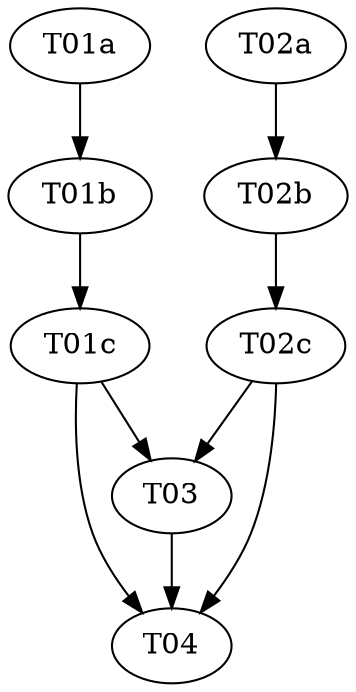

# Reasonable 3.0 — Part 6d of the P6 sub-series: `goals.json` + `policy.json` loaders

> **For agentic workers:** REQUIRED: Use vf-superpowers:subagent-driven-development (fresh Sonnet
> subagent per task, Opus supervising) or vf-superpowers:executing-plans. Steps use checkbox
> (`- [ ]`) syntax. This plan contains **two** `role: red|green|audit` triads (one per file) — each
> role MUST run as a fresh, isolated subagent.

> **Design status — read before starting.** This plan implements **P6d**, the third sub-part landed of
> the P6 topology stage (order: P6a → **P6d** → { P6b, P6c } → P6e), of `docs/DESIGN-3.0.md` (still a
> draft; the ceremony amendment is draft-five, "NOT YET ATTACKED"). Per the parent roadmap
> (`../2026-07-08-reasonable-3.0-roadmap.md`) and the P6 whole-stage design doc
> (`../../specs/2026-07-10-reasonable-3.0-p6-topology-design.md`, **Decision 6**): P6d is **purely
> additive** — two brand-new files, `lib/goals.mjs` and `lib/policy.mjs`, changing no existing behavior
> — the same additive shape as Parts 1/3/4, P5, and P6a. It does **not** retire `route.mjs`, touch
> `reconcile.mjs`/`next-action.mjs`, or build any writer (Call #1: P6 is additive; the route
> retirement + projection rebuild + the write path are P7's migration). **Nothing reads `goals.json`
> or `policy.json` until P7** — so there is no dual-format compatibility and no live consumer to wire.

**Goal:** Add two conservative JSON loaders — `readGoals` (`lib/goals.mjs`) and `readPolicy`
(`lib/policy.mjs`) — for two new machine-parsed artifacts (`goals.json`, `policy.json`) that live
*beside* `route.json`, each modeled EXACTLY on `lib/route.mjs`'s three-state contract (absent →
null-no-diagnostic; present-but-malformed → null + surfaced diagnostic, never a repair; valid →
validated). Read-and-validate only; **no writer** (that is P7's).

**Architecture:** Two new, independent `lib/*.mjs` files (one artifact per file — the design's
one-responsibility-per-loader call, mirroring how `route.mjs` loads one artifact). Each imports only
`node:fs` + `node:path` — as lean as `route.mjs`, deliberately **not** importing `parseClauseId` (which
would drag `ledger.mjs`/`effort.mjs` I/O into a loader). `goals.json` is an **array** of goal entries
(closed per-entry grammar → projected to five keys); `policy.json` is an **object** with an **open**
field set (`{ weights, legibility, cadence, dials, … }` → returned verbatim on success). Both are on
the vision-class enforcement-paths list; P6d builds the loaders, P7 builds the write path.

**Tech Stack:** Node.js ESM (`.mjs`), builtins only (`node:fs`, `node:path`, `node:assert`/`node:os`
in tests). No package.json, no dependencies — a hard invariant of this repo (`CLAUDE.md`).

**Design doc:** `docs/superpowers/specs/2026-07-10-reasonable-3.0-p6-topology-design.md` (Decision 6
pins the additive grammar + conservative loaders; Cross-cutting Decision 1 pins the two-files layout;
Call #1 pins additive scoping). `docs/DESIGN-3.0.md` §3 (goals/policy as the ratified planning
artifacts), §9 (band-indexed cadence), §16 (numeric defaults ship uncalibrated). Decision 6 pinned
P6d's shape concretely, so this went straight to `plan.md` (P6a's precedent) with the genuinely
unresolved shape flagged inline below rather than in a separate mini design brief.

**Planned by:** claude-opus-4-8. **Implemented by:** Sonnet subagents (one per role), Opus supervising.

**Versioning — no bump (roadmap decision, 2026-07-09).** P5–P8 land on one shared refactoring line at
`3.2.0`; the version bumps once, at the end of the generation. This plan carries **no
`version-bump-final-check` task** and touches neither `plugin.json` nor the README. T04 moves the
roadmap P6d status cell to `Landed — merged (no bump, 3.2.0)` and runs the suite.

---

## Flagged calls (contestable — surfaced, not silently resolved)

This session is non-interactive; per the whole-stage design doc's discipline, genuinely contestable
calls are flagged here rather than blocking. None changed P6d's scope; each is cheap to revise because
the loaders gate **shape, never value**.

1. **`scenarioCitations` are objects, not bare strings — a grounding correction.** Design Decision 6
   calls them "per-clause references (`component#cN`)," which reads as bare strings. But the shipped
   `lib/graph.mjs`'s `servesEdges` consumes them as **objects** via `providerOf.get(c.clause)`, and its
   own tests use `{ component, clause }`. So `readGoals` validates each citation has a non-empty string
   `clause` and **preserves the object verbatim**, so loaded goals feed `servesEdges` with no
   translation. A red test pins this composition directly. (Confirmed against `test/graph-edges.test.mjs`.)

2. **`policy.json` is returned verbatim (pass-through), not projected — a deliberate divergence from
   `route.mjs`.** `route.mjs` projects to a fixed `{ slices, ratifiedAt, ledgerSeq }` because
   `route.json`'s grammar is **closed**. `policy.json`'s grammar is **open** (`{ …, }`), so projecting
   would silently drop human-meant fields; `readPolicy` validates the four required sub-shapes and
   returns the parsed object unmodified. `readGoals` keeps `route.mjs`'s projection discipline, because
   `goals.json`'s per-entry grammar **is** closed.

3. **Three P6d-coined `policy.json` keys.** Decision 6 pinned `policy.json`'s fields by **role**, not by
   JSON key. P6d coins concrete keys: `legibility.r8Retries` (the "R8 retry bound N"), `cadence.<band> =
   { n, m }` (the N/M pair as an object, not a `[n,m]` tuple), and `dials.{ bandScale, phaseCutoffs,
   cadenceIndex }`. `dials.bandScale` is the load-bearing one — it must be the ordered string array
   `lib/rewrite.mjs`'s `ceremonyEscalation` does `indexOf` into. A reviewer may rename any; one-line change.

4. **`weights` gated as "object of finite numbers," not "the six named axes."** Validating shape (not
   the specific axis key set) keeps the loader tolerant if the priority-axis set evolves. A stricter
   variant pinning the six axis names is defensible; not taken (shape-not-value).

5. **Loaders do not import `parseClauseId`.** It is pure but `clause-id.mjs` imports
   `ledger.mjs`/`effort.mjs`; importing it would pull I/O into a loader `route.mjs` keeps to
   `node:fs`/`node:path`. A `clause` is validated as a non-empty string; clause-id well-formedness is
   the write path's (P7) and `servesEdges`' `Map.get` misses a bad ref harmlessly.

6. **Glossary scope kept tight (P6a's precedent).** T03 adds **goals.json**, **policy.json**,
   **ceremony-sizing dial** only. **cone**, **stratum**, **complexity band**, **legibility law** land
   with P6b/P6c — the sub-parts that measure/consume them — so P6d does not bold-cross-ref undefined terms.

## Pre-flight (supervisor, before Wave 1)

Check `git status` before dispatching anything. The branch is `reasonable-3.0-p6-topology-plan`. If the
working tree carries unrelated in-flight changes, resolve those with the user first — every task stages
**only its own listed files**; `git add -A` is forbidden (`shared/conventions.md`).

## Dependency Graph

| Task | Role | Depends On | Files Created/Modified |
|------|------|-----------|------------------------|
| T01a | red | — | `test/goals-loader.test.mjs` (authored here) |
| T01b | green | T01a | `lib/goals.mjs` (new; test file READ-ONLY) |
| T01c | audit | T01b | — (audit only) |
| T02a | red | — | `test/policy-loader.test.mjs` (authored here) |
| T02b | green | T02a | `lib/policy.mjs` (new; test file READ-ONLY) |
| T02c | audit | T02b | — (audit only) |
| T03 | — | T01c, T02c | `docs/artifacts.md`, `docs/glossary.md` |
| T04 | — | T01c, T02c, T03 | roadmap P6d status cell; full-suite check (NO version bump) |

**Wave Schedule:**
- Wave 1: T01a, T02a (both red — the goals + policy loader tests; **disjoint files, parallel**)
- Wave 2: T01b, T02b (both green — `lib/goals.mjs`, `lib/policy.mjs`; **disjoint files, parallel**)
- Wave 3: T01c, T02c (both audit — read-only; **parallel**)
- Wave 4: T03 (docs — artifacts + glossary; file-disjoint from code, lands after both audits are clean
  per `shared/conventions.md`'s "companion doc updates are a ratification precondition")
- Wave 5: T04 (roadmap status cell + full suite — **no version bump**)

**File conflict rule holds:** no two tasks without a dependency edge touch the same file. The two triads
are **fully independent** — `goals.mjs`/`goals-loader.test.mjs` and `policy.mjs`/`policy-loader.test.mjs`
share nothing, so no file is written by more than one task (unlike P5's shared `rewrite.mjs`, no
append-marker discipline is needed here). T03 is the only task that edits the docs; T04 the only one
that touches the roadmap. **No pre-existing `lib/*.mjs` is modified** — `route.mjs`, `reconcile.mjs`,
`next-action.mjs`, `graph.mjs`, `rewrite.mjs` are imported-from (in tests) or untouched (Call #1).

## Task Index

| ID | Name | File | Description |
|----|------|------|-------------|
| T01a | goals loader tests (red) | `tasks/T01a-goals-loader-red.md` | Failing tests for `readGoals`: absent/malformed/valid, all-or-nothing, degrade-to-null, citations-verbatim, order preserved, empty-array-valid, + a `servesEdges` composition check |
| T01b | goals loader impl (green) | `tasks/T01b-goals-loader-green.md` | Create `lib/goals.mjs` (`readGoals`) against the locked tests |
| T01c | goals loader audit | `tasks/T01c-goals-loader-audit.md` | Adversarial audit (discriminator vs. a null-stub, bidirectional contract mapping, `ledgerSeq: 0` trap, purity/Law 1, additivity) |
| T02a | policy loader tests (red) | `tasks/T02a-policy-loader-red.md` | Failing tests for `readPolicy`: absent/malformed/valid, the four sub-shape gates, shape-not-value, open-grammar verbatim pass-through, `dials.bandScale` as the rewrite.mjs-consumed array |
| T02b | policy loader impl (green) | `tasks/T02b-policy-loader-green.md` | Create `lib/policy.mjs` (`readPolicy`) against the locked tests |
| T02c | policy loader audit | `tasks/T02c-policy-loader-audit.md` | Adversarial audit (discriminator, bidirectional mapping, check-order, `dials.bandScale`↔`ceremonyEscalation` composition, purity/Law 1, additivity) |
| T03 | Docs | `tasks/T03-docs.md` | Register `goals.json *` + `policy.json *` in `docs/artifacts.md` (index tree + two full sections + `route.json` superseded note); add 3 `docs/glossary.md` terms |
| T04 | Final check (no bump) | `tasks/T04-final-check.md` | Full-suite run; move the roadmap P6d status cell to `Landed — merged (no bump, 3.2.0)` — no version bump |

## Execution Handoff

**Plan complete and saved to
`docs/superpowers/plans/2026-07-10-reasonable-3.0-p6d-goals-policy/plan.md`.**

Execution model (human-set): Sonnet subagents implement, one fresh subagent per role task; Opus
supervises and reviews between waves (vf-superpowers:subagent-driven-development). The two triads are
independent, so Waves 1–3 each dispatch two subagents in parallel. After P6d lands (tests green,
merged), the **P6b** (legibility law) and **P6c** (ceremony dial) plans are written next — both were
blocked on P6d's `policy.json` grammar, now unblocked — one sub-part at a time, per the parent roadmap.
