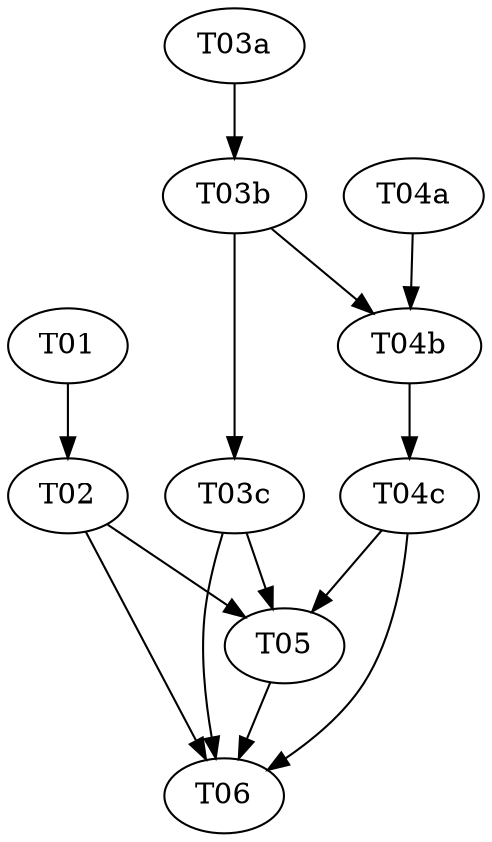

# Reasonable 3.0 — Part 6e of the P6 sub-series: The Topologist + `topology.html`

> **For agentic workers:** REQUIRED: Use vf-superpowers:subagent-driven-development (fresh Sonnet
> subagent per task, Opus supervising) or vf-superpowers:executing-plans. Steps use checkbox
> (`- [ ]`) syntax. This plan has **two kinds of deliverable**: a **role constitution** (markdown —
> one author task + one read-only audit task, the verification-trio shape applied to a document) and a
> **pure `lib/` HTML generator** (**two** normal `role: red|green|audit` triads over one file). Each
> role MUST run as a fresh, isolated subagent — that is what turns task-separation into agent-separation.

> **Design status — read before starting.** This plan implements **P6e**, the **final** P6 sub-part
> (order: P6a → P6d → { P6b, P6c } → **P6e**) of `docs/DESIGN-3.0.md` (still a draft; the topology stage
> is §3/§5/§5.1–§5.4/§9/§17). Per the parent roadmap
> (`../2026-07-08-reasonable-3.0-roadmap.md`) and the P6 whole-stage design doc
> (`../../specs/2026-07-10-reasonable-3.0-p6-topology-design.md`, **Decisions 7 & 8**, **Cross-cutting
> Decision 1**, **Call #1**): P6e is **purely additive** — it adds **one new agent file**
> (`agents/topologist.md`) and **one new pure `lib/` file** (`lib/topology-view.mjs`), changing no
> existing behavior — the same additive shape as P6a–P6d. It does **not** retire `route.mjs`, touch
> `reconcile.mjs`/`next-action.mjs`, edit `graph.mjs`/`legibility.mjs`/`ceremony.mjs`/`policy.mjs`/
> `goals.mjs`, register a ledger event type, wire a live consumer, or dispatch the topologist into the
> phase flow. **The stage orchestration — when the topologist runs, its ratification gate, the
> analysis→topology→scaffold sequencing, the live write path for its proposals — is P7's** (Call #1: P6
> computes/proposes, P7 wires). P6e delivers the *role* and the *pure engine it leans on*.

**Goal:** Add (A) `agents/topologist.md` — the **route-planner reborn** (DESIGN-3.0 §5.1): a thin,
mostly-read-only genesis planner that **proposes** the five §5.1 outputs and, post-genesis, supplies
rewrite payloads and re-chartering batches — with a **read-only tool allowlist** (`Read, Grep, Glob`,
mirroring `route-planner`) that makes "cannot write `goals.json`/`policy.json`" true **by capability, not
prose**; and (B) `lib/topology-view.mjs` — the pure `topology.html` generator (DESIGN-3.0 §5.3): a
self-contained layered-DAG renderer (**no CDN, no npm**; inline SVG + vanilla JS) exporting
`layoutTopology` (longest-path ranks + barycenter cross-reduction) and `renderTopologyHtml` (component /
per-goal-cone / diff views).

**Architecture:** Two deliverables of **different kinds**, so two different task shapes (justified in
*The two-deliverable structural call* below). (A) is markdown-with-normative-force whose **enforcement
mechanism is the tool allowlist** (CLAUDE.md's standing warning: "weakening an allowlist silently breaks
an adversarial separation") — it has no runtime surface and no `lib/` test, so it is verified by an
**author task + a dedicated read-only allowlist audit**, not a red/green triad (this repo has **no
agent-`.md` linter** — confirmed: no `lib/*.mjs` reads `agents/*.md`, no test parses agent frontmatter,
and the only `parseFrontmatter` in the repo is `lib/contract.mjs`'s, for *contract* files). (B) is a
normal pure calculus like P6a–P6d, but with **one genuinely-new, nontrivial algorithm** (the layered-DAG
layout) — so it is **two triads over one file** (layout, then render), serialized by an append-marker,
each triad earning its own adversarial red + audit. The layout red pins the algorithm's **properties**
against **real overlapping-edge fixtures** (rank-consistency, determinism, crossing reduction,
cycle-safety), not coordinate goldens.

**Tech Stack:** Node.js ESM (`.mjs`), builtins only (`node:assert` in tests). No package.json, no
dependencies — a hard invariant of this repo (`CLAUDE.md`, Law 1). `agents/topologist.md` is plain
markdown with a YAML frontmatter tool allowlist, exactly like every other `agents/*.md`.

**Design doc:** `docs/superpowers/specs/2026-07-10-reasonable-3.0-p6-topology-design.md` — **Decision 7**
pins the topologist role (route-planner lineage; read-only-plus-propose allowlist; on the
enforcement-paths list, cannot write `goals.json`/`policy.json`; charters = structure only, §13);
**Decision 8** pins `topology.html` (self-contained layered-DAG viewer; longest-path ranks + barycenter
ordering; three views; derived non-`*` view like `progress.html`); **Cross-cutting Decision 1** pins
`topology-view.mjs` as its own file and `topologist.md` as a role constitution (not code); **Call #1**
pins additive scoping (P6e delivers the role + viewer, P7 wires the stage). `docs/DESIGN-3.0.md` §5.1,
§5.3. Decisions 7/8 pin P6e's shape concretely, so this went straight to `plan.md` (P6a/P6b/P6c/P6d
precedent), with the genuinely unresolved shape flagged inline below — grounded against the **shipped**
`agents/route-planner.md` / `agents/blind-test-writer.md` / `agents/census.md` (the allowlist-as-
enforcement precedent), `lib/graph.mjs` (`foldAsLived`/`deriveCurrent` return `{ containment, atoms,
edges }`; `liftEdges`, `servesEdges`, `plannedNeedsEdges`), and `lib/legibility.mjs` (the finding shape),
not the design's prose.

**Planned by:** claude-opus-4-8. **Implemented by:** Sonnet subagents (one per role/task), Opus
supervising.

**Versioning — no bump (roadmap decision, 2026-07-09).** P5–P8 land on one shared refactoring line at
`3.2.0`; the version bumps once, at the end of the **whole generation** (after P7/P8) — **not** after
P6e. P6e is **P6's tail, not the generation's tail**, so it gets **no** bump. This plan carries **no
`version-bump-final-check` task** and touches neither `plugin.json` nor the README. T06 moves the roadmap
**P6e** status cell to `Landed — merged (no bump, 3.2.0)`, rolls the **top-level Part-6 row** up to
"all landed" (P6e's landing is the moment the whole P6 stage is done — a status-cell fact update, **not**
a bump), and runs the full suite.

---

## Flagged calls (contestable — surfaced, not silently resolved)

This session is non-interactive; per the whole-stage design doc's discipline, genuinely contestable
calls are flagged here rather than blocking. None changes P6e's scope; each is cheap to revise because
`agents/topologist.md` is a constitution with no `lib/` consumer yet and `lib/topology-view.mjs` is a
pure function with no on-disk artifact and no live caller until P7.

1. **The topologist's allowlist is `Read, Grep, Glob` — it PROPOSES, it never writes (the load-bearing
   call).** Decision 7 says the allowlist "mirrors `route-planner`'s read-only-plus-propose shape," and
   `route-planner`'s shipped frontmatter is exactly `tools: Read, Grep, Glob` (no Write, no Edit, **no
   Bash**). So the topologist returns its five §5.1 outputs as a **structured proposal**, and the
   orchestrator (or a narrow writer, at P7's ratification gate) persists them — `goals.json`/`policy.json`
   after human ratification (vision-class, §3), and each charter through the sanctioned ledger path (the
   controller's `atom-chartered` event). "Cannot write `goals.json`/`policy.json`" is then true **by
   capability** (it has no tool that writes a file at all), exactly as `route-planner` "cannot write
   `route.md`" by capability. **The one genuine residue:** Decision 7 says the topologist "authors
   charters through the sanctioned ledger path," which *could* be read as giving it scoped **Bash** to run
   `node lib/ledger.mjs append --type atom-chartered …` itself (the way `census` has Bash to emit via
   `lib/baseline.mjs`). **Not taken for P6e**, because (a) `route-planner` — the named template — has no
   Bash and proposes, and (b) the live *dispatch and write wiring* is explicitly P7's (Call #1: P6
   proposes, P7 wires). So P6e ships the pure read-only-plus-propose role; a reviewer who wants the
   topologist to self-append charters would add scoped Bash and lean on the fence's law-7 shell-write
   backstop — a one-line frontmatter change, local, and P7's call to make when it wires the dispatch.
   This is the one load-bearing allowlist boundary and T02 (the dedicated audit) attacks it directly.

2. **`renderTopologyHtml(graph, { view, goalId?, lastRatified?, legibility? })` — the options augment the
   design's shorthand.** Decision 8 writes the signature as `renderTopologyHtml(graph, {view,
   lastRatified?})`. Two options the shorthand omits but the three views require: **`goalId`** (the
   per-goal cone view must name *which* goal — the graph carries many `serves` cones) and **`legibility`**
   (the roadmap sub-table says the viewer "renders the graph + legibility findings", so an optional
   findings array — `legibilityFindings(graph, policy)`-shaped — annotates matching nodes; absent ⇒ no
   annotation, never an import of `legibility.mjs`). A reviewer could instead render **all** cones in the
   cone view (dropping `goalId`) or defer findings-annotation to P7; both are local, because the option
   set is additive and defaulted. Flagged.

3. **`layoutTopology({ nodes, edges }, opts?)` is exported as a named function and tested directly.**
   Decision 8 names the *mechanism* ("longest-path ranks, barycenter cross-reduction ordering") but only
   `renderTopologyHtml` as the public entry. P6e exports `layoutTopology` too — the same "pin the role,
   coin the key" move P6b made exporting `regroupingReducesTangle` and P6c made exporting
   `scaffoldMaterializes`/`classify` — so the genuinely-new algorithm's **properties** can be pinned on a
   clean data structure (real overlapping-edge fixtures), never by regexing SVG coordinates out of the
   rendered string (the over-fitted-golden trap). A reviewer could keep layout private and test it through
   the render surface; not taken, because the algorithm is the one nontrivial piece and it earns an
   undiluted adversarial red. Flagged.

4. **The layout pins *properties*, not coordinates; the exact barycenter parameters are open.** The
   longest-path rank is exact (integer rank, edge-consistent) and pinned by equality. The **barycenter
   cross-reduction** is a heuristic — P6e pins its *properties* (deterministic; never drops/duplicates a
   node; on a designed fixture with a resolvable crossing it produces **no more** crossings than the
   initial order, and **strictly fewer** on the crossing-fixture), never a golden order or coordinate. The
   sweep count (down-then-up × N), the median-vs-mean tie-break, the `x`/`y` gaps, and the edge-direction
   convention (rank increases along `from → to`) are **implementation-local and cosmetic** — a reviewer
   may retune any of them without touching the pinned properties. Flagged.

5. **Cycle-safety is defensive, not a validator.** The dependency graph *should* be a DAG (the legibility
   law + R6 catch cycles), but `layoutTopology` must never infinite-loop on a stray back-edge. It breaks
   cycles the same defensive way `lib/legibility.mjs`'s `chainFindings` does — ignore a back-edge into an
   on-stack node — rather than throwing. A reviewer who wants a hard cycle *verdict* would route that
   through R6 (the rewrite calculus), not the renderer; the viewer degrades gracefully, it does not judge.
   Flagged.

6. **The constitution is verified by audit, not by a new agent-`.md` linter (justified, not a shortcut).**
   There is **no** convention in this repo for mechanically testing an agent file's frontmatter/allowlist:
   agent constitutions are *markdown-with-normative-force read by the harness*, and their allowlist is
   enforced by the **harness** (`agent_type` × `tools:`), never by any `lib/*.mjs` (confirmed by search —
   nothing reads `agents/*.md`; the only frontmatter parser is `lib/contract.mjs`, for contracts).
   Inventing a bespoke YAML linter for a single deliverable would be out-of-pattern machinery the repo
   deliberately does not have (and would violate "add abstraction only when a runtime selector needs it").
   So the constitution is verified exactly the way the repo already treats every other `agents/*.md`: an
   **author task (worker) + a dedicated read-only audit (adversary)** against the reference (Decision 7 +
   the `route-planner` template + CLAUDE.md's allowlist warning) — the verification-trio shape at the
   document level. This is the constitution half's analogue of P6c's "mandated-pin discipline": the
   load-bearing concern (there, the phase predicate; here, the allowlist) earns its own adversarial pass.

## The two-deliverable structural call (why the task shapes differ — contrast P6c)

P6c justified its **two-triad** split by a rule: split when the two pieces **share no helper** (two
independent concerns merely co-located), keep one triad when they **share a helper** (splitting would
fragment a shared function across a triad boundary, P6b's case). P6e sits above that rule because its two
deliverables are of **different kinds**, and each half then makes its own structural call:

- **Half A — `agents/topologist.md` (a role constitution).** Not code. It has **no red/green** in the
  usual sense — there is no runtime surface to fail-then-pass and (Flag 6) no agent-`.md` linter to run.
  But it is **not** unverified: its load-bearing part is the **tool allowlist**, and getting that wrong
  silently breaks an adversarial separation (CLAUDE.md). So it is one **author** task (T01) + one
  dedicated **read-only audit** (T02) — the same worker→adversary shape as a triad, minus the mechanical
  red, with the audit's teeth aimed squarely at the allowlist. Two tasks, two fresh subagents.

- **Half B — `lib/topology-view.mjs` (a pure calculus with a genuinely-new algorithm).** Two triads over
  one file, **exactly P6c's shape and for P6c's reason**: the **layout engine** (longest-path ranks +
  barycenter ordering over a normalized `{nodes, edges}`) and the **renderer** (view projection + SVG
  string assembly + diff computation) **share no sub-helper** — the renderer *composes* the layout as a
  whole (it calls `layoutTopology` once and consumes its output), it does not share an inner function with
  it. So splitting fragments nothing, and it buys the two things the mandate wants: (a) the **layout
  algorithm is the one genuinely-new, nontrivial piece** — it earns its *own* dedicated adversarial red
  (property tests over real overlapping-edge fixtures) and its *own* audit, undiluted by the renderer's
  separate string-assembly concerns; (b) the two are **distinct testing disciplines** — graph-algorithm
  properties (rank-consistency, crossing reduction, determinism) vs. HTML **self-containment** (the
  §5.3/Law 1 "no CDN, no npm" invariant, pinned by grepping the output string), view routing, and diff
  color-coding. Because both halves live in one file, the two green tasks **serialize** via a single
  append-marker (the `rewrite.mjs`/`ceremony.mjs` discipline: T04b appends `renderTopologyHtml` below the
  marker T03b leaves, editing nothing above it) — no parallel-write conflict, and T03c audits the quiescent
  layout section before T04b appends.

## Pre-flight (supervisor, before Wave 1)

Check `git status` before dispatching anything. The branch is `reasonable-3.0-p6-topology-plan`. If the
working tree carries unrelated in-flight changes, resolve those with the user first — every task stages
**only its own listed files**; `git add -A` / `git add .` is forbidden (`shared/conventions.md`).

## Dependency Graph

| Task | Role | Depends On | Files Created/Modified |
|------|------|-----------|------------------------|
| T01  | author | — | `agents/topologist.md` (author the constitution) |
| T02  | audit  | T01 | — (read-only allowlist/constitution audit) |
| T03a | red    | — | `test/topology-layout.test.mjs` (authored here) |
| T03b | green  | T03a | `lib/topology-view.mjs` (create; `layoutTopology` + append marker; test READ-ONLY) |
| T03c | audit  | T03b | — (audit only, the layout pass) |
| T04a | red    | — | `test/topology-view.test.mjs` (authored here) |
| T04b | green  | T04a, T03b | `lib/topology-view.mjs` (append `renderTopologyHtml` below the marker; layout half + tests READ-ONLY) |
| T04c | audit  | T04b | — (audit only, the render pass) |
| T05  | —      | T02, T03c, T04c | `docs/glossary.md`, `docs/artifacts.md` |
| T06  | —      | T02, T03c, T04c, T05 | roadmap P6e cell + top-level P6 roll-up; full-suite check (NO version bump) |

**Wave Schedule:**
- Wave 1: **T01** (author the constitution), **T03a** (layout red), **T04a** (render red) — all
  independent, disjoint files (one markdown + two test files).
- Wave 2: **T02** (constitution audit — read-only, depends T01), **T03b** (layout green — creates
  `lib/topology-view.mjs` + the append marker). File-disjoint (T02 reads `agents/`, T03b writes `lib/`) —
  parallel.
- Wave 3: **T03c** (layout audit — read-only, the layout pass over the quiescent file).
- Wave 4: **T04b** (render green — appends `renderTopologyHtml` **below the marker**; depends T03b for the
  file + T04a for its locked tests).
- Wave 5: **T04c** (render audit — read-only, the self-containment + views + diff pass).
- Wave 6: **T05** (docs — glossary + artifacts; file-disjoint from code, lands after every audit is clean
  per `shared/conventions.md`'s "companion doc updates are a ratification precondition").
- Wave 7: **T06** (roadmap status cells + full suite — **no version bump**).

**File conflict rule holds:** the only shared code file is `lib/topology-view.mjs`, written by T03b then
T04b — which carry a dependency edge (T04b → T03b), so they are **not** independent, and the append-marker
keeps their sections disjoint (T04b edits nothing above the marker; T03c audits between them). The two
test files are disjoint; `agents/topologist.md` is touched only by T01; T05 is the only task that edits
the docs; T06 the only one that touches the roadmap. **No pre-existing `lib/*.mjs` or `agents/*.md` is
modified** — `graph.mjs`/`legibility.mjs` (imported/read when grounding), `route-planner.md`/
`blind-test-writer.md`/`census.md` (read as templates) are read-from, never edited (Call #1).

## Task Index

| ID | Name | File | Description |
|----|------|------|-------------|
| T01  | Topologist constitution (author) | `tasks/T01-topologist-constitution.md` | Author `agents/topologist.md`: frontmatter `tools: Read, Grep, Glob`; the five §5.1 outputs proposed (never written); charters = structure only (§13); post-genesis payloads + re-chartering; cite-the-oracle forks; capability-enforced hard boundaries + forbidden-moves table, mirroring `route-planner` |
| T02  | Constitution audit (allowlist) | `tasks/T02-topologist-audit.md` | **The load-bearing constitution audit.** Read-only adversary: the allowlist is exactly `Read, Grep, Glob` (no Write/Edit/Bash); it PROPOSES `goals.json`/`policy.json` and cannot write them; charters carry no behavior; the five outputs are all present; no prose claims a capability the allowlist denies; the description matches the body |
| T03a | Layout tests (red) | `tasks/T03a-layout-red.md` | Failing tests over real overlapping-edge fixtures: longest-path rank-consistency, determinism, no node loss, crossing **reduction** on a designed fixture, cycle-safety, coordinate monotonicity — properties, not coordinate goldens |
| T03b | Layout impl (green) | `tasks/T03b-layout-green.md` | Create `lib/topology-view.mjs` — `layoutTopology({nodes,edges})` (longest-path ranks + barycenter ordering + grid coords) + the append marker, against the locked tests |
| T03c | Layout audit | `tasks/T03c-layout-audit.md` | Adversarial audit: per-property discriminator, the crossing-reduction attack, cycle-safety, determinism, purity/Law 1, additivity, §5.3 mapping |
| T04a | Render tests (red) | `tasks/T04a-render-red.md` | Failing tests: **self-containment** (no CDN/external ref — the load-bearing §5.3/Law 1 invariant), returns non-empty SVG string, the three views route differently, cone selects the goal's atoms, diff tags added/retired/rewired, one node element per node |
| T04b | Render impl (green) | `tasks/T04b-render-green.md` | Append `renderTopologyHtml(graph, opts)` below the marker: view projection (component/cone/diff) → `layoutTopology` → inline SVG + vanilla JS string, against the locked tests |
| T04c | Render audit | `tasks/T04c-render-audit.md` | **The self-containment audit.** Per-view discriminator, the no-external-reference attack (grep for `http`/`src=`/`<link`/`cdn`), diff correctness, cone correctness, purity/Law 1, marker intact + layout half unchanged, additivity |
| T05  | Docs | `tasks/T05-docs.md` | `docs/glossary.md` (add **Topologist**; cross-link existing terms); `docs/artifacts.md` (register `topology.html` as a derived **non-`*`** view like `progress.html`; note the topologist proposes goals/policy, never writes them) |
| T06  | Final check (no bump) | `tasks/T06-final-check.md` | Full-suite run (zero regressions across P1–P6d, 72+ files); move roadmap **P6e** cell to `Landed — merged (no bump, 3.2.0)`; roll the **top-level P6 row** up to "all landed" — **no version bump** |

## The self-containment discipline (why T04a/T04c are unusually adversarial)

§5.3 and Law 1 make `topology.html` **self-contained by construction**: "inline SVG + vanilla JS; **no
CDN, no npm**." This is the one place the render half can silently rot — a helpful `<script
src="https://d3js.org/…">` or a Google-Fonts `<link>` would render fine locally and pass a naive
shape check while breaking the invariant that a ratifier can open the file in an air-gapped terminal or a
PR review. So the render red (T04a) pins the property **directly and mechanically**: the returned string
contains **no** `http://` / `https://` / `<script src` / `<link ` / `@import` / protocol-relative
`//` URL / `cdn` reference — every byte of style, script, and geometry is inline. T04c then attacks it
with real teeth (a stubbed renderer that emits an external `<script src>` MUST break the check). Because
`topology.html` is the human's ratification surface (Decision 8), a leak here is a methodology hole, not a
cosmetic one. This is the render half's analogue of P6c's mandated-pin discipline.

## Notes carried from the whole-stage design (grounding, not re-derivation)

- **The graph shape `renderTopologyHtml` receives is `{ containment, atoms, edges }`** — exactly what
  `lib/graph.mjs`'s `foldAsLived` / `deriveCurrent` return (confirmed by reading `graph.mjs`).
  `containment` is the tree root `{ id:'', kind:'root', children }`; `atoms` are folded charter/atom
  records `{ id, component, … }`; `edges` are `{ from, to, edge, op }` with `edge ∈
  needs|excludes|serves|informs`. `lastRatified` (diff view) is a second graph of the same shape.
- **`progress.html` does not actually exist** in this repo — the shipped derived views are
  `progress.{json,md}` (`lib/progress.mjs`). The design cites `progress.html` as the *category* ("a
  derived, disposable view, regenerated, never parsed back"); `topology.html` is the **first HTML
  artifact** the plugin emits, so `lib/topology-view.mjs` is the **first HTML generator** in `lib/` —
  there is no in-repo HTML-string precedent to copy, only the pure-calculus/`string`-returning precedent
  (`progress-map.mjs` returns a markdown string; this returns an HTML string). T05 registers
  `topology.html` in `artifacts.md` as a **non-`*`** (not machine-parsed) view, sitting beside the
  `progress.{json,md}` lines, and notes it is generated by `lib/topology-view.mjs` and never parsed back.
- **P6e imports only `liftEdges` from `graph.mjs`** (for the component-view projection — lifting atom
  edges to the component quotient, `liftEdges(graph.containment, graph.edges, '')`), exactly as
  `lib/legibility.mjs` imports only `liftEdges`. It does **not** import `legibility.mjs` (findings arrive
  as an argument), `policy.mjs`/`goals.mjs`/`ledger.mjs`/`clause-id.mjs`, or `node:fs`. The file is
  runtime-pure end to end.

## Execution Handoff

**Plan complete and saved to
`docs/superpowers/plans/2026-07-10-reasonable-3.0-p6e-topologist/plan.md`.**

Execution model (human-set): Sonnet subagents implement, one fresh subagent per role/task; Opus
supervises and reviews between waves (vf-superpowers:subagent-driven-development). P6e is one document
(author + audit) plus two triads over one file (serialized by the append-marker), so the waves dispatch
one or two subagents each after Wave 1's three parallel starts. Any confirmed audit gap becomes a fresh
follow-up `red` task/commit (the P6a/P6b/P6c/P6d pattern — an audit finding hardens the suite, it is not
a blocking redo). **P6e is the final P6 sub-part**: after it lands (tests green, merged, docs landed,
roadmap rolled up), the whole **topology stage (P6)** is done — the next roadmap work is **P7 (the
frontier loop + gates + 2.x→3.0 migration)**, which *wires* everything P6a–P6e built (the topologist's
dispatch, the goals/policy write path, the route retirement, the projection rebuild). Do not start P7
here.
