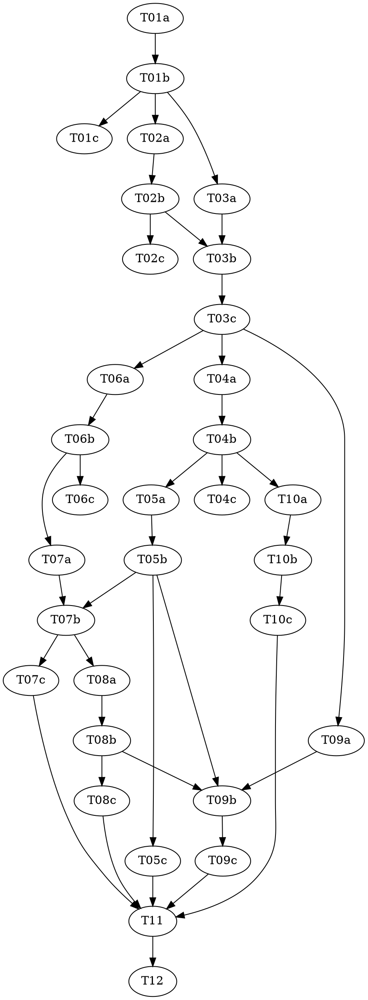

# Reasonable 3.0 — Part 7 of 8: The Frontier Loop + Gates (the migration that makes 3.0 live)

> **For agentic workers:** REQUIRED: Use vf-superpowers:subagent-driven-development (parallel,
> same session) or vf-superpowers:executing-plans (sequential, separate session) to implement this
> plan. Steps use checkbox (`- [ ]`) syntax for tracking. This plan contains `role:
> red|green|audit` triads — each role MUST run as a fresh, isolated subagent.

> **Design status — read before starting.** This plan implements a slice of `docs/DESIGN-3.0.md`,
> which is **still a draft** (its own header: "draft four … has not yet faced its own independent
> attack"; the ceremony amendment is draft-five, "NOT YET ATTACKED"). Per the parent roadmap
> (`../2026-07-08-reasonable-3.0-roadmap.md`): Parts 1–6 have landed (P1–P4 as v2.8.0→v3.2.0;
> P5–P6 merged on the shared refactoring line at 3.2.0, no per-part bump). **Unlike Parts 1, 3, 4, 5,
> and P6a–e — which were all *additive* (new files beside the live engine) — this part is the
> *terminus*: it WIRES the P1–P6 calculus INTO the load-bearing 2.x engine (`lib/ledger.mjs`,
> `lib/reconcile.mjs`, `lib/next-action.mjs`, `lib/progress-map.mjs`) and REPLACES the vertical-slice
> execution surface.** See `docs/superpowers/specs/2026-07-11-reasonable-3.0-p7-frontier-design.md`
> for the full reasoning, including the **one pivotal, flagged scoping call** (the append path OWNS
> effect computation — §2.4 taken literally) and the **five-step additive-then-subtractive migration
> order** that keeps the plugin's own suite green after every task.

> **STOP — confirm the pivotal call before Phase B.** The design's central decision — *the append
> path (`append()`) code-computes the effect set for an `atom-verdict`, not the frontier loop* — is
> flagged contestable. If it is reversed (frontier computes, `append()` validates), Phase B's tasks
> move into `lib/frontier.mjs` and change shape. **The supervisor must confirm this with the human
> before dispatching Phase B (T04+).** Phases A, C-deriver groundwork can proceed; the append wiring
> cannot until confirmed.

**Goal:** Wire the P1–P6 calculus into the live engine and replace the vertical-slice execution
surface: build `lib/frontier.mjs` (ready-set, packing, the exhaustive `GATE_RESULT` union +
band-indexed cadence, role-minimal provisioning), host `computeVerdictEffects`/`ceremonyEscalation`
inside `append()` behind a new collision-free `atom-verdict` event type, migrate the `nextAction`
projection from `route.json` to goals+cones (retiring `route.mjs`), replace
`vertical-slice-runner.workflow.js` with `frontier-wave.workflow.js`, and teach the progress fold the
3.0 vocabulary — all without ever leaving the plugin's own test suite red between tasks.

**Architecture:** Six internal phases (A–F), each landing green. **A** builds `lib/frontier.mjs` as a
pure library (the P5/P6 shape). **B** wires the append path (the P5-deferred verdict wiring). **C** is
the 2.x→3.0 migration, run **additive-then-subtractive** — build the goals/cones projection beside the
route path, switch consumers, then delete `route.mjs` last, once nothing imports it. **D** replaces the
workflow. **E** extends the progress fold. **F** is docs + final check. The migration surface is narrow
(the reconcile wiring map: one ≈200-line block + two imports, because downstream consumers read the
directive grammar, not `route.json`).

**Tech Stack:** Node.js ESM (`.mjs`), builtins only (`node:assert` for tests; `node:fs`/`node:path`
where a live-engine file already does I/O). No package.json, no dependencies — a hard invariant of this
repo (`CLAUDE.md`). Workflow scripts are **pure** (no `fs`/`Date`/`Math.random`/`import`).

**Design doc:** `docs/superpowers/specs/2026-07-11-reasonable-3.0-p7-frontier-design.md` (every open
design question DESIGN-3.0 left unstated for this part, resolved with reasoning, flagged where
contestable, grounded in the actually-shipped P1–P6 code). `docs/DESIGN-3.0.md` §6 (the frontier loop),
§9 (gates + the band-indexed floor), §12 (breaking changes / the migration), §17 (the ceremony dial),
§2.4 (why the effect set is code-computed in the append path), §7/§7.1/§7.2 (the verdicts this part
dispatches and appends), §8 (the live view).

**Planned by:** claude-opus-4-8

**Versioning — no bump (roadmap decision, 2026-07-09).** P5–P8 land on one shared refactoring line;
the plugin version stays **`3.2.0`** and bumps once, at the end of the generation (a **major** bump).
This plan therefore carries **no `version-bump-final-check` task**. T12 moves the roadmap status cell to
`Landed — merged (no bump, 3.2.0)` and runs the suite — it does not touch `plugin.json` or the README.

**Scope honesty — P7 is P6-split-sized; written as one plan by human instruction.** This part spans the
same five-subsystem breadth P6 split into P6a–P6e, and is the highest-risk part in the generation. It is
written as one plan *because the human asked for one plan executed by one pass*. **Strong advice:**
execute it in the six phase-waves below, reviewing between phases — do not attempt it as one
undifferentiated pass. Each phase leaves the suite green, so a phase boundary is a safe stopping point.

**Shared references (read before any task):** `shared/interfaces.md` (the exact P7 surface — every
signature grounded in shipped code), `shared/conventions.md` (harness, the three purity tiers,
migration safety, no-bump), `shared/architecture.md` (one-page orientation + the pivotal call),
`knowledge/running-tests.md` (how to run the suite).

**Two grounding corrections this plan carries (design-doc self-review claimed shipped reuse that does
NOT exist as read — `shared/interfaces.md` §0 pins the corrected forms):**
1. **`footprint.groupDisjoint` does not exist — and `footprint.mjs`'s CLI body is UNGUARDED, a latent
   bug never yet triggered.** `lib/footprint.mjs` exports nothing; the only `groupDisjoint` is inlined
   in the shipped `vertical-slice-runner.workflow.js`. Worse: its top-level code (including a bare
   `process.exit(1)` when no `.reasonable/` is found) runs unconditionally at module load — unlike
   `ledger.mjs`, which gates its CLI body behind `if (basename(process.argv[1]||'')==='ledger.mjs')
   runCli()`. Nothing imports `footprint.mjs` today, so this has never fired; P7 is the first thing that
   would. **T02 wraps the CLI body in that same guard (mirroring `ledger.mjs` verbatim — the real fix,
   not a workaround), THEN extracts a real `footprintsDisjoint` export** (no existing `footprint` test
   to keep byte-identical — none exists) and `frontier.pack` imports it — DRY between the two `lib/`
   files that can share, once the import is safe.
2. **The workflow cannot `import` `lib/frontier.mjs`** (substrate forbids `import`). `frontier.mjs` is
   the tested source of truth, imported by its `lib/` consumers; the **workflow inlines mirrors** of
   `pack`/`gateDue` (the repo's own `groupDisjoint` precedent). T09 pins this.

---

## Pre-flight (supervisor, before Wave 1)

Check `git status` before dispatching anything. If the working tree carries unrelated in-flight
changes, resolve those with the user first — every task in this plan stages **only its own listed
files**; `git add -A` is forbidden (see `shared/conventions.md`).

**Confirm the pivotal call** (design doc, "The central scoping fact"): the append path owns effect
computation. Get the human's explicit yes before Phase B. Phase A does not depend on it.

## File Structure

| File | New/changed | Responsibility |
|---|---|---|
| `lib/frontier.mjs` | **new, pure** | ready-set, wave packing, `GATE_RESULT` + `gateDue`, band-indexed cadence, `requiredRoles` |
| `lib/footprint.mjs` | extend (guard + additive export) | wrap the unguarded CLI body in a `runCli()` guard (mirrors `ledger.mjs`, a real fix — its top-level code exits(1) unconditionally today), then extract `footprintsDisjoint(a,b)` from the private `independent()` algebra (correction 1) |
| `lib/ledger.mjs` | extend | register `atom-verdict` + `phase-degenerated`; `append()` code-computes verdict effects |
| `lib/next-action.mjs` | extend | the goals/cones order deriver feeding the unchanged directive projection |
| `lib/reconcile.mjs` | extend, then narrow | select the goals/cones projection; replay effect sets; drop `readRoute` last |
| `lib/progress-map.mjs` | extend | `EVENT_MAP` gains the 3.0 atom / verdict / degeneration interpretations |
| `workflows/frontier-wave.workflow.js` | **new** | the frontier-wave workflow (replaces vertical-slice-runner) |
| `lib/route.mjs`, `test/route.test.mjs` | **deleted (last)** | removed once `reconcile.mjs` no longer imports `readRoute` |
| `workflows/vertical-slice-runner.workflow.js` | **deleted** | replaced by the frontier-wave workflow (T09) |
| `agents/*`, `skills/vertical-slice-execution/` | doc repoint | the skill is repointed at the new workflow (T11) |
| `docs/glossary.md`, `docs/artifacts.md` | extend | new normative terms + `atom-verdict` shape; `route.json` marked retired |

## Dependency Graph

| Task | Role | Depends On | Files Created/Modified |
|------|------|-----------|------------------------|
| T01a | red | — | `test/frontier-gate.test.mjs` |
| T01b | green | T01a | `lib/frontier.mjs` (new — GATE_RESULT + `gateDue` section) |
| T01c | audit | T01b | — |
| T02a | red | T01b | `test/frontier-ready-pack.test.mjs`, `test/footprint-disjoint.test.mjs` |
| T02b | green | T02a | `lib/footprint.mjs` (guard the CLI body + add `footprintsDisjoint` export), `lib/frontier.mjs` (append: `ready` + `pack` section) |
| T02c | audit | T02b | — |
| T03a | red | T01b | `test/frontier-roles.test.mjs` |
| T03b | green | T03a, T02b | `lib/frontier.mjs` (append: `requiredRoles` section) |
| T03c | audit | T03b | — |
| T04a | red | T03c | `test/ledger-atom-verdict.test.mjs` |
| T04b | green | T04a | `lib/ledger.mjs` (`atom-verdict`+`phase-degenerated` schemas; `append()` verdict branch) |
| T04c | audit | T04b | — |
| T05a | red | T04b | `test/ledger-two-phase.test.mjs` |
| T05b | green | T05a, T04b | `lib/ledger.mjs` (ratification fold of `pendingPermanent`; unwind on reject) |
| T05c | audit | T05b | — |
| T06a | red | T03c | `test/next-action-cones.test.mjs` |
| T06b | green | T06a | `lib/next-action.mjs` (goals/cones order deriver — additive) |
| T06c | audit | T06b | — |
| T07a | red | T06b | `test/reconcile-cones-projection.test.mjs` |
| T07b | green | T07a, T06b, T05b | `lib/reconcile.mjs` (select goals/cones projection; replay effect sets) |
| T07c | audit | T07b | — |
| T08a | red | T07b | `test/reconcile-next-action.test.mjs` (rewritten) |
| T08b | green | T08a, T07b | `lib/reconcile.mjs` (flip default; drop `readRoute`); **delete** `lib/route.mjs`, `test/route.test.mjs` |
| T08c | audit | T08b | — |
| T09a | red | T03c | `test/frontier-wave-workflow.test.mjs` |
| T09b | green | T09a, T05b, T08b | `workflows/frontier-wave.workflow.js` (new); **delete** `workflows/vertical-slice-runner.workflow.js` |
| T09c | audit | T09b | — |
| T10a | red | T04b | `test/progress-map-atoms.test.mjs` |
| T10b | green | T10a, T04b | `lib/progress-map.mjs` (`EVENT_MAP` 3.0 additions + containment fold) |
| T10c | audit | T10b | — |
| T11 | — | T05c, T07c, T08c, T09c, T10c | `docs/glossary.md`, `docs/artifacts.md`, `skills/vertical-slice-execution/SKILL.md` (repoint) |
| T12 | — | T11 | roadmap status cell; full-suite check (NO version bump) |

**Wave Schedule (phase boundaries are review checkpoints; suite is green after every green/audit task):**

- **Phase A — `lib/frontier.mjs` (pure):**
  - Wave 1: T01a (red)
  - Wave 2: T01b (green)
  - Wave 3: T01c (audit), T02a (red), T03a (red) — disjoint files, parallel-safe
  - Wave 4: T02b (green)
  - Wave 5: T02c (audit), T03b (green — appends below T02b's marker; depends on T02b)
  - Wave 6: T03c (audit)
- **Phase B — append-path wiring (STOP-gated on the pivotal call):**
  - Wave 7: T04a (red)
  - Wave 8: T04b (green)
  - Wave 9: T04c (audit), T05a (red), T10a (red — Phase E can start here; depends only on T04b), T06a (red — Phase C can start; depends on T03c)
  - Wave 10: T05b (green), T06b (green), T10b (green) — **disjoint files** (`ledger.mjs` / `next-action.mjs` / `progress-map.mjs`), parallel-safe
  - Wave 11: T05c (audit), T06c (audit), T10c (audit)
- **Phase C — migration (additive → subtractive):**
  - Wave 12: T07a (red)
  - Wave 13: T07b (green)
  - Wave 14: T07c (audit), T08a (red)
  - Wave 15: T08b (green — flips default, **deletes** `route.mjs`)
  - Wave 16: T08c (audit)
- **Phase D — the workflow:**
  - Wave 17: T09a (red)
  - Wave 18: T09b (green — **deletes** `vertical-slice-runner.workflow.js`)
  - Wave 19: T09c (audit)
- **Phase F — docs + final:**
  - Wave 20: T11 (docs + skill repoint)
  - Wave 21: T12 (roadmap status + full suite — **no version bump**)

**File conflict rule holds, with the named `lib/frontier.mjs` and `lib/ledger.mjs` exceptions:** no two
tasks *without a dependency edge* touch the same file. The deliberate exceptions are (a) T01b/T02b/T03b
all appending **disjoint, strictly-appended sections** to `lib/frontier.mjs` below a marker comment
(each depends on the last — real edges, exactly P5's `rewrite.mjs` practice), and (b) T04b/T05b/T07b/T08b
editing `lib/ledger.mjs`/`lib/reconcile.mjs` in a **dependency chain** (T05b depends on T04b; T08b on
T07b), never in parallel. Wave 10's parallel greens (T05b/T06b/T10b) touch **three different files**.
`lib/footprint.mjs` is touched by **T02b only** (the CLI-guard wrap + the `footprintsDisjoint`
extraction, correction 1) — no other task reads or writes it, so no conflict. **Phase E** (the progress-view fold,
T10a/b/c) is *interleaved* into Waves 9–11: it depends only on T04b, touches only `lib/progress-map.mjs`,
and runs parallel-safe alongside Phase B/C greens.

## Task Index

| ID | Name | File | Description |
|----|------|------|-------------|
| T01a | GATE_RESULT + `gateDue` tests (red) | `tasks/T01a-gate-red.md` | Failing tests for the 7-variant union, band-indexed floor, starvation, always-human, totality-HALT |
| T01b | GATE_RESULT + `gateDue` impl (green) | `tasks/T01b-gate-green.md` | `lib/frontier.mjs` top section: `GATE_RESULT` + total `gateDue(events, state, policy)` |
| T01c | Phase-A gate audit | `tasks/T01c-gate-audit.md` | Adversarial audit of the gate tests + impl |
| T02a | `ready` + `pack` tests (red) | `tasks/T02a-ready-pack-red.md` | Failing tests for the frontier ready-set, footprint-disjoint packing, and the new `footprintsDisjoint` export |
| T02b | `ready` + `pack` impl (green) | `tasks/T02b-ready-pack-green.md` | Guard `footprint.mjs`'s CLI body (mirrors `ledger.mjs`), extract `footprintsDisjoint` (correction 1), then append the ready/pack section importing it |
| T02c | ready/pack audit | `tasks/T02c-ready-pack-audit.md` | Adversarial audit |
| T03a | `requiredRoles` tests (red) | `tasks/T03a-roles-red.md` | Failing tests for role-minimal provisioning (reuses ceremony degeneration predicates) |
| T03b | `requiredRoles` impl (green) | `tasks/T03b-roles-green.md` | Append the `requiredRoles(wave, context)` section |
| T03c | roles audit | `tasks/T03c-roles-audit.md` | Adversarial audit |
| T04a | `atom-verdict` append tests (red) | `tasks/T04a-atom-verdict-red.md` | Failing tests: new event schemas; `append()` code-computes provisional effects; HALT on unknown kind |
| T04b | `atom-verdict` append impl (green) | `tasks/T04b-atom-verdict-green.md` | `EVENT_SCHEMAS` + the `append()` verdict branch (snapshot → `computeVerdictEffects` + `ceremonyEscalation`) |
| T04c | append audit | `tasks/T04c-atom-verdict-audit.md` | Adversarial audit — teeth on the no-model-in-the-loop boundary |
| T05a | two-phase tests (red) | `tasks/T05a-two-phase-red.md` | Failing tests: `pendingPermanent` recorded at verdict; ratification folds it; reject → unwind |
| T05b | two-phase impl (green) | `tasks/T05b-two-phase-green.md` | The ratification fold of `pendingPermanent` + `unwindCeremonyEscalation` on reject |
| T05c | two-phase audit | `tasks/T05c-two-phase-audit.md` | Adversarial audit — teeth on the apply-then-unwind identity at the wiring level |
| T06a | goals/cones deriver tests (red) | `tasks/T06a-cones-red.md` | Failing tests for the goals+cones order deriver (readGoals + servesEdges + weights) |
| T06b | goals/cones deriver impl (green) | `tasks/T06b-cones-green.md` | The additive order deriver in `lib/next-action.mjs` (route path untouched) |
| T06c | deriver audit | `tasks/T06c-cones-audit.md` | Adversarial audit |
| T07a | reconcile projection tests (red) | `tasks/T07a-reconcile-red.md` | Failing tests: `goals.json` present ⇒ cone-derived order; effect-set replay surfaces divergence |
| T07b | reconcile projection impl (green) | `tasks/T07b-reconcile-green.md` | Layer-2 selects goals/cones when `goals.json` present (route fallback kept); replay effect sets |
| T07c | reconcile audit | `tasks/T07c-reconcile-audit.md` | Adversarial audit — teeth on "green with route AND with goals" |
| T08a | migration cutover tests (red) | `tasks/T08a-cutover-red.md` | Rewrite `test/reconcile-next-action.test.mjs` (the ONLY route-coupled test beyond `route.test.mjs` itself — verified by grep; `test/next-action.test.mjs` feeds `routeOrder` as a plain fixture value and never touches `route.json`, so it needs no change) to seed `goals.json`/`policy.json` |
| T08b | migration cutover impl (green) | `tasks/T08b-cutover-green.md` | Flip default; drop `readRoute` import; **delete** `route.mjs` + `route.test.mjs` |
| T08c | cutover audit | `tasks/T08c-cutover-audit.md` | Adversarial audit — teeth on "nothing imports route.mjs" |
| T09a | frontier-wave workflow tests (red) | `tasks/T09a-workflow-red.md` | Failing behavioral tests (new `Function(...GLOBALS)` harness): 7-variant union, role-minimal dispatch |
| T09b | frontier-wave workflow impl (green) | `tasks/T09b-workflow-green.md` | `workflows/frontier-wave.workflow.js`; **delete** `vertical-slice-runner.workflow.js` |
| T09c | workflow audit | `tasks/T09c-workflow-audit.md` | Adversarial audit — teeth on purity (no `fs`/`Date`/`import`) + lane=atom untouched |
| T10a | live-view fold tests (red) | `tasks/T10a-progress-red.md` | Failing tests: the 3.0 atom / verdict / degeneration events fold into the progress tree |
| T10b | live-view fold impl (green) | `tasks/T10b-progress-green.md` | `EVENT_MAP` additions + containment fold in `lib/progress-map.mjs` |
| T10c | live-view audit | `tasks/T10c-progress-audit.md` | Adversarial audit |
| T11 | Docs + skill repoint | `tasks/T11-docs.md` | `glossary.md`/`artifacts.md` terms + `atom-verdict` shape; `route.json` → retired; repoint the skill |
| T12 | Final check (no bump) | `tasks/T12-final-check.md` | Full-suite run; roadmap P7 cell → `Landed — merged (no bump, 3.2.0)` — no version bump |

## Execution Handoff

**Plan complete and saved to
`docs/superpowers/plans/2026-07-11-reasonable-3.0-p7-frontier/plan.md`.**

**1. Subagent-Driven (this session)** — dispatch fresh subagent per task, review between tasks. Honor
the **STOP** before Phase B (confirm the pivotal call). Review at every phase boundary.

**2. Parallel Session (separate)** — open new session with executing-plans, batch execution per wave.

P8 (the zero-commit scout) is the last part; it depends on P6, not P7 — do not start it until P7 has
landed and been reviewed. If the pivotal call is reversed during review, Phase B's tasks change shape
(computation moves into `lib/frontier.mjs`); re-plan Phase B before executing it.
