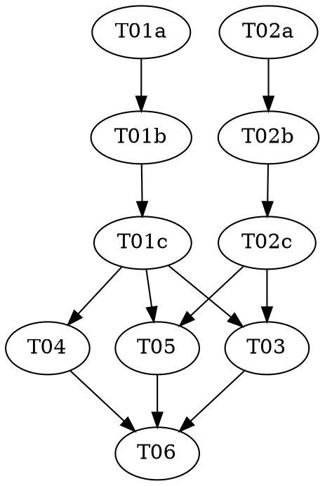

# Reasonable 3.0 — Part 8 of 8: The Zero-Commit Scout (the pre-effort front-end)

> **For agentic workers:** REQUIRED: Use vf-superpowers:subagent-driven-development (parallel, same
> session) or vf-superpowers:executing-plans (sequential, separate session) to implement this plan.
> Steps use checkbox (`- [ ]`) syntax for tracking. This plan contains `role: red|green|audit` triads
> — each role MUST run as a fresh, isolated subagent (see vf-superpowers:test-driven-development and
> vf-superpowers:adversarial-tdd for why: the agent that writes a test must not also write the code it
> tests). If you run this plan inline with no subagents, the triad separation cannot be enforced —
> note that rather than implying a guarantee you can't keep.

> **Design status — read before starting.** This plan implements a slice of `docs/DESIGN-3.0.md`,
> which is **still a draft** (its own header: "draft four … has not yet faced its own independent
> attack"; the scout ruling is draft-five, §17, "NOT YET ATTACKED — the youngest material in the
> document; a ratifier should weight it accordingly"). Per the parent roadmap
> (`../2026-07-08-reasonable-3.0-roadmap.md`): Parts 1–7 have landed (P1–P4 as v2.8.0→v3.2.0; P5–P7
> merged on the shared refactoring line at 3.2.0, no per-part bump). **P8 is the smallest and lowest-risk
> part in the generation** — unlike P7 (the terminus that wired the calculus into the load-bearing 2.x
> engine), P8 touches **no** live-engine file (`ledger.mjs`/`reconcile.mjs`/`next-action.mjs`/
> `fence.mjs` are all untouched). It adds a standalone capability beside the engine, the way P5/P6 added
> pure libraries. See `docs/superpowers/specs/2026-07-12-reasonable-3.0-p8-scout-design.md` for the full
> reasoning, including the **four flagged scoping calls** (none STOP-gated — §17 pre-settled the one that
> could have been) and the **answer to open edge (d)** (mechanically enforcing the seed is structure-only).

**Goal:** Build the **scout** — the spike-runner's quarantine machinery made launchable standalone,
before any `.reasonable/` state exists — as the sanctioned pre-effort shape-discovery surface. It runs
in a disposable workspace outside any repo (law-free by construction, no hook fence), produces a
knowledge artifact + an optional **genesis seed** (`seed.json`, shape-validated structure-only), and
hands the seed to the human to warm a later effort's genesis. Scout code is discarded; re-entry is
rewrite-from-knowledge.

**Architecture:** Four small pieces, each landing green. **`lib/scout-seed.mjs`** (new, pure) validates
the seed's draft charters are structure-only, reusing `lib/atom.mjs`'s charter grammar (extracted
additively as `validateCharterShape`). **`workflows/scout.workflow.js`** (new) is `spike.workflow.js`
minus the lane-provisioner/ledger/journal phase — one `Run scout` phase dispatching the reused
`spike-runner`. **`skills/scout/SKILL.md`** (new) is the standalone, effort-free entry (the `tdd-audit`
precedent) that creates the temp workspace, launches the workflow, and shape-validates the seed at
harvest. A small additive clause in **`agents/topologist.md`** names the seed as an advisory genesis
input. Glossary + artifacts pin the vocabulary and the `seed.json` shape.

**Tech Stack:** Node.js ESM (`.mjs`), builtins only (`node:assert`/`node:fs`/`node:path` for tests and
the loader). No package.json, no dependencies — a hard invariant of this repo (`CLAUDE.md`). Workflow
scripts are **pure** (no `fs`/`Date`/`Math.random`/`import`).

**Design doc:** `docs/superpowers/specs/2026-07-12-reasonable-3.0-p8-scout-design.md`. `docs/DESIGN-3.0.md`
§17 (the zero-commit scout ruling), §15 open edge (d) (the seed-must-be-structure-only edge P8 closes),
§13 (structure-only law), §5.1 (the topologist's genesis inputs).

**Planned by:** claude-opus-4-8

**Versioning — no bump (roadmap decision, 2026-07-09).** P5–P8 land on one shared refactoring line;
the plugin version stays **`3.2.0`** and bumps once, at the end of the generation (a **major** bump).
This plan therefore carries **no `version-bump-final-check` task** and touches neither
`.claude-plugin/plugin.json` nor the README version strings. T06 flips the roadmap status cell to
`Landed — merged (no bump, 3.2.0)` and runs the suite — nothing else.

**Scope check — P8 is single-subsystem; no split.** Unlike P7 (five subsystems, split-sized), P8 is
one new pure lib + one workflow + one skill + two small additive doc/agent clauses. It touches no
live-engine file. There is no case for a sub-split.

**Shared references (read before any task):**
- The design doc (above) — the four flagged calls and the open-edge-(d) answer in full.
- `knowledge/running-tests.md` (this plan's dir) — how to run the suite; the two test styles.
- `agents/spike-runner.md` — the agent P8 **reuses unchanged** (Call 2). Read it to see the
  effort-coupled "Report your progress as you go" section the scout dispatch prompt neutralizes.
- `workflows/spike.workflow.js` — the model for `scout.workflow.js`, **minus** its phase-1
  lane-provisioner block and all `effortRoot`/ledger references.
- `test/frontier-wave-workflow.test.mjs` — the `new Function(...GLOBALS)` behavioral-workflow harness to
  copy for `test/scout-workflow.test.mjs`.
- `lib/policy.mjs` — the pure-loader shape (`absent→{null,null}`, `malformed→{null,diagnostic}`,
  `valid→{parsed,null}`) + the guarded CLI (`basename(process.argv[1])===…`) that `lib/scout-seed.mjs`
  mirrors.

---

## Pre-flight (supervisor, before Wave 1)

Check `git status` before dispatching anything. If the working tree carries unrelated in-flight
changes, resolve those with the user first — every task stages **only its own listed files**; `git add
-A` is forbidden.

**No STOP gate.** Unlike P7, P8 has no pivotal call needing a human yes before a phase. §17 already
settled the one that could have been pivotal (the scout is law-free *by construction*). The four
scoping calls in the design doc are named and reversible, but none blocks execution. If a reviewer wants
to overturn **Call 2** (reuse the spike-runner verbatim → instead make a one-section conditional edit to
`agents/spike-runner.md`), that changes only T02's dispatch-prompt wording and adds a tiny agent edit —
it does not reshape the plan. Proceed unless the human raises it.

**The single forbidden move, carried into T03's skill and enforced by review:** **do NOT add any
`lib/fence.mjs` logic for the scout.** The scout is law-free by construction (no `.reasonable/` in its
workspace's ancestry ⇒ the fence fails open, `CLAUDE.md` invariant #2). A "scout mode" fence branch would
violate invariant #2 and contradict §17's "by construction, not by exemption." The scout's quarantine is
a workspace convention (temp dir + dispatch discipline), never a hook fence. `lib/fence.mjs` is not in
any task's file list; keep it that way.

## File Structure

| File | New/changed | Responsibility |
|---|---|---|
| `lib/scout-seed.mjs` | **new, pure** | `readSeed` (loader) + `validateSeedShape` (the structure-only fence) + a guarded `--validate` CLI |
| `lib/atom.mjs` | extend (additive) | extract `validateCharterShape(charter)→{ok,error}` from `charterAtom`; `charterAtom` delegates to it (byte-identical behavior; the seed reuses the exact charter grammar) |
| `workflows/scout.workflow.js` | **new** | the scout workflow — `spike.workflow.js` minus the lane-provisioner/ledger phase; one `Run scout` phase |
| `test/scout-seed.test.mjs` | **new** | pure-lib tests for `readSeed` + `validateSeedShape` |
| `test/scout-workflow.test.mjs` | **new** | behavioral tests for the workflow's typed union + no-effortRoot dispatch |
| `skills/scout/SKILL.md` | **new** | the standalone, effort-free scout skill (the `tdd-audit` precedent) |
| `agents/topologist.md` | extend (additive) | the advisory genesis-seed inputs clause (no allowlist change) |
| `agents/spike-runner.md` | **unchanged** | reused verbatim (Call 2); listed here so a reviewer confirms it is NOT edited |
| `docs/glossary.md` | extend | **Scout**, **Genesis seed** terms |
| `docs/artifacts.md` | extend | the scout report (prose) + `seed.json` (`*`) shapes, in a pre-effort section |
| `docs/superpowers/plans/2026-07-08-reasonable-3.0-roadmap.md` | extend | P8 row/section status (T06, at implementation land) |

## Dependency Graph

| Task | Role | Depends On | Files Created/Modified |
|------|------|-----------|------------------------|
| T01a | red | — | `test/scout-seed.test.mjs` |
| T01b | green | T01a | `lib/atom.mjs` (add `validateCharterShape`), `lib/scout-seed.mjs` (new) |
| T01c | audit | T01b | — |
| T02a | red | — | `test/scout-workflow.test.mjs` |
| T02b | green | T02a | `workflows/scout.workflow.js` (new) |
| T02c | audit | T02b | — |
| T03 | — | T01c, T02c | `skills/scout/SKILL.md` (new) |
| T04 | — | T01c | `agents/topologist.md` (additive seed-inputs clause) |
| T05 | — | T01c, T02c | `docs/glossary.md`, `docs/artifacts.md` |
| T06 | — | T03, T04, T05 | roadmap status cell + prose; full-suite check (**NO version bump**) |



**Wave Schedule (each green/audit task leaves the suite green; T01 and T02 are independent triads that
run fully in parallel):**

- **Wave 1:** T01a (red), T02a (red) — disjoint files, parallel-safe
- **Wave 2:** T01b (green), T02b (green) — disjoint files (`lib/*`+`atom.mjs` vs `workflows/*`)
- **Wave 3:** T01c (audit), T02c (audit)
- **Wave 4:** T03, T04, T05 — disjoint files (`skills/scout/` vs `agents/topologist.md` vs
  `docs/glossary.md`+`docs/artifacts.md`), parallel-safe
- **Wave 5:** T06 (roadmap status + final full-suite check)

---

## Phase A — the seed grammar (`lib/scout-seed.mjs`)

### Task T01a: author the seed-grammar tests

**Role:** `red` — write failing tests; do NOT implement. Owns `test/scout-seed.test.mjs`.

**Files:**
- Test: `test/scout-seed.test.mjs` (new)

**Context:** `lib/scout-seed.mjs` will export `readSeed(seedPath) → { seed, diagnostic }` (the
`lib/policy.mjs` loader shape) and `validateSeedShape(parsed) → { ok, errors }` (the structure-only
fence). A valid seed is `{ goalsSketch: [{id, scenario, notes?}], draftCharters: [{component, premises,
purpose, locus, order}] }`. `validateSeedShape` rejects any draft charter carrying a key **outside**
those five (the mechanical structure-only enforcement — a charter has no slot for a behavioral must),
and validates the five with `lib/atom.mjs`'s charter grammar (component `^[a-z0-9][a-z0-9-]*$`; premises
each `goal:|gate:|cite:|ledger:`; purpose non-empty string; locus array; order non-negative integer).

**Assert invariants, escalate ambiguity** (adversarial-tdd): pin the *shape rules* the design fixes; do
NOT invent field names or messages the design leaves open. In particular, assert the one **documented
residual** (a behavioral must in the free-prose `purpose` is NOT caught — identical to §13's own
non-normative-`purpose` boundary) so a later reader sees it was a deliberate boundary, not a miss.

- [ ] **Step 1: Write the failing tests**

```javascript
// test/scout-seed.test.mjs — the genesis-seed grammar (reasonable 3.0 Part 8, DESIGN-3.0 §17, §13).
// The seed's draftCharters are STRUCTURE ONLY: the exact charter fields, no Delta/clause/behavioral
// slot. validateSeedShape is the mechanical answer to §15 open edge (d). readSeed mirrors
// lib/policy.mjs (absent -> {null,null}; malformed -> {null,diagnostic}; valid -> {parsed,null}).

import assert from 'node:assert';
import { mkdtempSync, writeFileSync, rmSync } from 'node:fs';
import { join } from 'node:path';
import { tmpdir } from 'node:os';
import { readSeed, validateSeedShape } from '../lib/scout-seed.mjs';

let passed = 0;
function check(name, fn) {
  try { fn(); passed += 1; console.log(`  ok  ${name}`); }
  catch (e) { console.error(`FAIL  ${name}\n      ${e.stack || e.message}`); process.exitCode = 1; }
}

const validSeed = () => ({
  goalsSketch: [{ id: 'gs-1', scenario: 'a user can sign in with a session token' }],
  draftCharters: [
    { component: 'auth', premises: ['goal:gs-1'], purpose: 'issues + checks session tokens',
      locus: ['src/auth/**'], order: 0 },
  ],
});

// ── validateSeedShape ──────────────────────────────────────────────────────────

check('a well-formed seed validates ok', () => {
  const r = validateSeedShape(validSeed());
  assert.strictEqual(r.ok, true);
  assert.deepStrictEqual(r.errors, []);
});

check('a draft charter carrying a Delta/clause/behavioral field is REJECTED (structure-only fence)', () => {
  const seed = validSeed();
  seed.draftCharters[0].clauses = [{ must: 'reject expired tokens' }]; // a behavioral slot
  const r = validateSeedShape(seed);
  assert.strictEqual(r.ok, false);
  assert.ok(r.errors.some((e) => /clauses|extra|unexpected|structure/i.test(e)),
    `expected a structure-only rejection naming the offending key; got ${JSON.stringify(r.errors)}`);
});

check('other stray charter keys (delta / musts / behavior) are also rejected', () => {
  for (const key of ['delta', 'musts', 'behavior', 'assert']) {
    const seed = validSeed();
    seed.draftCharters[0][key] = 'anything';
    assert.strictEqual(validateSeedShape(seed).ok, false, `key "${key}" must be rejected`);
  }
});

check('a malformed component (uppercase) is rejected via the charter grammar', () => {
  const seed = validSeed();
  seed.draftCharters[0].component = 'Auth';
  assert.strictEqual(validateSeedShape(seed).ok, false);
});

check('a malformed premise (bad tag) is rejected via the charter grammar', () => {
  const seed = validSeed();
  seed.draftCharters[0].premises = ['nope:gs-1'];
  assert.strictEqual(validateSeedShape(seed).ok, false);
});

check('a non-integer order is rejected via the charter grammar', () => {
  const seed = validSeed();
  seed.draftCharters[0].order = 1.5;
  assert.strictEqual(validateSeedShape(seed).ok, false);
});

check('goalsSketch must be an array of {id, scenario}', () => {
  const seed = validSeed();
  seed.goalsSketch = [{ id: 'gs-1' }]; // missing scenario
  assert.strictEqual(validateSeedShape(seed).ok, false);
});

check('an empty draftCharters array is valid (a goals-only sketch is a legitimate seed)', () => {
  const seed = validSeed();
  seed.draftCharters = [];
  assert.strictEqual(validateSeedShape(seed).ok, true);
});

check('a non-object seed is rejected', () => {
  assert.strictEqual(validateSeedShape(null).ok, false);
  assert.strictEqual(validateSeedShape([]).ok, false);
});

// ── the DOCUMENTED RESIDUAL (open edge (d)): a behavioral must hidden in the ─────
// non-normative `purpose` prose is NOT caught by the shape fence — identical to §13's
// own boundary for real charters. Asserted so it is a deliberate boundary, not a miss.
check('a behavioral must smuggled into the free-prose purpose is NOT caught by the shape fence (documented §13 residual)', () => {
  const seed = validSeed();
  seed.draftCharters[0].purpose = 'MUST reject every expired token within 50ms'; // prose smuggling
  // The shape fence only guards STRUCTURE; prose in `purpose` is non-normative by §13, so this passes
  // the mechanical fence and is caught downstream by the topologist membrane + the human genesis gate.
  assert.strictEqual(validateSeedShape(seed).ok, true);
});

// ── readSeed (the lib/policy.mjs loader shape) ──────────────────────────────────

check('readSeed on an absent path -> {seed:null, diagnostic:null}', () => {
  const r = readSeed(join(tmpdir(), 'definitely-absent-seed-xyz.json'));
  assert.deepStrictEqual(r, { seed: null, diagnostic: null });
});

check('readSeed on malformed JSON -> {seed:null, diagnostic:<reason>}', () => {
  const dir = mkdtempSync(join(tmpdir(), 'scout-seed-'));
  try {
    const p = join(dir, 'seed.json');
    writeFileSync(p, '{ not json');
    const r = readSeed(p);
    assert.strictEqual(r.seed, null);
    assert.ok(typeof r.diagnostic === 'string' && r.diagnostic.length > 0);
  } finally { rmSync(dir, { recursive: true, force: true }); }
});

check('readSeed on a valid seed -> {seed:<parsed verbatim>, diagnostic:null}', () => {
  const dir = mkdtempSync(join(tmpdir(), 'scout-seed-'));
  try {
    const p = join(dir, 'seed.json');
    writeFileSync(p, JSON.stringify(validSeed()));
    const r = readSeed(p);
    assert.strictEqual(r.diagnostic, null);
    assert.strictEqual(r.seed.draftCharters[0].component, 'auth');
  } finally { rmSync(dir, { recursive: true, force: true }); }
});

check('readSeed does NOT validate structure-only-ness — that is validateSeedShape\'s job (separation)', () => {
  const dir = mkdtempSync(join(tmpdir(), 'scout-seed-'));
  try {
    const bad = validSeed(); bad.draftCharters[0].clauses = [{ must: 'x' }];
    const p = join(dir, 'seed.json');
    writeFileSync(p, JSON.stringify(bad));
    const r = readSeed(p);
    assert.strictEqual(r.diagnostic, null, 'readSeed only parses; it does not run the structure fence');
    assert.strictEqual(validateSeedShape(r.seed).ok, false, 'validateSeedShape is where the fence lives');
  } finally { rmSync(dir, { recursive: true, force: true }); }
});

if (process.exitCode) console.error(`\nscout-seed: FAILURES above (${passed} passed).`);
else console.log(`\nscout-seed: all ${passed} checks passed. ✓`);
```

- [ ] **Step 2: Run to verify it fails for the right reason**

Run: `node test/scout-seed.test.mjs`
Expected: FAIL — `Cannot find module '../lib/scout-seed.mjs'` (the module does not exist yet). This is
the correct red: the tests fail on the absent implementation, not on a bad assertion.

- [ ] **Step 3: Commit**

```bash
git add test/scout-seed.test.mjs
git commit -m "test(scout): lock the genesis-seed grammar — structure-only fence + loader (red, P8)"
```

### Task T01b: implement the seed grammar

**Role:** `green` — make the locked tests pass. Write no tests.

**Files:**
- Modify: `lib/atom.mjs` (additive — extract `validateCharterShape`)
- Create: `lib/scout-seed.mjs`
- Test (read-only — do NOT modify): `test/scout-seed.test.mjs`

**Scope / Negative constraints:**
- **`test/scout-seed.test.mjs` is read-only.** If a test looks wrong, escalate an `intent-fork` to the
  supervisor — never edit it.
- **`lib/atom.mjs` change is additive only.** `charterAtom` must keep the same signature and the same
  behavior; every existing atom test must stay green. You extract the five field-checks into a new
  exported `validateCharterShape`, and `charterAtom` calls it. (The error-message prefix shifts from
  `charterAtom:` to a neutral `charter:` — a cosmetic change to untested error text, confirmed no test
  pins it.)
- **`lib/` stays dependency-free** — node builtins + relative imports only.
- Do NOT touch `lib/fence.mjs`, any workflow, or any live-engine file.

- [ ] **Step 1: Extract `validateCharterShape` from `lib/atom.mjs` (additive)**

In `lib/atom.mjs`, add this exported function immediately **above** `charterAtom` (it uses the existing
module-scope `COMPONENT_RE` / `PREMISE_RE`):

```javascript
/**
 * Validate a charter's five STRUCTURE-ONLY fields (§13) — component / premises / purpose / locus /
 * order — without appending anything. The shared shape check charterAtom and the Part-8 scout seed
 * (lib/scout-seed.mjs) both use, so the seed's draft charters are charter-shaped by construction, not
 * by a re-declared copy of these rules.
 * @returns {{ ok: true } | { ok: false, error: string }}
 */
export function validateCharterShape(charter) {
  const { component, premises, purpose, locus, order } = charter || {};
  if (typeof component !== 'string' || !COMPONENT_RE.test(component)) {
    return { ok: false, error: `charter: component must match ${COMPONENT_RE} (got ${JSON.stringify(component)})` };
  }
  if (!Array.isArray(premises) || premises.some((p) => typeof p !== 'string' || !PREMISE_RE.test(p))) {
    return { ok: false, error: 'charter: every premise must be a well-formed tagged reference (goal:|gate:|cite:|ledger:)' };
  }
  if (typeof purpose !== 'string' || purpose.length === 0) {
    return { ok: false, error: 'charter: purpose must be a non-empty string' };
  }
  if (!Array.isArray(locus)) {
    return { ok: false, error: 'charter: locus must be an array' };
  }
  if (!Number.isInteger(order) || order < 0) {
    return { ok: false, error: 'charter: order must be a non-negative integer' };
  }
  return { ok: true };
}
```

Then replace `charterAtom`'s inline field-checks (its five `if` blocks) with a delegation, keeping the
rest of the function identical:

```javascript
export function charterAtom(effortRoot, charter) {
  const shape = validateCharterShape(charter);
  if (!shape.ok) return { ok: false, error: shape.error };
  const { component, premises, purpose, locus, order } = charter;
  const result = append(effortRoot, { type: 'atom-chartered', component, premises, purpose, locus, order });
  if (!result.ok) return { ok: false, error: result.error };
  return { ok: true, id: `a-${result.event.seq}`, seq: result.event.seq };
}
```

- [ ] **Step 2: Write `lib/scout-seed.mjs`**

```javascript
// lib/scout-seed.mjs — the genesis-seed grammar (reasonable 3.0 Part 8, DESIGN-3.0 §17, §13).
//
// The SCOUT (§17) is the zero-commit pre-effort exploration surface. On convergence it writes a
// `seed.json` — a draft charter set + goals sketch that seeds a later effort's genesis graph. The seed
// is STRUCTURE ONLY (§13): its draft charters carry exactly the charter fields (component / premises /
// purpose / locus / order) and NO Delta/clause/behavioral slot. This module is the mechanical answer to
// §15 open edge (d): validateSeedShape rejects any draft charter with a field outside the five, using
// lib/atom.mjs's exact charter grammar (validateCharterShape) so the seed is charter-shaped by
// construction. The one residual — a behavioral must smuggled into the free-prose `purpose` — is NOT
// caught here (it is identical to §13's own boundary for real charters) and is backstopped by the
// topologist's structure-only membrane + the human genesis gate. See the P8 design doc.
//
// NOT `.reasonable/` state: the scout writes no effort state. seed.json lives in the scout's disposable
// workspace and is a PRE-EFFORT input the human carries into `reasonable:develop`; it becomes ratified
// goals.json/policy.json only through the normal human-gated genesis gate.
//
// Law 1 (dependency-free): node builtins only + the relative atom.mjs import. Loader shape modeled on
// lib/policy.mjs: absent -> {null,null}; malformed -> {null,diagnostic}; valid -> {parsed VERBATIM,null}.

import { existsSync, readFileSync } from 'node:fs';
import { basename } from 'node:path';
import { validateCharterShape } from './atom.mjs';

const isPlainObject = (v) => v !== null && typeof v === 'object' && !Array.isArray(v);

// The ONLY keys a draft charter may carry — the structure-only fence. Any extra key is a behavioral
// slot the seed must not carry (a charter has no room for a Delta or a clause, §13).
const ALLOWED_CHARTER_KEYS = new Set(['component', 'premises', 'purpose', 'locus', 'order']);

/**
 * Parse a seed.json off disk. Validates JSON well-formedness ONLY, never structure-only-ness — that is
 * validateSeedShape's job (separation of parse from fence). Returns the parsed object VERBATIM on
 * success (a well-formed-but-wrong seed loads clean and is caught by validateSeedShape).
 * @returns {{ seed: object | null, diagnostic: string | null }}
 */
export function readSeed(seedPath) {
  if (!existsSync(seedPath)) return { seed: null, diagnostic: null };
  let parsed;
  try {
    parsed = JSON.parse(readFileSync(seedPath, 'utf8'));
  } catch (e) {
    return { seed: null, diagnostic: `seed.json: invalid JSON — ${(e && e.message) || String(e)}` };
  }
  return { seed: parsed, diagnostic: null };
}

/**
 * The structure-only fence (§13, the answer to open edge (d)). Accepts a seed shaped
 * { goalsSketch: [{id, scenario, notes?}], draftCharters: [{component,premises,purpose,locus,order}] }.
 * Rejects any draft charter carrying a key outside the five, and validates the five with the exact
 * charter grammar (lib/atom.mjs's validateCharterShape). draftCharters may be empty (a goals-only
 * sketch is a legitimate seed).
 * @returns {{ ok: boolean, errors: string[] }}
 */
export function validateSeedShape(parsed) {
  const errors = [];
  if (!isPlainObject(parsed)) return { ok: false, errors: ['seed: expected a JSON object'] };

  const { goalsSketch, draftCharters } = parsed;

  if (!Array.isArray(goalsSketch)) {
    errors.push('seed: "goalsSketch" must be an array of { id, scenario, notes? }');
  } else {
    goalsSketch.forEach((g, i) => {
      if (!isPlainObject(g) || typeof g.id !== 'string' || g.id.length === 0 ||
          typeof g.scenario !== 'string' || g.scenario.length === 0) {
        errors.push(`seed: goalsSketch[${i}] must have a non-empty string id and scenario`);
      }
    });
  }

  if (!Array.isArray(draftCharters)) {
    errors.push('seed: "draftCharters" must be an array (possibly empty)');
  } else {
    draftCharters.forEach((c, i) => {
      if (!isPlainObject(c)) { errors.push(`seed: draftCharters[${i}] must be an object`); return; }
      // Structure-only fence: reject any key outside the five charter fields (no Delta/clause/behavior).
      const extra = Object.keys(c).filter((k) => !ALLOWED_CHARTER_KEYS.has(k));
      if (extra.length) {
        errors.push(`seed: draftCharters[${i}] carries non-charter key(s) [${extra.join(', ')}] — a charter is STRUCTURE ONLY (§13); behavior is born at a gate, never in a charter`);
        return;
      }
      const shape = validateCharterShape(c);
      if (!shape.ok) errors.push(`seed: draftCharters[${i}] — ${shape.error}`);
    });
  }

  return { ok: errors.length === 0, errors };
}

// Guarded CLI (mirrors lib/policy.mjs / lib/ledger.mjs — never the unguarded top-level exit() that was
// lib/footprint.mjs's latent bug). `node lib/scout-seed.mjs --validate <path>` -> exit 0 valid / 1 not.
// This is the command the scout skill runs at harvest (the trusted control plane validating the
// producer's output — not the producer grading itself).
if (basename(process.argv[1] || '') === 'scout-seed.mjs') {
  const args = process.argv.slice(2);
  const i = args.indexOf('--validate');
  if (i === -1 || !args[i + 1]) {
    console.error('usage: node lib/scout-seed.mjs --validate <seed.json>');
    process.exit(2);
  }
  const { seed, diagnostic } = readSeed(args[i + 1]);
  if (diagnostic) { console.error(diagnostic); process.exit(1); }
  if (seed === null) { console.error(`seed.json not found: ${args[i + 1]}`); process.exit(1); }
  const { ok, errors } = validateSeedShape(seed);
  if (ok) { console.log('seed.json: structure-only OK ✓'); process.exit(0); }
  console.error('seed.json: NOT structure-only:\n  ' + errors.join('\n  '));
  process.exit(1);
}
```

- [ ] **Step 3: Run the new test to verify it passes**

Run: `node test/scout-seed.test.mjs`
Expected: PASS — `scout-seed: all N checks passed. ✓`

- [ ] **Step 4: Run the WHOLE suite to confirm the atom.mjs extraction regressed nothing**

Run: `for t in test/*.test.mjs; do node "$t"; done`
Expected: no `FAIL` line anywhere (especially `test/atom*.test.mjs` — `charterAtom`'s behavior is
unchanged).

- [ ] **Step 5: Commit**

```bash
git add lib/scout-seed.mjs lib/atom.mjs
git commit -m "feat(scout): the genesis-seed grammar — structure-only fence over the shared charter shape (green, P8)"
```

### Task T01c: audit the seed grammar

**Role:** `audit` — adversarially audit tests + code. Report gap tests as new `red` tasks; fix nothing
directly.

**Files:** none (read-only audit).

- [ ] **Step 1: Discriminator check.** Confirm the T01a tests fail on the pre-T01b commit (they must —
  the module did not exist). `git stash` any nothing; check out T01a's commit, run `node
  test/scout-seed.test.mjs`, confirm module-not-found; return to HEAD.
- [ ] **Step 2: Structure-only completeness.** Confirm `validateSeedShape` rejects EVERY behavioral
  slot, not just `clauses`: try `delta`, `musts`, `behavior`, `assert`, `must`, `spec` on a draft
  charter — all must reject via the extra-key filter. If any slips through, that is a gap `red` task.
- [ ] **Step 3: The residual is real and bounded.** Confirm the `purpose`-prose case is the ONLY
  structure-only escape (the design's named §13 residual), and that it is caught nowhere mechanically in
  P8 — i.e. the design does not silently claim the topologist membrane is mechanical. It is not; it is a
  constitutional membrane (T04) + the human gate. Confirm the test documents this honestly.
- [ ] **Step 4: DRY / grounding.** Confirm `validateSeedShape` uses the SHARED `validateCharterShape`
  (imported from `atom.mjs`), not a re-declared copy of the regexes — the design's "charter-shaped by
  construction" claim depends on it. Confirm `charterAtom`'s behavior is byte-identical (existing atom
  tests green).
- [ ] **Step 5: Report** — a short verdict (`green` / gap tests). Any gap becomes a new `red` task
  before Phase C consumes the seed grammar.

---

## Phase B — the scout workflow (`workflows/scout.workflow.js`)

### Task T02a: author the scout-workflow behavioral tests

**Role:** `red` — write failing tests; do NOT implement. Owns `test/scout-workflow.test.mjs`.

**Files:**
- Test: `test/scout-workflow.test.mjs` (new)

**Context:** `workflows/scout.workflow.js` is `spike.workflow.js` **minus** its phase-1 lane-provisioner
block. It has ONE phase (`Run scout`) that dispatches `reasonable:spike-runner` with a prompt naming the
disposable `workspaceRoot` and passing **no `effortRoot`**. It returns a typed union mirroring the spike:
- `{ kind: 'result', scoutId, verdict, report, seed }` — the scout answered (`verdict.verdict ∈
  converged | infeasible | inconclusive`; `verdict.seedPath` present only when `converged`).
- `{ kind: 'budget-exhausted', … }` — the `guard()` ceiling hit.
- `{ kind: 'blocked', … }` — the scout-runner returned null (skipped/died), OR `args.scout.question`
  is empty (a scout must carry one shape-discovery question).

Read `test/frontier-wave-workflow.test.mjs` and copy its `loadRunner()` / `runWith()` /
`new Function(...GLOBALS)` harness verbatim.

**Assert invariants, escalate ambiguity:** pin the typed-union routing and the no-`effortRoot`
dispatch. Do NOT pin the exact prose of the dispatch prompt beyond the load-bearing tokens (that it
mentions the workspace and does NOT compute an `effortRoot`).

- [ ] **Step 1: Write the failing tests**

```javascript
// test/scout-workflow.test.mjs — the scout workflow's behavioral contract (reasonable 3.0 Part 8,
// DESIGN-3.0 §17). One `Run scout` phase, NO lane-provisioner, NO effortRoot, NO ledger. Typed union
// mirrors spike.workflow.js: result | budget-exhausted | blocked. Copies the loadRunner()/runWith()
// harness from test/frontier-wave-workflow.test.mjs (the shipped precedent).

import assert from 'node:assert';
import { readFileSync } from 'node:fs';
import { join, dirname } from 'node:path';
import { fileURLToPath } from 'node:url';

const here = dirname(fileURLToPath(import.meta.url));
const scriptPath = join(here, '..', 'workflows', 'scout.workflow.js');
const GLOBALS = ['args', 'budget', 'phase', 'log', 'agent', 'parallel', 'pipeline', 'workflow'];

function loadRunner() {
  const src = readFileSync(scriptPath, 'utf8')
    .replace(/^export\s+const\s+meta\b/m, 'const meta')
    .replace(/^export\s+default\s+/m, '');
  // eslint-disable-next-line no-new-func
  return new Function(...GLOBALS, `return (async () => { ${src}\n });`);
}

const mockBudget = { spent: () => 0, remaining: () => Infinity, total: null };
const overBudget = { spent: () => 100, remaining: () => 0, total: 100 };
const noop = () => {};
async function parallel(thunks) { return Promise.all(thunks.map(async (t) => { try { return await t(); } catch { return null; } })); }
async function pipeline(items, ...stages) {
  return Promise.all(items.map(async (item) => { let a = item; for (const s of stages) { try { a = await s(a); } catch { a = null; } } return a; }));
}

function runWith(agent, over = {}, budget = mockBudget) {
  const args = {
    workspaceRoot: '/tmp/scout-ws',
    scout: { id: 's1', question: 'what is the right decomposition for a token-auth module?', timebox: '20 turns', ...over },
    ...(over.topArgs || {}),
  };
  const run = loadRunner()(args, budget, noop, noop, agent, parallel, pipeline, noop);
  return run();
}

let passed = 0;
async function check(name, fn) {
  try { await fn(); passed += 1; console.log(`  ok  ${name}`); }
  catch (e) { console.error(`FAIL  ${name}\n      ${e.stack || e.message}`); process.exitCode = 1; }
}

const convergedVerdict = {
  question: 'q', method: 'm', evidence: 'e', verdict: 'converged', confidence: 'high',
  expiry: 'tested against node 22; re-verify on a stack change',
  reportPath: '/tmp/scout-ws/scout-report.md', seedPath: '/tmp/scout-ws/seed.json', timeboxExpired: false,
};

await check('a converged scout returns {kind:"result"} carrying the verdict + seed path', async () => {
  const agent = async (_p, opts) => (opts.label === 'scout' ? convergedVerdict : {});
  const r = await runWith(agent);
  assert.strictEqual(r.kind, 'result');
  assert.strictEqual(r.verdict.verdict, 'converged');
  assert.strictEqual(r.seed, '/tmp/scout-ws/seed.json');
});

await check('an infeasible scout is a successful result (a "no"), carrying no seed', async () => {
  const agent = async (_p, opts) => (opts.label === 'scout'
    ? { ...convergedVerdict, verdict: 'infeasible', seedPath: undefined } : {});
  const r = await runWith(agent);
  assert.strictEqual(r.kind, 'result');
  assert.strictEqual(r.verdict.verdict, 'infeasible');
  assert.ok(!r.seed, 'infeasible carries no seed');
});

await check('the scout is dispatched with reasonable:spike-runner and NO effortRoot in its prompt', async () => {
  let seenPrompt = null, seenType = null;
  const agent = async (prompt, opts) => { if (opts.label === 'scout') { seenPrompt = prompt; seenType = opts.agentType; } return convergedVerdict; };
  await runWith(agent);
  assert.strictEqual(seenType, 'reasonable:spike-runner', 'the scout reuses the spike-runner agent (Call 2)');
  assert.ok(/\/tmp\/scout-ws/.test(seenPrompt), 'the prompt must name the disposable workspace');
  assert.ok(!/--root|effortRoot|ledger\.mjs/i.test(seenPrompt),
    'a scout dispatch carries NO effortRoot / ledger reference (the constitution\'s ledger section is vacuous for a scout)');
});

await check('a null scout-runner return -> {kind:"blocked"}', async () => {
  const agent = async (_p, opts) => (opts.label === 'scout' ? null : {});
  const r = await runWith(agent);
  assert.strictEqual(r.kind, 'blocked');
});

await check('a missing question -> {kind:"blocked"} (a scout must carry one shape-discovery question)', async () => {
  const agent = async () => convergedVerdict;
  const r = await runWith(agent, { question: '' });
  assert.strictEqual(r.kind, 'blocked');
});

await check('a budget ceiling during the scout -> {kind:"budget-exhausted"}', async () => {
  const agent = async () => { throw new Error('token budget ceiling exceeded'); };
  const r = await runWith(agent, {}, overBudget);
  assert.strictEqual(r.kind, 'budget-exhausted');
});

if (process.exitCode) console.error(`\nscout-workflow: FAILURES above (${passed} passed).`);
else console.log(`\nscout-workflow: all ${passed} checks passed. ✓`);
```

- [ ] **Step 2: Run to verify it fails for the right reason**

Run: `node test/scout-workflow.test.mjs`
Expected: FAIL — `ENOENT`/cannot read `workflows/scout.workflow.js` (the file does not exist yet).

- [ ] **Step 3: Commit**

```bash
git add test/scout-workflow.test.mjs
git commit -m "test(scout): lock the scout-workflow typed union + no-effortRoot dispatch (red, P8)"
```

### Task T02b: implement the scout workflow

**Role:** `green` — make the locked tests pass. Write no tests.

**Files:**
- Create: `workflows/scout.workflow.js`
- Test (read-only — do NOT modify): `test/scout-workflow.test.mjs`

**Scope / Negative constraints:**
- **`test/scout-workflow.test.mjs` is read-only.** Escalate a wrong test; never edit it.
- **Substrate purity (CLAUDE.md invariant #5):** no `fs`, no `Date.now()`/`new Date()`/`Math.random()`,
  no `import`. `export const meta` is a pure literal; inline every schema `const`. Model on
  `workflows/spike.workflow.js` — copy its `guard()` helper and `callShapeReminder` verbatim, **delete
  its entire phase-1 (`Provision quarantine` / lane-provisioner) block**, and strip every `effortRoot` /
  ledger reference.
- Do NOT reuse or reintroduce `lane-provisioner`, `journal`, `quarantineRoot`, or `.reasonable-lane.json`
  — there is no effort here (design Call 1).

- [ ] **Step 1: Write `workflows/scout.workflow.js`**

```javascript
// scout.workflow.js — the ZERO-COMMIT SCOUT (reasonable 3.0 Part 8, DESIGN-3.0 §17).
//
// SHAPE: spike.workflow.js MINUS the effort. A single timeboxed spike-runner, dispatched into a
// disposable workspace that lives OUTSIDE any repo -> knowledge-artifact + optional genesis-seed
// persistence -> return. Launched by the SCOUT SKILL (skills/scout), never inside an effort.
//
// LAW-FREE BY CONSTRUCTION, NOT BY FENCE (design Call 1, §17). A scout runs where no `.reasonable/`
// exists, so lib/fence.mjs fails OPEN (CLAUDE.md invariant #2) — there is NO hook path-fence here,
// unlike the in-effort spike (whose fence reads a `.reasonable-lane.json` descriptor). This is the
// design, not a gap: the scout's containment is the disposable workspace + the spike-runner's
// constitutional/dispatch scoping to it. This script provisions NO quarantine, writes NO descriptor,
// records NO journal/ledger — there is no effort to nest under. DO NOT add fence logic anywhere for the
// scout; that would violate invariant #2 and contradict §17.
//
// REUSE THE SPIKE-RUNNER VERBATIM (design Call 2). The dispatch passes NO effortRoot and states plainly
// that this is a scout (no effort, no ledger), so the spike-runner constitution's "Report your progress
// as you go" ledger section is vacuous (zero ledger facts, no effortRoot) and progress rides the
// structured return instead.
//
// PURITY (substrate-ref): pure JS. No filesystem, no Date.now / Math.random / argless new Date(). All
// side effects live INSIDE agents; the script sequences. Self-contained: every schema literal and the
// guard() helper inlined, no imports (invariant #5).

export const meta = {
  name: 'scout',
  description: 'Zero-commit pre-effort scout: shape-discovery in a disposable law-free workspace, deliver a knowledge artifact + an optional structure-only genesis seed, return a verdict. Writes no .reasonable/ state. Launched standalone by the scout skill.',
  whenToUse: 'Before an effort exists, to answer "what is the right decomposition / API / target?" — the exploratory front-end the committed spine serves badly. On convergence it seeds the genesis graph so analysis starts warm. Never inside an effort (that is the in-effort spike); never to prove the chosen direction (that is the walking skeleton, which ships).',
  phases: [
    { title: 'Run scout', detail: 'spike-runner answers the shape-discovery question with evidence inside the disposable workspace, within the timebox, and on convergence writes the scout report + seed.json there.' },
  ],
};

// The scout-runner's verdict. The gate is "a shape-discovery question answered WITH EVIDENCE" — not
// code that runs. A timeboxed "no" (infeasible) is a success. This structured return IS the knowledge
// that crosses the membrane back to the skill; the scout CODE never crosses (it is discarded). The
// scout-runner ALSO persists the same knowledge as a report file, and (only on convergence) a seed.json,
// inside its workspace; the skill harvests them and shape-validates the seed (lib/scout-seed.mjs).
const SCOUT_RESULT = {
  type: 'object',
  additionalProperties: false,
  required: ['question', 'method', 'evidence', 'verdict', 'confidence', 'expiry', 'reportPath'],
  properties: {
    question: { type: 'string', description: 'The single shape-discovery question, restated (what decomposition / API / target? — with a clear convergence criterion).' },
    method: { type: 'string', description: 'The cheapest thing built to explore it: harness shape, scope, what was hardcoded/skipped. Disposable by design.' },
    evidence: { type: 'string', description: 'The CURATED evidence that crosses the membrane: what was tried, what the shape turned out to be, the exact incantations that worked. Curate evidence, not accident — whole-code quoting is refactor-from-scout by the back door.' },
    verdict: {
      type: 'string',
      enum: ['converged', 'infeasible', 'inconclusive'],
      description: 'converged (a stable shape found — carries a seed) / infeasible (the target/direction is learned-closed — a real, successful "no", no seed) / inconclusive (timebox expired with no stable shape).',
    },
    confidence: { type: 'string', enum: ['high', 'medium', 'low'], description: 'Confidence in the verdict given the evidence and the timebox spent.' },
    expiry: { type: 'string', description: 'MANDATORY. The versions/conditions explored against, because shape-discovery conclusions rot — e.g. "explored against automerge 2.1.0, node 22; re-verify on a major dependency bump."' },
    reportPath: { type: 'string', description: 'The path (under the workspace) where the scout wrote the markdown knowledge artifact (question/method/evidence/verdict/confidence/expiry + candidate-shape narrative). NEVER read as code.' },
    seedPath: { type: 'string', description: 'Present ONLY on a converged verdict: the path (under the workspace) to seed.json — the draft charter set + goals sketch, STRUCTURE ONLY (charter fields component/premises/purpose/locus/order; no clauses, no behavioral musts). The skill shape-validates it (lib/scout-seed.mjs) before offering it to any genesis.' },
    timeboxExpired: { type: 'boolean', description: 'true if the scout hit the timebox before a decisive answer (verdict is then typically inconclusive — still a returnable result).' },
  },
};

// guard(): the budget-throw membrane. The engine THROWS when an agent() call would exceed the token
// ceiling. A raw throw would abort the scout and lose knowledge already gathered; guard() catches it and
// re-tags it as a structured ceiling signal so a budget wall is never misread as a scout failure. Any
// non-budget throw is re-raised. (Pure: no clock / random.)
async function guard(thunk) {
  try { return { ok: true, value: await thunk() }; }
  catch (e) {
    const msg = (e && e.message) ? String(e.message) : String(e);
    if (/budget|ceiling|token|exceed/i.test(msg)) return { ok: false, ceiling: true, reason: msg };
    throw e;
  }
}

const callShapeReminder =
  'TOOL-CALL SHAPE: call the forced tool with the schema\'s fields as the CALL\'S OWN top-level arguments (e.g. {"verdict": "converged", "reportPath": "...", ...}) — do NOT JSON-stringify the whole answer into a wrapper property (e.g. {"input": "{...}"}); that fails schema validation and burns a retry.';

function done(result) { return result; }

// args (passed by the scout SKILL at launch — the script reads no disk and no clock):
//   {
//     workspaceRoot,   // absolute path to the DISPOSABLE workspace OUTSIDE any repo (the skill created
//                      // it, e.g. via `mktemp -d`); the scout-runner is cwd'd here; all writes go under it.
//     scout: { id, question, timebox, context? },   // NO effortRoot anywhere — there is no effort.
//     budget,          // optional per-scout token target; guards the loop alongside engine budget.
//   }
export default async function run() {
  const a = { ...(args || {}) };
  const scout = a.scout || {};
  const workspaceRoot = a.workspaceRoot;

  if (!scout.question) {
    return done({ kind: 'blocked', outcome: 'no-question: a scout must carry exactly one shape-discovery question (args.scout.question is empty).' });
  }
  if (!workspaceRoot) {
    return done({ kind: 'blocked', outcome: 'no-workspace: the scout skill must create a disposable workspace OUTSIDE any repo and pass it as args.workspaceRoot (design Call 4).' });
  }

  phase('Run scout');
  log(`Running scout ${scout.id || '(unnamed)'} in disposable workspace ${workspaceRoot} (timebox: ${scout.timebox || 'as briefed'})`);

  const scoutPrompt = [
    `You are running ONE timeboxed SCOUT — the zero-commit, PRE-EFFORT exploration surface (DESIGN-3.0 §17).`,
    `This is NOT an effort. There is NO .reasonable/ state, NO ledger, and NO effortRoot. You do not`,
    `report to any ledger — the "Report your progress as you go" section of your constitution does not`,
    `apply here (there are zero ledger facts and no effortRoot); narrate progress ONLY in your returned`,
    `structured output.`,
    ``,
    `Shape-discovery question (the gate — a question answered WITH EVIDENCE, not code that runs):`,
    `  ${scout.question}`,
    scout.context ? `Context / what is already ruled out:\n  ${scout.context}` : ``,
    `Timebox: ${scout.timebox || 'as briefed'}. A timeboxed "no" (infeasible) or inconclusive is a`,
    `SUCCESS — you learned the direction is closed. Do not run past the timebox chasing certainty.`,
    ``,
    `Your workspace is the DISPOSABLE, LAW-FREE directory at: ${workspaceRoot}`,
    `Everything you write goes UNDER that path. Your code is DISCARDED — hack freely, hardcode, skip`,
    `error handling; optimize for a fast, decisive answer about the SHAPE. (There is no hook fence here —`,
    `you are trusted to confine writes to the workspace; do so.)`,
    ``,
    `Curate evidence vs. accident: whoever later builds the real thing reads your artifact and NEVER your`,
    `code. Quote only the curated incantations that are genuinely evidence. The expiry note is MANDATORY.`,
    ``,
    `Write, UNDER the workspace: (1) a markdown scout report (the knowledge-artifact format —`,
    `question / method / evidence / verdict / confidence / EXPIRY — plus a human-readable narrative of the`,
    `candidate shape); set reportPath to it. (2) ONLY IF you CONVERGED on a candidate decomposition:`,
    `seed.json — a genesis seed of the form`,
    `  { "goalsSketch": [ { "id": "gs-1", "scenario": "..." } ],`,
    `    "draftCharters": [ { "component": "<kebab>", "premises": ["goal:gs-1"], "purpose": "<one-line, NON-normative>", "locus": ["<glob>"], "order": 0 } ] }`,
    `The draft charters are STRUCTURE ONLY (§13): the exact charter fields component/premises/purpose/`,
    `locus/order and NOTHING else — NO clauses, NO "must"/behavior fields. A charter never says what a`,
    `component DOES; behavior is born later, at a gate. Set seedPath to it. If you did NOT converge, omit`,
    `the seed entirely (verdict infeasible or inconclusive). Set timeboxExpired honestly.`,
    callShapeReminder,
  ].filter(Boolean).join('\n');

  const scoutGuard = await guard(() =>
    agent(scoutPrompt, { agentType: 'reasonable:spike-runner', label: 'scout', phase: 'Run scout', schema: SCOUT_RESULT }));

  if (!scoutGuard.ok && scoutGuard.ceiling) {
    return done({ kind: 'budget-exhausted', progress: 'token ceiling hit while running the scout; workspace exists but no decisive verdict was reached.', lastOutcome: scoutGuard.reason });
  }
  const verdict = scoutGuard.value;
  if (verdict === null) {
    return done({ kind: 'blocked', outcome: 'scout-runner returned null (skipped or died); no verdict, nothing to harvest.' });
  }

  log(`Scout ${scout.id || '(unnamed)'} complete: ${verdict.verdict} (confidence ${verdict.confidence}). Report at ${verdict.reportPath || '(unspecified)'}${verdict.seedPath ? `, seed at ${verdict.seedPath}` : ' (no seed — did not converge)'}.`);
  return done({
    kind: 'result',
    scoutId: scout.id || null,
    verdict,                                   // converged | infeasible | inconclusive, with evidence + expiry
    report: verdict.reportPath || null,        // the markdown knowledge artifact (in the workspace)
    seed: verdict.seedPath || null,            // seed.json (workspace) on convergence; the skill shape-validates it
    workspace: workspaceRoot,                  // disposable; discarded by the skill; never harvested as code
    note: 'Scout code is discarded; only the knowledge artifact + the structure-only seed cross. Re-entry is rewrite-from-knowledge, never refactor-from-scout. The seed is a PRE-EFFORT input, never .reasonable/ state.',
  });
}
```

- [ ] **Step 2: Run the new test to verify it passes**

Run: `node test/scout-workflow.test.mjs`
Expected: PASS — `scout-workflow: all N checks passed. ✓`

- [ ] **Step 3: Run the purity gate + whole suite**

Run: `node test/workflow-load.test.mjs` (confirms `scout.workflow.js` loads + is pure), then
`for t in test/*.test.mjs; do node "$t"; done` — no `FAIL` anywhere.
Expected: `workflow-load: all N workflow(s) load. ✓`, whole suite clean.

- [ ] **Step 4: Commit**

```bash
git add workflows/scout.workflow.js
git commit -m "feat(scout): the scout workflow — spike machinery standalone, no effort, no fence (green, P8)"
```

### Task T02c: audit the scout workflow

**Role:** `audit` — read-only.

**Files:** none.

- [ ] **Step 1: Discriminator check.** Confirm T02a's tests fail on the pre-T02b commit (the workflow
  file did not exist).
- [ ] **Step 2: No-effort purity.** Grep `workflows/scout.workflow.js` for `effortRoot`, `lane`,
  `journal`, `quarantineRoot`, `provision`, `.reasonable-lane`, `ledger` — there must be **zero**
  functional uses (Call 1: no effort machinery). Confirm the dispatch prompt passes no `effortRoot` and
  no ledger command.
- [ ] **Step 3: Substrate purity.** Confirm `test/workflow-load.test.mjs` passes for the new file (no
  `fs`/`Date`/`Math.random`/`import`; `meta` a pure literal). Confirm `guard()` and `callShapeReminder`
  match the spike's shape (DRY intent, not a divergent copy).
- [ ] **Step 4: Union totality.** Confirm every path returns one of `result | budget-exhausted |
  blocked` — a null return blocks, an empty question blocks, a missing workspace blocks, a ceiling is
  budget-exhausted, a verdict is a result. No silent fall-through.
- [ ] **Step 5: Report** — verdict + any gap tests.

---

## Phase C — the skill + the genesis-seed wiring

### Task T03: write the scout skill

**Files:**
- Create: `skills/scout/SKILL.md`

**Context:** A **standalone, user-invocable** skill — the `skills/tdd-audit/SKILL.md` precedent: it does
**not** enter an effort, writes no `.reasonable/` state, and is NOT an effort entry point (only
`reasonable:develop` / `-autonomously` are). It resolves a disposable workspace **outside any repo**
(Call 4), launches the `scout` workflow, and shape-validates the seed at harvest (the mechanical
open-edge-(d) fence, run by the trusted control plane — not the producer). Read `skills/tdd-audit/SKILL.md`
and `skills/spike`'s dispatch discipline first for tone.

- [ ] **Step 1: Write `skills/scout/SKILL.md`** with this content:

````markdown
---
name: scout
description: Use when the user invokes /reasonable:scout or asks to explore a shape / decomposition / API / feasibility BEFORE starting an effort — the zero-commit pre-effort front-end (DESIGN-3.0 §17). Runs a timeboxed shape-discovery scout in a disposable law-free workspace OUTSIDE any repo, writing NO .reasonable/ state; delivers a knowledge artifact + an optional structure-only genesis seed that warms a later effort's genesis. Scout code is discarded; re-entry is rewrite-from-knowledge. NOT an effort entry point.
---

# reasonable: scout — the zero-commit pre-effort exploration surface

**Announce at start:** "Using scout to explore <question> — a zero-commit, pre-effort spike in a
disposable workspace. No effort is started; no `.reasonable/` state is written."

A **capability, not an effort**. Shape-discovery — *what is the right decomposition / API / target?* —
is the one regime the committed spine serves badly (today the only exploration surface, the spike, is a
route item *inside* a committed effort, so you must pay analysis-entry before you can explore). The scout
is the spike-runner's quarantine machinery launched **standalone**, before any `.reasonable/` state
exists. It does **not** enter `analysis → scaffolding → …`, writes no `.reasonable/` state, and never
edits a real repo's tree. Like `/init` and `tdd-audit`, it is **not** an effort entry point.

**Law-free by construction, not by exemption (DESIGN-3.0 §17).** A scout runs where no `.reasonable/`
exists, so the hooks fail open (`CLAUDE.md` invariant #2) — there is no hook path-fence here, and that is
the design. The scout's "quarantine" is a **workspace convention**: a disposable directory outside any
repo, plus the scout-runner's discipline to confine writes to it.

**Rigid checklist — one TodoWrite item per numbered step.**

(`${reasonable}` = this plugin's root — the installed absolute path.)

## 1. Frame the question
- **question** — one falsifiable shape-discovery question with a clear convergence criterion (*"what is
  the right module decomposition for X?"*, *"is target/library Y viable for our shape?"*). Not "prove the
  direction I already chose" — that is the walking skeleton, which ships.
- **timebox** — turns / wall budget. A timeboxed "no" is a **success**.
- **context** (optional) — what is already ruled out; any existing repo to read for brownfield context
  (reads are always fine; only the write workspace is disposable).

## 2. Create the disposable workspace — OUTSIDE any repo
Create a fresh temp directory that is **not** inside any target repo and has **no** `.reasonable/` in its
ancestry (design Call 4 — a plain temp dir is unconditionally law-free; an in-repo subdir would couple
law-free-ness to directory placement). Use Bash:

```bash
workspaceRoot="$(mktemp -d "${TMPDIR:-/tmp}/reasonable-scout-XXXXXX")"
```

Never place the workspace under a `.reasonable/`- or `.reasonable-efforts/`-bearing tree.

## 3. Launch the workflow BY NAME
Launch `Workflow({ name: 'scout', args: { workspaceRoot, scout: { id, question, timebox, context }, budget } })`.
Launch **by name**, not by `scriptPath` (the name path passes `args` reliably). Pass **no** `effortRoot`
— there is no effort. The call returns a run id; the run executes in the background and notifies you on
completion. Do not re-implement the scout-runner — the workflow owns it (it reuses `reasonable:spike-runner`).

## 4. Harvest — and shape-validate the seed (the trusted control plane, not the producer)
On the `{ kind: 'result', verdict, report, seed }` return:
- Present the **scout report** (`verdict.reportPath`) — the knowledge artifact: question / method /
  evidence / verdict / confidence / **expiry**.
- If `verdict.verdict === 'converged'` and a `seed` path is present, run the **structure-only fence**
  yourself (you are the trusted control plane; the producer does not grade its own seed):

  ```bash
  node "${reasonable}/lib/scout-seed.mjs" --validate "<seed path>"
  ```

  - **exit 0** → present the seed as a valid, structure-only **genesis seed**.
  - **non-zero** → **WITHHOLD the seed** and report the structure-only violation loudly (a seed that
    smuggles a behavioral must past §13 must never reach a genesis). Present the report only.
- On `budget-exhausted` → offer to extend the timebox / re-scope. On `blocked` → report why (no question,
  no workspace, or the scout-runner died); nothing to harvest.

## 5. Hand off — the seed is a PRE-EFFORT input
The seed is **not** `.reasonable/` state and does **not** auto-start an effort. Hand it to the human:
- the **goals sketch** warms the vision grill when they later run `reasonable:develop`;
- the **draft charter set** warms the topologist's genesis proposal (the topologist consumes it as an
  *advisory proposal to critique*, under the structure-only law — see `agents/topologist.md`).
It becomes ratified `goals.json` / `policy.json` only through the normal human-gated genesis gate (§3).

## 6. Discard the workspace
The scout's code is disposable. Re-entry into a real build is **rewrite-from-knowledge, never
refactor-from-scout** (DESIGN-3.0 §17 / D2). Remove the temp workspace once the report + seed are
harvested.

## Forbidden moves
| Thought | Reality |
|---|---|
| "I'll add a scout branch to `lib/fence.mjs` so the workspace is fenced" | **No.** The scout is law-free BY CONSTRUCTION (no `.reasonable/` in ancestry ⇒ the fence fails open, `CLAUDE.md` invariant #2). A fence special-case violates invariant #2 and contradicts §17. The quarantine is a workspace convention, not a hook. |
| "I'll write the seed into a `.reasonable/` so genesis can read it" | No. The scout writes no `.reasonable/` state. The seed is a pre-effort input the human carries into `develop`. |
| "The scout converged, I'll refactor its code into the new effort" | No. Re-entry is rewrite-from-knowledge; scout code is discarded. |
| "I'll just start analysis from here since we found the shape" | No. The scout PRECEDES the effort and hands off; it is not an entry point. Start the effort with `reasonable:develop`, feeding it the seed. |
| "The seed's charter says what the component does — good, that's the spec" | No. A charter is STRUCTURE ONLY (§13). A behavioral must in a seed charter is invalid; `lib/scout-seed.mjs` rejects the structural form, and you withhold any seed that fails validation. |

## Note
Like `/init` and `tdd-audit`, the scout does **not** enter a reasonable effort. It is the sanctioned
home for the exploratory front-end that *precedes* one.
````

- [ ] **Step 2: Sanity-check the skill loads** (no code test — it is a markdown skill). Confirm the
  front-matter `name: scout` and the `description` triggers read cleanly, and that no step references a
  file or symbol not created by this plan.

- [ ] **Step 3: Commit**

```bash
git add skills/scout/SKILL.md
git commit -m "feat(scout): the standalone scout skill — pre-effort exploration, no effort, no fence (P8)"
```

### Task T04: wire the genesis seed into the topologist (advisory input)

**Files:**
- Modify: `agents/topologist.md` (additive — a seed-inputs clause; **no allowlist change**)

**Context:** This is the "seeds the genesis graph" connection: the topologist consumes the seed as one
of its genesis inputs, **advisory**, like the brownfield frontier inventory. It is layer 3 of the
open-edge-(d) answer (the membrane that catches the prose residual the shape fence can't). **Do not change
the topologist's `tools:` line** (`Read, Grep, Glob`) — you are adding prose only.

- [ ] **Step 1: Add a seed-inputs paragraph to `agents/topologist.md`.** In the **"Read first"** section
  (after the census-skeleton sentence), add:

```markdown
On a **scouted** effort, also read the **genesis seed** (`seed.json`, if the human provides one from a
prior `reasonable:scout` run — DESIGN-3.0 §17): a draft charter set + goals sketch, already
shape-validated **structure-only** (`lib/scout-seed.mjs`). Consume it as an **advisory proposal to
critique, never a spec to transcribe** — exactly as you treat the brownfield frontier inventory (it
confers no trust and pins no behavior). The **structure-only law (§13) applies to the seed exactly as to
your own charters**: a seed draft-charter that carries a behavioral must (e.g. a `purpose` that says what
a component *does*) is invalid — **drop it and re-derive structure**. The seed warms your starting
topology/chartering proposal; it is never ratified by its own presence. `goals.json` / `policy.json`
remain vision-class, human-gated at the genesis gate regardless of any seed.
```

- [ ] **Step 2: Add a forbidden-move row** to the topologist's "Forbidden moves" table:

```markdown
| "The scout seed already charters this behavior, I'll keep it" | A seed is advisory and STRUCTURE ONLY (§13), like every charter. A behavioral must in a seed charter is invalid — drop it and re-derive structure. The seed warms your proposal; it never overrides the structure-only law or the human genesis gate. |
```

- [ ] **Step 3: Confirm the allowlist is untouched.** `git diff agents/topologist.md` must show **only**
  prose additions — the `tools: Read, Grep, Glob` line is unchanged (CLAUDE.md: weakening an allowlist
  silently breaks an adversarial separation).

- [ ] **Step 4: Commit**

```bash
git add agents/topologist.md
git commit -m "feat(scout): topologist consumes the genesis seed as advisory structure-only input (P8)"
```

---

## Phase D — vocabulary + status

### Task T05: glossary + artifacts

**Files:**
- Modify: `docs/glossary.md` (new normative terms — **Scout**, **Genesis seed**)
- Modify: `docs/artifacts.md` (the scout report + `seed.json` shapes)

**Context:** Only glossary terms carry normative force (CLAUDE.md invariant #6). A machine-parsed
artifact gets a `*` (invariant #3) — `seed.json` is parsed by `lib/scout-seed.mjs`, so it is `*`; the
scout report is prose (never parsed), so it is not.

- [ ] **Step 1: Add two terms to `docs/glossary.md`** (in the `## Terms` list, near **Spike** /
  **Knowledge artifact** so the family reads together):

```markdown
- **Scout** — the zero-commit **pre-effort** exploration surface (`skills/scout`, `workflows/scout.workflow.js`,
  Part 8, DESIGN-3.0 §17): the **Spike**-runner's quarantine machinery launched **standalone**, before any
  `.reasonable/` state exists, for shape-discovery (*what decomposition / API / target?*). **Law-free by
  construction, not by exemption** — outside an effort the hooks fail open (`CLAUDE.md` invariant #2), so no
  hook fence applies and none may be added; its "quarantine" is a disposable workspace **outside any repo**
  plus the runner's dispatch-scoped discipline. Deliverable: a **Knowledge artifact** (the scout report) plus,
  on convergence, a **Genesis seed**. Code is discarded; re-entry is **rewrite-from-knowledge, never
  refactor-from-scout**. Writes **no** `.reasonable/` state and is **not** an effort entry point — it
  *precedes* analysis and hands off (only `reasonable:develop` enters an effort).
- **Genesis seed** — the **Scout**'s convergence deliverable (`seed.json`, machine-parsed by
  `lib/scout-seed.mjs`, Part 8): a **draft charter set** (STRUCTURE ONLY — the exact **Charter** fields
  `component / premises / purpose / locus / order`, no **Delta**, no behavioral must, §13) plus a **goals
  sketch** (candidate top-level scenarios — raw material for the vision grill, weaker than **goals.json**: no
  `scenarioCitations`, since there are no clauses pre-effort). Shape-validated structure-only by
  `validateSeedShape` (the mechanical answer to §15 open edge (d)); the one residual — a behavioral must in
  the non-normative `purpose` prose — is identical to §13's own boundary for real charters, backstopped by
  the **Topologist**'s structure-only membrane (it critiques the seed, never transcribes it) and the
  human-gated genesis gate. **Advisory and NOT `.reasonable/` state**: a pre-effort input the human carries
  into `reasonable:develop`; it becomes ratified goals/policy only through the human gate, never automatically.
```

- [ ] **Step 2: Add the scout artifacts to `docs/artifacts.md`.** After the `## knowledge/<id>.md
  (spike & dead-end)` section, add a new pre-effort section:

````markdown
---

## Pre-effort scout artifacts (NOT `.reasonable/` state)

The **Scout** (Part 8, DESIGN-3.0 §17) runs before any effort exists and writes **no** `.reasonable/`
state. Its deliverables live in the scout's **disposable workspace** (a temp directory outside any repo)
and are handed to the human as pre-effort inputs — they are archived/discarded with the workspace, never
part of an effort's artifact set.

### scout report (prose — not machine-parsed)

The scout's **Knowledge artifact**: the mandatory `question / method / evidence / verdict / confidence /
expiry` format (as `knowledge/<id>.md`), plus a human-readable narrative of the candidate shape. Read by
the human and the vision grill; **never parsed** — not a `*` artifact.

### seed.json *  (machine-parsed by `lib/scout-seed.mjs`)

Present **only** on a `converged` scout. The **Genesis seed** — shape-validated STRUCTURE ONLY (§13):

```json
{
  "goalsSketch":  [ { "id": "gs-1", "scenario": "a user can sign in with a session token", "notes": "optional prose" } ],
  "draftCharters": [
    { "component": "auth", "premises": ["goal:gs-1"], "purpose": "issues + checks session tokens",
      "locus": ["src/auth/**"], "order": 0 }
  ]
}
```

`draftCharters` carry **exactly** the **Charter** fields — `component / premises / purpose / locus /
order` — and **no** Delta/clause/behavioral slot; `lib/scout-seed.mjs`'s `validateSeedShape` rejects any
draft charter with a field outside the five (the mechanical structure-only fence, DESIGN-3.0 §15 open edge
(d)). `goalsSketch` is a **sketch**, weaker than `goals.json` (no `scenarioCitations` — no clauses exist
pre-effort). The **Topologist** consumes it as an advisory proposal to critique at genesis; the human
ratifies `goals.json`/`policy.json` regardless. **Not `.reasonable/` state.**
````

- [ ] **Step 3: Commit**

```bash
git add docs/glossary.md docs/artifacts.md
git commit -m "docs(scout): normative Scout + Genesis-seed terms; seed.json (*) + scout-report shapes (P8)"
```

### Task T06: roadmap status + final full-suite check (NO version bump)

**Files:**
- Modify: `docs/superpowers/plans/2026-07-08-reasonable-3.0-roadmap.md` (P8 row + prose section)

**Context (do this LAST, when P8's code has merged):** flip the P8 status from `Planned` to `Landed —
merged (no bump, 3.2.0)` — the same regime P5/P6/P7 landed under. **No version bump** (roadmap
versioning decision): do **not** touch `.claude-plugin/plugin.json` or the README version strings. Note:
the design-doc-landed → `Design drafted` and plan-landed → `Planned` transitions were already recorded
when this plan and its design doc landed; T06 is only the `Planned → Landed` flip at implementation.

- [ ] **Step 1: Run the whole suite one final time.**

Run: `for t in test/*.test.mjs; do node "$t"; done`
Expected: no `FAIL` line. `node test/scout-seed.test.mjs`, `node test/scout-workflow.test.mjs`, and
`node test/workflow-load.test.mjs` all pass.

- [ ] **Step 2: Update the P8 summary-table row** in the roadmap (the `| **P8** | … | Not started |`
  row): change the final `Status` cell to `Landed — merged (no bump, 3.2.0)`.

- [ ] **Step 3: Update the `## Part 8` prose section** header from `## Part 8 — not yet planned (new in
  draft five)` to `## Part 8 — landed (merged, no bump, 3.2.0)`, and add the design-doc + plan links (as
  P7's section does):

```markdown
**Design doc:**
[`2026-07-12-reasonable-3.0-p8-scout-design.md`](../specs/2026-07-12-reasonable-3.0-p8-scout-design.md)

**Plan:** [`2026-07-12-reasonable-3.0-p8-scout/plan.md`](2026-07-12-reasonable-3.0-p8-scout/plan.md)
```

- [ ] **Step 4: Commit** (code + status in the terms the roadmap's status-discipline rule requires).

```bash
git add docs/superpowers/plans/2026-07-08-reasonable-3.0-roadmap.md
git commit -m "docs(roadmap): P8 (zero-commit scout) landed — merged, no bump (3.2.0)"
```

**No further task. P8 does NOT bump the version — the whole 3.0 generation bumps once, at the terminal
release (a human-called major).**

---

## Self-review (planner)

- **Spec coverage.** §17's scout ruling maps to: `skills/scout` (standalone entry, T03), the workflow
  (T02, spike-machinery-minus-effort), law-free-by-construction (Call 1, enforced by *not* touching
  `fence.mjs` + the forbidden-move rows in T03/pre-flight), reuse-the-spike-runner (Call 2, T02's
  dispatch), the knowledge-artifact deliverable (T02 report), "seeds the genesis graph" (the seed +
  T04's topologist wiring), rewrite-from-knowledge (T03 step 6). §15 open edge (d) → `lib/scout-seed.mjs`
  (T01) + the three-layer answer (shape fence / named residual / topologist membrane + human gate).
- **No placeholders.** Every task carries complete code (the loader, the validator, the workflow body,
  the two tests, the skill, the doc blocks) and exact commands with expected output.
- **Type consistency.** `readSeed`/`validateSeedShape` signatures, the `SCOUT_RESULT` schema fields
  (`verdict`/`reportPath`/`seedPath`), the workflow's `result|budget-exhausted|blocked` union, and the
  `seed.json` shape (`goalsSketch`/`draftCharters` with the five charter fields) are identical across
  the lib, the tests, the workflow, the skill, and the docs.
- **TDD separation.** Two triads (T01 lib, T02 workflow), each red→green→audit in different waves so a
  fresh subagent owns each role; the green tasks list the red's test file read-only. The doc tasks
  (T03/T04/T05/T06) carry no triad (no tested code) — same as tdd-audit's own skill doc.
- **Invariants.** `lib/` dependency-free (T01); no `fence.mjs` change (Call 1, invariant #2); spike-runner
  allowlist preserved byte-for-byte (Call 2 — the file is not in any task's list); `seed.json` `*` +
  its parser land together (invariant #3, T01+T05); no version bump (roadmap decision, T06).
````
