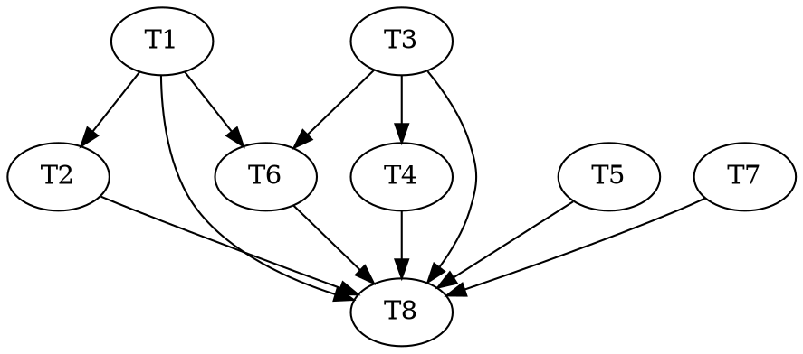

# A1 — Genesis producer Implementation Plan

> **Execution model:** Run **inline this session, autonomously to done**, test-first (RED → GREEN →
> commit per code task), escalating to the human only on the breaking triggers in the spec §9. This
> overrides the writing-plans default handoff (subagent-driven / parallel-session) per the user's stated
> operating model. Adversarial-TDD triads (`red`/`green`/`audit` split across agents) were considered and
> **skipped as disproportionate**: the spec pins crisp examples for a ~30-LOC code core (the skill's own
> "skip when the spec is airtight" case). Steps use checkbox (`- [ ]`) syntax for tracking.

**Goal:** Light up the reasonable atom graph on a live effort for the first time — a non-empty genesis
graph (nested containment tree + planned-needs edges + an initial complexity band) produced by
dispatching the topologist at analysis and persisting its ratified output through a capability-fenced
writer.

**Architecture:** One small production-code change (`lib/graph.mjs` gains a per-atom needs-fidelity
helper and loads the ratified ownership map into its two projections) + a new dependency-free loader
(`lib/ownership.mjs`) + a new fenced writer agent (`agents/genesis-writer.md`, cloned from
`intention-writer`) + orchestration rewiring in the analysis/retro skills + the `route.json` write
retirement. Charters are persisted as `atom-chartered` ledger events by the orchestrator inline.

**Tech Stack:** Node ESM, builtins only (invariant 1). Tests are standalone Node scripts using builtins,
building throwaway git repos in the OS temp dir (repo convention). No package.json, no runner.

**Spec:** `docs/superpowers/specs/2026-07-13-a1-genesis-producer-design.md`

---

## File Structure

| File | New/Mod | Responsibility |
|---|---|---|
| `lib/ownership.mjs` | new | Load + validate `.reasonable/ownership.json` (component → subeffort path). Mirrors `lib/goals.mjs`. |
| `lib/graph.mjs` | mod | Add `needsEdgesWithPlanned(atoms)`; wire it + the ownership map into `deriveCurrent`/`foldAsLived`. |
| `agents/genesis-writer.md` | new | Fenced haiku writer: persist ratified `goals.json`+`policy.json`+`ownership.json`, one atomic commit. |
| `skills/analysis/SKILL.md` | mod | Dispatch the topologist; replace step 10a's `route.json` write with genesis-writer dispatch + inline charter appends. |
| `skills/retro/SKILL.md` | mod | Remove the `route.json` re-sort write (step 5 / line ~107). |
| `docs/artifacts.md` | mod | Document `ownership.json` grammar + `genesis-writer`; mark `route.json` writes retired. |
| `docs/roadmap/atom-graph-orchestrator.md` | mod | Correct the "serves edges compute at A1" line (serves-cones are A2). |
| `.claude-plugin/plugin.json`, `README.md` | mod | Minor version bump (new backward-compatible capability). |
| `test/ownership.test.mjs` | new | Unit tests for the loader. |
| `test/graph-needs-fidelity.test.mjs` | new | Unit tests for `needsEdgesWithPlanned` (genesis / mixed / full-spec). |
| `test/genesis-graph.test.mjs` | new | The acceptance integration test — "does a real effort produce a non-empty genesis graph?" |

---

## Tasks

### Task 1 — `lib/ownership.mjs` loader (TDD)

**Files:** Create `lib/ownership.mjs`, `test/ownership.test.mjs`.

- [ ] **Step 1: Read the pattern.** Read `lib/goals.mjs` to mirror its exact file-read scaffolding
  (path join, `readFileSync`, ENOENT→absent, JSON.parse guard, the `{ x: …, diagnostic }` return shape).

- [ ] **Step 2: Write the failing tests** (`test/ownership.test.mjs`), builtins-only, mirroring the
  assertion style of `test/*.test.mjs`. Cases:
  - absent file → `{ ownership: null, diagnostic: null }`
  - `{}` (empty map) → `{ ownership: {}, diagnostic: null }` (valid; means all-flat placement)
  - `{ "lexer": "frontend/parsing" }` → `{ ownership: { lexer: 'frontend/parsing' }, diagnostic: null }`
  - top-level not an object (array / string) → `ownership: null`, non-null `diagnostic`
  - a value that is not a non-empty string (`{ "lexer": 3 }`, `{ "lexer": "" }`) → `null` + diagnostic
  - malformed JSON → `null` + diagnostic

- [ ] **Step 3: Run to verify RED.** `node test/ownership.test.mjs` → fails (module not found).

- [ ] **Step 4: Implement `lib/ownership.mjs`.** Export `readOwnership(effortRoot)` returning
  `{ ownership, diagnostic }`. Read `join(effortRoot, '.reasonable', 'ownership.json')`; ENOENT →
  `{ ownership: null, diagnostic: null }`; parse failure → `{ ownership: null, diagnostic: '…' }`.
  Validate: parsed must be a plain object (not array/null); every value a non-empty string; one bad
  entry fails the whole load with a diagnostic naming the key. Node builtins + relative imports only
  (invariant 1).

- [ ] **Step 5: Run to verify GREEN.** `node test/ownership.test.mjs` → passes.

- [ ] **Step 6: Commit.** `feat(lib): ownership.json loader (readOwnership)` + co-author trailer.

### Task 2 — genesis graph projection (TDD)

**Files:** Modify `lib/graph.mjs`. Create `test/graph-needs-fidelity.test.mjs`, `test/genesis-graph.test.mjs`.
**Depends on:** Task 1 (`readOwnership`).

- [ ] **Step 1: Write the failing unit tests** (`test/graph-needs-fidelity.test.mjs`) for a new pure
  export `needsEdgesWithPlanned(atoms)`:
  - **genesis** (all atoms have empty `deltaClauses`) → edges equal `plannedNeedsEdges(atoms)`.
  - **full-spec** (all atoms have `deltaClauses`) → edges equal `needsEdges(atoms)` (no planned edges).
  - **mixed** (some spec'd, some not) → a spec'd atom's outgoing edges come only from `needsEdges`; an
    un-spec'd atom's only from `plannedNeedsEdges`; no `from` id appears via both fidelities.

- [ ] **Step 2: Write the failing integration test** (`test/genesis-graph.test.mjs`). Build a throwaway
  git repo with a `.reasonable/` (mirror the temp-repo setup in `test/commit-gate.test.mjs`). Use
  `charterAtom` (from `lib/atom.mjs`) to charter ≥3 atoms across ≥2 components with premises that
  produce both cross-component (`cite:Other#c1`) and intra-component (`order` strata) planned edges.
  Write `goals.json` (≥1 goal), `policy.json` (with `dials.bandScale` + `dials.classifier` cutoffs so a
  band resolves), `ownership.json` (map a component to a `sub/effort` path). Assert:
  - `deriveCurrent(root, { goals }).containment` **nests** the mapped component's atom under its
    subeffort path (a `group` node at that path with the atom as leaf) — NOT flat. (Gap D.)
  - `deriveCurrent(root, { goals }).edges` contains **non-empty `needs` edges** matching the charter
    premises, and `serves` edges are **empty** (no deltas — the A2 boundary).
  - `classify(inputs, policy.dials)` returns a **band string** from `dials.bandScale` (assert it's a
    member of the scale).
  - `deriveConeOrder({ goals, atoms: deriveCurrent(root,{goals}).atoms, weights: policy.weights })`
    yields `routeOrder` = the goal ids in declared order (**non-empty**), and every slice's `woIds` is
    `[]` (cones empty until A2).
  - **Negative:** no `route.json` exists in the repo, yet all the above holds.

- [ ] **Step 3: Run to verify RED.** `node test/graph-needs-fidelity.test.mjs` and
  `node test/genesis-graph.test.mjs` → both fail (export missing / containment flat / needs empty).

- [ ] **Step 4: Implement in `lib/graph.mjs`.**
  - Add pure export `needsEdgesWithPlanned(atoms)`:
    ```js
    export function needsEdgesWithPlanned(atoms) {
      const specced = new Set(atoms.filter((a) => (a.deltaClauses || []).length > 0).map((a) => a.id));
      const planned = plannedNeedsEdges(atoms).filter((e) => !specced.has(e.from));
      return [...planned, ...needsEdges(atoms)]; // needsEdges only emits from specced sources → no overlap
    }
    ```
  - In `foldAsLived` and `deriveCurrent`: replace `...needsEdges(atoms)` with
    `...needsEdgesWithPlanned(atoms)`, and pass the ownership map to the tree:
    `readOwnership(effortRoot).ownership || undefined` → `containmentTree(atoms, { ownershipMap })`.
    Import `readOwnership` from `./ownership.mjs` in the I/O section.

- [ ] **Step 5: Run to verify GREEN.** Both new test files pass. Then run the full suite
  (`for t in test/*.test.mjs; do node "$t"; done`) to confirm no regression in existing graph/reconcile
  tests (foldAsLived/deriveCurrent shape unchanged apart from the intended non-empty genesis needs).

- [ ] **Step 6: Commit.** `feat(graph): planned-needs fidelity + ownership-map nesting in genesis projection`.

### Task 3 — `agents/genesis-writer.md` (authoring)

**Files:** Create `agents/genesis-writer.md`.

- [ ] **Step 1:** Read `agents/intention-writer.md` in full as the pattern.
- [ ] **Step 2:** Author `genesis-writer.md`: `model: haiku`; `tools: Read, Edit, Write, Bash, Grep, Glob`.
  Remit: persist the ratified `.reasonable/goals.json` + `policy.json` + `ownership.json`, **verbatim**
  from the ratified proposal, in **one atomic commit** + a `ratification` ledger line via the ledger
  controller CLI. Carry over intention-writer's disciplines: transcription fidelity (no authoring, no
  sizing, no fork-resolution), HALT-with-`persisted:false` honesty (never a fabricated SHA), the "you
  are the sanctioned exception; add these files to `enforcementPaths`" framing, and the forbidden-moves
  table adapted to the three files. Make explicit: it does **not** write charters (those are ledger
  events the orchestrator appends) and it does **not** ratify.
- [ ] **Step 3: Self-review** against `intention-writer.md`: every fence/honesty discipline carried over,
  no capability added beyond the file set, description one line and accurate.
- [ ] **Step 4: Commit.** `feat(agents): genesis-writer — fenced persistence of ratified genesis files`.

### Task 4 — `skills/analysis/SKILL.md` rewiring (authoring)

**Files:** Modify `skills/analysis/SKILL.md`.
**Depends on:** Task 3 (references `genesis-writer`).

- [ ] **Step 1:** Insert a new step after the intention grill / before ratification (step 9→10): **dispatch
  the topologist** to propose its five §5.1 outputs (component topology, structure-only chartering,
  containment tree + `component→subeffort` ownership map, `policy.json` proposal, t0 classification via
  `classify()`), consuming the grilled goals + intention. Honor mode behavior (gated blocks; autonomous
  self-ratifies-and-logs vision-class proposals, surfacing anything that sizes ceremony).
- [ ] **Step 2:** Rewrite **step 10a**: replace "Persist `route.json`" with — after ratification —
  (a) dispatch the **genesis-writer** to persist `goals.json` + `policy.json` + `ownership.json`; (b)
  the orchestrator appends each **charter** inline via the ledger controller (`atom-chartered` events,
  the id-duality collapse `a-<seq>`); (c) keep the node-planting ledger appends for the ratified
  frontier. Remove the `route.json` JSON block. Keep `route.md` as the human narration (unparsed) or
  fold its role into the topology/goals narration — do not leave a dangling machine-twin reference.
- [ ] **Step 3: Self-review:** the phase still ends at human ratification; no step consolidated; the
  brownfield branch (BF7) is left producing its existing artifacts (greenfield genesis only — spec §7);
  no claim that a plan records a human's words (invariant 7).
- [ ] **Step 4: Commit.** `feat(analysis): dispatch topologist + genesis-writer; retire route.json write`.

### Task 5 — `skills/retro/SKILL.md` route.json retirement (authoring)

**Files:** Modify `skills/retro/SKILL.md`.

- [ ] **Step 1:** Remove the "rewrite `.reasonable/route.json`" instruction at the re-sort step (~line 107);
  the frontier re-sort is expressed through goals/cones, which reconcile already reads. Keep the human
  narration (`route.md`) if the surrounding step relies on it; retire only the machine-twin write.
- [ ] **Step 2: Self-review:** no other step in retro reads `route.json`; the re-sort ratification path is
  intact.
- [ ] **Step 3: Commit.** `refactor(retro): retire route.json re-sort write (reconcile reads goals/cones)`.

### Task 6 — `docs/artifacts.md` (docs)

**Files:** Modify `docs/artifacts.md`.
**Depends on:** Task 1 (ownership shape), Task 3 (genesis-writer).

- [ ] **Step 1:** Add an `ownership.json` entry (mark it `*` machine-parsed — invariant 3): the object
  grammar (component → non-empty subeffort-path string), an example, and the `lib/ownership.mjs` parser
  pointer.
- [ ] **Step 2:** Note the `genesis-writer` as the sanctioned writer of `goals.json`/`policy.json`/
  `ownership.json`; update the `route.json` entry to mark its **writes retired** (both analysis step 10a
  and retro re-sort), leaving the historical/migration note intact.
- [ ] **Step 3: Commit.** `docs(artifacts): ownership.json grammar; genesis-writer; route.json writes retired`.

### Task 7 — `docs/roadmap/atom-graph-orchestrator.md` correction (docs)

**Files:** Modify `docs/roadmap/atom-graph-orchestrator.md`.

- [ ] **Step 1:** Correct the A1 "Ships" line: at genesis the graph lights up as **nested tree +
  planned-needs + band + goal-level `routeOrder`**; **serves-cones (cone contents) are an A2 payoff**
  (`servesEdges` needs spec-time clauses). Keep the sentence honest and brief; mark A1 done-status when
  the build lands (Task 8).
- [ ] **Step 2: Commit.** `docs(roadmap): correct A1 serves-cones scoping (A2 payoff)`.

### Task 8 — version bump + final verification (integration)

**Files:** Modify `.claude-plugin/plugin.json`, `README.md`.
**Depends on:** Tasks 1–7.

- [ ] **Step 1:** Run the **entire** suite: `for t in test/*.test.mjs; do node "$t"; done`. All green.
- [ ] **Step 2:** Bump the version **minor** (new backward-compatible capability) in
  `.claude-plugin/plugin.json`, the README install snippet, and the README footer `Version:` line — all
  the places the version string appears (CLAUDE.md maintenance rule).
- [ ] **Step 3:** Update the roadmap A1 status to reflect it landed (if not folded into Task 7).
- [ ] **Step 4: Commit.** `chore(release): bump vX.Y.0 — A1 genesis producer` + co-author trailer.
- [ ] **Step 5:** Report completion (files, tests, version, what lit up, what's deferred to A2).

---

## Dependency Graph

| Task | Depends On | Files Created/Modified |
|---|---|---|
| T1 ownership loader | — | `lib/ownership.mjs`, `test/ownership.test.mjs` |
| T2 graph projection | T1 | `lib/graph.mjs`, `test/graph-needs-fidelity.test.mjs`, `test/genesis-graph.test.mjs` |
| T3 genesis-writer | — | `agents/genesis-writer.md` |
| T4 analysis rewiring | T3 | `skills/analysis/SKILL.md` |
| T5 retro retirement | — | `skills/retro/SKILL.md` |
| T6 artifacts docs | T1, T3 | `docs/artifacts.md` |
| T7 roadmap correction | — | `docs/roadmap/atom-graph-orchestrator.md` |
| T8 bump + verify | T1–T7 | `.claude-plugin/plugin.json`, `README.md` |



**Wave schedule (no two tasks in a wave modify the same file):**
- **Wave 1:** T1, T3, T5, T7   (independent)
- **Wave 2:** T2 (needs T1), T4 (needs T3), T6 (needs T1,T3)
- **Wave 3:** T8 (needs all)

---

## Self-Review

- **Spec coverage:** topologist dispatch → T4; genesis-writer → T3; charters via ledger → T4 step 2;
  ownership.json + loader → T1/T6; graph projection (planned-needs + nesting) → T2; route.json retirement
  → T4/T5/T6; serves=A2 correction → T7; verification test → T2; version bump → T8; invariants preserved
  → honored per-task (deps-free T1, grammar+parser together T1/T6, no hook change). No gaps.
- **Placeholder scan:** none — concrete test cases, the `needsEdgesWithPlanned` body, exact paths/commands.
- **Type consistency:** `readOwnership` returns `{ ownership, diagnostic }` (T1) and is consumed as
  `readOwnership(effortRoot).ownership` (T2). `needsEdgesWithPlanned(atoms)` defined (T2 step 4) and
  tested (T2 step 1) with the same name. `containmentTree(atoms, { ownershipMap })` matches the existing
  signature (`lib/graph.mjs:13`). `classify(inputs, dials)` matches `lib/ceremony.mjs:46`.
  `deriveConeOrder({goals,atoms,weights})` matches `lib/next-action.mjs:232`.
