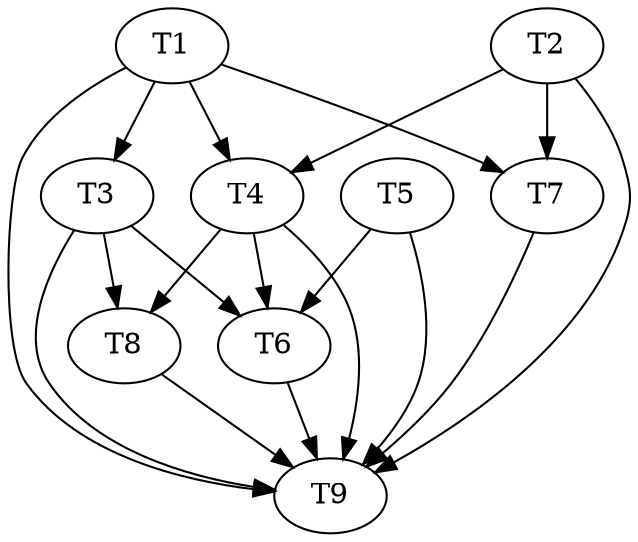

# A2 — Real Spec + Pack Implementation Plan

> **Execution model:** Run **inline this session, autonomously to done**, test-first (RED → GREEN →
> commit per code task), escalating to the human only on a genuine design fork or a broken invariant.
> This overrides the writing-plans default handoff (subagent-driven / parallel-session) per the user's
> stated operating model, and matches the A1 plan's header. Adversarial-TDD triads (`red`/`green`/`audit`
> split across agents) were considered and **skipped as disproportionate**: the code core is deterministic
> fences with crisp examples (union-find cohesion, set-intersection guard, greedy pack), the skill's
> "airtight spec" skip case; and inline execution has no subagent separation to enforce a triad anyway
> (writing-plans, "Requires a subagent-capable executor"). The agent-`.md` tasks (spec-author, footprinter,
> reconciler) are authoring, not TDD-able. Steps use checkbox (`- [ ]`) syntax for tracking.

**Goal:** De-schematize the **Spec** and **Pack** stages of `frontier-wave.workflow.js` so a live effort
authors each top-frontier atom's **real delta**, runs the spec-time decidable fences (R4 cohesion +
checkpoint-2), and packs the spec'd atoms into **actual-footprint-disjoint** waves — replacing the
`specdAtoms = [{ id: 'a-1' }]` placeholder.

**Architecture:** One new dependency-free lib (`lib/spec.mjs`: the pure `cohesionVerdict` / `checkpoint2`
fences + `liveBlastRadii` + a guarded CLI that persists a delta and reports fence verdicts) + one export
promotion and a new CLI mode in the existing footprint path (`lib/graph.mjs` exports `atomFootprint`;
`lib/footprint.mjs` gains `--atoms --json`) + one new fenced agent (`agents/spec-author.md`, the spec-time
twin of topologist→genesis-writer) + remit extensions to `agents/footprinter.md` (run the spec fences) and
`agents/reconciler.md` (briefing carries the ordered `frontier`) + the workflow rewrite. The verdict→state
fold that would *persist* an R4 split or a checkpoint-2 halt is **A3** — A2 *computes and routes* the
verdicts (drops a flagged atom from the wave), it does not land their effects. Dispatch / Collect / Merge
stay schematic (A3).

**Tech Stack:** Node ESM, builtins only (invariant 1). Tests are standalone Node scripts using builtins,
building throwaway git repos in the OS temp dir (repo convention). No package.json, no runner. The workflow
script stays pure — no `import` / `fs` / `Date` / `Math.random` (invariant 5); all disk work is inside
agents.

**Design source of truth:** `docs/DESIGN-3.0.md` §6 (the frontier loop — *spec first, pack second*), §4.1
(the delta authored at `spec'd` entry), §4.3 (the minimality law / R4 cohesion), §7.2 (the twice-run
insanity guard / checkpoint-2), §4.2 (clause ids + `demanded-by` provenance). Roadmap: `docs/roadmap/
atom-graph-orchestrator.md` §A2. **Resolved design fork (this session):** the spec-time delta is authored
by a **new fenced `spec-author` agent** (methodology-honest — real, tooth-bearing clauses the
blind-test-writer translates in A3 — over a mechanical premise-lift).

---

## What already exists (do not rebuild)

- `charterAtom` / `transitionAtom` / `authorDelta` / `enrichDelta` / `loadAtom` / `foldAtoms`
  (`lib/atom.mjs`). `authorDelta(effortRoot, atomId, clauses)` requires the atom in `ready`, appends
  `atom-delta-authored`, and the fold flips it to `spec'd` and populates `deltaClauses`
  (`lib/atom.mjs:221`, verified in `test/atom-ledger.test.mjs:137`).
- The clause shape `{ clauseId, citations, demandedBy, locus }` and its allocator
  `allocateClauseId(effortRoot, component) → { ok, clauseId, seq }` (`lib/clause-id.mjs:58`;
  `makeClause` fixture at `test/atom-ledger.test.mjs:122`).
- `cohesionComponents(clauses, componentRoot) → string[][]` — the §4.3 union-find (`lib/atom.mjs:90`),
  and `rewrite.mjs`'s `ruleOversized` which *validates* an R4 partition against it (A3).
- `atomFootprint(atom, citationGraph)` — the per-atom `{ locus, contracts, resources }` builder,
  currently **module-private** in `lib/graph.mjs:128` (used by `excludesEdges`).
- `pack(footprints) → { wave, deferred }` — greedy first-fit over `{ id, locus, contracts, resources }`,
  tested (`lib/frontier.mjs:135`, `test/frontier-ready-pack.test.mjs`); mirrored pure in the workflow
  (`workflows/frontier-wave.workflow.js:95`). `footprintsDisjoint` (`lib/footprint.mjs:61`).
- `needsEdgesWithPlanned` auto-refines planned→actual as each atom gains `deltaClauses`
  (`lib/graph.mjs:303`); `servesEdges(atoms, goals)` populates once deltas exist (`lib/graph.mjs:160`).
- Goal shape `{ id, scenario, scenarioCitations: [{ clause }] }` (`lib/goals.mjs`); the R2 dead-end
  effect stamps `change.blastRadius: string[]` (`lib/rewrite.mjs:207`).

---

## File Structure

| File | New/Mod | Responsibility |
|---|---|---|
| `lib/spec.mjs` | new | Spec-stage fences + persistence. Pure `cohesionVerdict(atom, componentRoot)` (R4) and `checkpoint2(closure, radii, opts)` (§7.2); ledger fold `liveBlastRadii(effortRoot)`; a guarded CLI: `--author` (persist a delta via `authorDelta`) and `--guard --json` (per-atom cohesion + checkpoint-2 verdicts). Deps-free (invariant 1). |
| `lib/graph.mjs` | mod | Promote `atomFootprint` from private to `export` so `lib/footprint.mjs` reuses it (one footprint algebra, DRY). No behavior change. |
| `lib/footprint.mjs` | mod | Add an `--atoms --json` mode: fold spec'd atoms from the ledger, map `atomFootprint`, emit the SAME `{ footprints, independence }` shape as the work-order mode. |
| `agents/spec-author.md` | new | Fenced author of the spec-time delta: reads the charter + its component's contract + goals, authors the clauses (contract text **and** the machine delta), persists via `node lib/spec.mjs --author`. Its own component only; blind to tests + implementation. |
| `agents/footprinter.md` | mod | Extend the decidable-fence remit: also run `node lib/spec.mjs --guard --json` (cohesion + checkpoint-2) alongside `lib/footprint.mjs --atoms --json`, returning both verbatim over the PERSISTED deltas (independent of the author's self-report). |
| `agents/reconciler.md` | mod | Briefing gains `frontier` — the ready atom ids ordered best-first by policy (`ready()` minus flagged, argmax over `policy.weights`). |
| `workflows/frontier-wave.workflow.js` | mod | De-schematize Spec + Pack (lines 152–159): spec each `briefing.frontier` atom (spec-author), run the fences (footprinter), drop oversized/guard-halted atoms, pack survivors on actual footprints. Extend the `BRIEFING` schema with `frontier`. Add two pure prompt builders. |
| `docs/artifacts.md` | mod | Document the spec stage: `spec-author`, `lib/spec.mjs`'s `--author`/`--guard`, the footprint `--atoms` mode, and the checkpoint-2 producer boundary (radius archival deferred to A3). |
| `docs/roadmap/atom-graph-orchestrator.md` | mod | Mark A2 landed; pin the A2/A3 boundary (verdict→state fold, halt/split *persistence*, radius archival are A3). |
| `.claude-plugin/plugin.json`, `README.md` | mod | Minor version bump (new backward-compatible capability) — v3.3.0 → v3.4.0. |
| `test/spec-guard.test.mjs` | new | Unit tests for `cohesionVerdict`, `checkpoint2`, `liveBlastRadii`, and the CLI (`--author` round-trip, `--guard --json`). |
| `test/footprint-atoms.test.mjs` | new | Unit tests for the `--atoms` footprint mode. |
| `test/frontier-wave-spec-pack.test.mjs` | new | Acceptance: a real spec'd effort packs real, footprint-disjoint waves; serves-cones fill once deltas land; a colliding pair defers. |
| `test/frontier-wave-workflow.test.mjs` | mod | Update the harness for the new labels (`spec-author`, `footprinter`) + `frontier` briefing; add the multi-atom-pack and the fence-drop cases. |

---

## Tasks

### Task 1 — `lib/spec.mjs`: the spec-stage fences + persistence (TDD)

**Files:** Create `lib/spec.mjs`, `test/spec-guard.test.mjs`.

- [ ] **Step 1: Read the patterns.** Read `lib/footprint.mjs` (the guarded-CLI shape: `runCli()` +
  `if (basename(process.argv[1] || '') === '…') { runCli(); }`, and `rootFromArgv`/`argvWithoutRoot`
  from `./effort.mjs`), `lib/clause-id.mjs` (the `readJsonl(join(root,'.reasonable','ledger.jsonl'))`
  ledger-read idiom), and `lib/atom.mjs`'s `cohesionComponents` + `authorDelta` signatures.

- [ ] **Step 2: Write the failing unit tests** (`test/spec-guard.test.mjs`), builtins-only, mirroring
  `test/atom-cohesion.test.mjs`'s `check(name, fn)` harness and `test/atom-ledger.test.mjs`'s temp-effort
  factory. Cases:
  - **`cohesionVerdict`** — one cohesive delta (all clauses share a citation) → `{ kind: 'ok' }`; a
    delta with two disconnected clusters → `{ kind: 'oversized', partition }` with `partition.length === 2`
    (reuse the disconnected fixture from `test/atom-cohesion.test.mjs:124`).
  - **`checkpoint2`** — closure `['lexer','ast']`, radii `[]` → `{ kind: 'ok' }`; closure `['ast']`,
    radii `['ast']` → `{ kind: 'guard-halted', hit: ['ast'] }`; same hit but `{ lineageExempt: true }`
    → `{ kind: 'ok', injected: ['ast'] }` (the §7.2 proceed-with-injection exemption).
  - **`liveBlastRadii`** — a fresh effort (no verdict events) → `[]`; after appending a synthetic
    `atom-verdict` event carrying `effects: [{ nodeId:'a-3', change: { blastRadius: ['ast'] } }]`
    → `['ast']` (deduped, sorted).
  - **CLI `--author`** (child process) — charter+`ready` an atom, run
    `node lib/spec.mjs --author --root <root> --atom <id> --clauses <file.json>`; assert exit 0 and
    `loadAtom` now reports `state === "spec'd"` with the clauses.
  - **CLI `--guard --json`** (child process) — over one cohesive, guard-clear spec'd atom, assert stdout
    parses to `{ atoms: [{ atomId, cohesion: { kind:'ok' }, checkpoint2: { kind:'ok' } }] }`.
  - **CLI-guard regression** — importing `lib/spec.mjs` does NOT run the CLI (mirror
    `test/footprint-disjoint.test.mjs`'s no-`exit(1)` child-process assertion).

- [ ] **Step 3: Run to verify RED.** `node test/spec-guard.test.mjs` → fails (module not found).

- [ ] **Step 4: Implement `lib/spec.mjs`.** Node builtins + relative imports only.

  ```js
  // lib/spec.mjs — the spec-stage decidable fences + delta persistence (DESIGN-3.0 §4.1, §4.3, §6, §7.2).
  // Pure fences: cohesionVerdict (R4) and checkpoint2 (the spec-time insanity guard, §7.2 checkpoint 2).
  // A guarded CLI persists a delta (--author, via lib/atom.mjs authorDelta) and reports the per-atom
  // fence verdicts (--guard --json) over the PERSISTED deltas. Law 1: node builtins + relative imports.
  import { readFileSync } from 'node:fs';
  import { join, basename } from 'node:path';
  import { cohesionComponents, authorDelta, foldAtoms } from './atom.mjs';
  import { citationClosure } from './contract.mjs';
  import { readJsonl, rootFromArgv, argvWithoutRoot } from './effort.mjs';

  const COMPONENT_ROOT = (component) => `lib/${component}`; // fallback root; overridden by ownership map when present

  // R4 — the §4.3 minimality law at spec time. One connected cohesion component ⇒ cohesive.
  export function cohesionVerdict(atom, componentRoot) {
    const partition = cohesionComponents(atom.deltaClauses || [], componentRoot);
    if (partition.length <= 1) return { kind: 'ok' };
    return { kind: 'oversized', partition };
  }

  // checkpoint-2 (§7.2) — the delta's citation closure vs every LIVE blast radius, before dispatch.
  // An intersection HALTs the atom, UNLESS its lineage is the consuming R2 gate (proceed-with-injection).
  export function checkpoint2(closure, radii, { lineageExempt = false } = {}) {
    const radiiSet = new Set(radii || []);
    const hit = [...new Set((closure || []).filter((c) => radiiSet.has(c)))].sort();
    if (hit.length === 0) return { kind: 'ok' };
    if (lineageExempt) return { kind: 'ok', injected: hit };
    return { kind: 'guard-halted', hit };
  }

  // The live blast radii: every R2 (dead-end) blastRadius stamped in the ledger's effects.
  // NOTE (A2/A3 boundary): the §7.2 radius LIFECYCLE — a radius goes archived once its consuming
  // amendment batch lands — rides the A3 verdict→state fold; A2 returns the full stamped set (at
  // greenfield genesis there are no verdict events yet, so this is []). See the roadmap A2/A3 note.
  export function liveBlastRadii(effortRoot) {
    const events = readJsonl(join(effortRoot, '.reasonable', 'ledger.jsonl'));
    const radii = new Set();
    for (const e of events) {
      for (const eff of (e && e.effects) || []) {
        const r = eff && eff.change && eff.change.blastRadius;
        if (Array.isArray(r)) for (const c of r) radii.add(c);
      }
    }
    return [...radii].sort();
  }

  function guardOne(effortRoot, atom, radii) {
    const root = COMPONENT_ROOT(atom.component);
    const cohesion = cohesionVerdict(atom, root);
    const seeds = [atom.component, ...(atom.deltaClauses || []).flatMap(
      (cl) => (cl.citations || []).map((ci) => ci.component))];
    const closure = citationClosure(effortRoot, [...new Set(seeds)]);
    const lineageExempt = typeof atom.lineage === 'string' && atom.lineage.startsWith('R2');
    const cp2 = checkpoint2(closure, radii, { lineageExempt });
    return { atomId: atom.id, cohesion, closure, checkpoint2: cp2 };
  }

  function runCli() {
    const argv = argvWithoutRoot(process.argv).slice(2);
    const effortRoot = rootFromArgv(process.argv, process.cwd());
    if (!effortRoot) { console.error('spec: no effort root'); process.exit(1); }

    if (argv.includes('--author')) {
      const atomId = argv[argv.indexOf('--atom') + 1];
      const clausesFile = argv[argv.indexOf('--clauses') + 1];
      const clauses = JSON.parse(readFileSync(clausesFile, 'utf8'));
      const r = authorDelta(effortRoot, atomId, clauses);
      if (!r.ok) { console.error(r.error); process.exit(1); }
      console.log(JSON.stringify({ ok: true, atomId }));
      process.exit(0);
    }

    if (argv.includes('--guard')) {
      const ids = argv.filter((a) => !a.startsWith('--')); // the bare (non-flag) args are the atom ids
      const atoms = Object.values(foldAtoms(effortRoot)).filter((a) => ids.length === 0 || ids.includes(a.id));
      const radii = liveBlastRadii(effortRoot);
      const out = atoms.map((a) => guardOne(effortRoot, a, radii));
      console.log(JSON.stringify({ atoms: out }, null, 2));
      process.exit(0);
    }
    console.error('spec: expected --author or --guard'); process.exit(1);
  }

  if (basename(process.argv[1] || '') === 'spec.mjs') { runCli(); }
  ```
  Notes for the implementer: verify `foldAtoms`, `citationClosure`, `rootFromArgv`, `argvWithoutRoot`
  signatures at implement time and adjust arg-parsing to match `lib/footprint.mjs`'s exact idiom (that
  file is the canonical CLI precedent). `COMPONENT_ROOT` is a thin fallback — when an ownership map
  exists, the component root should come from it; keep the fallback until A-later wires ownership into
  the fence. Keep `guardOne` returning `closure` so the footprinter can hand the workflow a real
  footprint without a second computation.

- [ ] **Step 5: Run to verify GREEN.** `node test/spec-guard.test.mjs` → passes.

- [ ] **Step 6: Commit.** `feat(lib): spec-stage fences + delta persistence (lib/spec.mjs)` + co-author trailer.

### Task 2 — footprints for atoms: export `atomFootprint` + `--atoms` mode (TDD)

**Files:** Modify `lib/graph.mjs`, `lib/footprint.mjs`. Create `test/footprint-atoms.test.mjs`.

- [ ] **Step 1: Write the failing unit test** (`test/footprint-atoms.test.mjs`). Build a temp effort
  (mirror `test/atom-ledger.test.mjs`'s factory). Charter → `ready` → `authorDelta` two atoms in two
  components with **disjoint** footprints (distinct loci, distinct cited components), and a third that
  **collides** with the first (shares a cited component). Assert:
  - `node lib/footprint.mjs --atoms --root <root> --json` prints
    `{ footprints: [...], independence: [...] }` — one footprint per spec'd atom, each
    `{ id, locus, contracts, resources }` (`contracts` = the citation **closure**, not the raw cites),
    and the collision surfaces as an `independence` pair with `ok: false`.
  - Feeding `footprints` into `pack` (import from `lib/frontier.mjs`) puts the two disjoint atoms in the
    wave and defers the collider.

- [ ] **Step 2: Run to verify RED.** `node test/footprint-atoms.test.mjs` → fails.

- [ ] **Step 3: Implement.**
  - `lib/graph.mjs`: change `function atomFootprint(` → `export function atomFootprint(` (line 128).
    No other change — `excludesEdges` still calls it locally. Run `node test/graph-projections.test.mjs`
    and any graph test to confirm the export is inert.
  - `lib/footprint.mjs`: import `atomFootprint` from `./graph.mjs` and `foldAtoms` from `./atom.mjs`;
    in `runCli()`, branch on `args.includes('--atoms')`: fold the atoms, keep those with non-empty
    `deltaClauses` (spec'd), map each through `atomFootprint(atom, liveCitationGraph(effortRoot))` plus
    `id`, then emit the **same** `{ footprints, independence }` object the work-order branch builds
    (reuse the existing pairwise-`independent` loop verbatim — only the footprint *source* differs).

- [ ] **Step 4: Run to verify GREEN.** `node test/footprint-atoms.test.mjs` passes; re-run the existing
  `test/footprint-disjoint.test.mjs` and `test/graph-projections.test.mjs` — no regression.

- [ ] **Step 5: Commit.** `feat(footprint): export atomFootprint; --atoms mode packs real spec'd atoms`.

### Task 3 — `agents/spec-author.md` (authoring)

**Files:** Create `agents/spec-author.md`.
**Depends on:** Task 1 (uses `node lib/spec.mjs --author`).

- [ ] **Step 1:** Read `agents/genesis-writer.md` and `agents/implementer.md` as patterns (the fenced,
  single-responsibility writer; the "enrich your own component's contract" contract-authoring discipline).
- [ ] **Step 2:** Author `spec-author.md`. `model: sonnet`; `tools: Read, Edit, Write, Bash, Grep, Glob`.
  Remit — for one atom handed by the orchestrator (id + effort root):
  - **Read** the atom's charter (`loadAtom` via a read, or the ledger), its **own component's** contract
    (`lib/contract.mjs` `contractPath`/`loadContract`), the ratified `goals.json`, and everything landed
    so far (§4.1: "from the accumulated canonical contract state, the goal's scenario, and everything
    landed by then").
  - **Author the real delta** — the new/changed clauses for THIS atom's component only. Write the clause
    text into the component contract file (the musts the blind-test-writer will translate in A3), and
    build the machine delta: for each clause allocate `allocateClauseId(root, component)`, and record
    `{ clauseId, citations: [{ component, clause }], demandedBy: '<tag>:<ref>', locus: [...] }` (the
    `demanded-by` provenance per §4.2 — a goal assertion, a consuming citation, or the chartering event).
  - **Persist** the machine delta via `node <plugin>/lib/spec.mjs --author --root <root> --atom <id>
    --clauses <clausesFile>` (moves the atom `ready → spec'd`). Return `{ ok: true, atomId }` on success,
    or `{ ok: false, atomId, reason }` — never a fabricated success.
  - **Fences (state them explicitly, forbidden-moves table like genesis-writer):** authors ONLY its own
    component's contract + the machine delta; never writes tests, never touches a foreign contract, the
    derived index, or the enforcement layer; does NOT run the cohesion/checkpoint-2 fences on its own
    delta (that is the footprinter's independent job — no self-grading); does NOT pack, dispatch, or
    transition beyond `ready → spec'd`; escalates rather than inventing a clause the contract/goal does
    not support.
- [ ] **Step 3: Fence-integration self-review.** Confirm how `lib/fence.mjs` governs a contract write at
  spec time — the implementer already writes its component contract via enrichment, so verify whether the
  spec-author rides that allowance or needs adding to the contract-write allowlist. If it needs adding,
  note it as an explicit follow-up in the commit body (do NOT silently weaken a fence). In THIS repo the
  hook no-ops (no `.reasonable/`), so this is a correctness note for real efforts, not a test here.
- [ ] **Step 4: Self-review** against genesis-writer: every fence/honesty discipline carried over, no
  capability beyond {own contract, machine delta}, description one line and accurate.
- [ ] **Step 5: Commit.** `feat(agents): spec-author — fenced author of the spec-time delta`.

### Task 4 — `agents/footprinter.md`: run the spec fences (authoring)

**Files:** Modify `agents/footprinter.md`.
**Depends on:** Task 1, Task 2.

- [ ] **Step 1:** Read the current `agents/footprinter.md` (its "decidable-fence, decides nothing,
  computes nothing by judgment, surfaces gaps rather than papering over" charter).
- [ ] **Step 2:** Extend the remit to the spec/pack decidable fences as a set (all decidable, all
  read-only over persisted state): run **both** `node <plugin>/lib/footprint.mjs --atoms --root <root>
  --json <ids…>` (actual footprints) **and** `node <plugin>/lib/spec.mjs --guard --root <root> --json
  <ids…>` (cohesion + checkpoint-2), and return, per atom, the merged verbatim record
  `{ id, locus, contracts, resources, cohesion, checkpoint2 }`. Keep the completeness obligation: fewer
  records than ids handed in is a surfaced gap (a HALT upstream), never papered over. State plainly it
  reads the **persisted** delta (so the author cannot self-clear its own fence) and decides/edits nothing
  — the workflow routes the verdicts.
- [ ] **Step 3: Self-review:** tool allowlist unchanged (`Read, Grep, Glob, Bash`); no judgment added;
  description updated to name the spec fences.
- [ ] **Step 4: Commit.** `feat(agents): footprinter also runs the spec-time fences (cohesion + checkpoint-2)`.

### Task 5 — `agents/reconciler.md`: the ordered `frontier` in the briefing (authoring)

**Files:** Modify `agents/reconciler.md`.

- [ ] **Step 1:** Read the current `agents/reconciler.md` and the `BRIEFING` schema in
  `workflows/frontier-wave.workflow.js:34-54` to match field naming/return discipline.
- [ ] **Step 2:** Add to the briefing a `frontier: string[]` field — the **ready** atom ids
  (`lib/frontier.mjs` `ready(graph, flags)` semantics: `chartered`/`ready`/`spec'd`, minus
  frozen/guard-halted/barred, whose planned-needs providers have merged) ordered **best-first by policy**
  (argmax over `policy.weights`; on a tie, charter order). Keep it bounded (the reconciler already reads
  the full graph + policy). State it is derived, never invented, and empty when the frontier is empty
  (which the gate reads as starvation).
- [ ] **Step 3: Self-review:** no new mutation power (reconciler stays read-only + Bash); `frontier` is
  additive to the existing briefing; ordering rule stated once, unambiguously.
- [ ] **Step 4: Commit.** `feat(agents): reconciler briefing carries the policy-ordered frontier`.

### Task 6 — workflow: de-schematize Spec + Pack (TDD)

**Files:** Modify `workflows/frontier-wave.workflow.js`, `test/frontier-wave-workflow.test.mjs`.
**Depends on:** Task 3, Task 4, Task 5.

- [ ] **Step 1: Update the harness + write the failing behavioral tests** in
  `test/frontier-wave-workflow.test.mjs` (the stub-`agent()`-by-`opts.label` harness):
  - Extend `baseBriefing` with `frontier: ['a-1']`, and add default stubs so a wave is non-empty:
    `spec-author` → `{ ok: true, atomId: 'a-1' }`; `footprinter` →
    `{ footprints: [{ id: 'a-1', locus: [], contracts: [], resources: [], cohesion: { kind: 'ok' }, checkpoint2: { kind: 'ok' } }] }`.
  - **New case — multi-atom disjoint pack:** `frontier: ['a-1','a-2']`, footprinter returns two
    footprints disjoint by locus, both `cohesion/checkpoint2 = ok`. Assert both dispatch (the
    `implementer` label is called for `a-1` and `a-2`) — i.e. `pack` produced a two-atom wave.
  - **New case — R4 drop:** one atom's footprinter record has `cohesion: { kind: 'oversized' }`. Assert
    that atom is NOT dispatched (held out of the wave) and the run still returns a valid 7-variant gate.
  - **New case — checkpoint-2 drop:** one atom's record has `checkpoint2: { kind: 'guard-halted' }`.
    Assert it is NOT dispatched and the run still returns a valid gate.
  - Keep the existing 7-variant, role-minimal, and purity assertions green (the purity test already
    guards `import`/`fs`/`Date`/`Math.random`).

- [ ] **Step 2: Run to verify RED.** `node test/frontier-wave-workflow.test.mjs` → the new cases fail
  (the schematic single-atom stub ignores `frontier` and the fence verdicts).

- [ ] **Step 3: Implement the workflow rewrite.**
  - Extend the `BRIEFING` schema (after line 52): `frontier: { type: 'array', items: { type: 'string' } }`.
  - Add two pure prompt builders next to `reconcilePrompt` (pure string assembly only):
    ```js
    function specAuthorPrompt(a, atomId) {
      return [
        `Author the real spec-time delta for atom ${atomId} (§4.1: from the canonical contract state,`,
        'the goal scenario, and everything landed). Write your own component contract + the machine delta;',
        `persist via lib/spec.mjs --author. Effort root: ${a && a.effortRoot}. Return { ok, atomId }.`,
      ].join('\n');
    }
    function footprintPrompt(a, ids) {
      return [
        'Run the spec-time decidable fences over the PERSISTED deltas and return them verbatim:',
        'lib/footprint.mjs --atoms (actual footprints) and lib/spec.mjs --guard (cohesion + checkpoint-2).',
        `Effort root: ${a && a.effortRoot}. Atom ids: ${(ids || []).join(', ')}.`,
      ].join('\n');
    }
    ```
  - Replace lines 152–159 (`phase('Spec')` … the `pack(specdAtoms)` block) with:
    ```js
    phase('Spec');
    // §6: spec first. Author each ready frontier atom's real delta (ready -> spec'd). Serial safety via
    // parallel-then-collect; the spec-author is fenced (own contract + machine delta only).
    const frontier = briefing.frontier || [];
    const specd = (await parallel(frontier.map((atomId) => () =>
      guard(() => agent(specAuthorPrompt(args, atomId), { label: 'spec-author', atomId }))
    )));
    for (const s of specd) {
      if (s && s.__budgetExhausted) return { kind: 'budget-exhausted', detail: { stage: 'spec-author', message: s.message } };
    }
    const specdIds = specd.filter((s) => s && s.ok).map((s) => s.atomId);

    // The spec-time decidable fences (§4.3 cohesion + §7.2 checkpoint-2) + actual footprints, computed by
    // the footprinter over the PERSISTED deltas (independent of the author's self-report).
    const fenced = specdIds.length
      ? await guard(() => agent(footprintPrompt(args, specdIds), { label: 'footprinter', atomIds: specdIds }))
      : { footprints: [] };
    if (fenced && fenced.__budgetExhausted) return { kind: 'budget-exhausted', detail: { stage: 'footprinter', message: fenced.message } };

    phase('Pack');
    // Route the fence verdicts: an oversized atom (R4 — the split is A3) or a guard-halted atom
    // (checkpoint-2 hit) is held OUT of this wave. A2 drops it; A3's verdict->state fold persists the
    // split/halt effect. At greenfield genesis no atom is dropped (cohesive deltas, no live radii).
    const perAtom = (fenced && fenced.footprints) || [];
    const packable = perAtom.filter((f) =>
      !(f.cohesion && f.cohesion.kind === 'oversized') &&
      !(f.checkpoint2 && f.checkpoint2.kind === 'guard-halted'));
    const heldOut = perAtom.length - packable.length;
    if (heldOut > 0) log(`${heldOut} atom(s) held out of the wave by a spec-time fence (R4/checkpoint-2).`);
    const { wave: waveIds } = pack(packable);
    log(`packed ${waveIds.length} atom(s) into this wave on actual footprints.`);
    ```
  - Leave Dispatch / Collect / Merge (lines 161–201) untouched — they already loop `waveIds`; A3
    de-schematizes them. Confirm `gateState.frontierSize = waveIds.length` (line ~207) still holds.

- [ ] **Step 4: Run to verify GREEN.** `node test/frontier-wave-workflow.test.mjs` → all pass, including
  the purity assertion (no `import`/`fs`/`Date`/`Math.random` introduced — the prompt builders are pure
  string assembly). Also run `node test/workflow-load.test.mjs` if present (the global purity gate).

- [ ] **Step 5: Commit.** `feat(frontier-wave): de-schematize Spec + Pack — real deltas, real footprints`.

### Task 7 — acceptance: a spec'd effort packs real disjoint waves (TDD)

**Files:** Create `test/frontier-wave-spec-pack.test.mjs`.
**Depends on:** Task 1, Task 2.

- [ ] **Step 1: Write the failing integration test.** Build a throwaway git repo with `.reasonable/`
  (mirror `test/genesis-graph.test.mjs` / `test/atom-ledger.test.mjs`). Charter → `ready` → `authorDelta`
  **three** atoms:
  - `a-A` in component `lexer`, locus `['lib/lexer/**']`, one clause citing `ast#cN`.
  - `a-B` in component `parser`, locus `['lib/parser/**']`, one clause citing `eval#cN` (disjoint from A).
  - `a-C` in component `lexer2`, locus `['lib/lexer/**']` (collides with A on locus).
  Write `goals.json` with one goal whose `scenarioCitations` reference `a-A`'s and `a-B`'s clause ids
  (so serves resolves). Assert:
  - `deriveCurrent(root, { goals }).edges` now contains **non-empty `serves` edges** for `a-A`/`a-B`
    (the A2 payoff — cone *contents* fill once deltas land; empty at A1).
  - Building footprints from `atomFootprint` (or the `--atoms` CLI) and calling `pack`, the wave is
    `['a-A','a-B']` and `a-C` is deferred (locus collision with `a-A`).
  - `needsEdgesWithPlanned` for these now emits the **actual** needs edge `a-A → ast`'s provider if that
    provider is spec'd, and no planned edge remains for a spec'd `from` (planned→actual refinement fired).

- [ ] **Step 2: Run to verify RED**, then rely on Tasks 1–2 being GREEN. If this task runs after Tasks
  1–2 landed, Step 1 should already pass — in that case treat it as the acceptance gate (it must exercise
  the real path, not restate a unit test). If it fails, the failure is the signal that spec→pack is not
  wired end-to-end; fix in `lib/` (not by weakening the test).

- [ ] **Step 3: Run to verify GREEN.** `node test/frontier-wave-spec-pack.test.mjs` passes.

- [ ] **Step 4: Commit.** `test(frontier-wave): acceptance — spec'd effort packs real disjoint waves, serves-cones fill`.

### Task 8 — docs: artifacts + roadmap (docs)

**Files:** Modify `docs/artifacts.md`, `docs/roadmap/atom-graph-orchestrator.md`.
**Depends on:** Task 3, Task 4.

- [ ] **Step 1 (`artifacts.md`):** Document the spec stage — the `spec-author` as the sanctioned author of
  the spec-time delta (its own component contract + the `atom-delta-authored` machine delta); `lib/spec.mjs`
  and its `--author`/`--guard` CLI; the footprint `--atoms` mode. Mark any newly machine-parsed shape with
  `*` (invariant 3) — the `--guard --json` verdict shape `{ atoms: [{ atomId, cohesion, closure,
  checkpoint2 }] }` and the footprinter's merged per-atom record. Note the checkpoint-2 producer's
  **A2/A3 boundary**: A2 computes + routes the verdict; the radius *lifecycle* (archival on amendment
  landing) and the persisted halt/split effect ride the A3 verdict→state fold.
- [ ] **Step 2 (`roadmap`):** Update the A2 section — status **A2 LANDED**; "Ships" confirmed
  (`frontier-wave` packs real atoms into real, footprint-disjoint waves; serves-cone *contents* fill;
  planned→actual edges refine). Pin explicitly what A2 defers to A3: the verdict→state fold, the
  persistence of an R4 split / a checkpoint-2 halt, and the blast-radius archival lifecycle. Keep the
  open pieces intact (calibration §16, brownfield genesis).
- [ ] **Step 3: Commit.** `docs(artifacts,roadmap): spec-author + spec fences; A2 landed, A2/A3 boundary pinned`.

### Task 9 — version bump + final verification (integration)

**Files:** Modify `.claude-plugin/plugin.json`, `README.md`.
**Depends on:** Tasks 1–8.

- [ ] **Step 1:** Run the **entire** suite: `for t in test/*.test.mjs; do node "$t"; done`. All green
  (PowerShell: `Get-ChildItem test/*.test.mjs | ForEach-Object { node $_.FullName }`).
- [ ] **Step 2:** Bump the version **minor** (new backward-compatible capability) v3.3.0 → **v3.4.0** in
  `.claude-plugin/plugin.json`, the README install snippet, and the README footer `Version:` line — all
  the places the version string appears (CLAUDE.md maintenance rule).
- [ ] **Step 3:** Confirm the roadmap A2 status reflects landed (from Task 8) and CLAUDE.md's headline
  version line (`reasonable is at v3.x.x`) is updated if it names the version.
- [ ] **Step 4: Commit.** `chore(release): bump v3.4.0 — A2 real spec + pack` + co-author trailer.
- [ ] **Step 5:** Report completion (files, tests, version, what lit up — real deltas, actual-footprint
  packing, serves-cone contents — and what's deferred to A3: the verdict→state fold, halt/split
  persistence, radius archival, and Dispatch/Merge de-schematization).

---

## Dependency Graph

| Task | Depends On | Files Created/Modified |
|---|---|---|
| T1 spec.mjs fences | — | `lib/spec.mjs`, `test/spec-guard.test.mjs` |
| T2 footprint atoms | — | `lib/graph.mjs`, `lib/footprint.mjs`, `test/footprint-atoms.test.mjs` |
| T3 spec-author agent | T1 | `agents/spec-author.md` |
| T4 footprinter agent | T1, T2 | `agents/footprinter.md` |
| T5 reconciler frontier | — | `agents/reconciler.md` |
| T6 workflow Spec+Pack | T3, T4, T5 | `workflows/frontier-wave.workflow.js`, `test/frontier-wave-workflow.test.mjs` |
| T7 acceptance test | T1, T2 | `test/frontier-wave-spec-pack.test.mjs` |
| T8 docs | T3, T4 | `docs/artifacts.md`, `docs/roadmap/atom-graph-orchestrator.md` |
| T9 bump + verify | T1–T8 | `.claude-plugin/plugin.json`, `README.md` |



**Wave schedule (no two tasks in a wave modify the same file):**
- **Wave 1:** T1, T2, T5   (independent; distinct files)
- **Wave 2:** T3 (needs T1), T4 (needs T1,T2), T7 (needs T1,T2)
- **Wave 3:** T6 (needs T3,T4,T5), T8 (needs T3,T4)
- **Wave 4:** T9 (needs all)

*File-conflict check:* T3 and T4 both touch `agents/` but different files; T6 is the only writer of the
workflow + its test; T8 is the only writer of docs; no two independent tasks share a file. ✓

---

## Self-Review

- **Spec coverage (roadmap A2 + DESIGN §6):**
  - "author its real delta" → T3 (spec-author) + `authorDelta` persistence in T1; the machine delta shape
    is `test/atom-ledger.test.mjs`-verified.
  - "refine planned → actual edges" → no new code (auto via `needsEdgesWithPlanned` once `deltaClauses`
    populate); **asserted** in T7 step 1.
  - "run the cohesion check (R4)" → `cohesionVerdict` (T1), run by the footprinter (T4), routed by the
    workflow (T6 drops oversized); split *persistence* is A3 (stated).
  - "run the spec-time guard (checkpoint-2)" → `checkpoint2` + `liveBlastRadii` (T1), run by the
    footprinter (T4), routed by the workflow (T6 drops guard-halted); the radius lifecycle + halt
    persistence are A3 (stated, roadmap-pinned in T8).
  - "Pack on actual footprints" → `atomFootprint` export + `--atoms` mode (T2), fed to the tested `pack`
    (T6, T7).
  - "Ships: packs real atoms into real, footprint-disjoint waves" → T7 acceptance.
  - Serves-cone *contents* fill (roadmap A1 note's A2 payoff) → asserted in T7.
- **Invariants:** dep-free `lib/` (T1/T2 builtins + relative imports only); workflow purity (T6 prompt
  builders are pure strings; the purity test guards it); machine-grammar + parser land together (T1 CLI
  verdict shape documented in T8, invariant 3); no `DESIGN.md`/`DESIGN-3.0.md` section renumbering; no
  agent tool-allowlist weakened (footprinter/reconciler keep their allowlists; spec-author's fence is
  stated and its contract-write allowance is flagged, not silently granted — T3 step 3); fail-open/closed
  untouched (no hook path changed).
- **Placeholder scan:** concrete function bodies (`cohesionVerdict`/`checkpoint2`/`liveBlastRadii`, the
  workflow Spec+Pack block, both prompt builders), concrete test cases with real fixtures, exact
  paths/commands. The two "verify at implement time" notes (Task 1 arg-parsing against `footprint.mjs`;
  Task 3 fence allowance) are *verification* steps against named files, not deferred design.
- **Type consistency:** the fence verdict shapes are used identically everywhere — `cohesionVerdict`
  returns `{ kind:'ok' } | { kind:'oversized', partition }` (T1) and the workflow filters on
  `f.cohesion.kind === 'oversized'` (T6); `checkpoint2` returns `{ kind:'ok' } | { kind:'guard-halted', hit }`
  and the workflow filters on `f.checkpoint2.kind === 'guard-halted'`. The footprinter's per-atom record
  `{ id, locus, contracts, resources, cohesion, checkpoint2 }` (T4) is exactly what `pack` consumes
  (`{id,locus,contracts,resources}`, extra fields ignored) and what T6 filters. `authorDelta(root, id,
  clauses)` (T1 CLI) matches `lib/atom.mjs:221`. `atomFootprint(atom, citationGraph)` (T2) matches
  `lib/graph.mjs:128`. `pack(footprints)` matches `lib/frontier.mjs:135`.
```
