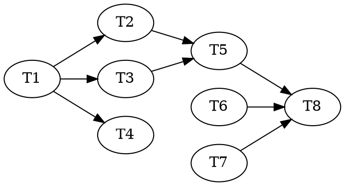

# Frontier-Wave Drift Fix + Atom-Graph Gap Roadmap — Implementation Plan

> **For agentic workers:** REQUIRED: Use superpowers:subagent-driven-development or superpowers:executing-plans to implement this plan. Steps use checkbox (`- [ ]`) syntax for tracking.

**Goal:** Fix the stale-`vertical-slice-runner` reference drift across the live orchestration surfaces (the entry skill launches a deleted workflow with an obsolete result union), harden against recurrence with a mechanical guard test, and lay down the two roadmap problem-files that convert the atom-graph efficiency gaps into properly-scoped design work.

**Architecture:** Two halves. **Half A (bug fix, ships working software):** a `workflows/*.workflow.js` file was renamed `vertical-slice-runner.workflow.js` → `frontier-wave.workflow.js`, but ~7 live surfaces (`skills/`, `agents/`, `docs/architecture.md`, workflow comments) still name the deleted file — and `skills/develop/SKILL.md` step 6 actually *launches* it and routes the pre-frontier **4-variant** `GATE_RESULT` instead of the current **7-variant** one. We repoint the entry skill to delegate to `reasonable:vertical-slice-execution` (the maintained phase skill that already launches `frontier-wave` and routes the 7 variants), reconcile the authoritative docs, and add a guard test that fails whenever a live surface names a nonexistent workflow file. **Half B (gap closure, ships design artifacts):** two `docs/roadmap/*.md` problem-files — one for the atom-graph orchestrator on-ramp (gaps A+B+D from the architecture analysis), one for the knowledge-brick unification (gap C) — each in the repo's roadmap format so a dedicated design session can pick them up. We do **not** write implementation tasks for undesigned work.

**Tech Stack:** Dependency-free Node ESM (`node:*` builtins only, no package.json), Markdown skills/agent constitutions with normative force, polyglot hook bridge. Tests are standalone `node test/<name>.test.mjs` scripts — see [running-tests](knowledge/running-tests.md).

---

## Scope note (read before starting)

This plan deliberately does **not** contain implementation tasks for the four architecture gaps:

- **A** — de-schematize `frontier-wave.workflow.js` (its Spec/Pack/Merge are hardcoded stubs, `frontier-wave.workflow.js:152-201`) and build a live producer for `goals.json` / `policy.json`.
- **B** — wire `lib/ceremony.mjs classify()` at genesis and give the phase-degeneration predicate a mechanical spec + calibrate thresholds.
- **C** — the knowledge-brick unification (lift `Kind` onto the atom so an investigation is a first-class graph node).
- **D** — collapse the Node/Atom id-duality.

Reasons, made explicit so a reviewer can check them: (1) The writing-plans **No Placeholders** rule forbids "implement the genesis producer" tasks with no test code — and there is no interface spec to write test code against. (2) `DESIGN-3.0.md §16` states the classifier thresholds, the band cutoffs, and the phase-degeneration predicate are "to be settled with ledger data, not asserted." (3) Gap C is net-new design with no spec at all. (4) `CLAUDE.md` invariant #7 + the roadmap README pin this repo's pipeline as **roadmap problem-file → dedicated design session → plan**. Half B produces exactly those problem-files, which is the correct and honest "close the gap" move for undesigned work. When a design session ratifies either problem-file, *that* is when its implementation plan gets written.

**Adversarial-TDD triads:** not used in this plan. The one task with test code (Task 1) is a mechanical existence-invariant guard, not intent-pinning behavior with ambiguity (the skill says skip triads for "a spec so airtight it supplies the critical examples itself"). Every other task is a documentation edit verified by that guard plus human review. No behavior task certifies its own interpretation, so no red/green/audit separation is required.

---

## File Structure

**Created:**
- `test/live-workflow-refs.test.mjs` — guard: every `*.workflow.js` file named by a live surface must exist in `workflows/`. Owns nothing else.
- `docs/roadmap/atom-graph-orchestrator.md` — problem-file for gaps A+B+D (the dynamic engine has no live dispatcher).
- `docs/roadmap/knowledge-brick.md` — problem-file for gap C (knowledge work is not a first-class brick).

**Modified:**
- `skills/develop/SKILL.md` — step 6 delegates to `reasonable:vertical-slice-execution`; drop the deleted-workflow launch + 4-variant union; rename the bare `vertical-slice-runner` token at the nesting note.
- `docs/architecture.md` — the live-plane workflow table row, the sketch heading, and the bare mentions renamed to `frontier-wave`; the result-union arity updated 4 → 7 where it appears.
- `skills/scaffolding/SKILL.md`, `agents/characterizer.md`, `agents/reconciler.md`, `workflows/spike.workflow.js`, `workflows/characterization.workflow.js` — bare-name consistency rename.
- `docs/roadmap/README.md` — two new bullets under "Open problems" indexing the new problem-files.
- `.claude-plugin/plugin.json`, `README.md` — version bump (patch) + the two mirror version strings.

---

## Task 1: Guard test — a live surface may not name a nonexistent workflow (RED)

**Files:**
- Create: `test/live-workflow-refs.test.mjs`

This is the failing test that pins the bug. It scans the *current-system* surfaces (`skills/`, `agents/`, `docs/architecture.md`) — **not** `workflows/` itself (a workflow's own header comment legitimately names its deleted predecessor, e.g. `frontier-wave.workflow.js:6` "Replaces workflows/vertical-slice-runner.workflow.js") and **not** `docs/superpowers/**` (point-in-time plans/specs, `CLAUDE.md` invariant #7). It matches only the `<name>.workflow.js` *filename* form, so bare-prose mentions of the old name are out of scope for the guard (they are cleaned up in Tasks 2–4 but not mechanically enforced, to avoid false-positives on historical prose).

- [ ] **Step 1: Write the guard test**

```javascript
// live-workflow-refs.test.mjs — every `*.workflow.js` FILE named by a LIVE orchestration
// surface (skills/, agents/, docs/architecture.md) must actually EXIST in workflows/.
// Catches the rename-drift class: a workflow is renamed (vertical-slice-runner.workflow.js
// -> frontier-wave.workflow.js) but a launch/reference in a live skill or the authoritative
// architecture doc still names the deleted file.
//
// Deliberately NOT scanned: workflows/ itself (a workflow header may name its deleted
// predecessor as a historical note) and docs/superpowers/** (point-in-time plans and specs,
// CLAUDE.md invariant #7). Only the `<name>.workflow.js` filename form is matched — bare-prose
// mentions of an old name are out of scope here.
// Run: node test/live-workflow-refs.test.mjs

import assert from 'node:assert';
import { readdirSync, readFileSync } from 'node:fs';
import { join, dirname, relative } from 'node:path';
import { fileURLToPath } from 'node:url';

const here = dirname(fileURLToPath(import.meta.url));
const root = join(here, '..');

// Ground truth: workflow files that actually exist right now.
const realWorkflows = new Set(
  readdirSync(join(root, 'workflows')).filter((n) => n.endsWith('.workflow.js')),
);

// Live surfaces that describe the CURRENT system.
const SURFACE_DIRS = ['skills', 'agents'];
const SURFACE_FILES = [join('docs', 'architecture.md')];

function collect(dir) {
  const out = [];
  for (const e of readdirSync(dir, { withFileTypes: true })) {
    const p = join(dir, e.name);
    if (e.isDirectory()) out.push(...collect(p));
    else if (e.name.endsWith('.md') || e.name.endsWith('.js')) out.push(p);
  }
  return out;
}

const files = [
  ...SURFACE_DIRS.flatMap((d) => collect(join(root, d))),
  ...SURFACE_FILES.map((f) => join(root, f)),
];

const REF = /\b([\w-]+\.workflow\.js)\b/g;
const violations = [];
for (const f of files) {
  const src = readFileSync(f, 'utf8');
  for (const m of src.matchAll(REF)) {
    if (!realWorkflows.has(m[1])) {
      violations.push(`${relative(root, f).replace(/\\/g, '/')} references ${m[1]} (no such file in workflows/)`);
    }
  }
}

let passed = 0;
function check(name, fn) {
  try { fn(); passed += 1; console.log(`  ok  ${name}`); }
  catch (e) { console.error(`FAIL  ${name}\n      ${e.message}`); process.exitCode = 1; }
}

check('every workflow named by a live surface exists in workflows/', () => {
  assert.deepStrictEqual(violations, [], `\n  - ${violations.join('\n  - ')}`);
});

if (process.exitCode) console.error(`\nlive-workflow-refs: FAILURES above (${passed} passed).`);
else console.log(`\nlive-workflow-refs: all referenced workflows exist. ✓`);
```

- [ ] **Step 2: Run it to verify it FAILS for the right reason**

Run: `node test/live-workflow-refs.test.mjs`
Expected: FAIL, listing at least `skills/develop/SKILL.md references vertical-slice-runner.workflow.js (no such file in workflows/)` and `docs/architecture.md references vertical-slice-runner.workflow.js (no such file in workflows/)`. If the list is empty (test passes), the drift was already fixed elsewhere — stop and reconcile before proceeding.

- [ ] **Step 3: Commit**

```bash
git add test/live-workflow-refs.test.mjs
git commit -m "test: guard against live surfaces naming a nonexistent workflow file"
```

---

## Task 2: Repoint `develop` step 6 to the maintained phase skill (GREEN)

**Files:**
- Modify: `skills/develop/SKILL.md` (step 6 region ~230-245; step 7 opener ~246; step 8 ~252-255; the nesting note ~185; the step-5 aside ~226)

`develop` already declares the flow `analysis → scaffolding → vertical-slice-execution → retro` (frontmatter + line 11) and delegates scaffolding to `reasonable:scaffolding` (step 5). Step 6 is the outlier: it inlines a launch of the **deleted** `workflows/vertical-slice-runner.workflow.js` and branches on the **4-variant** union `green | budget-exhausted | blocked | halt`. The maintained `reasonable:vertical-slice-execution` skill already launches `frontier-wave.workflow.js` and routes the **7-variant** `GATE_RESULT`. Fix: make step 6 delegate, matching step 5's shape, so the 7-variant routing has one source of truth.

- [ ] **Step 1: Replace step 6 with a delegation**

Replace the entirety of step 6 (currently beginning `6. **Launch one vertical-slice run per vertical slice...`, through its `**halt**` sub-bullet) with:

```markdown
6. **Run the vertical-slice loop from the main session.** Invoke `reasonable:vertical-slice-execution`
   for the best-first vertical slice on the route. That skill launches `workflows/frontier-wave.workflow.js`
   and routes the exhaustive **seven-variant `GATE_RESULT`** (`goal-green | heartbeat | batch-full |
   starved | blocked-human | halt | budget-exhausted`, D4/§6/§7) — every gate fired from the main session,
   in both run modes. Re-assert both `runMode` and `tier` from the reconcile briefing before each run.
   **Do not re-describe or re-implement that routing here** — `vertical-slice-execution` owns it, so the
   gate contract lives in exactly one place.
```

- [ ] **Step 2: Fix step 7's trigger and step 8's wording**

In step 7, change the opener `On a `green` result, invoke `reasonable:retro`.` to:

```markdown
7. **Run the retro (the blocking heartbeat).** At a `goal-green` or `heartbeat` gate (surfaced by
   `vertical-slice-execution`), invoke `reasonable:retro`.
```

In step 8, change `return to step 6 and **re-launch** a freshly parameterized runner for the next best-first slice` to:

```markdown
   Route has more vertical slices → return to step 6 for the next best-first slice (inter-slice dynamism
   rides in the *args* of the next `vertical-slice-execution` run — including any changed effective tier —
   never in model-authored JS).
```

- [ ] **Step 3: Rename the bare `vertical-slice-runner` mentions in this file**

At the step-5 aside (~line 226) and the one-level-nesting note (~line 185), replace the bare token `vertical-slice-runner` with `frontier-wave` (the current workflow). Confirm none remain in this file:

Run: `grep -n "vertical-slice-runner" skills/develop/SKILL.md`
Expected: no output.

- [ ] **Step 4: Commit**

```bash
git add skills/develop/SKILL.md
git commit -m "fix(develop): delegate step 6 to vertical-slice-execution; drop deleted-workflow launch + 4-variant union"
```

---

## Task 3: Reconcile the authoritative architecture doc (GREEN)

**Files:**
- Modify: `docs/architecture.md` (lines ~553, ~574, ~720, ~773-774, ~784, ~786, ~844)

`docs/architecture.md` is authoritative on intended behavior (`CLAUDE.md`) and still presents `vertical-slice-runner.workflow.js` as the live in-run plane. Rename to `frontier-wave.workflow.js` and update the arity of the result union it returns; preserve the section semantics (the D14 low-floor paragraph at ~574 keeps its meaning — only the workflow name changes).

- [ ] **Step 1: Rename the workflow-table row (~773) and its description**

In the workflow table, change the cell `**`vertical-slice-runner.workflow.js`**` to `**`frontier-wave.workflow.js`**` and update its description to the frontier-wave shape:

```markdown
| **`frontier-wave.workflow.js`** | workflow (one run per vertical slice) | the in-run plane: reconcile prologue → spec/pack atoms into footprint-disjoint **waves** → per wave the enrichment `pipeline()` → trap `switch` → scribe the derived index → return the exhaustive **seven-variant `GATE_RESULT`** (`goal-green | heartbeat | batch-full | starved | blocked-human | halt | budget-exhausted`) |
```

- [ ] **Step 2: Rename the remaining live mentions**

Replace the bare token `vertical-slice-runner` with `frontier-wave` at the enrichment-pipeline row (~774), the sketch heading (~786 `vertical-slice-runner sketch` → `frontier-wave sketch`), the nesting note (~553), the D14 low-floor paragraph (~574), the brownfield first-touch note (~720, ~784), and the breaking-changes row (~844). Where a nearby line states the old 4-variant union (`green | budget-exhausted | blocked | halt`), update it to the 7-variant union above.

- [ ] **Step 3: Verify no suffixed reference remains, and run the guard**

Run: `grep -n "vertical-slice-runner" docs/architecture.md`
Expected: no output (all renamed).

Run: `node test/live-workflow-refs.test.mjs`
Expected: PASS — with Tasks 2 and 3 done, no live surface names the deleted file. (`architecture.md` is scanned by the guard; `develop/SKILL.md` too.)

- [ ] **Step 4: Commit**

```bash
git add docs/architecture.md
git commit -m "docs(architecture): rename vertical-slice-runner -> frontier-wave; 4-variant -> 7-variant GATE_RESULT"
```

---

## Task 4: Bare-name consistency across the remaining live surfaces (GREEN)

**Files:**
- Modify: `skills/scaffolding/SKILL.md` (lines 122, 125, 174, 184)
- Modify: `agents/characterizer.md` (line 14)
- Modify: `agents/reconciler.md` (line 123)
- Modify: `workflows/spike.workflow.js` (line 5, comment)
- Modify: `workflows/characterization.workflow.js` (line 10, comment)

These are bare-prose mentions of the old name in live constitutions and workflow comments — not launch bugs (the guard does not flag them), but the rename should be complete so the vocabulary stays honest.

- [ ] **Step 1: Rename each occurrence**

In every file above, replace the bare token `vertical-slice-runner` with `frontier-wave` where it names the current in-run plane (e.g. "inside the vertical-slice-runner" → "inside frontier-wave"; "the `vertical-slice-runner` prologue" → "the `frontier-wave` prologue"). Do not touch `frontier-wave.workflow.js:6`'s "Replaces workflows/vertical-slice-runner.workflow.js" historical note.

- [ ] **Step 2: Verify only historical mentions remain**

Run: `grep -rn "vertical-slice-runner" skills/ agents/ workflows/`
Expected: only `workflows/frontier-wave.workflow.js:6` (the "Replaces …" historical note). No other output.

- [ ] **Step 3: Confirm the workflows still load**

Run: `node test/workflow-load.test.mjs`
Expected: `all N workflow(s) load. ✓` (comment edits must not break the function-scope wrap).

- [ ] **Step 4: Commit**

```bash
git add skills/scaffolding/SKILL.md agents/characterizer.md agents/reconciler.md workflows/spike.workflow.js workflows/characterization.workflow.js
git commit -m "chore: finish vertical-slice-runner -> frontier-wave rename across live constitutions"
```

---

## Task 5: Full-suite verification (no regression)

**Files:** none (verification only)

- [ ] **Step 1: Run the guard and the whole suite**

Run:
```bash
node test/live-workflow-refs.test.mjs
node test/workflow-load.test.mjs
for t in test/*.test.mjs; do node "$t"; done
```
Expected: the guard passes; `workflow-load` passes; every `test/*.test.mjs` ends in `✓` (no `FAILURES above`). The doc edits touch no `lib/` behavior, so a red anywhere else means an unrelated pre-existing failure — record it, do not paper over it.

- [ ] **Step 2: No commit** (verification task; nothing to stage).

---

## Task 6: Roadmap problem-file — the atom-graph orchestrator on-ramp (gaps A+B+D)

**Files:**
- Create: `docs/roadmap/atom-graph-orchestrator.md`

Author a problem-file in the exact shape the [roadmap README](../../roadmap/README.md) prescribes: *one problem — what is broken and why it matters, the failure modes a solution must prevent, and a candidate direction — readable cold, no full design.* Content is grounded, not invented — cite the real findings.

- [ ] **Step 1: Write the problem-file**

It must contain these sections (prose, the repo's roadmap voice):

- **Problem.** The 3.0 atom graph is a rigorously unit-tested pure calculus (`lib/atom.mjs` 10-state lifecycle, `lib/graph.mjs` four-edge fold, `lib/frontier.mjs` pack/ready/gateDue, `lib/ceremony.mjs` classifier) with **no live dispatcher**. The running engine still dispatches 2.x work-orders; `frontier-wave.workflow.js:152-201` is a schematic stub (`specdAtoms = [{ id: 'a-1' }]`, dispatch = prompt strings, merge = a `log()` line). On a live effort all four dependency edges return `[]` (no delta citations, no `goals.json` producer, no R5). Net: "a calculus without an orchestrator."
- **Why it matters.** This is the single reason the "ceremony is a dial, not a constant" ruling (`DESIGN-3.0.md §5.4/§17`) does not actually run — so a simple task is still all-or-nothing (triaged out to external `simple-task`, or the full `analysis → scaffold → slice → retro` chain; `tier=lite` thins only the mutation-sample). The slice-as-degenerate-cone unification (`§3`) never fires because `servesEdges` returns `[]`.
- **Failure modes a fix must prevent.** (1) Sizing ceremony *down* by any agent-writable path — the classifier band and `policy.json` dials are vision-class, human-gated, on the enforcement-paths list (`§3` anti-attack); a fix must not let a struggling autonomous run buy its own rigor down. (2) Asserting uncalibrated thresholds — `§16` requires the classifier inputs, band cutoffs, and the phase-degeneration predicate be settled with ledger data. (3) A phase that is *cut* rather than *proven empty* — degeneration must record a ledger event, never silently skip (`§5.4`). (4) Breaking parity/commit invariants at the new merge path.
- **Candidate direction.** (a) A live producer for `goals.json` + `policy.json` (the topologist "proposes but cannot write" — `glossary.md`), migrating the retired `route.json`. (b) De-schematize `frontier-wave` Spec/Pack/Merge to read real work-order specs/footprints and emit real `atom-verdict`/merge events. (c) Wire `ceremony.classify` at genesis to write the band into `policy.json.dials` so `requiredRoles` and `gateDue` index a real band. (d) A precise mechanical spec for the phase-degeneration predicate ("introduces a new goal-cone / touches the outer shell?"). (e) Fold gap **D** in here: collapse the Node/Atom id-duality (one id space, atoms nesting under their `component→subeffort` containment path via the unbuilt ownership map) so atoms stop rendering flat beside the 2.x Node tree.
- **Note.** This is a "finish the P5–P8 buildout + calibrate" problem, not new design. Sequence: this on-ramp lands first; it is the prerequisite that makes a proportionate simple-task lane real (see the earlier "both ends" analysis).

- [ ] **Step 2: Verify it reads cold**

Confirm the file stands alone (no dangling "see above"), names its cited files/sections, and matches the length/shape of a sibling like `docs/roadmap/dead-end-blast-radius.md`.

- [ ] **Step 3: Commit**

```bash
git add docs/roadmap/atom-graph-orchestrator.md
git commit -m "docs(roadmap): define the atom-graph orchestrator on-ramp (calculus without a dispatcher)"
```

---

## Task 7: Roadmap problem-file — the knowledge brick (gap C)

**Files:**
- Create: `docs/roadmap/knowledge-brick.md`

The net-new design idea: today the "brick" is delivery-shaped (the atom lifecycle terminates in `merged` code), and knowledge work (spike / scout / dead-end) is a *different* mechanism — a 2.x Node `Kind` plus an `informs` edge — so an investigation is not a node in the dynamic graph. This problem-file frames unifying them.

- [ ] **Step 1: Write the problem-file**

Required sections:

- **Problem.** The atom (the 3.0 brick) is delivery-only: its success terminal is `merged` (audited code via `--no-ff`). A spike/scout/investigation produces a **knowledge artifact, code discarded**, and is modeled as a separate thing — a Node with a `Kind ∈ spike|scaffold|grill-pass|…` and knowledge crossing to the delivery graph as an `informs` **edge** (`graph.mjs`), never as a node. So "the dynamic graph of atomic bricks" is really a graph of *delivery* bricks with investigations bolted on as edges; the "one node set" thesis (`DESIGN-3.0.md §2`) is realized only at the old Node layer, and the atom never absorbed it.
- **Why it matters.** The span "simple task → complex investigation" crosses a seam where the primitive changes kind, which is exactly the generalization a single dev methodology needs to own. The exploratory end is a second-class citizen: an out-of-band excursion whose result is carried back by hand, rather than a first-class node the frontier loop schedules, prices, and folds.
- **Failure modes a fix must prevent.** (1) Breaching the one-way membrane (Law 2): spike code must never reach mainline — a knowledge brick must keep the law-free quarantine workspace and code-discard, preserved by its *terminal state and quarantine flag*, not by being a separate primitive. (2) Letting a knowledge brick claim a delivery terminal (`merged`) or vice-versa. (3) Losing the "no mainline knowledge-writer" property that `spike.workflow.js` deliberately enforces.
- **Candidate direction.** Lift `Kind` onto the atom (`deliver | investigate`) and fork the lifecycle by kind: a `deliver` atom terminates `audited → merged`; an `investigate` atom terminates `→ harvested` (a knowledge artifact), lane law-free, code discarded. Two payoffs to test: `informs` collapses into `needs`-over-a-knowledge-atom (fewer edge kinds), and an investigation becomes a first-class graph node — so simple task and complex investigation are one primitive at different sizes. This unifies the two primitives the architecture analysis found (`Node`-with-`Kind` and `Atom`).
- **Status / caveat.** Net-new design. Must face an independent adversarial pass before ratification precisely because it touches Law 2 and the ceremony-dial material it would compose with is itself the youngest, not-yet-attacked part of `DESIGN-3.0` (`§17`). Depends on the atom-graph orchestrator on-ramp (`atom-graph-orchestrator.md`) existing first — there is no live graph to make investigations first-class *in* until then.

- [ ] **Step 2: Verify it reads cold** (same check as Task 6 Step 2).

- [ ] **Step 3: Commit**

```bash
git add docs/roadmap/knowledge-brick.md
git commit -m "docs(roadmap): define the knowledge-brick unification (make investigation a first-class node)"
```

---

## Task 8: Index the new problems + version bump + final check

**Files:**
- Modify: `docs/roadmap/README.md` (Open problems list)
- Modify: `.claude-plugin/plugin.json` (version)
- Modify: `README.md` (install snippet + footer `Version:` line)

- [ ] **Step 1: Add two bullets to the roadmap index**

Under `docs/roadmap/README.md`'s "## Open problems", add:

```markdown
- [atom-graph-orchestrator.md](atom-graph-orchestrator.md) — **the dynamic atom graph has no live dispatcher.**
  The 10-state lifecycle, four-edge fold, packer, and classifier are unit-tested in `lib/` but nothing dispatches
  atoms; the live engine still runs 2.x work-orders and `frontier-wave` is a schematic stub. Finishing the P5–P8
  wiring + calibrating the ceremony dial is what makes "ceremony is a dial" and a proportionate simple-task lane real.
- [knowledge-brick.md](knowledge-brick.md) — **knowledge work is not a first-class brick.** The atom terminates in
  `merged` code; a spike/investigation is a separate Node-kind + an `informs` edge, so an investigation is not a node
  in the graph. Candidate: lift `Kind` onto the atom (`deliver | investigate`) so `informs` collapses into `needs`
  and a simple task and a complex investigation are one primitive at different sizes.
```

- [ ] **Step 2: Confirm the current version, then bump patch**

Run: `grep -n '"version"' .claude-plugin/plugin.json`
Expected: the current version (per `CLAUDE.md`, `3.2.0`). This change set is a backward-compatible bug fix + docs → **patch**. Bump `3.2.0` → `3.2.1` in `.claude-plugin/plugin.json`.

- [ ] **Step 3: Update the two README mirror strings**

In `README.md`, update the install snippet's pinned version and the footer `Version:` line to `3.2.1` (grep to find both):

Run: `grep -n "3\.2\.0" README.md`
Expected: the install snippet line and the footer line — update both to `3.2.1`.

- [ ] **Step 4: Final check + commit**

Run:
```bash
grep -rn "3\.2\.0" .claude-plugin/plugin.json README.md   # expect: no output (all bumped)
node test/live-workflow-refs.test.mjs
```
Expected: no stray old version; guard passes.

```bash
git add docs/roadmap/README.md .claude-plugin/plugin.json README.md
git commit -m "docs(roadmap): index atom-graph + knowledge-brick problems; bump 3.2.1"
```

---

## Dependency Graph

### Dependency table

| Task | Depends On | Files Created / Modified |
|------|-----------|--------------------------|
| T1 Guard test (red) | — | `test/live-workflow-refs.test.mjs` |
| T2 Fix `develop` (green) | T1 | `skills/develop/SKILL.md` |
| T3 Fix `architecture.md` (green) | T1 | `docs/architecture.md` |
| T4 Bare-name cleanup (green) | T1 | `skills/scaffolding/SKILL.md`, `agents/characterizer.md`, `agents/reconciler.md`, `workflows/spike.workflow.js`, `workflows/characterization.workflow.js` |
| T5 Full-suite verify | T2, T3 | — |
| T6 Roadmap: orchestrator | — | `docs/roadmap/atom-graph-orchestrator.md` |
| T7 Roadmap: knowledge brick | — | `docs/roadmap/knowledge-brick.md` |
| T8 Index + version bump | T5, T6, T7 | `docs/roadmap/README.md`, `.claude-plugin/plugin.json`, `README.md` |

### Dot



### Wave schedule

- **Wave 1 (parallel):** T1, T6, T7 — no shared files, no edges in.
- **Wave 2 (parallel):** T2, T3, T4 — each depends on T1; disjoint file sets (no two touch the same file).
- **Wave 3:** T5 — depends on T2, T3 (the two that flip the guard green).
- **Wave 4:** T8 — depends on T5, T6, T7.

**File-conflict check:** every task in a given wave writes a disjoint file set. T2 owns all of `develop/SKILL.md` (including line 185), so T4 does not touch it. T6/T7 create distinct new files; only T8 edits `docs/roadmap/README.md`. No independent tasks share a file.

---

## Self-Review

- **Spec coverage.** The bug (stale `vertical-slice-runner` launch + 4-variant union) → T2 (entry skill, the correctness fix) + T3 (authoritative doc) + T4 (remaining live prose), all pinned by the T1 guard and verified in T5. The four architecture gaps → T6 (A+B+D) and T7 (C) as roadmap problem-files, per the Scope note. Version/maintenance rule (`CLAUDE.md`) → T8.
- **Placeholder scan.** T1 carries full test code; every doc task shows exact tokens/replacement text and a `grep`-verifiable expectation; T6/T7 enumerate required sections with grounded content, not "write the design." No "TBD / handle edge cases / similar to Task N."
- **Type/name consistency.** The workflow's real name is `frontier-wave.workflow.js`; the result union is the 7-variant `goal-green | heartbeat | batch-full | starved | blocked-human | halt | budget-exhausted` (used identically in T2, T3, T6). The guard file name `test/live-workflow-refs.test.mjs` and version `3.2.1` are consistent across tasks.
