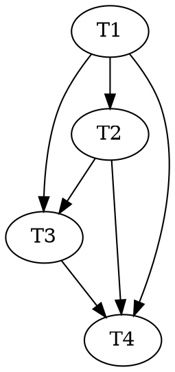

# A3a — The verdict→state fold (state layer) Implementation Plan

> **For agentic workers:** REQUIRED — use `superpowers:subagent-driven-development` or
> `superpowers:executing-plans` to implement this plan. Steps use checkbox (`- [ ]`) syntax for tracking.
>
> **Execution model:** Run **inline this session, autonomously to done**, test-first (RED → GREEN →
> commit per code task), escalating to the human only on a genuine design fork or a broken invariant —
> matching the A1/A2 plan headers and the user's stated operating model.
>
> **Adversarial-TDD triads:** Task 1 (the fold overlay) is the intent-heavy **keystone** — "the driver
> the 10-state machine has never had live." It is more interpretation-bearing than A1/A2's crisp fences,
> so this plan does **not** skip the audit leg: **Task 3 is a dedicated adversarial audit dispatched to a
> fresh subagent.** If this plan is executed **subagent-driven**, split Task 1 into a `red`/`green`/`audit`
> triad (a test-author agent that never sees the fold code, a separate implementer, then the Task-3 audit);
> if executed **inline** (no subagent separation), the triad cannot be enforced — Task 3's fresh-context
> audit is the compensating control. Do not imply a separation that inline execution can't keep.

**Goal:** Make a computed `atom-verdict` effect actually move an atom — extend the atom fold to apply the
recorded `.effects` overlay (state + flag entries) that `lib/ledger.mjs` already stamps but nothing yet
reads, and connect `ready()`'s frozen/guard-halted/barred filter to those folded flags. This is the
**state half** of roadmap A3 (`docs/roadmap/atom-graph-orchestrator.md`); the orchestration half
(de-schematize Dispatch + Merge, produce real verdicts) is **A3b**, a separate plan that depends on this one.

**Architecture:** Two small, dependency-free `lib/` changes, both testable against synthetic ledger events
with no workflow change: (1) `lib/atom.mjs`'s `foldAtomFromEvents` gains an **effects-overlay pass** — for
every event carrying a code-computed `effects` array (`atom-verdict` = provisional, `ratification` =
permanent), it applies the entries addressed to this atom (a lifecycle `{state}` hop or a `{flag,op}`
change), ignoring edge/reprice/band/charter entries (those are not atom state); (2) `lib/frontier.mjs`
gains `readyFlagLists(atoms)` — the one place that name-maps the folded hyphenated flags
(`frozen`/`guard-halted`/`dispatch-barred`) into `ready()`'s `{frozen, guardHalted, barred}` id-lists, wired
into the reconciler's `frontier` computation. Because both graph projections (`deriveCurrent`,
`foldAsLived`) build atoms through `foldAtomFromEvents`, the overlay propagates to both for free.

**Tech Stack:** Node ESM, builtins only (invariant 1). Tests are standalone Node scripts using builtins,
building throwaway `.reasonable/` efforts in the OS temp dir (repo convention). No package.json, no runner.
No workflow change in A3a, so invariant 5 (workflow purity) is untouched here.

**Design source of truth:** `docs/DESIGN-3.0.md` §2.4 (*"the as-lived graph at any seq = **fold of recorded
effects**"*), §7.2 (two-phase effects — provisional at verdict time, permanent at ratification; *"replay
folds recorded effects"*), §8 (the event grammar: *"`effects` is first-class and code-computed … multi-node
effects enumerate one addressed entry each"*), §4.1/§6 (the ten-state lifecycle; `ready = planned edges
minus frozen / guard-halted / barred`). **Resolved design fork (confirmed with the user this session):** the
fold is an **overlay** the projection reads — DESIGN-3.0 §2.4/§7.2/§8 are decisive and authoritative; it is
**not** a write-through that re-materializes discrete events. `docs/artifacts.md`'s "no effects-array overlay
layer" note is (a) scoped to *edges in the current graph* — which stay 100% derived — and (b) **stale** (it
predates A2's stamping); Task 4 corrects it.

---

## Scope: what A3a does, and what it defers to A3b (named, not overlooked)

A3a is deliberately the **cleanly-specified** state-layer core. It **defers** three A3 pieces to A3b because
each is entangled with a genuinely under-specified corner best resolved alongside the R4 **production**
wiring (where the parent atom's context is in hand):

- **Sub-atom birth materialization (R4 split, R3/R5/R6 births).** DESIGN-3.0 §8 says births are *containment
  events*, but an R4 sub-atom effect is `{nodeId:'a-P/sub-i', change:{charter:{clauses}, lineage, dispatchFree}}`
  — a **partial** charter (a clause group, not the five structure-only fields `atom-chartered` requires), and
  the `'a-P/sub-i'` placeholder id is not the durable `a-<seq>` id `charterAtom` mints. Deriving the real
  charter (component/premises/purpose/locus/order) from the parent + clause group is an interpretation A3b
  makes where the parent is available. **A3a's overlay applies the parent's own `{state}` hop** (e.g. the
  oversized parent `spec'd → retired-pending`); it does **not** mint the children.
- **Checkpoint-2 halt *production*.** A3a's overlay *applies* a `guard-halted` flag effect (tested here). The
  workflow step that *appends* the guard-halted verdict from the footprinter's report — replacing A2's
  in-memory drop — is A3b (the workflow change lives there).
- **Blast-radius archival lifecycle (§7.2).** A radius archives when its remediation amendment atom **merges**
  — which needs the born amendment atom (birth materialization, above) and a folded `lineage` field the atom
  record does not carry yet (`lib/spec.mjs` forward-note). It rides A3b alongside births.

The result A3a ships on its own: **a computed verdict effect moves a real atom, and a flagged atom leaves the
frontier** — the keystone the 10-state machine has never had, de-risked in isolation before A3b builds
orchestration on top of it.

---

## What already exists (do not rebuild)

- `lib/ledger.mjs` `append()` **already code-computes and stamps** an `atom-verdict`'s `effects`
  (provisional) + `pendingPermanent`, and a `ratification`'s folded `effects` (accept = the referenced
  verdicts' `pendingPermanent`; reject = the unwind) — `lib/ledger.mjs:490-546`. **Nothing yet applies them.**
- `lib/rewrite.mjs` `computeVerdictEffects(verdict, state)` — the pure R1–R9 effect calculus (tested by
  `test/rewrite-*.test.mjs`). Emits `{nodeId, change:{state, …}}`, `{nodeId, change:{flag, op, reason}}`,
  `{nodeId, change:{reprice}}`, `{nodeId:'a-P/sub-i', change:{charter,…}}`, and `{from,to,edge,op}` entries.
- `lib/atom.mjs` `foldAtomFromEvents(events, atomId)` (`:131`) folds `atom-chartered` / `atom-transitioned` /
  `atom-delta-authored` / `delta-enrichment` / `atom-flag-set` / `atom-flag-cleared` into an in-memory
  record `{ id, component, premises, purpose, locus, order, state, flags:Set, deltaClauses }`. Its `default:
  break;` **ignores `atom-verdict` / `ratification`, and it never reads `.effects`** — the gap A3a closes.
  `foldAtomsFromEvents(events)` (`:264`) lists ids from `atom-chartered` events and folds each.
- `LIFECYCLE_TRANSITIONS` / `isValidTransition` / `FLAG_NAMES = ['frozen','guard-halted','dispatch-barred']`
  / `isValidFlag` (`lib/atom.mjs:8-38`).
- `lib/frontier.mjs` `ready(graph, flags)` (`:108`) filters `chartered`/`ready`/`spec'd` atoms whose
  planned-needs providers merged, **minus** `flags.frozen` / `flags.guardHalted` / `flags.barred` — but **no
  caller derives those id-lists from folded `atom.flags`**; every test passes hand-built lists
  (`test/frontier-ready-pack.test.mjs`). `lib/reconcile.mjs` does not call `ready()` at all.
- `lib/effects.mjs` `validateEffects` (`:45`) — outer-shape validator only: each entry is a **node** effect
  `{nodeId, change}` (any JSON `change`) XOR an **edge** effect `{from,to,edge∈needs|excludes|serves|informs,
  op∈add|remove}`. The `change` vocabulary is opaque to it.
- Test harness idiom (copy verbatim): `newEffort()` (`mkdtempSync` + `mkdirSync(.reasonable)`),
  `seedLedger(root, events)` (raw-write jsonl — **bypasses `append()`'s effect recompute**, so a test can pin
  hand-crafted effects), `readLedgerLines`, `check(name, fn)` — all in `test/ledger-atom-verdict.test.mjs`.
  Real-append helpers `charterAtom` / `transitionAtom` / `authorDelta` / `loadAtom` / `foldAtoms` from
  `lib/atom.mjs`; `computeVerdictEffects` from `lib/rewrite.mjs`; `deriveCurrent` from `lib/graph.mjs`.

---

## File Structure

| File | New/Mod | Responsibility |
|---|---|---|
| `lib/atom.mjs` | mod | `foldAtomFromEvents` gains the **effects-overlay pass**: apply `{state}` / `{flag,op}` entries addressed to this atom from any event's `.effects` (atom-verdict provisional, ratification permanent). Node builtins only; no other fold behavior changes. |
| `test/atom-verdict-fold.test.mjs` | new | The overlay's behavioral contract — real appended verdicts move the atom; raw-seeded neighbor-freeze / guard-halted / two-phase-permanent / ignored-non-atom-effects cases; both projections reflect it. |
| `lib/frontier.mjs` | mod | New pure export `readyFlagLists(atoms)` — name-map folded `atom.flags` Sets into `{frozen, guardHalted, barred}` id-lists. `ready()` unchanged. |
| `test/frontier-ready-flags.test.mjs` | new | `readyFlagLists` unit (name-map, partition) + the integration proof: a flag set by a verdict effect (Task 1 overlay) excludes that atom from `ready(graph, readyFlagLists(atoms))`. |
| `agents/reconciler.md` | mod | The `frontier` computation derives the flag lists via `readyFlagLists(atoms)` from the folded graph, so a frozen/guard-halted/dispatch-barred atom leaves the frontier (capability, not a hand-list). Allowlist unchanged. |
| `docs/artifacts.md` | mod | Correct the stale "Effects — the optional cross-cutting field" + atom-lifecycle scope notes: the overlay is now built for atom state; edges stay derived. |
| `docs/roadmap/atom-graph-orchestrator.md` | mod | Mark the A3 fold's **state half landed (A3a)**; pin what rides A3b (birth materialization, checkpoint-2 halt production, blast-radius archival, Dispatch, Merge). |
| `.claude-plugin/plugin.json`, `README.md` | mod | Minor bump (new backward-compatible capability) v3.4.0 → v3.5.0. |

---

## Tasks

### Task 1 — the effects-overlay pass in the atom fold (TDD)

**Files:** Modify `lib/atom.mjs`. Create `test/atom-verdict-fold.test.mjs`.

- [ ] **Step 1: Read the patterns.** Read `lib/atom.mjs:131-172` (`foldAtomFromEvents` — the exact loop and
  its `default: break;`), `lib/ledger.mjs:490-546` (what `append()` stamps onto an `atom-verdict` /
  `ratification`), and `test/ledger-atom-verdict.test.mjs:1-72` (the `newEffort` / `seedLedger` /
  `readLedgerLines` / `check` harness this test copies).

- [ ] **Step 2: Write the failing tests** (`test/atom-verdict-fold.test.mjs`), builtins-only, harness copied
  from `test/ledger-atom-verdict.test.mjs`. Import `charterAtom, transitionAtom, authorDelta, loadAtom,
  foldAtoms` from `../lib/atom.mjs`, `append` from `../lib/ledger.mjs`, `deriveCurrent, foldAsLived` from
  `../lib/graph.mjs`. Cases:

  ```js
  // 1. INTEGRATION — a real appended checkpoint verdict moves the atom (spec'd -> ready).
  check('a checkpoint atom-verdict folds the atom to ready (the effect is applied, not just stamped)', () => {
    const root = newEffort();
    const c = charterAtom(root, { component: 'lexer', premises: ['ledger:1'], purpose: 'x', locus: [], order: 0 });
    assert.equal(c.ok, true, c.error);
    assert.equal(transitionAtom(root, c.id, 'ready').ok, true);
    assert.equal(authorDelta(root, c.id, [{ clauseId: 'lexer#c1', citations: [], demandedBy: 'goal:g1', locus: [] }]).ok, true);
    assert.equal(loadAtom(root, c.id).state, "spec'd", 'precondition: authored delta => spec\'d');

    const r = append(root, { type: 'atom-verdict', atomId: c.id, kind: 'checkpoint', evidence: 'budget exhausted' });
    assert.equal(r.ok, true, r.error);
    // append() STAMPED { nodeId:c.id, change:{ state:'ready', reprice, evidence } }; the fold must now APPLY it.
    assert.equal(loadAtom(root, c.id).state, 'ready', 'the computed checkpoint effect must fold the atom back to ready');
  });

  // 2. ISOLATED — a verdict's effect addresses ANOTHER atom (an R2 neighborhood freeze), by nodeId.
  check('a verdict effect addressed to a neighbor sets that neighbor\'s flag, not the subject\'s', () => {
    const root = newEffort();
    seedLedger(root, [
      { seq: 1, type: 'atom-chartered', component: 'lexer', premises: [], purpose: 'p', locus: [], order: 0 }, // a-1
      { seq: 2, type: 'atom-chartered', component: 'parser', premises: [], purpose: 'p', locus: [], order: 0 }, // a-2
      { seq: 3, type: 'atom-verdict', atomId: 'a-1', kind: 'dead-end',
        effects: [{ nodeId: 'a-2', change: { flag: 'frozen', op: 'set', reason: 'R2 blast radius' } }] },
    ]);
    assert.equal(loadAtom(root, 'a-2').flags.has('frozen'), true, 'the neighbor a-2 is frozen by the effect entry addressed to it');
    assert.equal(loadAtom(root, 'a-1').flags.has('frozen'), false, 'the verdict subject a-1 is NOT frozen — no entry addresses it');
  });

  // 3. ISOLATED — the checkpoint-2 guard-halted flag via a verdict effect.
  check('a guard-halted flag effect folds onto the atom', () => {
    const root = newEffort();
    seedLedger(root, [
      { seq: 1, type: 'atom-chartered', component: 'lexer', premises: [], purpose: 'p', locus: [], order: 0 }, // a-1
      { seq: 2, type: 'atom-verdict', atomId: 'a-1', kind: 'checkpoint',
        effects: [{ nodeId: 'a-1', change: { flag: 'guard-halted', op: 'set', reason: 'checkpoint 2' } }] },
    ]);
    assert.equal(loadAtom(root, 'a-1').flags.has('guard-halted'), true);
  });

  // 4. TWO-PHASE — permanent effects land only via the ratification event; a verdict's pendingPermanent does NOT.
  //    NOTE: the atom is seeded at spec'd (chartered -> ready -> spec'd, all legal moves) so that the
  //    provisional spec'd -> retired-pending and permanent retired-pending -> retired are BOTH real
  //    transitions — the fold trusts pre-validated effects, so the fixture must model a reachable ledger.
  const twoPhaseSeed = () => [
    { seq: 1, type: 'atom-chartered', component: 'lexer', premises: [], purpose: 'p', locus: [], order: 0 }, // a-1
    { seq: 2, type: 'atom-transitioned', atomId: 'a-1', from: 'chartered', to: 'ready' },
    { seq: 3, type: 'atom-transitioned', atomId: 'a-1', from: 'ready', to: "spec'd" },
    // a verdict whose PROVISIONAL effect retires-pending, and whose permanent retire is only RECORDED in
    // pendingPermanent (never in effects) — so the fold must NOT apply the permanent from the verdict:
    { seq: 4, type: 'atom-verdict', atomId: 'a-1', kind: 'dead-end',
      effects: [{ nodeId: 'a-1', change: { state: 'retired-pending' } }],
      pendingPermanent: [{ nodeId: 'a-1', change: { state: 'retired' } }] },
  ];
  check('a permanent state effect lands only on the ratification event, not on the verdict', () => {
    const root = newEffort();
    seedLedger(root, twoPhaseSeed());
    assert.equal(loadAtom(root, 'a-1').state, 'retired-pending', 'the PROVISIONAL retire folds; the pending permanent does NOT');
    // now the ratification carries the folded permanent in its OWN effects (as append() would stamp it):
    const root2 = newEffort();
    seedLedger(root2, [
      ...twoPhaseSeed(),
      { seq: 5, type: 'ratification', gate: 'slice', ratifiesSeqs: [4],
        effects: [{ nodeId: 'a-1', change: { state: 'retired' } }] },
    ]);
    assert.equal(loadAtom(root2, 'a-1').state, 'retired', 'the ratification event\'s own effects fold the permanent retire');
  });

  // 5. NON-ATOM-STATE effects are ignored — edges are derived; reprice/band are not lifecycle.
  check('edge and reprice effects do not touch atom state', () => {
    const root = newEffort();
    seedLedger(root, [
      { seq: 1, type: 'atom-chartered', component: 'lexer', premises: [], purpose: 'p', locus: [], order: 0 }, // a-1
      { seq: 2, type: 'atom-transitioned', atomId: 'a-1', from: 'chartered', to: 'ready' },
      { seq: 3, type: 'atom-verdict', atomId: 'a-1', kind: 'stale-spec',
        effects: [
          { from: 'a-1', to: 'a-2', edge: 'excludes', op: 'add' },
          { nodeId: 'a-1', change: { reprice: { factor: 'α' } } },
        ] },
    ]);
    const a1 = loadAtom(root, 'a-1');
    assert.equal(a1.state, 'ready', 'no {state} entry => state unchanged');
    assert.equal(a1.flags.size, 0, 'no {flag} entry => flags unchanged');
  });

  // 6. BOTH PROJECTIONS reflect the overlay (foldAtomsFromEvents is shared).
  check('deriveCurrent and foldAsLived both reflect the folded verdict effect', () => {
    const root = newEffort();
    const c = charterAtom(root, { component: 'lexer', premises: ['ledger:1'], purpose: 'x', locus: [], order: 0 });
    transitionAtom(root, c.id, 'ready');
    authorDelta(root, c.id, [{ clauseId: 'lexer#c1', citations: [], demandedBy: 'goal:g1', locus: [] }]);
    append(root, { type: 'atom-verdict', atomId: c.id, kind: 'checkpoint', evidence: 'x' });
    const cur = deriveCurrent(root, { goals: [] }).atoms.find((a) => a.id === c.id);
    const liv = foldAsLived(root).atoms.find((a) => a.id === c.id);
    assert.equal(cur.state, 'ready', 'current projection reflects the overlay');
    assert.equal(liv.state, 'ready', 'as-lived projection reflects the overlay');
  });
  ```

- [ ] **Step 3: Run to verify RED.** `node test/atom-verdict-fold.test.mjs` → cases 1, 3, 4, 6 (and the freeze
  in 2) FAIL: the fold ignores `.effects`, so the atom stays `spec'd` / unflagged / `retired-pending`.

- [ ] **Step 4: Implement the overlay in `lib/atom.mjs`.** In `foldAtomFromEvents`, immediately **after** the
  `atom-chartered` block's `continue` and **before** the `if (!record || e.atomId !== atomId) continue;` line
  (so it runs for events about *other* atoms too), insert:

  ```js
      // ── effects overlay (DESIGN-3.0 §2.4/§7.2/§8) ──────────────────────────────────────────────
      // Any event MAY carry a code-computed `effects` array — atom-verdict (provisional) and
      // ratification (permanent), both stamped by lib/ledger.mjs (§2.4), never agent-authored. Each
      // entry is addressed by its OWN nodeId, independent of the event's subject atomId: one R2 verdict
      // freezes a whole neighborhood as many entries in a single event (§8 "multi-node effects enumerate
      // one addressed entry each"). So apply the entries that target THIS atomId, from ANY event, in seq
      // order. Only a lifecycle {state} hop and the three {flag} names are atom state; edge / reprice /
      // band / charter(birth) entries are NOT (edges are derived in graph.mjs; a birth is materialized as
      // its own atom-chartered event — A3b). The stored effects were validated by lib/rewrite.mjs at
      // compute time (an illegal transition HALTs the append), so the overlay trusts them.
      if (record && Array.isArray(e.effects)) {
        for (const eff of e.effects) {
          if (!eff || eff.nodeId !== atomId || !eff.change) continue;
          const { change } = eff;
          if (typeof change.state === 'string') record.state = change.state;
          if (typeof change.flag === 'string' && change.op === 'set') record.flags.add(change.flag);
          if (typeof change.flag === 'string' && change.op === 'clear') record.flags.delete(change.flag);
        }
      }
  ```

  No other change — the existing `switch` (which still runs for `e.atomId === atomId` events) is untouched, so
  a direct `atom-transitioned` / `atom-flag-set` still folds exactly as before. The overlay is purely additive.

- [ ] **Step 5: Run to verify GREEN.** `node test/atom-verdict-fold.test.mjs` → all pass. Then run
  `node test/atom-ledger.test.mjs`, `node test/atom-lifecycle.test.mjs`, `node test/graph-projections.test.mjs`,
  `node test/ledger-atom-verdict.test.mjs`, `node test/ledger-two-phase.test.mjs` — no regression (the overlay
  is additive; existing atom-* folding and effect *stamping* are unchanged).

- [ ] **Step 6: Commit.** `feat(atom): fold overlay — verdict/ratification effects move atom state (A3a)` +
  co-author trailer.

### Task 2 — `ready()`'s flag filter from folded `atom.flags` (TDD)

**Files:** Modify `lib/frontier.mjs`, `agents/reconciler.md`. Create `test/frontier-ready-flags.test.mjs`.
**Depends on:** Task 1 (the integration case sets a flag via the overlay).

- [ ] **Step 1: Read the patterns.** Read `lib/frontier.mjs:108-144` (`ready`'s `{frozen, guardHalted, barred}`
  params and its filter), `lib/atom.mjs:15` (`FLAG_NAMES` — the hyphenated literals the fold stores), and
  `test/frontier-ready-pack.test.mjs` (the `ready` test idiom + graph fixture shape).

- [ ] **Step 2: Write the failing tests** (`test/frontier-ready-flags.test.mjs`). Import `ready, readyFlagLists`
  from `../lib/frontier.mjs`; for the integration case, `charterAtom, transitionAtom, loadAtom, foldAtoms` from
  `../lib/atom.mjs` and `deriveCurrent` from `../lib/graph.mjs` (or `seedLedger` a verdict-effect line). Cases:
  - **Unit — name-map + partition:** atoms `[{id:'a-1',flags:new Set(['frozen'])}, {id:'a-2',flags:new
    Set(['guard-halted'])}, {id:'a-3',flags:new Set(['dispatch-barred'])}, {id:'a-4',flags:new Set()}]` →
    `readyFlagLists(atoms)` deep-equals `{ frozen:['a-1'], guardHalted:['a-2'], barred:['a-3'] }` (note the
    `guard-halted → guardHalted` and `dispatch-barred → barred` remap; `a-4` appears in none).
  - **Unit — an atom with two flags** lands in both lists; an atom with a missing/undefined `flags` is skipped
    without throwing.
  - **Integration — the connection:** build an effort, charter two atoms `ready`, set `frozen` on one via a
    seeded `atom-verdict` effect (`{nodeId:'a-1',change:{flag:'frozen',op:'set'}}`), fold with `deriveCurrent`,
    then assert `ready(graph, readyFlagLists(graph.atoms))` **excludes** `a-1` and **includes** `a-2`. This is
    the roadmap's "connect `ready()`'s flag filter to the folded `atom.flags`" made real.
  - **Discriminator:** `ready(graph, readyFlagLists(graph.atoms))` with **no** flags set includes both atoms —
    a broken `readyFlagLists` that returns every id would fail this.

- [ ] **Step 3: Run to verify RED.** `node test/frontier-ready-flags.test.mjs` → fails (`readyFlagLists` not
  exported).

- [ ] **Step 4: Implement `readyFlagLists` in `lib/frontier.mjs`** (add after `ready`, in the same section):

  ```js
  /**
   * Project the folded `atom.flags` sets into the three keyed id-lists `ready()` consumes. The flag
   * literals are the hyphenated FLAG_NAMES lib/atom.mjs folds (`frozen`, `guard-halted`, `dispatch-barred`);
   * `ready()`'s params are `frozen` / `guardHalted` / `barred`, so this is the ONE place that name-maps
   * (DESIGN-3.0 §4.1/§6 — "minus frozen / guard-halted / barred"). Pure; the atoms are folded records (each
   * `.flags` a Set), so a verdict-effects overlay that set a flag (A3a fold) flows straight through into the
   * frontier filter.
   * @param {Array<{id:string, flags?:Set<string>}>} atoms
   * @returns {{frozen:string[], guardHalted:string[], barred:string[]}}
   */
  export function readyFlagLists(atoms) {
    const frozen = [], guardHalted = [], barred = [];
    for (const a of atoms || []) {
      const flags = a && a.flags;
      const has = (f) => !!flags && typeof flags.has === 'function' && flags.has(f);
      if (has('frozen')) frozen.push(a.id);
      if (has('guard-halted')) guardHalted.push(a.id);
      if (has('dispatch-barred')) barred.push(a.id);
    }
    return { frozen, guardHalted, barred };
  }
  ```

- [ ] **Step 5: Update `agents/reconciler.md`.** In the `frontier` computation (added in A2), derive the flag
  lists from the folded graph via `readyFlagLists(graph.atoms)` and pass them to `ready(graph, flags)`, so a
  `frozen` / `guard-halted` / `dispatch-barred` atom leaves the frontier — reading the **folded** flags, never
  a hand-authored list (capability over prose). State it plainly and keep the reconciler read-only (allowlist
  unchanged). One sentence, one code-shaped instruction; do not expand the reconciler's remit otherwise.

- [ ] **Step 6: Run to verify GREEN.** `node test/frontier-ready-flags.test.mjs` passes; re-run
  `node test/frontier-ready-pack.test.mjs` and `node test/frontier-gate.test.mjs` — no regression.

- [ ] **Step 7: Commit.** `feat(frontier): readyFlagLists — the frontier filter reads folded atom.flags (A3a)`.

### Task 3 — adversarial audit of the fold (subagent)

**Files:** none authored here — the audit **reports** gap-tests, which become new `red` tasks appended to this
plan (or fixed in `lib/atom.mjs` / `lib/frontier.mjs` if a defect is confirmed).
**Depends on:** Task 1, Task 2.

- [ ] **Step 1: Dispatch a fresh-context audit subagent** (the `reasonable:auditor`, `code-reviewer`, or a
  `general-purpose` agent — whichever the executor has). It must run in a **fresh context** that did not write
  the fold. Charge it to adversarially verify the overlay against `docs/DESIGN-3.0.md` §2.4/§7.2/§8:
  - **Discriminator:** confirm the new Task-1/Task-2 tests **fail on the pre-Task-1 commit** (`git stash` the
    overlay or check out `HEAD~`), i.e. they pin the *new* behavior, not a tautology.
  - **Two-phase fidelity:** a verdict's `pendingPermanent` must **not** reach state through the fold — only via
    a `ratification` event's own `.effects` (Task-1 case 4). Try to construct a ledger where it leaks.
  - **Addressing:** an effect entry whose `nodeId` targets atom B must fold onto B, never onto the verdict's
    subject A (Task-1 case 2). Try a multi-entry event that touches three atoms and confirm each lands once.
  - **Non-atom-state isolation:** edge / `reprice` / `band` / `charter` entries must never mutate `state` or
    `flags`. Try a malformed `change` (e.g. `{state: 42}`, `{flag: 'bogus', op:'set'}`) and confirm the fold
    neither throws nor sets a non-`FLAG_NAMES` flag (the fold trusts pre-validated effects, but must degrade
    safely on a hand-corrupted ledger line).
  - **Name-map:** `readyFlagLists` maps `guard-halted → guardHalted` and `dispatch-barred → barred` exactly;
    no atom leaks into the wrong list; a two-flag atom lands in both.
  - **Idempotence / order:** set-then-clear across two events yields absent; two identical set effects are a
    no-op (Set semantics).

- [ ] **Step 2: Triage the report.** Each confirmed gap becomes a new `red` task (a failing test) + its `green`
  fix; each false alarm is recorded and dismissed. Do **not** weaken a test to make the audit pass — a real gap
  is fixed in `lib/`. If the audit is clean, record that and proceed.

- [ ] **Step 3: Commit** any gap-fixes with `fix(atom|frontier): <gap> found by A3a fold audit`. (No commit if
  the audit is clean and authored nothing.)

### Task 4 — docs + version bump + final verification (docs / integration)

**Files:** Modify `docs/artifacts.md`, `docs/roadmap/atom-graph-orchestrator.md`, `.claude-plugin/plugin.json`,
`README.md`.
**Depends on:** Task 1, Task 2, Task 3.

- [ ] **Step 1 (`docs/artifacts.md`): correct the now-stale effects notes.**
  - The "Effects — the optional cross-cutting field (3.0)" **Scope note** (≈ lines 1052-1063) currently claims
    *"nothing in the codebase has ever written a real effects array"* (false since A2 — `lib/ledger.mjs` stamps
    them) and states *"there is deliberately no effects-array overlay layer"* without qualification. Rewrite it
    to: (a) A2 made `append()` **stamp** `atom-verdict` / `ratification` effects; (b) **A3a** made
    `foldAtomFromEvents` **apply** the `{state}` / `{flag,op}` entries as the as-lived overlay DESIGN-3.0
    §2.4/§7.2/§8 mandate; (c) the "no overlay layer" statement now scopes to **dependency EDGES in the current
    graph**, which stay 100% derived (a recorded edge effect never overrides derivation — the unresolved
    precedence the note guards is edge-only). Keep it honest and brief.
  - The atom-lifecycle **Scope note** (≈ lines 1103-1112) — *"applying an effect set is the frontier loop's job
    (Part 7) … are transitioned by those computed effects once Part 7 applies them"* — update to: the
    **application is built (A3a)** — `foldAtomFromEvents` applies recorded `{state}`/`{flag}` effects; the
    *production* of those verdicts (Dispatch/Collect) and *births* remain A3b. No new `*` grammar (the overlay
    reads `effects[].change.{state,flag,op}`, already covered by `ledger.jsonl *`).

- [ ] **Step 2 (`docs/roadmap/atom-graph-orchestrator.md`):** In the A3 section, record that the **verdict→state
  fold's state half + the `ready()` flag-filter wiring landed (A3a, 2026-07-15)** — a computed verdict effect
  now moves a real atom and a flagged atom leaves the frontier. Pin explicitly what **A3b** still owns: sub-atom
  **birth materialization** (R4 split + R3/R5/R6 births), **checkpoint-2-halt production** (append the verdict
  from the footprinter report), **blast-radius archival lifecycle**, and **Dispatch + Merge** de-schematization.
  Keep the open pieces intact (§16 calibration, brownfield genesis). Do not renumber DESIGN-3.0 sections.

- [ ] **Step 3: Bump the version minor** (new backward-compatible capability) v3.4.0 → **v3.5.0** in
  `.claude-plugin/plugin.json`, the `README.md` install snippet, and the `README.md` footer `Version:` line —
  every place the version string appears (CLAUDE.md maintenance rule). Update CLAUDE.md's headline
  `reasonable is at vX.Y.Z` line if it names the version.

- [ ] **Step 4: Run the entire suite.** `for t in test/*.test.mjs; do node "$t"; done` (PowerShell:
  `Get-ChildItem test/*.test.mjs | ForEach-Object { node $_.FullName }`). All green.

- [ ] **Step 5: Commit.** `chore(release): bump v3.5.0 — A3a verdict→state fold (state layer)` + co-author
  trailer.

- [ ] **Step 6: Report completion** — files, tests, version, what lit up (a computed verdict effect moves a real
  atom; the frontier filter reads folded flags) and what's queued for **A3b** (births, checkpoint-2-halt
  production, blast-radius archival, Dispatch, Merge — and the pending merge-design decision: membrane vs.
  narrow merge-agent).

---

## Dependency Graph

| Task | Depends On | Files Created/Modified |
|---|---|---|
| T1 fold overlay | — | `lib/atom.mjs`, `test/atom-verdict-fold.test.mjs` |
| T2 ready-flags | T1 | `lib/frontier.mjs`, `agents/reconciler.md`, `test/frontier-ready-flags.test.mjs` |
| T3 fold audit | T1, T2 | — (reports gap-tests) |
| T4 docs + bump + verify | T1, T2, T3 | `docs/artifacts.md`, `docs/roadmap/atom-graph-orchestrator.md`, `.claude-plugin/plugin.json`, `README.md` |



**Wave schedule (no two tasks in a wave modify the same file):**
- **Wave 1:** T1
- **Wave 2:** T2 (needs T1's overlay for its integration case)
- **Wave 3:** T3 (audits T1+T2)
- **Wave 4:** T4 (needs all)

*File-conflict check:* T1 owns `lib/atom.mjs` + its test; T2 owns `lib/frontier.mjs` + `agents/reconciler.md`
+ its test; T3 authors nothing (or, on a confirmed gap, a fix scoped to the file that owns it); T4 is the only
writer of docs + version files. No two tasks share a file. ✓ (T2's pure `readyFlagLists` unit could technically
start in Wave 1, but its integration proof needs T1 — keep the edge for a meaningful RED.)

---

## Self-Review

- **Spec coverage (roadmap A3 fold, state half):**
  - "`atom-verdict` → `lib/rewrite.mjs`'s effects → `atom-transitioned`" (the driver the 10-state machine never
    had live) → **T1** overlay applies `{state}` entries; asserted by the real-appended-checkpoint case.
  - checkpoint-2 halt's `atom-flag-set: guard-halted` **application** → **T1** applies `{flag,op}` entries
    (case 3). Its *production* (append from the footprinter report) is A3b, stated.
  - "connect `ready()`'s flag filter to the folded `atom.flags`" → **T2** `readyFlagLists` + reconciler wiring;
    the integration case proves a folded flag excludes the atom.
  - Two-phase permanence (provisional at verdict, permanent at ratification) → **T1** case 4.
  - Deferred pieces (births, checkpoint-2 production, blast-radius archival, Dispatch, Merge) → **named** in the
    Scope section and the roadmap (T4), not silently dropped.
- **Invariants:** `lib/` stays dependency-free (T1/T2 add only builtins + the existing fold); no workflow change
  in A3a (invariant 5 untouched); machine-grammar + parser move together — the overlay reads the existing
  `effects[].change` shape `lib/effects.mjs` already validates, no new grammar (invariant 3), doc'd in T4; no
  DESIGN-3.0 section renumbering (invariant 4); no agent tool-allowlist weakened (reconciler keeps its
  read-only allowlist); hooks unchanged (fail-open/closed untouched); invariant 7 (a plan never records a
  human's words) — T2's reconciler edit adds a capability, quotes no one.
- **Placeholder scan:** concrete overlay body, concrete `readyFlagLists` body, concrete test cases with real
  fixtures and exact assertions, exact paths/commands, a concrete audit charge. No "add error handling" / "TBD".
- **Type consistency:** the overlay reads `eff.nodeId` / `eff.change.{state,flag,op}` — the exact shape
  `lib/rewrite.mjs` emits (`{nodeId, change:{state,…}}`, `{nodeId, change:{flag, op, reason}}`) and
  `lib/effects.mjs` validates. `record.flags` is a `Set` (`lib/atom.mjs:143`) → `.add`/`.delete` match.
  `readyFlagLists(atoms)` returns `{frozen, guardHalted, barred}` — exactly `ready(graph, flags)`'s param shape
  (`lib/frontier.mjs:108`). Flag literals `frozen`/`guard-halted`/`dispatch-barred` match `FLAG_NAMES`
  (`lib/atom.mjs:15`); the `guardHalted`/`barred` param names match `ready`'s destructuring.
```
