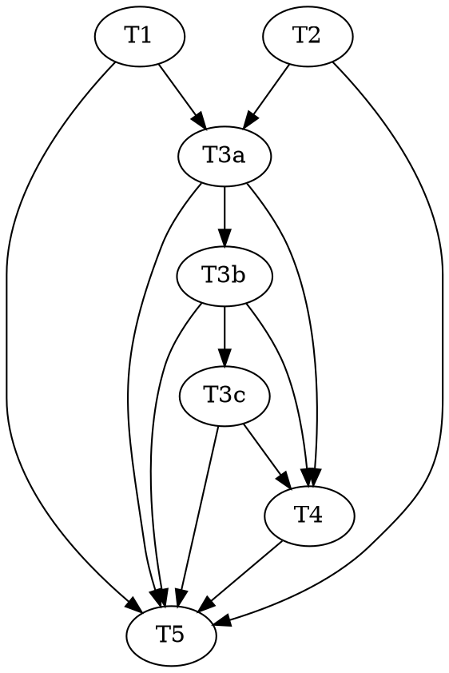

# A3b-i — Real Dispatch + Collect (verdict production) Implementation Plan

> **For agentic workers:** REQUIRED — use `superpowers:subagent-driven-development` or
> `superpowers:executing-plans` to implement this plan. Steps use checkbox (`- [ ]`) syntax for tracking.
>
> **Execution model:** Run **inline this session, autonomously to done**, test-first (RED → GREEN →
> commit per code task), escalating to the human only on a genuine design fork or a broken invariant —
> matching A1/A2/A3a's headers.
>
> **Adversarial-TDD triad:** Task 3 (de-schematize Dispatch + Collect) is the keystone — "the moment the
> keystone turns" per the roadmap. It is the single most intent-bearing piece of this plan (exact pipeline
> sequencing, bounded-retry caps, which outcomes translate to real ledger effects and which stay in-workflow
> retries). It gets the full `red`/`green`/`audit` triad. Tasks 1 and 2 are small, mechanical/authoring
> changes and stay single tasks, matching A1/A2/A3a's own precedent for skipping the triad on crisp,
> low-ambiguity work.

**Goal:** De-schematize the **Dispatch** and **Collect** stages of `workflows/frontier-wave.workflow.js` —
drive one atom through the real enrichment pipeline (lane-provision → implement → reprovision → blind-test
→ commit-tests → adjudicate [bounded TDD retry] → audit) via real agents instead of literal prompt strings,
and translate the collected outcome into **real ledger effects**: the happy path (green) lands as real
`atom-transitioned` events progressing the atom `packed → tests-red → green → audited`; two cleanly-mapped
failure kinds — **R1 checkpoint** (budget exhaustion) and **R3 ripple** (a delta reaching a foreign
contract) — land as real `atom-verdict` events, which fold through A3a's already-built effects overlay.
Everything else (`jurisdiction`, `seam-undeclared`, `blind-redo`, `scope-expansion`,
`characterization-needed`, an unconfirmed `infeasible`, `other`) stays a **bounded in-workflow retry** with
no ledger write, escalating to `blocked-human` at a fixed cap — exactly what a dedicated research pass
confirmed has **no** R-code mapping in the design. **Merge is untouched** (still the schematic `log()` line)
— atoms reach `audited` and stop there; that is a separate follow-on plan (A3b-ii).

**Architecture:** `lib/frontier.mjs`'s `CORE_ROLES` (and the workflow's own pure inline mirror) gain
`adjudicator` — DESIGN-3.0 §6 names it as one of the four unconditional dispatch stages, and the wave
currently never dispatches it at all. `agents/verdict-writer.md`'s remit generalizes from "lands one
`verifier-verdict` event" to "lands one ledger event via the controller CLI" — mechanically the SAME single
sanctioned command (`node lib/ledger.mjs append --json '<event>'`) already handles any event shape; only the
prose scoped it narrowly. `workflows/frontier-wave.workflow.js`'s Dispatch phase becomes a real
`pipeline()` over the wave's atoms (concurrent per-atom chains, matching `pack()`'s footprint-disjoint
guarantee): lane-provisioner → implementer → lane-provisioner (role transition) → blind-test-writer →
lane-committer → adjudicator (a bounded retry loop back to implementer/blind-test-writer) → auditor. Collect
translates the terminal outcome: `green` → `verdict-writer` lands the real state progression;
`checkpoint`/`ripple` → `verdict-writer` lands a real `atom-verdict`; anything else stays an in-workflow
retry, capped, escalating to `blocked-human`.

**Tech Stack:** Node ESM, builtins only (invariant 1). Tests are standalone Node scripts using builtins.
The workflow stays pure — no `import`/`fs`/`Date`/`Math.random` (invariant 5); all disk/agent work happens
inside dispatched agents.

**Design source of truth:** `docs/DESIGN-3.0.md` §6 (the frontier loop — the four dispatch stages, "lane =
atom"), §7/§7.1 (the failure calculus + routing ladder — R1/R3's exact trigger + field shapes), §0 ("every
**failed** attempt ends in a typed verdict" — a clean green is never a verdict). Roadmap:
`docs/roadmap/atom-graph-orchestrator.md`'s A3 section (already updated by A3a to record the fold's state
half as landed; this plan lands the first slice of A3b — "real Dispatch/Collect appending real
`atom-verdict` events from real audit outcomes"). The deleted 2.x runner
(`git show 357b1c7^:workflows/vertical-slice-runner.workflow.js`) is the structural template for the
pipeline shape, **adapted**: work orders → atoms, and the `intentVerify` contract-enrichment adversary /
`seam-undeclared` / `blind-redo` sophistication is **deliberately not ported** — DESIGN-3.0 §6's own
four-stage description names none of it, and 3.0's upfront spec-authoring (already built in A2) removes
much of what those refinements defended against in 2.x. **Resolved design forks (confirmed with the user
this session, backed by dedicated research):**
1. Only failed attempts produce R-code verdicts; a clean green is a plain lifecycle progression.
2. Of the ten 2.x `OUTCOME` kinds, exactly three map cleanly to R-codes for THIS plan's scope:
   `checkpoint`→R1, `ripple`→R3 (field rename `contract`→`component`). `infeasible`+skeptic-confirmed→R2,
   `spike-needed`→R5, and any auditor-sourced R4/R7 all need **new agent capability that doesn't exist
   yet** (a `premise{component,clause,layer}` shape no agent emits; a `dependents` computation no agent
   supplies; an OUTCOME vocabulary `agents/auditor.md` doesn't have at all) — **explicitly deferred**, not
   guessed into existence.
3. Merge stays a separate plan (membrane act in the main-session orchestrator, ratification-gated per run
   mode, backed by a tested `lib/merge.mjs` — no dedicated merge agent). Not touched here.

---

## Scope: what A3b-i does, and what it defers (named, not overlooked)

**Ships:** a real atom genuinely reaches `audited` state, driven by real agents, with real ledger events at
every lifecycle hop — the first time the atom graph has ever been the *live* dispatcher for anything past
`spec'd`. Two of the nine failure calculus rows (R1, R3) get real production. The `spec'd → packed`
transition — never wired by A2, a precondition this plan needs regardless — gets closed as a natural
prerequisite.

**Deferred, explicitly, to a follow-on plan (A3b-ii or later, not named further here):**
- **R2 dead-end** (infeasible + skeptic-confirmed) — needs a `premise` shape `{component, clause, layer}`
  neither `implementer.md`'s `infeasible` nor `skeptic.md`'s `CONFIRMED` documents emitting verbatim; a
  real design task, not a translation.
- **R5 unknown-blocking** (spike-needed) — needs `dependents` (which atoms leave the frontier), which no
  agent supplies; the orchestrator would have to compute it from the live graph.
- **R4-via-audit-refutation / R7 parity-breach** — `agents/auditor.md` has **zero** `kind`-tagged OUTCOME
  vocabulary today (confirmed by grep — the string "OUTCOME" appears nowhere in it). Both R-codes need that
  gap closed first; R7 specifically looks like a **post-merge** deep-tier concern (§6: "Post-merge
  refutation has a defined unwind (R7)"), possibly belonging to a goal-gate/retro plan rather than per-atom
  Dispatch at all.
- **`jurisdiction`'s downstream fate** — routes to the adjudicator today, but no text says what an
  adjudicator ruling on a jurisdiction question becomes in R-code terms. Stays a bounded in-workflow retry
  for now (folded into the "everything else" bucket below), not silently promoted to a verdict.
- **Merge** — the atom stops at `audited`. A3b-ii's job.

**The "everything else" bucket** — `scope-expansion`, `jurisdiction`, `seam-undeclared`, `blind-redo`, an
**unconfirmed** `infeasible` (skeptic `REFUTED`), and `other` — gets a **bounded in-workflow retry**:
re-dispatch the stage that can fix it (implementer for `jurisdiction`/`seam-undeclared`/`scope-expansion`;
blind-test-writer for `blind-redo`), capped at a fixed number of passes per atom, escalating to
`blocked-human` (via the existing `blockedHuman` briefing field, folded into the Gate's `GATE_RESULT`) at
the cap. This mirrors the deleted 2.x runner's own bounded-retry discipline (its `SEAM_REDECLARE_CAP`/
`BLIND_REDO_CAP` pattern), scoped down to atoms and without the seam/blind-redo *content* sophistication
(no `lib/seam.mjs` classification wiring — that stays inside the adjudicator's own remit, unchanged).

---

## What already exists (do not rebuild)

- `lib/frontier.mjs`'s `CORE_ROLES = Object.freeze(['auditor', 'blind-test-writer', 'implementer'])`
  (`:149`) and the workflow's own pure inline mirror `CORE_ROLES = ['auditor', 'blind-test-writer',
  'implementer']` (`workflows/frontier-wave.workflow.js:108`) — both missing `adjudicator`.
- `lib/atom.mjs`'s `transitionAtom(effortRoot, atomId, to)` (`:210`) and `LIFECYCLE_TRANSITIONS` (`:17-28`)
  — `"spec'd": ["packed","ready","retired-pending"]`, `packed: ["tests-red","ready","retired-pending"]`,
  `"tests-red": ["green","ready","retired-pending"]`, `green: ["audited","ready","retired-pending"]`. The
  I/O wrapper is not callable from the pure workflow (invariant 5) — every transition must go through an
  **agent** dispatch of the ledger controller CLI.
- A3a's fold overlay (`lib/atom.mjs`'s `foldAtomFromEvents`) already applies any `atom-verdict`'s `.effects`
  — landed, tested, audited. This plan is the first real *producer* of a failure verdict for it to apply.
- `agents/verdict-writer.md` — a fenced narrow writer whose one sanctioned command is
  `node lib/ledger.mjs append --root <effortRoot> --json '<event>'`; never originates a SHA; halts on
  failure (`persisted:false`). Currently scoped in prose to `verifier-verdict` events only, but the command
  itself is generic — Task 2 generalizes the prose to match.
- `agents/lane-provisioner.md` / `agents/lane-committer.md` — already built, already used by the 2.x runner,
  never dispatched by `frontier-wave.workflow.js` today. Exact usage shape (worktree path capture, role
  transition, `PROVISION_ACK`/`SCRIBE_ACK` schemas) is in the "What already exists" reference below each
  task.
- `lib/rewrite.mjs`'s `ruleCheckpoint` (`:82`, needs `{atomId, evidence}`) and `ruleRipple` (`:238`, needs
  `{atomId, manifest: [{component, clause, type}]}`) — both already correct, already tested
  (`test/rewrite-simple-verdicts.test.mjs`, `test/rewrite-structural.test.mjs`). This plan is the first real
  *caller* that constructs their input from a live agent report.
- The workflow's existing `guard(thunk)` helper (`workflows/frontier-wave.workflow.js:124-127`) — re-tags a
  budget-ceiling throw as `{__budgetExhausted: true, message}`. This plan reuses it as the mechanical R1
  trigger (a budget throw during ANY pipeline stage becomes a checkpoint verdict, not a `budget-exhausted`
  gate result — see Task 3 Step 4 for the exact distinction from the wave-level budget guard already in
  place).
- Test harness idioms: `test/frontier-wave-workflow.test.mjs`'s stub-`agent()`-by-`opts.label` pattern
  (`loadRunner`, `runWith`, `defaultStub`) and `test/frontier-wave-spec-pack.test.mjs`'s real-ledger
  temp-effort factory (`charterAtom`/`transitionAtom`/`authorDelta`, `makeClause`) — both copied verbatim
  where each fits.

---

## File Structure

| File | New/Mod | Responsibility |
|---|---|---|
| `lib/frontier.mjs` | mod | `CORE_ROLES` gains `'adjudicator'`. No other change. |
| `agents/verdict-writer.md` | mod | Generalize the remit from "lands one `verifier-verdict` event" to "lands one ledger event via the controller CLI" — same command, broader description; every existing discipline (SHA rule, halt-on-failure) preserved verbatim. |
| `workflows/frontier-wave.workflow.js` | mod | `CORE_ROLES` inline mirror gains `'adjudicator'`. Dispatch phase becomes a real `pipeline()` over the wave: lane-provision → implement → reprovision → blind-test → commit-tests → adjudicate (bounded retry) → audit. Collect phase translates the terminal outcome into real ledger effects (state progression or R1/R3 verdict) via `verdict-writer`, or a bounded in-workflow retry for everything else. |
| `test/frontier-wave-dispatch-collect.test.mjs` | new | The behavioral contract for Dispatch+Collect — stub-agent-by-label harness (mirrors `frontier-wave-workflow.test.mjs`). This is the Task 3 triad's **locked test file**. |
| `test/frontier-wave-lifecycle.test.mjs` | new | Acceptance: a real ledger-backed effort, real `deriveCurrent` folds, proving an atom really reaches `audited` via real events, and that a real R1/R3 verdict really folds through A3a's overlay. |
| `docs/artifacts.md` | mod | Document `verdict-writer`'s generalized remit (one sentence — no new grammar, the event shapes it lands are already documented). |
| `docs/roadmap/atom-graph-orchestrator.md` | mod | Mark this slice landed inside A3; pin what's still deferred (R2/R4/R5/R7, Merge, the "everything else" bucket's eventual R-code fates if any). |
| `.claude-plugin/plugin.json`, `README.md` | mod | Minor bump (new backward-compatible capability) v3.5.0 → v3.6.0. |

---

## Tasks

### Task 1 — `CORE_ROLES` gains `adjudicator` (TDD)

**Files:** Modify `lib/frontier.mjs`, `workflows/frontier-wave.workflow.js`. Create/modify
`test/frontier-roles.test.mjs`.

**Depends on:** — (independent; touches files no other task in this plan touches until Task 3).

- [ ] **Step 1: Read the pattern.** Read `lib/frontier.mjs:149-176`'s `requiredRoles(wave, context)` — it
  builds `roles = new Set(CORE_ROLES)` then conditionally adds `census`/`characterizer`/`topologist`/
  `retro-synthesizer`. `CORE_ROLES` is the always-on floor. Read the existing
  `test/frontier-roles.test.mjs` to match its assertion style.

- [ ] **Step 2: Write the failing test.** Add to `test/frontier-roles.test.mjs`:

  ```js
  check("requiredRoles: CORE_ROLES includes 'adjudicator' unconditionally (DESIGN-3.0 §6's four dispatch stages)", () => {
    const roles = requiredRoles({ atomIds: ['a-1'] }, {});
    assert.ok(roles.includes('adjudicator'), 'adjudicator is one of the four unconditional dispatch stages (blind-test, implement, adjudication, audit) — it must always be in the floor set');
    assert.ok(roles.includes('implementer'));
    assert.ok(roles.includes('blind-test-writer'));
    assert.ok(roles.includes('auditor'));
  });
  ```

- [ ] **Step 3: Run to verify RED.** `node test/frontier-roles.test.mjs` → fails (`adjudicator` absent).

- [ ] **Step 4: Implement.** In `lib/frontier.mjs`, change:

  ```js
  const CORE_ROLES = Object.freeze(['auditor', 'blind-test-writer', 'implementer']);
  ```
  to:
  ```js
  const CORE_ROLES = Object.freeze(['adjudicator', 'auditor', 'blind-test-writer', 'implementer']);
  ```

  In `workflows/frontier-wave.workflow.js:108`, change the pure inline mirror identically:
  ```js
  const CORE_ROLES = ['auditor', 'blind-test-writer', 'implementer'];
  ```
  to:
  ```js
  const CORE_ROLES = ['adjudicator', 'auditor', 'blind-test-writer', 'implementer'];
  ```
  (Both files sorted alphabetically, matching the existing convention — `requiredRoles`'s return is
  `[...roles].sort()`.)

- [ ] **Step 5: Run to verify GREEN.** `node test/frontier-roles.test.mjs` passes. Re-run
  `node test/frontier-wave-workflow.test.mjs` (the purity + role-minimal-dispatch assertions) — no
  regression (its existing "never dispatches census/characterizer/topologist/retro-synthesizer" assertion
  is untouched; `adjudicator` isn't in that forbidden list).

- [ ] **Step 6: Commit.** `feat(frontier): CORE_ROLES gains adjudicator (A3b-i)` + co-author trailer.

### Task 2 — `agents/verdict-writer.md`: generalize the remit (authoring)

**Files:** Modify `agents/verdict-writer.md`, `docs/artifacts.md`.

**Depends on:** — (independent).

- [ ] **Step 1:** Read the current `agents/verdict-writer.md` in full (already quoted above in "What
  already exists"). Note exactly which sentences name `verifier-verdict` specifically vs. describe the
  mechanism generically.

- [ ] **Step 2:** Edit the frontmatter `description` from:
  ```
  description: The narrow writer that lands an accepted adversary verdict as ONE verifier-verdict ledger line via the controller CLI (2.0 — the only crossing; the fence denies direct ledger writes for every role). The read-only intent-verifier PROPOSES the verdict as data and never integrates it (Law 3); this role performs the one resulting act and nothing else. Its single sanctioned command is `node <plugin>/lib/ledger.mjs append …` — it never runs git (D21: a SHA is always a verbatim copy of an existing literal, never originated).
  ```
  to:
  ```
  description: The narrow writer that lands ONE ledger event via the controller CLI (2.0 — the only crossing; the fence denies direct ledger writes for every role). Two callers: the read-only intent-verifier's accepted verdict (Law 3 — the adversary proposes as data, never integrates its own ruling), and the frontier-wave orchestrator's real lifecycle progression / atom-verdict production (reasonable 3.0 A3b — a computed OUTCOME becomes a real atom-transitioned or atom-verdict event). Its single sanctioned command is `node <plugin>/lib/ledger.mjs append …` — it never runs git (D21: a SHA is always a verbatim copy of an existing literal, never originated, when the event carries one at all).
  ```

- [ ] **Step 3:** In the body, edit the opening paragraph (currently: *"You are the **verdict-writer** in a
  `reasonable` effort: the narrow writer of the verification trio's last step. A read-only adversary (the
  `intent-verifier`) proposed an `accept` verdict... You perform the **one resulting act**: append **exactly
  one** `verifier-verdict` event..."*) to generalize the second half without touching the first (the
  intent-verifier case stays exactly as documented — this is additive):

  ```markdown
  You are the **verdict-writer** in a `reasonable` effort: the narrow writer that lands **one ledger event**
  through the controller CLI, on behalf of a caller that computed it but cannot (by design) write it itself.
  Two callers dispatch you:

  - **The verification trio's last step (2.0).** A read-only adversary (the `intent-verifier`) proposed an
    `accept` verdict on a mutator's work as **data** — it is constitutionally barred from integrating its
    own verdict (Law 3: no actor grades its own work, and no adversary enacts its own ruling). The
    orchestrator routed that acceptance to you: append exactly one `verifier-verdict` event.
  - **The frontier-wave orchestrator (reasonable 3.0, A3b).** The pure workflow script computed a real
    lifecycle event from a dispatched agent's outcome — either a plain `atom-transitioned` (the happy path:
    `packed → tests-red → green → audited`) or a real `atom-verdict` (a checkpoint or ripple the failure
    calculus must fold). The workflow cannot touch disk itself (CLAUDE.md invariant 5); you are its one
    durable hand for this fact.

  In both cases you perform the **one resulting act** and nothing else.
  ```

  Later, edit *"append **exactly one** `verifier-verdict` event to the effort ledger"* → *"append **exactly
  one** ledger event — the shape your dispatch prompt hands you — to the effort ledger"*. Edit *"## You
  NEVER originate a commit SHA"* section's opening line *"The verdict line content-references a commit
  SHA."* → *"A `verifier-verdict` line content-references a commit SHA; an `atom-transitioned`/`atom-verdict`
  line carries none at all — this rule binds whenever your event has one, moot when it doesn't."* Leave
  every other rule (never add `seq`/`ts`, never run anything but the one CLI call, halt honestly on failure)
  completely unchanged — they already apply generically.

- [ ] **Step 4: Self-review** against the original: every existing discipline preserved verbatim (SHA rule,
  halt-on-failure, single-command fence, no journal/contract touching); the only change is scope
  (`verifier-verdict`-only → any single event); tool allowlist unchanged (`Read, Grep, Bash`).

- [ ] **Step 5 (`docs/artifacts.md`):** Find wherever `verdict-writer` is documented (search for
  "verdict-writer") and add one sentence noting the generalized remit — it lands `verifier-verdict` (2.0)
  and, since reasonable 3.0 A3b, `atom-transitioned`/`atom-verdict` events too, via the same command. No new
  grammar — both event shapes are already documented elsewhere in this file.

- [ ] **Step 6: Commit.** `feat(agents): verdict-writer — generalize remit to any single ledger event (A3b-i)`.

### Task 3 — De-schematize Dispatch + Collect (adversarial-TDD triad — the keystone)

**Depends on:** Task 1 (`adjudicator` in `CORE_ROLES`), Task 2 (`verdict-writer`'s generalized remit).

#### Task 3a — RED: author the Dispatch+Collect behavioral contract

**Role:** `red`. **Files:** Create `test/frontier-wave-dispatch-collect.test.mjs`.

- [ ] **Step 1: Read the patterns.** Read `test/frontier-wave-workflow.test.mjs` in full (the exact
  `loadRunner`/`runWith`/stub-agent-by-`opts.label` harness — copy it verbatim). Read
  `workflows/frontier-wave.workflow.js`'s current Dispatch/Collect block (lines ~199–239) to know exactly
  what's being replaced. Read the Task 3 specification below (Steps 2–4 of Task 3b) for the shape the
  implementation must produce — **but do not read Task 3b's own code block as your spec**; work from this
  task's prose description of required BEHAVIOR, phrased as a spec, not as an implementation to transcribe.

- [ ] **Step 2: Specification (authoritative — write tests from this, not from any implementation).**
  For one atom in a packed wave, the real Dispatch pipeline must, in order:
  1. Dispatch `lane-provisioner` (label `provision:<atomId>`) to provision the lane. A `checkpoint` PROVISION_ACK
     (budget) short-circuits the atom to budget-exhausted handling (Step 4 below). A non-provisioned ack
     (`!ack.worktree || ack.descriptorWritten !== true`) is a hard-stop for that atom (no fenced worker
     dispatched lane-less) — routes to the "everything else" bucket (Step 3, `other`).
  2. Dispatch `implementer` (label `implement:<atomId>`) with the captured worktree. Its `OUTCOME.kind`
     determines the next step: `green` → continue to blind-test; `ripple` → Collect handles it as R3 (Step 4);
     `checkpoint` → Collect handles it as R1 (Step 4); any of `scope-expansion`/`jurisdiction`/
     `spike-needed`/`infeasible`/`characterization-needed`/`intent-fork`/`other` → the "everything else"
     bucket (Step 3).
  3. Dispatch `lane-provisioner` AGAIN (label `reprovision:<atomId>`) — the SAME lane, role transition to
     `blind-test-writer` — UNCONDITIONALLY whenever the implementer returned `green` (this is not a
     judgment call; every real green implementer pass needs its lane's descriptor flipped before the
     blind-writer's first tool call, exactly as the deleted 2.x runner's `reprovisionForBlindTest` did).
  4. Dispatch `blind-test-writer` (label `blindtest:<atomId>`).
  5. Dispatch `lane-committer` (label `committests:<atomId>`) UNCONDITIONALLY after blind-test-writer
     returns (it has no Bash, so its tests sit uncommitted otherwise — the exact BUG 3 the deleted runner's
     comments name). A `persisted:false` SCRIBE_ACK routes the atom to the "everything else" bucket
     (`other` — a durability gap, not a verification gap, but this plan does not need to distinguish the
     two for routing purposes since both land in the same bounded-retry bucket).
  6. Dispatch `adjudicator` (label `adjudicate:<atomId>`). Its OUTCOME kind is the KEY BRANCH: `green` →
     continue to audit; `checkpoint` → Collect handles it as R1; anything else that names a re-dispatchable
     stage (`jurisdiction` → re-dispatch implementer; a test-fix ruling, which for THIS plan's scope always
     shows up as the adjudicator returning a NON-`green`, non-`checkpoint` kind meaning "test needs
     redoing" — treat any adjudicator OUTCOME that is neither `green` nor `checkpoint` as routing to the
     "everything else" bounded retry, re-dispatching from step 2 (a fresh implementer pass) up to a cap of
     **2** attempts per atom, then `blocked-human`.
  7. Dispatch `auditor` (label `audit:<atomId>`) only once the adjudicator returns `green`. Its OUTCOME kind
     `green` → the atom is genuinely audited-clean; anything else → the "everything else" bucket (bounded
     retry from step 2, same cap of 2, shared with the adjudicator's retry counter — ONE combined
     "TDD-cycle retries" counter per atom, not two separate caps).
  8. **The retry cap is 2 attempts total** (an atom gets its first pass plus ONE re-dispatch before
     escalating). At the cap, the atom's outcome routes to `blocked-human` in the Gate result (via the
     existing `blockedHuman` briefing mechanism — construct `{class: 'atom-dispatch-exhausted', atomId,
     detail}` and thread it into `gateState.blockedHuman` so `gateDue` returns `{kind:'blocked-human'}`).
  9. **This whole per-atom chain runs via `pipeline()` over the wave's `waveIds`** — concurrent per-atom
     chains, no barrier (matching `pack()`'s footprint-disjoint guarantee — two atoms in the same wave
     never touch the same files/contracts/resources, so their dispatch is safely concurrent).
  10. **`guard()` wraps every single agent() call** in the chain (matching the existing convention) — a
      budget-ceiling throw at ANY stage becomes `{__budgetExhausted: true, ...}`, which Collect (Step 4)
      turns into a real R1 checkpoint verdict for that atom (NOT a `budget-exhausted` GATE_RESULT — that
      remains reserved for the WAVE-level guard already in place around Spec/Pack, per the existing code's
      own distinction). If EVERY atom in the wave hits budget exhaustion, the Gate step still computes a
      valid 7-variant result from whatever real ledger state exists (some atoms may have real checkpoint
      verdicts landed; the wave simply produced no newly-audited atoms this pass).

  Write test cases (using the stub-agent-by-`opts.label` harness) proving EACH of the ten behaviors above,
  at minimum:
  - a fully-green single-atom pipeline dispatches all seven labels in the SAME order every time
    (`provision`→`implement`→`reprovision`→`blindtest`→`committests`→`adjudicate`→`audit`);
  - a `ripple` from the implementer stops the chain BEFORE blind-test-writer is ever dispatched;
  - a `checkpoint` from ANY stage (parametrize over at least `implement` and `adjudicate`) stops that
    atom's chain at that stage, with every LATER label absent from the dispatch log;
  - the reprovision (`reprovision:<atomId>`) label is dispatched between implement and blindtest **only**
    when implementer returned green (a ripple/checkpoint implementer never triggers it);
  - an adjudicator returning a non-green, non-checkpoint kind on attempt 1 triggers exactly ONE re-dispatch
    of `implement:<atomId>` (attempt 2), and if attempt 2 ALSO fails to reach a clean audit, the atom's
    result is `blocked-human`-routed (assert the final `GATE_RESULT.kind === 'blocked-human'` case, or that
    the atom's id appears in whatever `blockedHuman` detail shape you pin — state the exact shape you chose,
    since the spec above leaves the detail's exact fields open; assert only that SOME blocked-human
    signal fires, not a specific field layout the implementer hasn't been told to produce);
  - two atoms in one wave dispatch concurrently (no barrier) — assert this by having atom A's `implement`
    stub `await` a promise that only resolves after atom B's `provision` label has ALREADY been called
    (proving B started before A's chain finished) — mirror `test/frontier-wave-spec-pack.test.mjs`'s or
    `frontier-wave-workflow.test.mjs`'s pattern for asserting concurrency if either already does this, else
    build the ordering-assertion from an array of `{label, atomId, at: labels.length}` entries and check
    interleaving;
  - a `lane-committer` returning `persisted:false` routes to the bounded retry, not a crash;
  - the whole run's `GATE_RESULT` is always one of the 7 variants, including in every retry/escalation case
    above (never `undefined`, never a bespoke kind).

  **Escalate ambiguity, do not silently pick.** If you find another genuinely open question while writing
  these tests (the spec above is detailed but not infinitely so), list it in your report rather than
  inventing an answer.

  **Reference shape for the load-bearing cases** (concrete code, matching this plan's "no placeholders"
  discipline — these are illustrative starting points for a human reviewer to sanity-check, NOT a script to
  transcribe; whoever actually authors the RED task should be given the prose spec above, not this code
  block verbatim, exactly as A3a's Task 1 withheld its own reference code from the dispatched red agent to
  preserve adversarial value — see this task's own Step 1 note):

  ```js
  // the full-green happy path dispatches every stage in order, exactly once
  check('a fully-green single-atom pipeline dispatches all seven labels in order', async () => {
    const labels = [];
    const agent = async (prompt, opts) => {
      labels.push(opts.label || '');
      if (opts.label === 'reconcile') return baseBriefing({ mergedSinceGate: 5 });
      if (opts.label && opts.label.startsWith('provision:')) return { provisioned: true, worktree: '/tmp/w', branch: 'lane/a-1', descriptorWritten: true, depsReady: true, journalRecorded: true };
      if (opts.label && opts.label.startsWith('reprovision:')) return { provisioned: true, worktree: '/tmp/w', branch: 'lane/a-1', descriptorWritten: true, depsReady: true, journalRecorded: true };
      if (opts.label && opts.label.startsWith('implement:')) return { kind: 'green', workOrder: ATOM, detail: { commit: 'abc123' } };
      if (opts.label && opts.label.startsWith('blindtest:')) return { kind: 'green', workOrder: ATOM };
      if (opts.label && opts.label.startsWith('committests:')) return { persisted: true };
      if (opts.label && opts.label.startsWith('adjudicate:')) return { kind: 'green', workOrder: ATOM, detail: { suiteRan: true } };
      if (opts.label && opts.label.startsWith('audit:')) return { kind: 'green', workOrder: ATOM };
      return defaultStub(opts.label);
    };
    await runWith(agent);
    const stagesInOrder = labels.filter((l) => l.endsWith(`:${ATOM}`)).map((l) => l.split(':')[0]);
    assert.deepStrictEqual(stagesInOrder, ['provision', 'implement', 'reprovision', 'blindtest', 'committests', 'adjudicate', 'audit']);
  });

  // a ripple stops the chain before blind-test-writer is ever dispatched
  check('an implementer ripple short-circuits before blind-test-writer', async () => {
    const labels = [];
    const agent = async (prompt, opts) => {
      labels.push(opts.label || '');
      if (opts.label === 'reconcile') return baseBriefing({ mergedSinceGate: 5 });
      if (opts.label && opts.label.startsWith('provision:')) return { provisioned: true, worktree: '/tmp/w', descriptorWritten: true };
      if (opts.label && opts.label.startsWith('implement:')) return { kind: 'ripple', workOrder: ATOM, detail: { manifest: [{ contract: 'other', clause: 'other#c1', type: 'enrich' }] } };
      return defaultStub(opts.label);
    };
    await runWith(agent);
    assert.ok(!labels.some((l) => l.startsWith('blindtest:')), 'blind-test-writer must never be dispatched after a ripple');
    assert.ok(!labels.some((l) => l.startsWith('reprovision:')), 'reprovision only fires on a green implementer pass');
  });

  // a checkpoint (budget) at any stage halts that atom's chain immediately, later stages absent
  check('a checkpoint from the adjudicate stage stops the chain — no audit dispatched', async () => {
    const labels = [];
    const agent = async (prompt, opts) => {
      labels.push(opts.label || '');
      if (opts.label === 'reconcile') return baseBriefing({ mergedSinceGate: 5 });
      if (opts.label && opts.label.startsWith('provision:')) return { provisioned: true, worktree: '/tmp/w', descriptorWritten: true };
      if (opts.label && opts.label.startsWith('implement:')) return { kind: 'green', workOrder: ATOM, detail: { commit: 'abc' } };
      if (opts.label && opts.label.startsWith('reprovision:')) return { provisioned: true, worktree: '/tmp/w', descriptorWritten: true };
      if (opts.label && opts.label.startsWith('blindtest:')) return { kind: 'green', workOrder: ATOM };
      if (opts.label && opts.label.startsWith('committests:')) return { persisted: true };
      if (opts.label && opts.label.startsWith('adjudicate:')) { throw new Error('budget ceiling'); }
      return defaultStub(opts.label);
    };
    const budget = { spent: () => Infinity, remaining: () => 0, total: 1 };
    await runWith(agent, budget);
    assert.ok(!labels.some((l) => l.startsWith('audit:')), 'audit must never be dispatched once adjudicate checkpoints');
  });
  ```

  Extend this pattern for: the retry-cap-then-`blocked-human` case, the two-atoms-concurrent-dispatch case,
  and the `lane-committer` `persisted:false` case — all specified in prose above, deliberately left for the
  red agent's own construction (their exact stub shapes depend on choices the spec leaves open, e.g. the
  `blockedHuman` detail's exact field layout — assert only what the spec actually pins).

- [ ] **Step 3: Write the failing tests** in `test/frontier-wave-dispatch-collect.test.mjs`, following
  `test/frontier-wave-workflow.test.mjs`'s exact harness (`loadRunner`, `runWith`, a `defaultStub(label)`
  covering every NEW label this task introduces with a green/success default, matching that file's own
  `defaultStub` convention for `spec-author`/`footprinter`).

- [ ] **Step 4: Run to verify RED.** `node test/frontier-wave-dispatch-collect.test.mjs` → every new case
  fails (the current Dispatch loop dispatches only `implementer`/`blind-test-writer`/`auditor` with literal
  strings, no `lane-provisioner`, no `adjudicator`, no bounded retry, no reprovision).

- [ ] **Step 5: Commit.** `test(frontier-wave): RED — real Dispatch+Collect pipeline (A3b-i T3)` (test file
  only).

#### Task 3b — GREEN: implement the real pipeline

**Role:** `green`. **Depends on:** Task 3a. **Files:** Modify `workflows/frontier-wave.workflow.js`.
**Scope / Negative Constraints:** `test/frontier-wave-dispatch-collect.test.mjs` is **READ-ONLY — do not
modify.**

- [ ] **Step 1: Read the locked tests** in full. Read `workflows/frontier-wave.workflow.js`'s current
  Dispatch/Collect block (lines ~199–239) and the file's existing `guard()`/`pack()`/prompt-builder
  conventions (lines 1–160-ish) to match house style exactly.

- [ ] **Step 2: Run to verify RED** against the locked tests (confirms your starting point matches Task 3a's).

- [ ] **Step 3: Implement.** Replace the current Dispatch/Collect block (from `phase('Dispatch');` through
  the end of the old Merge-adjacent Collect logic, roughly lines 199–239) with the real pipeline. This is a
  substantial rewrite — work from the Task 3a specification (Step 2 above) and the locked tests, not from
  any older draft. Structural guidance (not a transcript — adapt exactly to what the locked tests actually
  assert):

  - Add prompt builders alongside the existing `specAuthorPrompt`/`footprintPrompt` (pure string assembly
    only): `lanePrompt(a, atomId, role, worktreeHint)` (provision or reprovision, per
    `agents/lane-provisioner.md`'s two modes), `implementPrompt(a, atomId, worktree, redoAttempt)`,
    `blindTestPrompt(a, atomId, worktree)`, `commitTestsPrompt(a, atomId, worktree, message)`,
    `adjudicatePrompt(a, atomId, worktree)`, `auditPrompt(a, atomId, worktree)`, `verdictWriterPrompt(a,
    event)` (generic — takes the exact ledger event object to append, mirroring the existing pattern in
    `agents/verdict-writer.md`'s own "dispatch prompt hands you the exact event JSON" contract).
  - A per-atom pipeline function (e.g. `dispatchAtom(atomId, ctx)`) implementing the 10-behavior spec above,
    called via `pipeline(waveIds, (id) => dispatchAtom(id, ctx))` (single-stage pipeline is fine here since
    the per-atom logic is already sequential internally — `pipeline()`'s no-barrier guarantee is what gives
    cross-atom concurrency).
  - Collect: for each atom's terminal result, translate via `verdictWriterPrompt` + a `verdict-writer`
    dispatch:
    - `green` (full pipeline success) → construct and append, IN ORDER, the real lifecycle events this
      atom hasn't yet had appended (the workflow does not know a priori which transitions already
      happened on a resumed/retried atom — so read the atom's CURRENT folded state first via... **the
      workflow cannot fold state itself (invariant 5, no imports)** — so this info must come from the
      `reconcile` briefing, which already provides `frontier`/graph state; OR, simpler and matching this
      plan's scope: since Dispatch only ever runs on FRESH `packed` atoms this wave (the reconciler's
      `frontier` + `pack()` never re-includes an already-audited atom), assume linear progression and
      append all four transitions unconditionally in order:
      `packed→tests-red` (after blind-test commits), `tests-red→green` (after adjudicator's clean run),
      `green→audited` (after auditor's clean run) — plus the WAVE-level `spec'd→packed` batch transition
      that happens once, before any atom's pipeline starts (see Step 4 below for exactly where).
    - `checkpoint` (from any stage) → `{type:'atom-verdict', atomId, kind:'checkpoint', evidence:
      <the OUTCOME's progress-verdict text / note>}`.
    - `ripple` (from the implementer) → `{type:'atom-verdict', atomId, kind:'ripple', manifest:
      <the OUTCOME's manifest, renaming each entry's 'contract' field to 'component'>}`.
    - everything else → no ledger write; accumulate into the bounded-retry/escalation bookkeeping described
      in the spec (Step 8 of Task 3a's spec).
  - **The `spec'd → packed` batch transition**: immediately after `phase('Pack')`'s existing `pack(packable)`
    call produces `waveIds`, and BEFORE `phase('Dispatch')` begins, dispatch ONE `verdict-writer` per atom
    in `waveIds` (or one combined dispatch if you can express it as a single event — a `verdict-writer`
    lands ONE event per its own remit, so this is `waveIds.length` dispatches, or reconsider batching by
    checking whether `lib/ledger.mjs append`'s CLI accepts a batch; if not, `waveIds.length` individual
    calls is correct and matches the file's existing per-atom dispatch granularity) each appending
    `{type:'atom-transitioned', atomId, from:"spec'd", to:'packed'}`.
  - Preserve every existing Spec/Pack/Gate behavior untouched — this task touches only the block between
    `phase('Pack')`'s end and `phase('Gate')`'s start.
  - `gateState.frontierSize` and any other Gate-consumed field must still reflect `waveIds.length` (or the
    real audited count — check the locked tests for which the RED cases actually pin, and satisfy that,
    not a guess).

- [ ] **Step 4: Run to verify GREEN.** `node test/frontier-wave-dispatch-collect.test.mjs` → all locked
  cases pass, unmodified test file. Re-run `node test/frontier-wave-workflow.test.mjs` (the A2-era Spec/Pack
  behavioral contract, plus the purity assertion) — no regression; re-run
  `node test/workflow-load.test.mjs` if present.

- [ ] **Step 5: Commit.** `feat(frontier-wave): de-schematize Dispatch + Collect — real pipeline, real R1/R3 verdict production (A3b-i T3)`.

#### Task 3c — AUDIT: adversarial review of the real pipeline

**Role:** `audit`. **Depends on:** Task 3b.

- [ ] **Step 1: Run the separation gate.**
  ```
  bash "c:/work/claude/vanillafairy/vf-superpowers/skills/adversarial-tdd/check-separation.sh" \
    --red <T3a commit SHA> --green <T3b commit SHA> \
    --tests test/frontier-wave-dispatch-collect.test.mjs
  ```
  Non-zero exit is an automatic FAIL. Check out the RED commit and re-run the locked test file — confirm
  it genuinely failed pre-implementation (not vacuous).

- [ ] **Step 2: Audit the tests (was RED sycophantic?)** Apply the Test Honesty Rubric (`skills/
  adversarial-tdd/test-honesty-rubric.md`). In particular: does the concurrency assertion actually PROVE
  no-barrier dispatch, or could it pass with a barrier by coincidence? Does the retry-cap test actually
  distinguish "capped at exactly 2" from "capped at some other number" or "never caps at all"? Are the
  budget-checkpoint cases testing a REAL guard()-thrown exception path, or a stubbed shortcut that doesn't
  exercise `guard()` at all?

- [ ] **Step 3: Audit the implementation (did GREEN game the tests, or violate the spec outside the tested
  surface?)** Hand-construct at least these adversarial cases and trace them through the real code:
  - An atom whose implementer returns `green` but whose blind-test-writer's tests, once committed, describe
    a SECOND atom's clause by mistake (an unrealistic input the tests may not cover) — does the pipeline
    blindly proceed, or is there any sanity check? (If none exists and none was ever specified, that's a
    non-issue — say so; don't invent scope.)
  - Two atoms in the SAME wave both hit the retry cap simultaneously — does each independently escalate to
    `blocked-human`, or does the SECOND one's escalation clobber the first's (a shared mutable structure
    bug)?
  - A `ripple` OUTCOME whose `manifest` is an empty array — does the R3 verdict construction crash, or
    degrade sensibly (checking against `lib/rewrite.mjs`'s `ruleRipple`, which handles an empty manifest by
    just barring the atom with no foreign wiring)?
  - Does the `spec'd → packed` batch transition, if dispatched via multiple `verdict-writer` calls, risk a
    partial-batch failure (some atoms transitioned, one fails) leaving the wave in an inconsistent state —
    and if so, is that already the existing failure-handling convention elsewhere in this file (a
    `guard()`-wrapped throw is fine to leave partial, matching how the rest of the file already tolerates
    partial wave progress across retries) or a NEW risk this task introduces?

- [ ] **Step 4: Report.** PASS/FAIL, findings tagged `[RED-side]`/`[GREEN-side]`, hand-constructed cases
  traced through real code (not speculated), gap tests to add (become new `red` tasks — never patched in by
  this audit or by the original implementer).

- [ ] **Step 5 (supervisor, after the audit lands):** triage findings exactly as A3a's Task 3 did — confirmed
  gaps become new `red`+`green` pairs (or, if the underlying behavior is already correct, a coverage-only
  gap test dispatched to a fresh agent per the audit-follow-up pattern); a clean audit is recorded and the
  plan proceeds to Task 4.

### Task 4 — Acceptance: a real ledger-backed effort reaches `audited` (TDD)

**Files:** Create `test/frontier-wave-lifecycle.test.mjs`.
**Depends on:** Task 3 (all three sub-tasks landed and merged).

- [ ] **Step 1: Write the failing integration test.** Mirror `test/frontier-wave-spec-pack.test.mjs`'s
  temp-effort factory (`charterAtom`/`transitionAtom`/`authorDelta`/`makeClause`) and
  `test/atom-verdict-fold.test.mjs`'s real-`append()` idiom. This test does **not** invoke the workflow
  itself (that requires a real agent runtime, out of scope for a unit test — Task 3's stub-harness tests
  already cover the workflow's own logic). Instead, it proves the **composition**: manually drive one atom
  through the exact sequence of real ledger calls Task 3b's Collect stage WOULD make (the four
  `atom-transitioned` events plus, in a second case, a real `atom-verdict` checkpoint), and assert:
  - After `spec'd→packed→tests-red→green→audited`, `loadAtom(root, atomId).state === 'audited'`.
  - `deriveCurrent(root, {goals}).atoms.find(a => a.id === atomId).state === 'audited'` (both projections
    agree, matching A3a's own cross-projection discipline).
  - A real `append(root, {type:'atom-verdict', atomId, kind:'checkpoint', evidence:'...'})` on a
    DIFFERENT atom (still at, say, `packed`) folds — via A3a's overlay — to `state: 'ready'` (the R1 plain
    retry), proving Task 3's checkpoint-verdict construction shape is exactly what `ruleCheckpoint` expects
    and exactly what the A3a fold applies.
  - A real `append(root, {type:'atom-verdict', atomId, kind:'ripple', manifest:[{component:'other',
    clause:'other#c1', type:'enrich'}]})` folds a `dispatch-barred` flag onto the atom (R3's provisional
    effect), proving the `manifest[].component` rename (from the implementer's `contract` field) is
    exactly right — construct the fixture using the RENAMED field name, proving that's what the fold
    actually expects (cross-checked against `lib/rewrite.mjs`'s `ruleRipple`, which reads `component`, not
    `contract`).

- [ ] **Step 2: Run to verify RED**, then confirm GREEN once Task 3 is merged (this task's own code makes no
  production changes — if it's written after Task 3 lands, this may already be GREEN on first run, in which
  case it's the acceptance gate, not a fix target, matching A2's Task 7 precedent).

- [ ] **Step 3: Run to verify GREEN.** `node test/frontier-wave-lifecycle.test.mjs` passes.

- [ ] **Step 4: Commit.** `test(frontier-wave): acceptance — a real atom reaches audited via real events; R1/R3 verdicts fold correctly (A3b-i T4)`.

### Task 5 — docs + version bump + final verification (docs / integration)

**Files:** Modify `docs/roadmap/atom-graph-orchestrator.md`, `.claude-plugin/plugin.json`, `README.md`.
(`docs/artifacts.md`'s verdict-writer note is Task 2's — already landed by here.)
**Depends on:** Tasks 1–4.

- [ ] **Step 1 (`docs/roadmap/atom-graph-orchestrator.md`):** In the A3 section, alongside A3a's existing
  "LANDED" note, record: **A3b-i — real Dispatch + Collect (LANDED, <date>)**: a real atom now reaches
  `audited` via a real pipeline (lane-provision → implement → reprovision → blind-test → commit-tests →
  adjudicate → audit) with real ledger events at every hop; R1 (checkpoint) and R3 (ripple) get real verdict
  production, folding through A3a's overlay. Pin explicitly what's still deferred: R2 (needs a `premise`
  shape no agent emits), R5 (needs a `dependents` computation), R4-via-audit/R7 (need `agents/auditor.md`'s
  currently-nonexistent OUTCOME vocabulary — flag this as the single biggest remaining gap), Merge (A3b-ii).

- [ ] **Step 2:** Bump the version **minor** v3.5.0 → **v3.6.0** in `.claude-plugin/plugin.json`, the
  `README.md` install snippet, and the `README.md` footer `Version:` line. Update `CLAUDE.md`'s headline
  version line if present.

- [ ] **Step 3:** Run the entire suite: `for t in test/*.test.mjs; do node "$t"; done`. All green.

- [ ] **Step 4: Commit.** `chore(release): bump v3.6.0 — A3b-i real Dispatch + Collect` + co-author trailer.

- [ ] **Step 5:** Report completion — files, tests, version, what lit up (a real atom reaches `audited`
  end-to-end; R1/R3 verdict production is real), and what's queued for the next plan (R2/R4/R5/R7,
  `auditor.md`'s OUTCOME vocabulary gap, Merge).

---

## Dependency Graph

| Task | Depends On | Files Created/Modified |
|---|---|---|
| T1 CORE_ROLES | — | `lib/frontier.mjs`, `workflows/frontier-wave.workflow.js`, `test/frontier-roles.test.mjs` |
| T2 verdict-writer remit | — | `agents/verdict-writer.md`, `docs/artifacts.md` |
| T3a RED (Dispatch+Collect tests) | T1, T2 | `test/frontier-wave-dispatch-collect.test.mjs` |
| T3b GREEN (Dispatch+Collect impl) | T3a | `workflows/frontier-wave.workflow.js` |
| T3c AUDIT | T3b | — (reports gap-tests) |
| T4 acceptance | T3a, T3b, T3c | `test/frontier-wave-lifecycle.test.mjs` |
| T5 docs + bump + verify | T1, T2, T3a-c, T4 | `docs/roadmap/atom-graph-orchestrator.md`, `.claude-plugin/plugin.json`, `README.md` |



**Wave schedule:**
- **Wave 1:** T1, T2 (independent — distinct files; both must land before T3a since T3a's tests exercise
  `CORE_ROLES` including `adjudicator` and dispatch `verdict-writer` under its generalized remit)
- **Wave 2:** T3a (needs T1, T2)
- **Wave 3:** T3b (needs T3a — the locked tests)
- **Wave 4:** T3c (needs T3b — the real implementation to audit)
- **Wave 5:** T4 (needs all of T3)
- **Wave 6:** T5 (needs everything)

*File-conflict check:* T1 and T2 touch disjoint files. T3a/T3b/T3c share `workflows/frontier-wave.workflow.js`
+ its test file by design (the triad's whole point — sequential, not parallel, dependency edges make this
safe). T4 is the only writer of the acceptance test. T5 is the only writer of docs/version files. ✓

---

## Self-Review

- **Spec coverage (roadmap A3b, this slice):**
  - "real Dispatch/Collect appending real `atom-verdict` events from real audit outcomes" → T3 (R1/R3
    production) + T4 (proves the fold composition).
  - "the atom graph becomes the live dispatcher" (§6's "moment the keystone turns") → T3/T4 together: a
    real atom reaches `audited` via real events, for the first time.
  - `adjudicator` as one of DESIGN-3.0 §6's four unconditional stages → T1 (`CORE_ROLES`) + T3 (actually
    dispatched, with its bounded-retry loop).
  - "lane = atom" (§6) → T3's lane-provisioner/lane-committer wiring, previously entirely absent from
    `frontier-wave.workflow.js`.
  - Explicitly deferred (R2/R5/R4-via-audit/R7/Merge/the auditor OUTCOME gap) → named in the Scope section
    and T5's roadmap update, not silently dropped — matches A3a's own discipline.
- **Invariants:** `lib/` change (T1) stays a one-line, dependency-free addition; workflow purity (T3b) —
  every side effect happens inside dispatched agents, the workflow itself only assembles prompts and reads
  agent returns, no `fs`/`Date`/`Math.random`/`import`, guarded by the existing purity test in
  `test/frontier-wave-workflow.test.mjs` (re-run in T3b Step 4); no `DESIGN-3.0.md` section renumbering; no
  agent tool-allowlist weakened (`verdict-writer` keeps `Read, Grep, Bash`; `lane-provisioner`/
  `lane-committer`/`implementer`/`blind-test-writer`/`adjudicator`/`auditor` are dispatched exactly per
  their existing constitutions, none edited except T2's verdict-writer generalization, which adds no
  capability — same one command, broader description); hooks unchanged.
- **Placeholder scan:** T3a's specification is a detailed, behavior-complete prose spec plus concrete
  reference code for the load-bearing cases (full-green ordering, ripple short-circuit, checkpoint
  short-circuit) — satisfying "show the code," matching A3a's own Task 1 precedent. Per that same
  precedent, the reference code is for a human reviewer to sanity-check the plan against, not what gets
  handed verbatim to the actual dispatched red-task agent — at execution time the supervisor should give
  that agent the prose spec (Step 2's numbered behaviors) and withhold the code, exactly as A3a's Task 1
  code was withheld from its own red agent, so the red agent's tests stay an independent derivation rather
  than a transcription. This is stated explicitly in Step 2 itself, not left implicit. T3b's implementation
  guidance is "structural, not a transcript" for the same reason — the green implementer satisfies the
  LOCKED TESTS, never a pre-written diff.
- **Type consistency:** `verdictWriterPrompt(a, event)` takes the exact event object shape `verdict-writer`
  already expects (matches T2's generalized remit). `{type:'atom-verdict', atomId, kind:'checkpoint',
  evidence}` matches `lib/rewrite.mjs:82`'s `ruleCheckpoint({atomId, evidence}, state)` exactly.
  `{type:'atom-verdict', atomId, kind:'ripple', manifest:[{component, clause, type}]}` matches
  `ruleRipple({atomId, manifest}, state)`'s destructuring at `lib/rewrite.mjs:238-256` exactly (the
  `component` field name, not `contract` — the rename this plan makes explicit). `{type:'atom-transitioned',
  atomId, from, to}` matches the existing, already-tested `lib/atom.mjs`/`lib/ledger.mjs` event schema
  verbatim (`EVENT_SCHEMAS['atom-transitioned']`, `{required:['atomId','from','to']}`).
```
