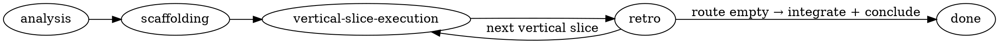

<!-- Not a user command and NOT an entry point. This is the shared methodology
     reference loaded ON DEMAND by the model when develop / develop-autonomously / analysis
     and the implementer / scaffolder constitutions say "Read using-reasonable".
     `user-invocable: false` keeps that model-load working while removing the
     /reasonable:using-reasonable slash command. Efforts start ONLY via
     reasonable:develop or reasonable:develop-autonomously. -->

# Using Reasonable

## Overview

**reasonable** enforces *outside-in, contract-governed, adversarially verified development* for
agentic software work. Motto: **every claim reasoned, every reason checked.**

It exists to cure **bottom-up-development-in-disguise** (analyze → spec every component → per-brick
TDD → assemble), whose two failure modes are (1) integration discovered too late and (2) tests
pinning component APIs at the moment of least knowledge. The cure is two meta-principles:

> **(1) Feedback beats prediction.** Let component shapes emerge from development history.
> **(2) Capability beats discipline.** Enforce by hook/allowlist/fence what would otherwise be a
> prompt an agent can rationalize away.

## Two orthogonal axes — mode and tier — chosen explicitly, never guessed

An effort is parameterized by two **orthogonal** axes, both resolved at entry by `reasonable:develop`
(the single entry point — it *asks* both up front) and both **explicit, never inferred**:

- **mode** ∈ `gated | autonomous` — does a human-ratification gate (analysis sign-off, scaffold
  sign-off, each retro) **block and wait** (gated, the default), or **self-ratify-and-log** (autonomous,
  which never blocks but still runs every step and every mechanical check)? Autonomy means "do not wait
  for the human," never "skip a step." (`reasonable:develop-autonomously` remains a thin alias that
  presets autonomous and routes into the same flow.)
- **tier** ∈ `full | lite` — the **effort-default** per-slice ceremony depth (per-slice overridable in
  `route.md`). `lite` is the §17 audit-depth collapse made user-selectable: it drops the vertical-slice
  audit's iterative **mutation-sample only**, waiving no guard — everything else (the coherence-grill,
  the walking skeleton, the blind-test separation, the discriminator, the fences, the floor trip-wire)
  runs identically. `full` is the default.

**Neither axis is ever inferred.** A standing/background directive ("act autonomously", "be concise",
"KISS") selects nothing and authorizes skipping nothing. `gated` and `full` are the safe defaults;
`autonomous` and `lite` are each an explicit opt-in. When unsure, take the safe default and ask.

## Precedence (read this — it prevents a silent coin-flip)

`reasonable` **supersedes** these superpowers/vf-superpowers skills for a governed effort:
`test-driven-development` (its per-brick RED mandate conflicts with contract-governed tests),
`writing-plans`, `executing-plans`. It **coexists with** `systematic-debugging`,
`verification-before-completion` (aligned in spirit), and `using-git-worktrees` (subsumed by lane
mechanics).

**Protocol is absolute once an effort is entered.** User instructions still govern *what* to build
and *whether* to use `reasonable` at all (triage may route out; an explicit per-step instruction may
authorize one logged deviation). But a **generic standing preference never silently weakens the
protocol** — every phase step and every mechanical gate check runs in both modes. The distinction:
user instructions outrank the plugin about *goals and scope*; they do not license the orchestrator to
quietly consolidate or skip the *procedure*. Deviations are explicit, per-step, and logged
(`type:"deviation"`) — never assumed. (This is meta-principle (2): **capability beats discipline** —
the gate scripts and fence exist precisely so "I'll just streamline this" cannot pass silently.)

## First: is this methodology even applicable? (triage)

A methodology that names its boundaries survives; one that claims universality gets abandoned. Engage
`reasonable` when **(topology is novel) OR (decomposition is uncertain) OR (work spans ≥2 seams).**
Otherwise, route around it — a first-class verdict, not a failure:

| Situation | Route |
|---|---|
| Small task (bugfix / single-component change in existing topology) | lightweight path (e.g. `simple-task`) |
| Spec-pinned component (contract fully known & externally fixed: CRC32, an RFC, a frozen wire format) | classic bottom-up TDD — the spec *is* the suite |
| Research question | spike mode (see the `vertical-slice-execution` skill's spike path) |
| Not applicable | choose whatever methodology fits — first-class verdict |

**v1 targets greenfield efforts in a single repo, single orchestrator session, intra-vertical-slice
parallelism.** Brownfield retrofit is deferred.

## The phases (each is its own rigid skill — follow it exactly)

1. **`analysis`** — grill the vision; sketch topology; draft the initial route; triage applicability;
   set the documentation-integration policy, resource lexicon, sanity invariants. Human ratifies.
2. **`scaffolding`** — the walking skeleton (real wiring, thin behavior) + the parked scenario suite.
3. **`vertical-slice-execution`** — the orchestrator loop: dispatch waves, the enrichment pipeline, tripwires,
   the approval inbox, journal upkeep. One vertical slice in flight by default.
4. **`retro`** — the mandatory blocking heartbeat at every vertical-slice gate: three-way divergence
   classification, amendment batches, route re-sort ratification, budget/dial tuning. Then loop — or, when
   the route is empty, **integrate and conclude**: `finishing-a-development-branch` lands the work, then
   `lib/conclude.mjs` archives `.reasonable/` aside so the blast-radius fence releases and the next effort
   starts clean. (An effort that finishes but never concludes leaves the repo fenced against all later work.)

**Walking away from an unfinished effort — `reasonable:abandon`.** An effort you *finish* is closed by
`conclude`; an effort you *walk away from* is closed by its twin, `reasonable:abandon` (run
`node ${reasonable}/lib/abandon.mjs`). Same cheap teardown as conclude — a final `abandoned` ledger event
plus a rename of `.reasonable/` aside to `.reasonable.abandoned-<effort>/` — so a walked-away effort
**releases the blast-radius fence and drops out of the discovery scan** instead of lingering as a live
effort forever. The commit iron rule still applies: abandon HALTs rather than archive over uncommitted
in-scope work. Archival keeps the ledger/decisions/vision auditable and is reversible by renaming back.

## The orchestrator is the main session, not an agent

Platform constraint: **subagents can't dispatch subagents.** So orchestration runs **in the main
session** via these phase skills — a deterministic checklist, never improvised. Model judgment lives
*inside* nodes (the dispatched agents); the control flow *between* nodes is code. Promise: **a
deterministic pipeline with stochastic nodes** — not deterministic nodes.

## The Three Laws (the compression test for any rule)

1. **Parity** — claims match reality exactly.
2. **One-way membranes** — value crosses boundaries only in sanctioned form.
3. **External verification** — no actor grades its own work.

Anything that isn't one of these three, at some scale, is probably not a `reasonable` rule.

## Two enforcement primitives: the categorical fence and the verification trio

Law 3 ("no actor grades its own work") and capability-beats-discipline together yield two reusable
shapes for putting a check between *produced* and *trusted*. Know which one a given guard is:

- **The categorical fence** — a *decidable*, front-line capability block: a synchronous hook or
  allowlist that says yes/no by a rule a script can compute (enforcement-path locus, role test-path,
  no-foreign-contracts, SHA custody, runmode-present, two-lanes, the sanity-regex hard-deny). No
  judgment, no model — it just refuses. This is the default; most guards are fences.
- **The verification trio** (worker → adversary → orchestrator; plain alias *make-and-check*) — the
  named generalization of Law 3 for the cases a fence *cannot* decide. A **worker** (a mutator)
  produces a *proposed* diff; a fresh, read-only-**by-capability** **adversary** judges it against a
  **named reference that sits ABOVE the artifact** (never the worker's own output or transcript — that
  agreement would be tautological) and **proposes** a verdict `accept | reject | escalate`; the
  **orchestrator** routes the verdict and a narrow writer performs any resulting act. The adversary
  **never self-executes the act its verdict authorizes** (the Law-3 corollary, `DESIGN.md` §4) and an
  `accept` **annotates, never disarms** (it marks a diff `explained-by-verdict` *advisory only* — it
  turns off no guard). Family members: auditor, adjudicator, skeptic, grill-adversary,
  **intent-verifier**. The verdict is a durable `verifier-verdict` ledger event (proposed, content-
  referencing the code commit; no git commit of state).

**Wrap a check in a trio only when all three hold** (else it stays a fence): the check is
**oracle-dependent** (needs a reference a script can't encode) AND it would **degrade if wrong**
silently AND it is **non-decidable** (no mechanical yes/no settles it). Any condition failing leaves
a **false trio** — keep it a fence.

### The three tiers a verdict passes through (FENCE → ADVERSARY → BACKSTOP)

The same value can be guarded at up to three ordered tiers, cheapest first:

1. **Fence** — the decidable front line (above). Refuses what a rule can settle, synchronously.
2. **Adversary** — the judgment tier: the trio's fresh read-only judge, for what a fence can't
   decide. Renders a semantic verdict against a reference above the artifact.
3. **Backstop tripwire** — the *last* line: a mechanical reconcile check that **still fires and
   surfaces** even after the fence and the adversary. The byte-level **floor-integrity hash** is the
   exemplar — it cannot tell a harmless additive pin from a real regression, so it is demoted from a
   first-line HALT to a backstop that still fires, **annotated** by an explaining `accept` but
   **never silenced** by one. In autonomous mode an *unexplained* breaking floor-integrity mismatch
   (no accept verdict explains it — something bypassed the pre-integration adversary) is an
   always-escalate class: the orchestrator queues BREAKING and **stops** the loop. An *explained*
   floor diff is a non-blocking notice. The failure direction is always *toward* human scrutiny.

## The commit iron rule ("done" entails committed)

A corollary of Law 1 (Parity), strong enough to name: **uncommitted == not done.** A gate that
passes, a vertical slice that closes, or an effort that concludes while its own work product sits
uncommitted is making a false "done" — the claim contradicts reality, and the work is one stray
`git checkout` from gone. So **everything reasonable does is committed** — capability-enforced, not
left to a prompt (`lib/commit-gate.mjs`, the conclude guard, and the Stop/SubagentStop backstop;
the implementer's atomic commit is mandatory and un-suspendable).

The principle that makes this coherent in *both* run modes: **committing is durability, not
ratification.** Saving work to git is not a decision that needs a human nod — it is what makes work
survivable. So commit is *orthogonal* to the gated/autonomous split: reasonable commits its own work
product in both modes, always. The gated control plane still owns the acts that *are* decisions —
ratifying a gate, **merging to the human's branch, and pushing** (reasonable never auto-pushes and
never auto-merges to your branch; commits land on lane/effort branches only). This **supersedes the
harness default "commit only when the user asks" for an effort's own work product**: invoking a
reasonable effort *is* the standing ask.

## Where things live

> **`${reasonable}`** in any skill or constitution means **this plugin's root directory** (where it is
> installed). In hooks it is the env var `$CLAUDE_PLUGIN_ROOT`; when the orchestrator dispatches script
> invocations it substitutes the absolute path. So `node ${reasonable}/lib/footprint.mjs` = run that
> module from the installed plugin.

- Vocabulary: `docs/glossary.md` · Artifact formats: `docs/artifacts.md`
- Procedure skills: `component-contract`, `gate-mechanics`, `contract-amendment`,
  `adversarial-audit`, `shared-context-session`
- Agents (roles): `implementer`, `blind-test-writer`, `adjudicator`, `auditor`, `skeptic`,
  `intent-verifier`, `spike-runner`, `retro-synthesizer`, `scaffolder`, `route-planner`
- The law (hooks/scripts): `lib/*.mjs` (fence, budget, footprint, discriminator, mutation,
  burndown, citation-resolve, redispatch-guard, commit-accounting, sanity, reconcile)
