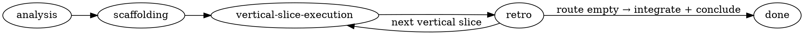

# Using Reasonable

## Overview

**reasonable** enforces *outside-in, contract-governed, adversarially verified development* for
agentic software work. Motto: **every claim reasoned, every reason checked.**

It exists to cure **bottom-up-development-in-disguise** (analyze → spec every component → per-brick
TDD → assemble), whose two failure modes are (1) integration discovered too late and (2) tests
pinning component APIs at the moment of least knowledge. The cure is two meta-principles:

> **(1) Feedback beats prediction.** Let component shapes emerge from development history.
> **(2) Capability beats discipline.** Enforce by hook/allowlist/fence what would otherwise be a
> prompt an agent can rationalize away.

## Two run modes — chosen explicitly, never guessed

An effort runs in exactly one of two modes, selected **only** by which entry skill the user invokes:

- **`reasonable:run` — GATED (the default).** Every human-ratification gate (analysis sign-off,
  scaffold sign-off, each retro) **blocks and waits** for explicit human approval. Silence never
  ratifies.
- **`reasonable:run-autonomously` — AUTONOMOUS.** Gates self-ratify and are **logged**; the system
  never blocks on the human. But **every step and every mechanical check still runs** — autonomy
  means "do not wait for the human," never "skip a step."

**Mode is never inferred.** A standing/background directive ("act autonomously", "be concise",
"KISS") does **not** select autonomous mode and does **not** authorize skipping steps. Only an
explicit, contemporaneous invocation of the autonomous entry enables it. If unsure, use gated.

## Precedence (read this — it prevents a silent coin-flip)

`reasonable` **supersedes** these superpowers/vf-superpowers skills for a governed effort:
`test-driven-development` (its per-brick RED mandate conflicts with contract-governed tests),
`writing-plans`, `executing-plans`. It **coexists with** `systematic-debugging`,
`verification-before-completion` (aligned in spirit), and `using-git-worktrees` (subsumed by lane
mechanics).

**Protocol is absolute once an effort is entered.** User instructions still govern *what* to build
and *whether* to use `reasonable` at all (triage may route out; an explicit per-step instruction may
authorize one logged deviation). But a **generic standing preference never silently weakens the
protocol** — every phase step and every mechanical gate check runs in both modes. The distinction:
user instructions outrank the plugin about *goals and scope*; they do not license the orchestrator to
quietly consolidate or skip the *procedure*. Deviations are explicit, per-step, and logged
(`type:"deviation"`) — never assumed. (This is meta-principle (2): **capability beats discipline** —
the gate scripts and fence exist precisely so "I'll just streamline this" cannot pass silently.)

## First: is this methodology even applicable? (triage)

A methodology that names its boundaries survives; one that claims universality gets abandoned. Engage
`reasonable` when **(topology is novel) OR (decomposition is uncertain) OR (work spans ≥2 seams).**
Otherwise, route around it — a first-class verdict, not a failure:

| Situation | Route |
|---|---|
| Small task (bugfix / single-component change in existing topology) | lightweight path (e.g. `simple-task`) |
| Spec-pinned component (contract fully known & externally fixed: CRC32, an RFC, a frozen wire format) | classic bottom-up TDD — the spec *is* the suite |
| Research question | spike mode (see the `vertical-slice-execution` skill's spike path) |
| Not applicable | choose whatever methodology fits — first-class verdict |

**v1 targets greenfield efforts in a single repo, single orchestrator session, intra-vertical-slice
parallelism.** Brownfield retrofit is deferred.

## The phases (each is its own rigid skill — follow it exactly)

1. **`analysis`** — grill the vision; sketch topology; draft the initial route; triage applicability;
   set the documentation-integration policy, resource lexicon, sanity invariants. Human ratifies.
2. **`scaffolding`** — the walking skeleton (real wiring, thin behavior) + the parked scenario suite.
3. **`vertical-slice-execution`** — the orchestrator loop: dispatch waves, the enrichment pipeline, tripwires,
   the approval inbox, journal upkeep. One vertical slice in flight by default.
4. **`retro`** — the mandatory blocking heartbeat at every vertical-slice gate: three-way divergence
   classification, amendment batches, route re-sort ratification, budget/dial tuning. Then loop — or, when
   the route is empty, **integrate and conclude**: `finishing-a-development-branch` lands the work, then
   `lib/conclude.mjs` archives `.reasonable/` aside so the blast-radius fence releases and the next effort
   starts clean. (An effort that finishes but never concludes leaves the repo fenced against all later work.)

## The orchestrator is the main session, not an agent

Platform constraint: **subagents can't dispatch subagents.** So orchestration runs **in the main
session** via these phase skills — a deterministic checklist, never improvised. Model judgment lives
*inside* nodes (the dispatched agents); the control flow *between* nodes is code. Promise: **a
deterministic pipeline with stochastic nodes** — not deterministic nodes.

## The Three Laws (the compression test for any rule)

1. **Parity** — claims match reality exactly.
2. **One-way membranes** — value crosses boundaries only in sanctioned form.
3. **External verification** — no actor grades its own work.

Anything that isn't one of these three, at some scale, is probably not a `reasonable` rule.

## The commit iron rule ("done" entails committed)

A corollary of Law 1 (Parity), strong enough to name: **uncommitted == not done.** A gate that
passes, a vertical slice that closes, or an effort that concludes while its own work product sits
uncommitted is making a false "done" — the claim contradicts reality, and the work is one stray
`git checkout` from gone. So **everything reasonable does is committed** — capability-enforced, not
left to a prompt (`lib/commit-gate.mjs`, the conclude guard, and the Stop/SubagentStop backstop;
the implementer's atomic commit is mandatory and un-suspendable).

The principle that makes this coherent in *both* run modes: **committing is durability, not
ratification.** Saving work to git is not a decision that needs a human nod — it is what makes work
survivable. So commit is *orthogonal* to the gated/autonomous split: reasonable commits its own work
product in both modes, always. The gated control plane still owns the acts that *are* decisions —
ratifying a gate, **merging to the human's branch, and pushing** (reasonable never auto-pushes and
never auto-merges to your branch; commits land on lane/effort branches only). This **supersedes the
harness default "commit only when the user asks" for an effort's own work product**: invoking a
reasonable effort *is* the standing ask.

## Where things live

> **`${reasonable}`** in any skill or constitution means **this plugin's root directory** (where it is
> installed). In hooks it is the env var `$CLAUDE_PLUGIN_ROOT`; when the orchestrator dispatches script
> invocations it substitutes the absolute path. So `node ${reasonable}/lib/footprint.mjs` = run that
> module from the installed plugin.

- Vocabulary: `docs/glossary.md` · Artifact formats: `docs/artifacts.md`
- Procedure skills: `component-contract`, `gate-mechanics`, `contract-amendment`,
  `adversarial-audit`, `shared-context-session`
- Agents (roles): `implementer`, `blind-test-writer`, `adjudicator`, `auditor`, `skeptic`,
  `spike-runner`, `retro-synthesizer`, `scaffolder`, `route-planner`
- The law (hooks/scripts): `lib/*.mjs` (fence, budget, footprint, discriminator, mutation,
  burndown, citation-resolve, redispatch-guard, commit-accounting, sanity, reconcile)
